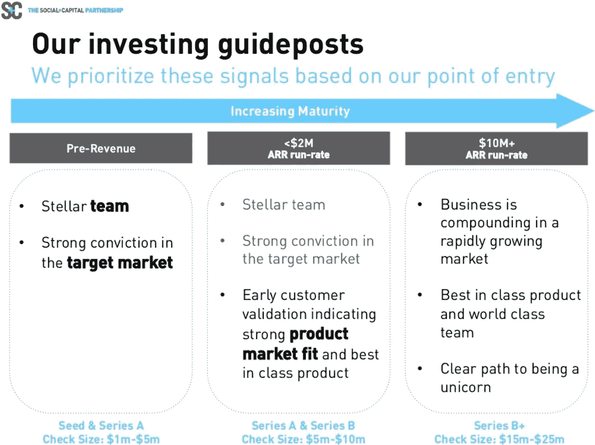

# 问初创公司的有用问题

> 原文：<https://medium.com/swlh/useful-questions-to-ask-a-startup-1424add3b901>

好的，情况是这样的:你从事科技行业。你的需求量很大。不仅如此，你还要做大量的面试，和许多公司聊天。你应该问什么问题*？*

从我在初创公司的经历中，我发现了很多与初创公司交谈时有用的问题。虽然这些问题是为初创公司设计的，但你也可以很容易地为非初创公司定制。我希望无论你在和哪种类型的公司交谈，这些问题都会对你有所帮助。好了，序言到此为止——继续表演吧！

你的问题将分为三类:公司、团队和个人。你的目标是在这些领域收集尽可能多的信息。

# 公司层面

Photo: [Credit](https://www.flickr.com/photos/dskley/)/[License](https://creativecommons.org/licenses/by-nd/2.0/legalcode)

在公司层面，你想知道公司成功的可能性。你想了解公司的文化和资源。名义上，管理团队中的任何人都应该能够回答这些问题(例如 cxo、SVP、VP)。在现实中，这些知识可能存在于许多人的头脑中。找到他们(例如，“哦，你不知道；你知道谁能回答这个问题吗？”).现在，对于具体的问题。

1.  **什么是公司的不公平竞争优势？为什么会持续？**显然，一个好的答案可以解释公司可持续的不公平竞争优势的内容和原因。但是，你也应该注意到，一个好的答案也可能是该公司没有可持续的竞争优势(见丽塔·冈瑟·麦格拉思的 HBR 文章:[短暂优势](https://hbr.org/2013/06/transient-advantage))。也就是说，我从未听说过一家公司声称自己没有可持续的竞争优势(至少对候选人来说是这样)。所以，如果有人这样对你，那家公司很可能看重坦诚，或者试图阻止你加入。你必须运用你的判断力来判断是哪一个。
2.  **公司是预营收吗？它是否有早期客户验证——它是否显示产品适合市场？公司仅仅是在一个工作模式上扩展吗？**这些问题抓住了一个简单的根本问题:公司的融资轮次与公司的成熟度匹配程度如何(*见问题#5* 后的图表)。如果一家公司的到期日落后于其融资，该公司可能在执行方面表现迟缓，但却很受投资者欢迎。一家到期日超过融资水平的公司可能会有自己挑选的投资者。
3.  人都走了吗？如果有，为什么？如果不是，你觉得为什么不是？你认为损耗率是多少？你在调查公司的任何系统性问题。这个问题是你最想亲自问的。你想观察这个人的*总体反应*，就像他们的话语一样。这类似于埃隆·马斯克问阿什莉·万斯的问题:“[你认为我疯了吗？](https://www.sciencefriday.com/articles/a-peek-inside-the-mind-of-elon-musk/)“埃隆并没有真的在意阿什莉的话；他关心阿什莉的反应。
4.  人们最不兴奋的是什么？他们最不喜欢什么？询问人们对什么最不感兴趣是很重要的，因为当你问问题时，人们往往会回答你提出的问题。这导致他们寻找正面的例子，导致确认偏差。确证偏差的解药是不确证的证据。而且，你通过询问不确定的问题得到不确定的证据。因此，询问人们不喜欢什么对于获得令人不安的证据至关重要。你可以通过许多方式来达到这个目的。例如，你可以问“在过去的一个月里，你的工作让你有多少天精力充沛？”(杰夫·贝索斯认为这对“工作与生活的和谐”很重要)
5.  **人们最兴奋的是什么？他们最喜欢什么？**这是上面问题的逆问题。在这个问题和上一个问题中，你真的想问尽可能多的人这个问题。你真的想看看模式是否会出现。如果一些事情被许多不同的非合谋者重复，你可以给那些回应更多的可信度。另外，这也给你一种感觉，如果你成为公司的一名员工，这是否是你可以得到的东西。如果公司里的人和这项全球研究中的人一样，他们可能会对创新、目标和灵活性感到兴奋。这三件事是抽象的。你的目标是把它们具体化。

[Social Capital Slides](http://www.slideshare.net/03133938319/saastr) (Slide 5); Does the maturity level match the funding level of the startup you’re considering?

# 团队级别

Photo: [Credit](https://www.flickr.com/photos/dawnmanser/)/[License](https://creativecommons.org/licenses/by-sa/2.0/legalcode)

在许多创业环境中，你的大部分工作将与团队成员一起进行。因此，了解你将如何与这些团队成员一起工作将会让你洞察到你将如何工作。如果团队的运作系统不符合你的工作风格，你就不会出类拔萃。最好在你加入之前，而不是在你的第一个绩效周期之后，弄清楚这一点。这些问题应该针对的人应该是你未来的经理或技术主管。

1.  团队中有哪些不同的角色？你想知道你将在团队中扮演一个有意义的角色。你能做的最糟糕的事情之一是加入一个团队，然后发现你不得不离开，在角落里摆弄你的拇指，因为他们知道你必须做什么。一些公司有太多的钱，过度招聘，然后过一段时间不得不过度解雇。你不想让自己陷入那种境地。问这个问题的另一个好处是，它有助于你了解你的经理是否了解团队的动态。无法解释每个角色以及他们如何帮助团队取得成功是一个不好的信号。
2.  **协作是什么样子的？团队如何相互协作？其他部门/团队呢？**一个充斥着孤立团队的公司将很难实现交叉授粉，在很多情况下也很难实现其全部潜力。在创业环境中，孤立看起来很糟糕。虽然一家大公司可能能够逃脱这一点，但小公司太小，无法长期逃脱这种行为。如果你是那种真正喜欢跨团队工作的人，并且你知道这个团队并不真正这样做，你可能想在加入这个团队之前仔细考虑一下。
3.  **团队是如何管理的？**你想知道经理的工作风格是否会和你的匹配。如果经理是相当亲力亲为的，并且你知道当你基本上独自一人时，你会做得最好，你知道你可能会有危险。如果可能的话，你应该将这位经理的解释与该经理管理的某个人相互参照，看看这些解释是否相符。
4.  **团队面临的最大挑战是什么？了解一个团队认为什么是困难有助于你校准你的难度表。如果团队的难度表和你的难度表相差很大，可能是不匹配。不能清楚地说明他们的工作有什么困难是一个不好的迹象。这表明该团队对他们的工作思考得不够深入。另外，如果他们告诉你他们的工作有什么困难，而你认为很琐碎，而他们又无法解释为什么不琐碎，那么你可能还是不合适。**
5.  **流失率是多少？为什么？这个团队存在多久了？你加入这个团队多久了？上面公司部分的所有内容都适用于此。除此之外，后面的问题将帮助你理解如何衡量这个人的回答。如果他在团队中的时间不长，他的视角应该与其他在团队中时间更长的人进行适当的校准。**
6.  迄今为止，该团队最大的成就是什么？你想知道团队能够一起做什么类型的事情。如果他们能做的事情听起来让你感到自豪，那么这可能是一个好迹象。如果团队已经存在多年，你会想知道是否有很多这样的例子，或者这只是团队的一次侥幸经历。

# 个人水平

Photo: [Credit](https://www.flickr.com/photos/plugimi/)/[License](https://creativecommons.org/licenses/by-nd/2.0/legalcode)

你想知道你的角色会是怎样的。问完这些问题后，你应该能够想象出你工作中的关键部分。你试图突出任何可能阻止你作为个人贡献者(或者作为经理，如果这是你的目标)尽可能优秀的障碍。理想情况下，这些问题应该问你的上司。

1.  **优先权是如何确定的？我们如何在这些问题上达成一致？**了解如何完成工作非常重要。我想很多人认为工程师只是被简单地告知要做什么，他们只是盲目地去做。在许多情况下，选项集很大，并且在如何完成工作方面有相当大的灵活性。如果公司按预期运行，没人会“告诉”你做什么。经理/同事会试图*说服*你，一项任务对你来说是最好/最重要的事情，有助于推动公司前进。如果你发现别的事情更重要，并且你能够证明你的观点，你应该被允许去做更重要的事情。为了弄清楚这种事情是否会发生，问问这种事情是否曾经发生过。如果从来没有发生过，你应该问一下人们是否曾经推掉过分配给他们的任务。你接受的工作任务应该是你相信的工作，而不仅仅是某个高层相信的。
2.  **我们如何确定我是否做对了工作？反馈是如何提供的？一些公司有两周和季度回顾会。其他人只是进行年度评估。有些只是有特别的反馈。其他人仍然没有反馈。你想知道你会遇到什么？此外，你想知道谁最终决定你的工作质量。是你的同事，你的经理，还是他们的组合？**
3.  **在我的角色中，成功是什么样的？这将帮助你确定这是否是你想要成为的那种人。如果描述的人是在晚上和周末工作的人，而你正在寻找一个能让你在晚上和周末安心的角色，那么这对你来说可能是一个大的危险信号。**
4.  对我的角色来说，最大的挑战是什么？你被雇来解决特定的问题。无论是你正在处理的问题，还是让你难以解决问题的障碍，你都想了解它们的本质。你最大的问题可能会占据你生活中很有意义的一部分，所以你想尽可能多的了解这个问题。
5.  **我能解决的问题有哪些？**这将有助于你想象自己正在做的工作。如果你能模拟在那里工作的经历，那么你知道你有足够的例子。通常情况下，人们会给应聘者一些抽象的场景，让他们很难想象这份工作。对此的解药是一个具体的例子。如果因为你签了 NDA，他们有可能讨论他们实际工作中的一些事情，请让他们这样做。
6.  **为什么决定这个职位应该存在？**这有助于你了解公司是如何考虑招聘的。如果你得到一个糟糕的答案(“我们只是想要尽可能多的好人！”)，你可能正在和一个没有准备好和候选人交谈的人打交道。或者，你可能处于这样一种情况，团队过度招聘，最终可能过度解雇。要警惕。

这是一大堆问题。然而，与你接受一份工作时考虑付出的时间和精力相比，这些时间和精力是很少的。面试过程通常会超过一天。因此，如果你在现场时不记得所有这些问题，你可以随时打电话联系招聘人员或与你交谈过的特定人员。如果你在面试时问了上述问题，我相信你会比大多数进入科技初创公司面试的求职者准备得更充分。

祝你好运！

(你觉得问初创公司还有哪些有用的问题？请在评论中分享。)

## 这个故事发表在 [The Startup](https://medium.com/swlh) 上，这里有 266，300 多人聚集在一起阅读 Medium 关于创业的主要故事。

## 订阅接收[我们的头条新闻](http://growthsupply.com/the-startup-newsletter/)。

