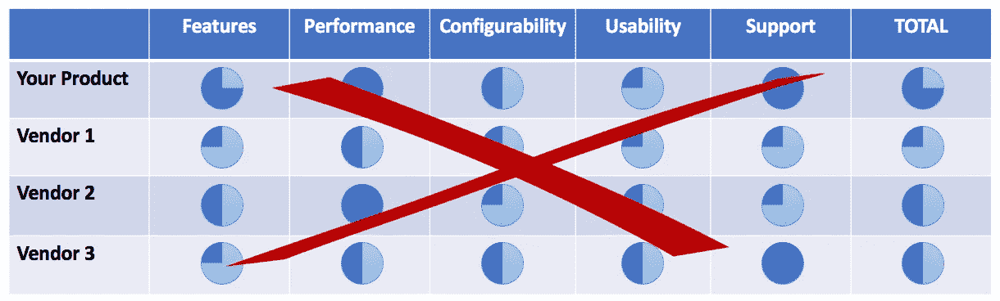
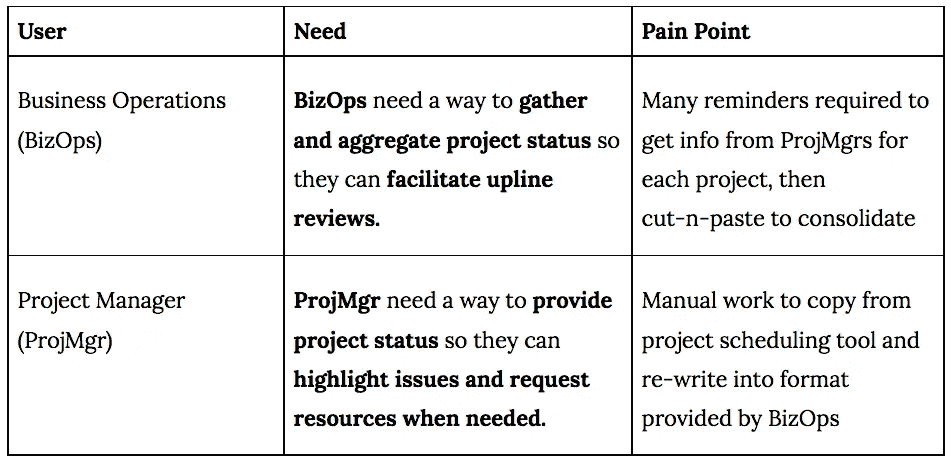
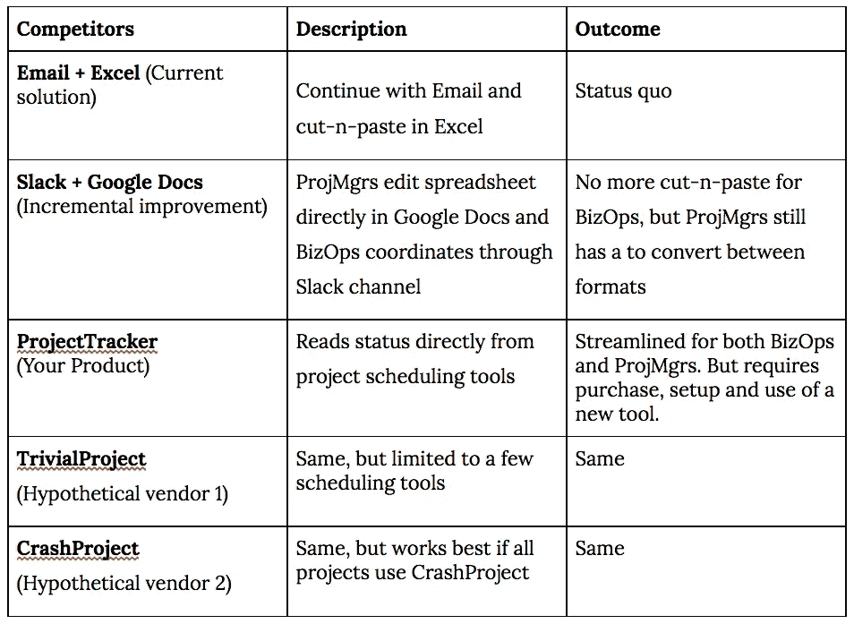
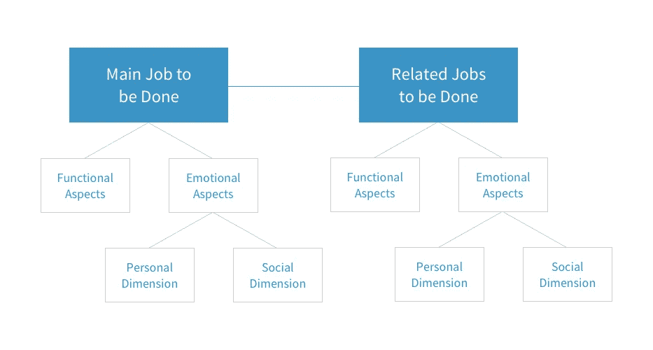

# 以用户为中心的竞争分析:为什么更好以及如何做(第一部分)

> 原文：<https://medium.com/swlh/user-centric-competitive-analysis-why-its-better-and-how-to-do-it-part-i-eaa93d9df2e2>

在软件世界，我们现在生活和呼吸着用户体验。我们设计体验，实现它们，并根据它们有多令人愉快来竞争。

那么为什么还在做基于产品特性的竞争分析呢？

本指南将帮助您解决这个问题。

## 外卖

> 你的用户有与你的产品不同的选择。因此，你的竞争力分析需要超越像你自己这样的其他厂商
> 
> ***因为你竞争的是用户体验，所以你的竞争分析应该是用户体验，而不是功能***

这是由两部分组成的文章的第一部分，展示了如何通过目标用户的视角进行竞争分析。你可以在这里找到第二部分。

## **传统竞争分析**

在软件开发中，团队经常在业务案例或产品路线图中执行并包含竞争分析。目的是确定竞争差距和潜在的差异化因素，因此，竞争分析对于制定成功的产品和业务战略至关重要。

一般来说，竞争分析是通过从网站收集信息、探索产品试用以及从客户、分析师、卖家和合作伙伴那里收集数据来进行的。这种分析通常在一个二维表格中进行总结，其中一组供应商在一组产品功能上进行评分。

虽然简单，但这并不是你竞争地位的有用指标！为什么？因为它是基于一个有缺陷的假设，即顾客和你一样看待世界，即通过产品和功能透镜。

Traditional competitive analysis: stop doing this

在这个竞争分析中，有两个相关的错误:

**错误一:仅与其他产品供应商进行比较**

*   实际的竞争还包括用户可以解决问题的所有创造性方法，也许是将普通的工具和过程(聊天、电子邮件、电子表格、文件共享、电话会议、白板等)结合在一起

**错误二:比较产品能力**

*   一个更具指示性的比较是关于用户问题解决得如何，以及采用和使用解决方案的用户体验

先来探讨第一个错误，竞争对手的选择。

虽然正确地将其他供应商识别为竞争对手，但是团队经常忘记我们的目标用户拥有的其他选择。在企业软件中，你可能比其他任何特定的供应商更容易因为“什么都不改变”、“电子邮件+ Excel”或“定制”而失败。没有人得到这笔生意，因为他们都没有打破现状的价值主张。在消费产品中，一个常用的例子是网飞。他们是只与有线电视、Hulu、Youtube 和亚马逊 Prime 竞争，还是也与“睡眠”、“检查脸书”或“与朋友出去玩”竞争？

让我们展示一下如何挖掘出完整的竞争对手。为了使这一点具体化，让我们使用一个简单的 B2B 例子。

## 一个例证

你是一名企业家，目标是经营咨询项目的中型公司。一个典型的公司有大约 20 个项目经理(以下简称 ProjMgrs)负责跟踪大约 30-40 个项目的状态。虽然每个项目都有详细的时间表和里程碑(混合使用第三方时间安排工具)，但有一名业务运营人员(BizOps)负责提供所有项目的状态摘要，包括总体进度、潜在问题、所需资源等。到目前为止，他一直在使用 Excel 模板和大量电子邮件，在每周上线审查之前追踪每个项目经理。类似的过程可以在市场营销、销售、财务、开发等领域找到，所以作为一名企业家，你会觉得有增长的潜力。

您已经创建了一个名为 ProjectTracker 的产品，该产品提供了一个简单的工作流和仪表板来自动生成用于上线审查的报告。它还直接与流行的项目调度软件连接，以自动提取高级项目信息。

# 选择竞争对手

要想知道谁是你真正的竞争对手，你需要真正了解你的用户，他们的工作以及他们想要完成的目标。这是通过用户研究完成的，这通常会产生一组针对不同用户类型的角色和[同理心图](https://www.ibm.com/design/thinking/activities/empathy-map)，以及[现状图](https://www.ibm.com/design/thinking/activities/scenario-map)，描述他们当前如何开展工作。

这些地图非常有助于与用户建立共鸣，了解他们如何工作，但这些场景通常与他们当前使用的方法和工具紧密相关。你的研究还应该确定潜在的用户需求(也称为用户问题、任务或工作)。通过抽象出具体的工具和步骤，您可以得到描述用户正在寻找的*结果*的[需求陈述](https://www.ibm.com/design/thinking/activities/needs-statements)，其一般形式如下:

**<我们的用户>** 需要一种方式来 **<解决这种需要>** 以便他们 **<以这种方式受益>**

在我们的示例中，它看起来像这样:

*The competitive alternatives for project tracking*

从这些核心需求中，我们可以得出客户拥有的一套备选解决方案:

The competitive alternatives for project tracking

这是第一步，也就是说，从用户的角度来看，现在已经有了一个竞争对手的列表。

[本文的第二部分](/@greger_ottosson/user-centric-competitive-analysis-why-its-better-and-how-to-do-it-part-ii-3c66866e5f15)将得出用于比较的属性，并结束练习。

# 好奇者的进一步阅读

对于合理规模的问题空间(就像我们的小例子)，或者您所擅长的领域，以结构化的方式写下核心用户需求通常不会太难。对于更复杂的领域，或者如果你正努力摆脱以产品为中心的思维模式，你可以考虑使用一个框架，比如工作完成(JTBD)。

由 Clayton Christensen 在“创新者的解决方案”中推广的 JTBD 方法有相当多的追随者，并且有多种风格的框架。这里有一个结构说明了工作的关系和细节:

Source: [Drawbackwards](https://design.org/blog/the-wrong-and-right-way-to-build-an-mvp/)

以下是一些有待完成的工作，供进一步阅读:

*   [https://en.wikipedia.org/wiki/Outcome-Driven_Innovation](https://en.wikipedia.org/wiki/Outcome-Driven_Innovation)
*   [https://jtbd.info/](https://jtbd.info/)
*   [https://strategyn.com/jobs-to-be-done/](https://strategyn.com/jobs-to-be-done/)
*   [http://jobstobedone.org/](http://jobstobedone.org/)

感谢[凯瑟琳·麦金农](https://www.linkedin.com/in/kmckinnon/)、[尼克·加尔](https://www.linkedin.com/in/nickgall/)和[苏萨拉·范·登·希弗](https://www.linkedin.com/in/susaravandenheever/)对本文的反馈和建议。

格雷格在 IBM 工作，常驻法国。以上文章为个人观点，不一定代表 IBM 的立场、策略或观点。

## 这个故事发表在 [The Startup](https://medium.com/swlh) 上，这是 Medium 最大的企业家出版物，拥有 291，182+人。

## 在这里订阅接收[我们的头条新闻](http://growthsupply.com/the-startup-newsletter/)。

