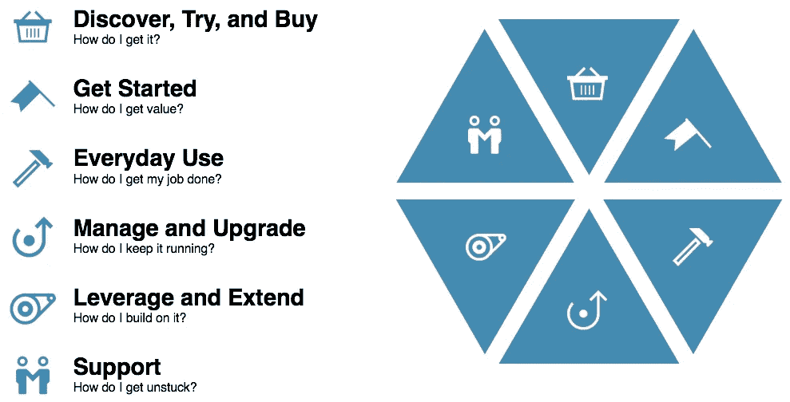
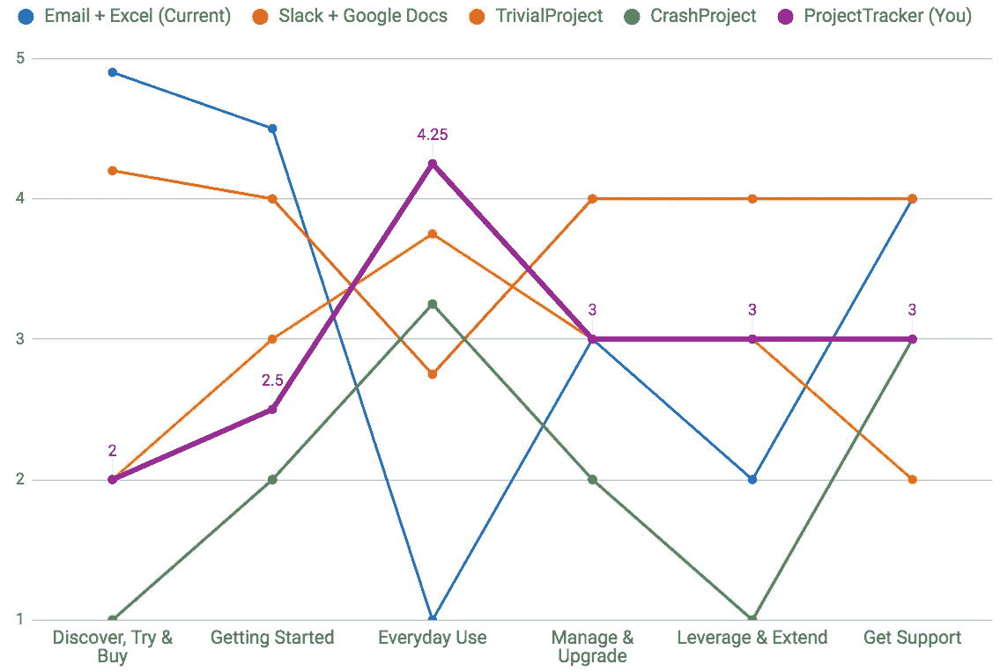
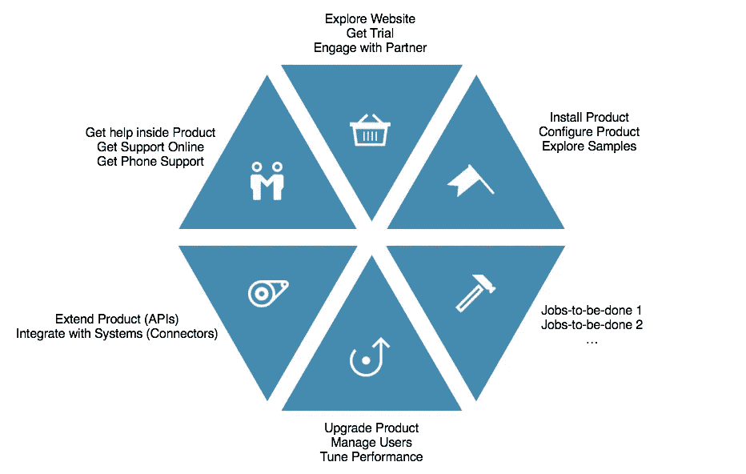
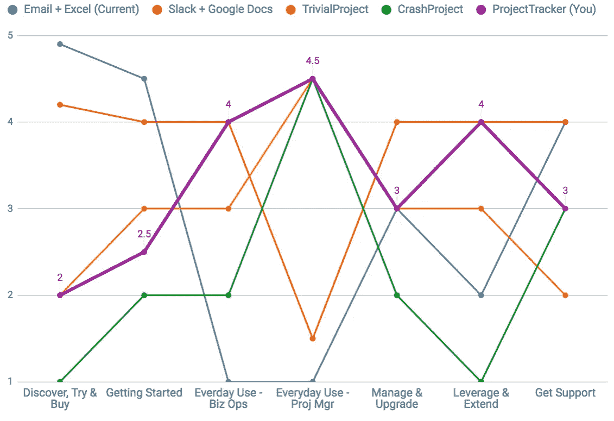
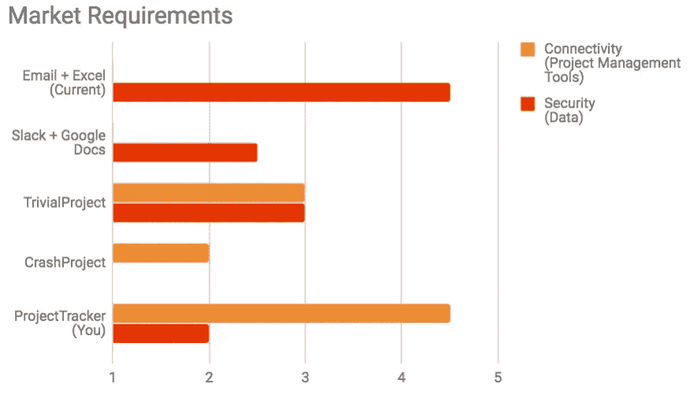
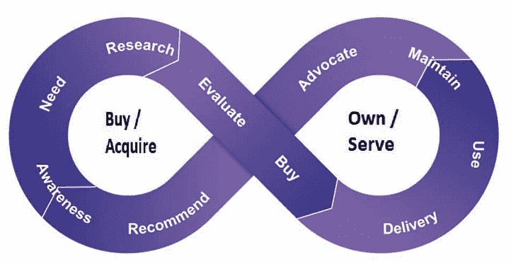
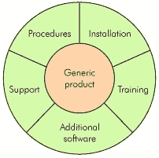

# 以用户为中心的竞争分析:为什么更好以及如何做(第二部分)

> 原文：<https://medium.com/swlh/user-centric-competitive-analysis-why-its-better-and-how-to-do-it-part-ii-3c66866e5f15>

**注意:**这是本文的第二部分，你可以在这里找到第一部分。

概括地说，在进行竞争分析时，有两个常见的错误:

**错误一:仅与其他产品供应商比较**

*   实际的竞争还包括用户可以解决问题的所有创造性方法，也许是将普通的工具和过程(聊天、电子邮件、电子表格、文件共享、电话会议、白板等)结合在一起

**错误二:比较产品能力**

*   一个更具指示性的比较是关于用户问题解决得如何，以及采用和使用解决方案的用户体验

本文的第一部分解决了第一个问题(识别所有竞争对手)，第二部分将解决如何识别最佳比较属性的问题。这一步也许是最重要的。如果之前漏掉了一个竞争对手，添加一个是很容易的，但是如果整个练习是围绕错误的属性设计的，你可能会拒绝扔掉它，并对所有竞争对手重新评分。

## 为什么比较能力不好

在传统的竞争分析中，用于比较的属性选择通常是以产品为中心的。该表可以从性能、价格和可扩展性等通用列开始，然后添加特定于该产品的功能。例如，开发人员工具可能具有调试、协作或语言支持。

比较产品能力有三个严重的缺点:

1.  **功能不能准确反映用户如何做出产品决策。**执行竞争分析的原因是模拟客户选择。新用户会找到我们并选择我们吗，现有用户会继续留在我们身边吗，他们会把我们推荐给其他人吗？通过比较产品功能，这些问题并没有得到很好的回答，因为用户关注的是他们的问题，而不是我们的功能。
2.  **源自*我们*产品的功能会导致一种虚假的安全感。**通过*我们的*产品能力来评估我们的竞争对手，我们的竞争实力会被高估。竞争对手越与众不同，他们对我们产品功能的评价就越差，尽管他们可能很好地解决了用户问题！
3.  **源自*竞争*产品的能力导致追赶和非差异化。**根据竞争对手的能力评估我们自己时，可能会有明显的差距。于是，人们很想投资弥补这些差距以实现平等，却牺牲了满足用户需求的真正创新的解决方案。

## 最好在用户体验上进行比较

为了避免这些问题，考虑下面的方法，我们改为比较*用户体验*:

1.  **从用户在发现、采纳和使用解决方案时的一小组“生命周期”体验开始**
2.  **为核心“工作”**添加体验，即用户希望满足的核心需求
3.  **可选地，添加买家最关心的任何硬性“市场”要求**

接下来的章节将通过分别探索*生命周期经历*、*工作经历*和*市场需求*来给出这些步骤的结构。

## 生命周期体验

生命周期体验定义了用户如何发现、采纳和使用解决方案。它们是整体的，作为用户和解决方案之间所有交互的总体结构。在这些体验上取得好成绩意味着赢得新客户、留住现有客户并增加他们的使用量。

我在这里使用的生命周期框架来自于 [IBM 设计思维](http://www.ibm.com/design/thinking)，叫做[六种通用体验](http://www.ibm.com/design/language/experience):

Source: [Six Universal Experiences](http://www.ibm.com/design/language/experience)

关于六种体验的几个澄清点。首先，一个典型的解决方案会有几十个甚至几百个不同的用户体验，但是它们都属于这六个类别中的一个。在我们的第一部分的例子中，BizOps 第一次收集和审查总体项目状态是一次“入门”体验。

第二，一些用户场景可能跨越或跨越六种体验中的几种。例如，在“日常使用”期间，用户陷入无法执行任务的困境，利用“支持”选项来摆脱困境，这可能导致通过“利用和扩展”步骤添加补充模块。这些场景可能不是标准，但是它们对于以无缝的方式考虑和交付是非常重要的。

作为起点，这六种体验将成为竞争分析中的栏目。对于每项体验，请根据提供的体验对您的解决方案和竞争对手进行评分。在我们的简单示例中，初始表如下所示:

Comparison on Six Experiences

从用户的角度来看，坚持使用电子邮件和 Excel 在“发现、尝试和购买”以及“开始使用”方面得分较高，因为这些是每个人都已经可以使用的熟悉工具。切换到供应商产品涉及到搜索、试用、预算和在整个组织中推广，这是一个非常耗时的过程。另一方面，对于日常使用来说，使用电子邮件和 Excel 的体验确实很痛苦，使用 Slack + Google Docs 的体验逐渐变好，总体来说这些产品非常令人愉快。

## 要做的工作经历

在这六种体验中的每一种体验中，用户通常会做多项工作，因此用户和解决方案之间会有多次交互。这些细微的经历都有助于快乐(或不快乐)的整体感受。这里有一个 B2B 软件产品的小例子:

Typical jobs for enterprise software product

为了深入挖掘和提炼你在特定经历中的竞争力，将这些“工作经历”作为顶级专栏是很有用的。例如，如果您的目标是加速新客户增长，您可能希望将不同的渠道(数字、合作伙伴、直销等)作为“发现、尝试和购买”的子体验。

在我们的简单示例中，如果您还记得，只有两个主要的用户需求:

*   BizOps 需要追踪和汇总项目状态
*   项目经理需要从他们的项目进度表中提取信息，并提供给 BizOps

这两者都存在于日常使用中，并且是触发潜在客户首先寻找解决方案的核心需求。因此，在这个例子中，将这两种体验作为单独的体验进行比较是有意义的。

在插入这两种体验作为日常使用的替代品后，我们的对比图看起来是这样的:

Comparison on Six Experiences + 2 Everyday Use Jobs

在我们的例子中，Slack + Google Docs 对 BizOps 的评分很高，因为 ProjMgrs 直接编辑一个共享文档，所以 BizOps 减少了手工操作。请求和提醒仍然是必要的，尽管通过一个宽松的渠道比电子邮件更有效。然而，ProjMgrs 仍然需要手动提取信息并进行转换，因此收效甚微。相比之下，商业供应商支持连接到软件工具，因此 BizOps 和 ProjMgrs 的许多工作都实现了自动化。

## 市场需求

可能会有一些特殊的情况，在这些情况下，所需的特性或系统需求并不自然地适合某个体验。例如，如果您向政府和国防部门销售，法规遵从性可能是一个主要的竞争因素。是的，您可以将此作为“发现、尝试和购买”体验的一部分进行评估，但作为一项强制性要求，它可能更容易被视为顶级属性。

在我们的例子中，三个软件应用程序(包括我们的 ProjectTracker)在日常使用中得分很高，因为它们自动从第三方日程安排工具中提取。但这只有在它们支持特定客户端使用的调度工具时才有效，所以如果我们要寻求广泛的市场采用，连通性是一个关键的属性。同样，项目进度和状态报告包含非常敏感的数据，因此安全性也是买家最关心的问题。

因为这些方面更多的是*市场需求*而不是用户体验，所以在竞争分析中将它们提升到顶级属性并在如下图表中单独说明是实用的:

Comparison on select set of market requirements

在这个简单的项目跟踪例子中，如果你从用户体验和市场需求两方面来看，很明显 ProjectTracker 比其他软件供应商更有竞争力。ProjectTracker 在发现和入门方面得分较低，阻碍了新客户的快速增长。如果采用和增长是主要的业务目标，这可能是最重要的投资部分。

# 结论

当今最成功的公司提供卓越的体验，不仅仅是在产品 UI 本身，而是在用户生命周期的所有接触点以及与公司的接触(从发现到支持)。这就是当今竞争的现实，传统的基于特征的竞争分析并不能有效让你真正具有竞争力。

更好的解决方案是采用结构化方法来执行*以用户为中心的竞争分析*:

*   **进行研究，发现*核心用户需求和痛点*** ，让你识别所有竞争对手，而不仅仅是产品供应商
*   **对比*用户体验，*** 关注客户如何发现、采纳和使用解决方案的生命周期体验

您可能会惊讶于您的发现，以及它与来自现场的故事和您成功实现业务目标的一致性。

# 好奇者的进一步阅读

在本文中，IBM 设计思维的六个普遍经验被用作竞争分析的基础。这是转向以用户为中心的思维模式的一个很好的框架。由于这六种体验总是相同的，它还允许您

*   比较一个产品在一段时间内的进展(即使工作发生了变化)，以及
*   比较不同的产品(甚至跨越完全不同的领域)。

然而，你可能已经在使用或者可能更适合你的替代品。

首先，过去是线性的经典“客户旅程图”现在普遍被描绘成一个循环，通常看起来像这样:

Source: [OpenText](https://blogs.opentext.com/the-customers-perspective-of-the-redefined-customer-journey/)

该图通常用于市场营销，与六种体验非常接近，但隐含的步骤顺序对于竞争分析并不准确或有用。例如，当用户第一次发现并采用一个解决方案时，他可能会遵循这个顺序，但是在那之后，用户就不会离开“使用”去进行宣传了。此外，与右侧竞争分析所需的关注点相比，左侧活动有太多的重点和粒度。

另一个更早的以用户为中心的思维框架是“整体产品”概念，由里吉斯·麦肯纳提出，并在杰弗里·摩尔的《[跨越鸿沟](https://en.wikipedia.org/wiki/Crossing_the_Chasm)》中得到推广:

Whole Product framework

发明于 UX 流行之前，它不是从体验的角度来描述的，而是强调使产品“完整”所需的补充服务和产品，即满足用户的实际需求。如果你在一个复杂的生态系统中与许多供应商和服务提供商在一个复杂的价值链中竞争，这个框架可以很好地补充这六种体验。

以下是一些可供进一步阅读的提示:

**设计思维**

*   【https://en.wikipedia.org/wiki/Design_thinking 
*   [https://www.ibm.com/design/](https://www.ibm.com/design/)
*   [http://www.ibm.com/design/language/experience](http://www.ibm.com/design/language/experience)

**整个产品**

*   [https://en.wikipedia.org/wiki/Whole_product](https://en.wikipedia.org/wiki/Whole_product)
*   [https://en.wikipedia.org/wiki/Crossing_the_Chasm](https://en.wikipedia.org/wiki/Crossing_the_Chasm)

感谢[凯瑟琳·麦金农](https://www.linkedin.com/in/kmckinnon/)、[尼克·加尔](https://www.linkedin.com/in/nickgall/)和[苏萨拉·范·登·希弗](https://www.linkedin.com/in/susaravandenheever/)对本文的反馈和建议。

格雷格在 IBM 工作，常驻法国。以上文章为个人观点，不一定代表 IBM 的立场、策略或观点。

## 这个故事发表在 [The Startup](https://medium.com/swlh) 上，这是 Medium 最大的企业家出版物，拥有 291，182+人。

## 在这里订阅接收[我们的头条新闻](http://growthsupply.com/the-startup-newsletter/)。

