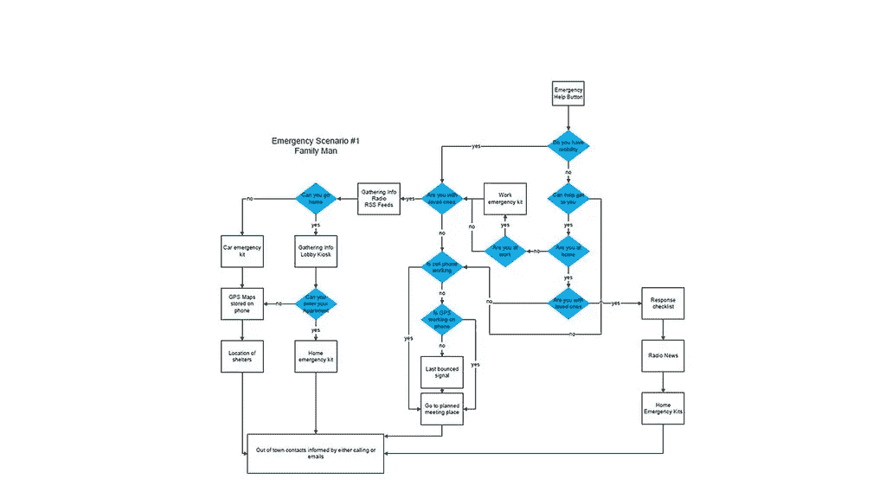

# 用户界面开发流程。八步流程

> 原文：<https://medium.com/swlh/user-interface-development-flow-537f82f00247>

*本文描述了 Django Stars 的用户界面(UI)开发流程，从想法到最终结果。让我们回到起点。*

> [这篇关于 UI 开发流程的文章最初发布在 Django Stars 博客](https://djangostars.com/blog/ui-development-flow/?utm_source=medium&utm_medium=medium.com%2Fswh&utm_campaign=user%20interface%20development%20flow&utm_content=originallyposted)上。

你有一个想法，我们有工具来实现它。但是我们应该从什么开始呢？我们从调查业务领域、用户受众和产品用例开始。这有助于更好地了解目标受众，并以用户需求为中心构建用户界面(UI)。这可能会影响按钮的大小和位置、表单、字体以及界面结构的许多其他方面。让我们比较一下[金融科技应用](https://djangostars.com/industries/fintech/?utm_source=medium&utm_medium=medium.com%2Fswh&utm_campaign=user%20interface%20development%20flow&utm_content=fintechapp)和[出租车&交通](https://djangostars.com/industries/taxi-transportation/?utm_source=medium&utm_medium=medium.com%2Fswh&utm_campaign=user%20interface%20development%20flow&utm_content=taxi%26transportation)领域的应用。第一个将包括大量的表单、列表、图表和转换。第二个将定位在大型且合适的控制装置上，在乘坐过程中易于使用。在这两种情况下，界面应该是符合人体工程学和用户友好的，但你希望它有很大的不同，对不对？

# 头脑风暴和素描

一旦项目的概念清晰了，我们就进入头脑风暴区，将我们关于界面的想法转化为现实。我们带了一支笔和一张纸。与 Balsamiq 样机、Sketch、Photoshop 和 InVision 等高级工具相比，这在时间上更有效率。

# 用户流程图

一旦草图完成，我们就得到界面的结构。但是用户应该如何与之交互呢？用户流程图在这里发挥了作用。该图通过显示与 UI 的每一种可能的交互、这些交互的路线图以及每一点的界面状态来帮助理解产品的逻辑。

# 结构和流程验证

当我们完成用户界面草图和用户流程图时，我们要求客户确认。结构和流程是建筑的基础(用于用户界面设计)。这是 UI 开发中非常重要的阶段。没有得到证实，我们不会前进。在这个阶段对界面进行修改要容易得多。我们可以以一个复杂的网站设计为例。如果在设计实现后改变结构，可能会面临通过简单改变几个元素的放置就成功打破了配色方案、UI 控件、视觉风格等部分的情况。在这种情况下，您可能需要拒绝这些更改，或者部分甚至完全重新开发设计。

# 选择界面的样式

当客户确认结构和流程时，这是一个前进的信号。下一步是什么？我们选择界面的风格。选择余地很大。那可以是极简主义，材料设计，skeuomorphism，地铁接口或任何其他。在选择一款产品时，我们会要求客户提供一些他们喜欢的产品的链接(包括款式和效果，帮助我们更好地了解你)以及未来的计划。我们关注当前趋势、可能的接口扩展以及开发团队进行设计开发和实施所需的时间。

# 样式验证

在这个阶段，我们向客户展示我们的设计版本，解释为什么做出这些或那些决定。客户可能一开始就不同意某些时刻，因为他可能没有意识到全貌和可能的陷阱。这里的目标是最终得到一个满足客户愿景并遵循 UX 最佳实践的解决方案。

# 选择和创建预览表单

一旦上面列出的都完成了，我们就可以向你展示你的设计是什么样子了。可以以各种形式呈现。根据预期的保真度和您准备花费的时间，这可能是以下情况之一:

## **线框**

实现速度最快的一个。这是一个低详细的设计介绍。线框显示了用户与界面交互的结构和描述。通常它是以灰色块的形式制成的。

## 实体模型

实体模型是设计的中等或高度详细的静态表示。它呈现的内容向您展示了您的设计在静态下的外观。与灰色块状线框相比，它更容易理解，而且与原型或动画 UI 流相比，它的实现速度仍然相当快。

## 可点击原型

原型是最终产品的高度详细的表示，模拟用户与界面的交互。它允许你点击你的应用程序，检查完整的流程和动画。然而，原型创建是相当耗时的。

## 动画 UI 流

动画 UI 流是用户与应用程序交互的视频模拟。这种表示的创建是最耗时的(因为它包括原型的创建+视频编辑过程)。然而，这是一个非常合适的方式来介绍你的产品给同事和未来的潜在投资者。

# 您可能还喜欢:

 [## 洛蒂框架指南:创建动画的 5 个步骤

### 想象一下现在是周一早上。你醒来后拿起手机查看你的推特信息。你一卷又一卷——什么…

djangostars.com](https://djangostars.com/blog/lottie-animation-guide/?utm_source=medium&utm_medium=medium.com%2Fswh&utm_campaign=user%20interface%20development%20flow&utm_content=youmayalsolike) 

# 设计验证

有些人脑子里有这个设计的确切图片，有些人只是猜测。反正每个人都有自己的眼光。在设计验证阶段，您会看到结果，并向我们提供意见和建议。我们，在另一边，调整它来满足你的期望。

# 摘要

让我们一步一步地开发用户界面，验证开发的每个阶段，并坚持不懈地向最终目标前进。这种方法节省了时间，允许及时定位需要改进的地方，并降低了在产品开发的后续阶段进行额外投资的可能性。

> 文章由[Dmytro Puchkov](https://medium.com/u/1a5c7fa0fcec?source=post_page-----537f82f00247--------------------------------)([**Dmytro Puchkov**](https://djangostars.com/blog/author/dmytro-puchkov/)**)**—UI/UX 设计负责人在 [Django Stars](https://djangostars.com) 。这篇关于 [UI 开发流程](https://djangostars.com/blog/ui-development-flow/?utm_source=medium&utm_medium=medium.com%2Fswh&utm_campaign=user%20interface%20development%20flow&utm_content=uidevelopmentflow)的文章最初发布在 Django Stars 博客上。
> 
> 特别分享给[创业](https://medium.com/u/1ecc355a806?source=post_page-----537f82f00247--------------------------------)社区。

我们随时欢迎您提出问题，分享您想阅读的话题！

> *如果你觉得这篇文章有用，请点击👏下面的按钮:)*