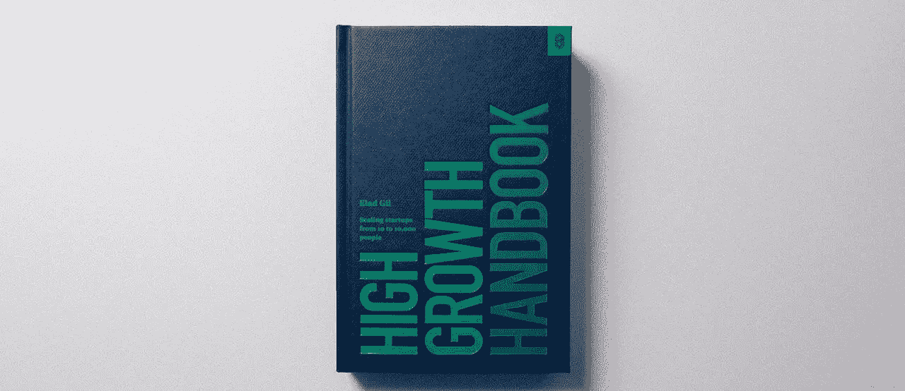

# 为什么您应该编写“如何与我合作”用户手册

> 原文：<https://medium.com/swlh/user-manual-to-me-92c8ce68f960>

当克莱尔·休斯·约翰逊加入 Stripe 公司时，她与公司分享了一份公开文件，并亲自发送给与她密切合作的人。

但这不仅仅是任何类型的公司展示。

克莱尔宣布:*“我不是一个微观管理者，我不会担心你的细节，除非我认为事情偏离了轨道，如果我这样做了，我会告诉你我的担忧。”*

再往下，上面写着:*“*你的工作是获得我对某件事的感觉，并与我辩论。我喜欢争取更好的结果。”*

还有一个请求:*“我常常对我的时间过于慷慨，对事情说太多的是。如果你看到这个，请把它标记给我。”*

克莱尔分享的文件是她写的关于如何与她一起工作的指南。

总共 2000 多字。

这本非正统的指南大受欢迎。

# 困惑、误解和失望

想象一下这种常见的情况:

你加入了一家新公司，或者一位新高管现在负责你所在的团队。

你可能会得到一个面对面的介绍会，但这需要几周(甚至几个月)的密切合作来相互了解，并真正理解彼此合作的最佳方式。

会有起伏。会有困惑、误解、未满足的期望和失望。

这段关系可能永远不会有结果。你和你的公司可能会因此变得更糟。

但是有没有更好的办法呢？

认识一下 Stripe 的首席运营官(首席运营官)Claire Hughes Johnson。

# 导游的意图是什么？

克莱尔于 2014 年加入，当时该公司有 165 名员工，并帮助 Stripe 发展到目前的 1000 多名员工。此前她在谷歌工作。

我听说克莱尔正在阅读埃拉德·吉尔的《高增长手册》。

以下是她谈到她的指南对 Stripe 的影响:

*“它在整个组织中传播得相当快。这是有意义的，因为我是新来的，我处于领导地位，人们想要理解我。然后人们开始问，“那么，为什么我们没有更多这样的东西？".我甚至让我团队中的非经理人员给我写这些指南。它非常有洞察力。所以我是你的超级粉丝。”*

克莱尔认为，创始人和其他领导者和管理者应该写一份与他们共事的指南。

这应该成为更多公司的最佳实践。

该指南旨在阐明您的角色、最适合您的互动方式以及与您合作的最佳方式。

这样，人们就知道该做什么和期待什么，而不需要费劲地去学习。“因为问题是，人们在那一刻学会了，但那时已经太晚了。”

这些是你的导游应该回答的问题类型:

*   我想参与什么？
*   *我想什么时候收到你的来信？*
*   *我喜欢的沟通方式是什么？*
*   *什么让我不耐烦？*
*   *不要用 X 给我惊喜*

# 克莱尔的指南长什么样？

克莱尔的指南从“操作方法”开始，她解释了她喜欢处理一对一聊天、团队会议和其他计划会议的方式。

这是她在报告中提到的一件事:

*“在我们一起工作的头几个月，我们会在某个时候进行一次职业生涯会议——你的历史，你为什么会做出这样的选择，你对未来有什么抱负，等等。这些有助于我了解你在个人发展兴趣和长期计划方面的抱负。”*

# 我不喜欢追逐最后期限，但我会注意到事情的进展

接下来，她分享了她管理风格的细节。关于行动项目和截止日期等主题:

“我非常认真地对待行动项目，我希望你知道你的是什么，什么时候到期，并完成它们。我不喜欢追赶他们，但我确实注意到了事情的进展——重新协商截止日期没问题，但如果是截止日期的第二天，我会很恼火…”。

她的策略是:

“我试着去思考事情的结局，以及到达那里的最直路线，但我一直都很灵活。如果有漩涡，我通常会想:“这里的大杠杆是什么？”“我们要解决什么问题？”“为什么我们需要解决它？”“我们什么时候需要解决？”“我们需要什么信息，什么时候能得到？“我希望你也这样做。”

# 仅供参考=无需回应

还有一个关于电子邮件的部分:

“我会阅读一天内收到的每一封邮件，但我不会回复，只是想让你知道我也看了——我只会在你直接问我问题或者我有问题的时候才会回复。因此，假设我在 18 小时内读了这封邮件，但如果你认为我欠你一个回复，请重新发送或 ping 我，我不会生气。”

这进一步澄清了:

*“我*喜欢* fyi 电子邮件，当你给我发送你看到的东西、客户轶事、一篇文章、一些数据或你团队中的某人做的事情时，如果你在主题或转发中写 fyi，我会知道这是给我的信息，但*不*需要回复或紧急阅读，我也会为你做同样的事情。仅供参考=无需回应。”*

你明白了。

# 和你一起工作的指南会是什么样的？

这种类型的 doc 似乎是一种非常有用的方式，可以更快地了解某人，最大限度地减少误解和误传。它可以帮助你管理一个更好的团队和组织。

所以，当你发现自己在一个新的工作场所或管理一个新的团队时，考虑做同样的事情。

你的工作指南会是什么样的？

感谢您阅读我的帖子！您想了解更多关于我使用内容、搜索和社交媒体进行数字营销和品牌建设的方法吗？**在** [**找到我关于如何写博客的免费提示和建议**](https://howtomakemyblog.com/) **。** *本文原载于*[*markosaric.com*](https://markosaric.com/guide/)*。*

## 这篇文章发表在 [The Startup](https://medium.com/swlh) 上，这是 Medium 最大的创业刊物，有+ 379，306 人关注。

## 在这里订阅接收[我们的头条新闻](http://growthsupply.com/the-startup-newsletter/)。

