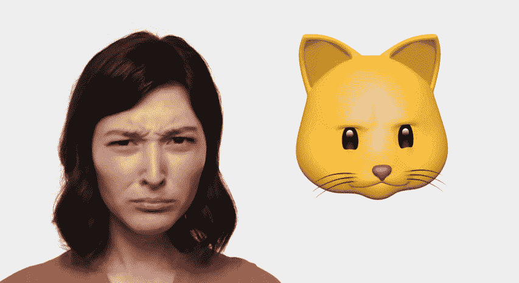

# 用户、人和人类

> 原文：<https://medium.com/swlh/users-people-humans-e1a1c47f078c>

## 你为谁设计？新年短信

当涉及到设计时，用户和人类之间总是有一条细微的界限。我认为我们经常迷失在我们的人物角色的本质目标中(*我们从真实的人那里建立的，请注意*)，我们看不到我们实际上是为谁设计的。他们想要什么，需要什么，甚至关心什么。

这不是一个关于以用户为中心的设计或你应该如何进行用户研究和实现你的见解的深入讲座，而是一个新的一年的小小提醒。我们的用户、参与者或调查对象实际上是谁，而不是我们想要他们成为什么样的人。

 [## 真人:一个提醒

### 我打算把这篇文章命名为《真实的人与调查的回答者》。但我没有，因为我懒得…

www.linkedin.com](https://www.linkedin.com/pulse/real-people-reminder-siamack-salari/) 

## 他们只是人类

你也是。真实的人不在乎你想让他们在乎什么，他们和你我一样真实，一样扯淡。当他们意识到有人在观察、研究并试图洞察他们的生活时，我们就不再了解他们的全貌了。

捕捉真实的洞察力和人们回答他们如何感知他们应该如何之间的斗争将永远是一个问题。

即使有最真实的意图，我们仍然设法在我们的角色中把它混合起来。我记得制作我的第一套人物角色，他们是完美的…没有错。然而，我从来没有停下来想一想，如果这些人物是真实的，他们实际上反映了谁？我想让他们成为什么样的人，或者我为谁设计？

# 我们继续聊！

了解别人的想法是很棒的，不要犹豫回复或联系！☺️

**节日快乐**

## 这篇文章发表在 [The Startup](https://medium.com/swlh) 上，这是 Medium 最大的创业刊物，有 278，108+人关注。

## 订阅接收[我们的头条新闻](http://growthsupply.com/the-startup-newsletter/)。

