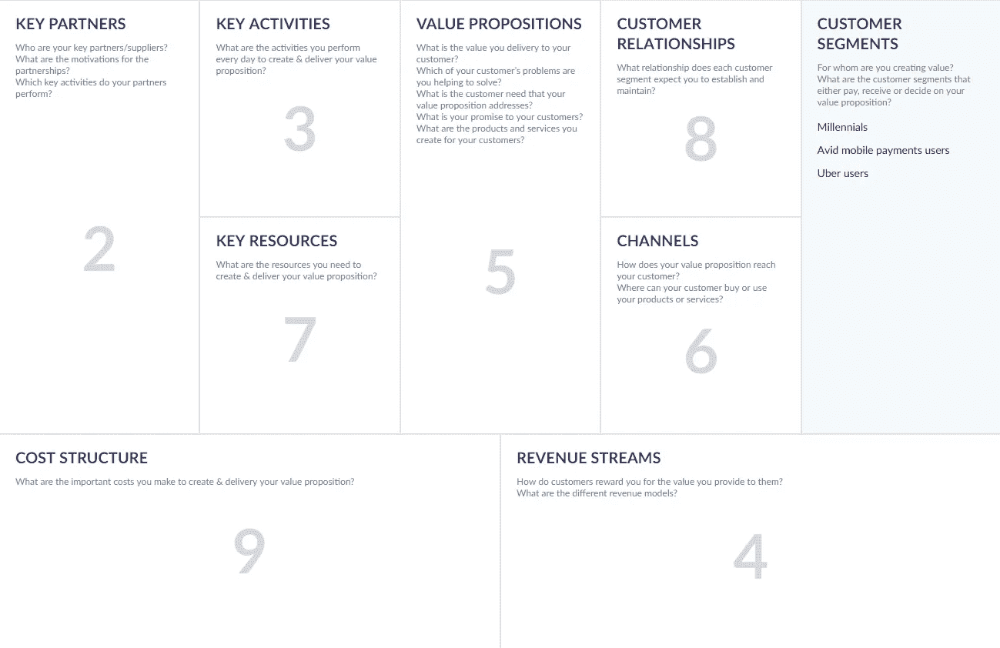

# 使用商业模式画布启动技术创业或改进已建立的运营模式

> 原文：<https://medium.com/swlh/using-business-model-canvas-to-launch-a-technology-startup-or-improve-established-operating-model-149c465d96fa>

不久以前，组织还必须依赖许多已建立的工具来构建他们的业务模型、制定策略和进行创新。由于其复杂性和耗时的研究过程，我们今天所知的商业计划的使用在 20 世纪 80 年代和 90 年代开始下降。不足为奇的是，这种下降与高科技繁荣和硅谷的创业文化是同步的。商业计划是任何想要创新的组织不可或缺的一部分。但是，今天这意味着什么呢？尽管——也许是由于？—他们的年龄和传统地位，商业计划需要时间、精力、顶级咨询公司的参与和财务资源来编制。

如今，初创公司，尤其是科技类初创公司，负担不起这种奢侈。为了跟上竞争对手，快速成长和创新，他们需要一种真正敏捷的技术，一种易于编写、编辑和理解的思维导图。

早在 2004 年，商业理论家亚历山大·奥斯特瓦尔德(Alexander Osterwalder)和他在洛桑大学的教授伊夫·皮涅尔(Yves Pigneur)提出了一种商业模式设计，可以取代繁琐的商业计划。

一种很快被命名为**商业模式画布** (BMC)的方法已经获得了相当数量的忠实实践者。不仅初创公司采用了这种方法，微软、SAP 和通用电气等巨头也采用了这种方法。让我们找出什么是商业模型画布，并探索软件公司如何利用这种方法来推动成功。

业务模型画布是一个可视化模板，用于识别和组织业务模型的不同元素。Osterwalder 将画布分为九个部分，每个部分负责每个组织中最重要的业务元素。(单击某个项目会将您导向本文中的部分。)

*   客户群
*   关键伙伴关系
*   关键活动
*   收入来源
*   价值主张
*   频道
*   关键资源
*   客户关系
*   费用结构

*Classic scheme of Business Model Canvas
Source:* [*CNVS*](https://cnvs.online/en)

可以找到该方法的许多改编。例如，有一种[精益创业画布](https://leanstack.com/leancanvas)，是专门为[创业发布](https://www.altexsoft.com/blog/business/6-tech-tips-for-building-a-successful-startup/?utm_source=MediumCom&utm_medium=referral)设计的。尽管它没有得到 BMC 创建者的批准，但许多组织发现它很有用。Tom Hulme 的[商业模式框架](http://bmtoolbox.net/tools/business-model-framework/)，除了 9 个积木，还涵盖了增长和竞争策略。

奥斯特瓦尔德和皮涅尔认为可以接受的一种解释叫做商业模式剧院。对于你的视觉类型，在这里观看一个 1.5 分钟的视频。对于你们其余的人，这里有一个快速的回顾:就像在剧院一样，一个企业有一个前台和一个后台。即使观众看不到幕布后面发生的事情，但这正是前台工作的原因。你的收入来源于前台，但只有拥有资源和行动的后台才能让前台的魔术发生。

但是今天我们将把重点放在原始画布上，因为这个工具已经被更多的企业家和企业测试过，并且经历了近十年的研究和开发。随着[构建商业模型](https://www.altexsoft.com/blog/business/software-business-models-examples-revenue-streams-and-characteristics-for-products-services-and-platforms/?utm_source=MediumCom&utm_medium=referral)的方法的丰富，商业模型画布肯定有一些真正特殊的东西，为它在经典工具中赢得了一席之地。

 [## 软件商业模式、范例、收入流以及产品、服务的特征…

### 业务模型(BM)描述了一个组织如何为客户创造和交付价值。它描述了产品的特征…

www.altexsoft.com](https://www.altexsoft.com/blog/business/software-business-models-examples-revenue-streams-and-characteristics-for-products-services-and-platforms/?utm_source=MediumCom&utm_medium=referral) 

从 BMC 开始，**你需要**:一小群人，一块木板或一大张纸，记号笔和便利贴，以及最多一个小时的时间。当你收集好所有东西后，就该开始绘制地图了。我们去草丛里吧。

# 1.进行客户细分

您的客户将决定您的企业每天的运营方式。通过了解和理解你的客户，你将能够定义你业务的核心——价值主张。

如果你是一家软件公司，你的客户群可以从个人到全球组织，他们都需要不同类型的关系、分销渠道和支付方式。之前，我们解释了[如何为 SaaS 企业](https://www.altexsoft.com/blog/business/starting-a-saas-business-9-steps-towards-success/?utm_source=MediumCom&utm_medium=referral)创建买家角色。在 BMC 方面，概念是类似的。

除了我们在文章中提到的细分原则，软件企业还应该考虑一些客户群:

随着[移动流量超过桌面流量](http://www.telegraph.co.uk/technology/2016/11/01/mobile-web-usage-overtakes-desktop-for-first-time/)，了解客户最常用的设备至关重要。这将让你知道不同设备的客户如何体验你的产品，你将能够根据他们的需求定制你的内容。

众所周知[一半的免费游戏收入来自 0.19%的手机游戏玩家](http://www.androidauthority.com/freemium-games-make-70-percent-revenue-first-48-hours-681770/)。尽管大多数用户继续使用他们的免费计划，免费增值模式仍然允许公司增加收入。确保你知道给你带来最大价值的人的动机，但不要忽视那些不花一分钱但看你的广告并为整体流量做出贡献的人。

根据用户已经使用你的产品的次数，他们的行为会有所不同。就像设备类型一样，您可以根据他们是通过访客模式还是登录来浏览您的产品来定制个人体验。

让我们以 [Venmo](https://venmo.com/) 为例来说明这一点，这是一项 PayPal 拥有的服务，用于朋友之间的账单共享和轻松支付，最近引入了与优步的集成。这幅画布是由 [CNVS](https://cnvs.online/en) 使用在线模板创建的。

*Venmo’s Customer Segments*

# 2.选择重要的合作伙伴

这一构建模块定义了您的合作伙伴和供应商网络，使您的业务模式得以运行。请记住，并不是所有的合作伙伴都是你的关键合作伙伴。您可以识别四类合作伙伴。

**买方-供应商**是最常见的商业关系类型，意味着双方交换所需的商品。对你来说，这意味着一个可靠的供应来源，以及他们的产品或你的合作伙伴的确定买家。

**非竞争对手之间的战略联盟。**这种合作背后的理念是利用彼此的资源。作为一家初创公司，你可以与许多不同的供应商合作，直到你决定哪些供应商最支持你的商业模式。当谈到一个成熟的企业，你有很多风险，因此需要可靠和长期的关系。这正是文莫建立的那种伙伴关系。该工具提供了与许多电子商务商店的集成，允许用户在诸如 Urban Outfitters、优步或 GrubHub 等特色网站上使用他们的 Venmo 帐户进行购买。作为回报，这些网站可以使用 Venmo 作为额外的支付方式。

*Venmo’s key partners*

当你需要填补只有其他企业才能填补的空白时，合资企业就应运而生，例如，将你的产品销售给一个新的利基市场。当你与一家拥有你所需要的缺失元素的公司合作时，它会帮助你扩大你的受众并增加销售额。我们之前讨论的加盟计划也可以被认为是一个合资企业。就像用你的 API 增强某人的 SaaS 产品(反之亦然)或者从第三方为你的客户提供追加销售。

**竞合**是竞争者之间的合作关系。这通常发生在两家公司都在努力推出一种产品，并希望分散风险以实现共同收入的时候。例如，当苹果推出 iPad 时，平板电脑成为亚马逊 Kindle 的最大竞争对手。因此，竞争对手通过 iOS Kindle 应用程序合作销售亚马逊图书，这帮助亚马逊扩大了电子书市场，并确立了 iPad 作为一种可行的阅读设备的地位。有时合作竞争伙伴关系会导致合并。例如，PayPal 诞生于两家相互竞争的金融公司的合并。

# 3.概述关键活动

关键活动是一个公司为了使其商业模式有效而应该做的事情。对于披萨外卖服务来说，它需要以最优惠的价格获得最新鲜的食材、准备食物、组织呼叫中心或网站、雇佣快递员等等。但如果你开发了一个只是收集和传输披萨请求的应用程序，你还有另一套操作，如支持应用程序，组织与合作伙伴的快速无缝连接，自动更新菜单等。

根据*商业模式生成*，你可以将你所有的活动归纳为三个主要类别:

1.  生产。
2.  解决问题。
3.  站台。

像大多数软件提供商一样，Venmo 属于第三类。他们的主要活动与平台直接相关。因此，他们的大部分预算都花在了支持系统和随着客户群的增长而扩展系统上。

*Venmo’s Key Activities*

# 4.寻找相关的收入来源

根据你试图销售的产品或服务，你需要清楚地了解你将从每个客户群中获得收入的方式。

识别和管理收入流的策略称为收入模型。以下是一些可能适合你的收入模式。请参阅链接中的文章，了解更多关于软件业务货币化的信息。

**广告。YouTube、Twitter、谷歌和脸书等平台，以及许多其他免费下载的应用程序和服务的增长主要归功于广告。没错，互联网用户倾向于屏蔽广告，但组织会想办法保留广告，从简单地要求禁用 AdBlock 到监管高度相关的广告。**

**联盟营销。**这一策略的基础是通过向受众推荐其他产品和服务来赚取佣金。这里的关键是选择和你同行业的商家，只推荐你实际发现对你的用户有益的商品。

**订阅。**这种模式最适合您的 SaaS、PaaS 或 IaaS 业务。它也适用于点播流媒体服务，如网飞、Spotify，或任何在线出版商，如赫芬顿邮报。

**赞助。**如果你是一个小型开发团队，提供有用的、吸引人的、最好是独特的服务，捐赠可能是一个不错的选择。Paint.NET 是一款免费的 Photoshop 模拟软件，依靠广告和捐赠生存。包括一个 PayPal 捐赠按钮，或者友好地请用户为你的团队购买咖啡或啤酒。

**免费增值**。为什么这种模型被许多 web 服务广泛使用，这是显而易见的。通过将受众吸引到基本功能集，您可以为付费客户(另一个客户群)提供高级功能。

**收费型。**这种模式需要大量用户，这些用户认为服务有价值，足以支付少量费用。这些费用可以是基于百分比的，也可以是固定的，并且便于计算收入。Venmo 与优步、Stripe 和许多在线市场一起使用这种模式。它的另一个动力是数据——通过存储用户财务活动的信息，Venmo 可以[提出个性化建议](https://www.altexsoft.com/blog/datascience/customer-experience-personalization-in-travel-and-hospitality-using-behavioral-analytics-and-machine-learning/?utm_source=MediumCom&utm_medium=referral)并由此增加收入。

*Venmo’s Revenue Streams*

# 5.描述你的价值主张

价值主张是顾客购买你的产品的原因。好的价值主张是将解决客户问题或为他们带来额外价值的独特功能组合。

价值主张应该简短。确保你和你的用户都能在 5 秒钟之内读完，并且清楚地了解你的产品是关于什么的。放弃模糊的描述和行话。

以下是一些卓有成效的价值主张示例:

*   教练指导的音频训练，价格仅为现场教练的几分之一。( [Aaptiv](https://aaptiv.com/) )
*   免费、快速、详细且完全离线的地图，带有即时路线导航功能，受到全球超过 6500 万旅行者的信赖。( [Maps.me](http://maps.me/en/home) )
*   Bookmate 是享受书籍的完美方式——无论何时何地。([书签](https://bookmate.com/))
*   收集你在网上发现的所有歌曲。( [Playmoss](https://playmoss.com/)
*   世界上最好的公司用 Vision 设计你喜欢的产品。([视觉](https://www.invisionapp.com/))
*   我们帮助大品牌扩展 WordPress。([华丽地](https://pagely.com/))

请注意:对于每个客户群，您应该有不同的价值主张。

Venmo 有几个价值主张，侧重于满足不同的客户需求。它的官方口号简单明了:股份支付。该工具通过社交 feed 和电子商务集成提供了额外的价值，其中每一项对于不同的用户群都很重要。

*Venmo’s Value Propositions*

# 6.概述分销渠道

渠道元素反映了公司如何向其客户群传递价值主张。但这不是渠道的唯一功能；他们还可以创造品牌知名度，并提供售后客户支持。

在 [*商业模式生成*](https://www.amazon.com/Business-Model-Generation-Visionaries-Challengers/dp/0470876417) 一书中，Osterwalder 和 Pigneur 强调了渠道发展的五个阶段。每个通道可以覆盖这些阶段中的多个阶段。

*Five phases of distribution channels*

**提高认识**。你可以通过广泛的渠道让你的潜在用户了解你的产品。目前，博客和社交媒体是接触那些想听的人的最简单的方式。内容营销需要相当大的努力，特别是如果你想定期提供高质量的内容，但它使人们愿意参与和分享内容。带来最相关、最有购买倾向受众的认知方式是口碑。然而，它也是最难扩展的。

**评估你的价值主张。**客户如何发现你的提议有帮助？他们需要实践经验。例如，先试后买的方法就是这样做的。不要忘记引导他们了解产品，以确保他们获得了想要的价值或实现了其潜力。案例研究和评论可能是帮助顾客在掏钱之前理解价值的另一种方式。

**采购方式。**既然我们在谈论软件，你的用户肯定会在线购买你的产品。如果你正在开发一个移动应用，人们应该能够在应用商店或者游戏市场找到你。如果您通过另一个平台分发应用程序，请确保用户知道支付过程是安全的，并且他们同意条款和条件。

**交付产品。**虽然软件产品不需要物流和复杂的交付过程，但你仍然必须确保你的应用程序已经正确安装，并按预期方式运行。

在我们的例子中，Venmo 使用标准的 iOS 和 Android 应用程序市场进行分发，但它也有一个网站，用户可以在没有支付选项的情况下查看交易。Venmo 还推出了一种真正的借记卡，用户可以通过在线申请获得。至于其提高认识的方法，Venmo 依靠口碑和与合作伙伴的关系。

*Venmo’s Distribution Channels*

**售后支持。**这是客户非常关心的阶段。取消政策是什么？他们如何就问题或疑问与您联系？什么是入职流程？如今，许多软件提供商使用聊天机器人或模拟软件作为他们的售后渠道之一。(你可以阅读[我们关于设计聊天机器人的文章](https://www.altexsoft.com/blog/business/a-comprehensive-guide-to-chatbots-best-practices-for-building-conversational-interfaces/?utm_source=MediumCom&utm_medium=referral)来了解更多。)此外，你还可以发送客户调查，跟踪社交媒体上的评论和问题，或者根据用户活动创建个人推荐。

# 7.识别关键资源

关键资源在创建您的价值主张、向您的客户群提供服务以及支持客户关系方面发挥着直接作用。

资源通常分为四种资产:物质的、智力的、人力的和财务的。

建筑物、设施和车辆，以及硬件或冷却系统等任何其他有形资源都属于**物理**类别。在软件产品的情况下，它还取决于您的产品需要什么样的交付资产:您是否需要拥有硬件资产，或者它们是来自云提供商。

对于软件企业来说，核心资源可能是人力和智力资产。**无形**(智力)资源包括专利、版权、许可证和客户知识。您可能用于业务的内部或云服务也是一种智力资源。

至于人力资源，你所有的软件工程师、营销专家和客户服务代表都是任何基于服务的企业的宝贵资产。然而，这也是最昂贵的一种。考虑外包你能做的服务，记得包括会计和法律顾问。

初创公司可以通过几种方式获得他们的**金融**资源，包括银行贷款、战略客户的预付款和风险资本投资者。如果你的业务围绕着一个重要的事业，你可以申请拨款或在网上发起众筹活动。当然，如今大多数初创公司都是自筹资金的(尽管这些公司通常最少被媒体提及)。这个过程也被称为创业。尽管这可能是最难的创业方式，因为它需要时间来省钱，但自举可以让你完全控制你的企业。

Venmo 的资源遵循软件公司的标准模式。除了自己的代码库，公司还获得了构建和维护其服务所需的软件许可证。Venmo 还需要人力资源，如程序员、QA 专家、客户服务专员、管理人员等等。

*Venmo’s Key Resources*

当评估你的关键资源时，忽略那些对任何企业来说都很普通的资源，但是注意那些对你来说具有战略重要性的资源。对于亚马逊 Prime，关键资源将是流媒体电影和电视节目的许可权。对于微软、Adobe 或谷歌来说，这将是无数的专利。保险和银行组织没有财政资源就无法生存。

# 8.选择客户关系策略

根据*商业模式生成*，客户关系有五种可能的情况:

**个人协助。确保你的顾客可以在购买前或购买后的任何时间与你联系，并使联系渠道多样化和方便:通过电子邮件、电话或聊天机器人。处理客户关系的一个具体方法是专门的客户护理人员。他们可以参与处理 SaaS 客户。**

**自助服务。**这种类型的关系通常适用于 B2C 客户模式。除了自动更新和入职指导，在这种情况下通常不会与用户交流。Venmo 采用自助服务模式，为用户提供入职指南和常见问题解答帮助中心。在某些情况下，用户可以通过电话、聊天或电子邮件直接联系支持部门。

*Venmo’s Customer Relationships*

**自动化服务。**这就是网飞和 Spotify 与客户保持关系的方式。通过提供人工智能支持的电影和播放列表推荐，这些服务模仿人类互动并保持客户参与。

**社区。**为了更好地了解客户的困境并促进用户之间的联系，公司可以围绕产品或品牌创建一个社区，用户可以在那里交流知识。看看[的甲骨文](https://community.oracle.com/welcome)。他们的社区有 50 万活跃参与者，帮助客户在其他用户中寻找建议。

**共同创造。用户生成的内容是现代网络的一个特征。任何上传视频到 YouTube 的人都贡献了一份服务。公司的作用，在这种情况下，就是精准匹配内容创作者和内容消费者。另一个很好的例子是 HiNative，它允许世界各地的人们在同一个平台上提供关于他们语言的问题和答案。**

# 9.分类成本结构

传递价值、维护客户关系和购买资源都会产生成本。

对于一个典型的产品开发软件公司，主要的运营费用通常包括研发(R&D)成本、销售和营销活动以及支持成本。让我们来分解一下:

*   根据市场现实主义者的说法，软件行业只有 10%到 20%的成本用于研发，其中只有 5%真正用于创新，其余的用于测试。
*   由于市场竞争激烈，软件公司的营销费用通常超过 R&D 成本，这就是为什么大约 25%的收入用于营销和销售。根据不同的产品，这个数字可能会有所不同。
*   支持成本与处理客户请求和留住受众有关。因为很难留住软件产品的客户，所以很大一部分费用用于客户成功管理和防止流失。

除了运营成本，您的成本结构还应包括:

*   资本成本——购买或升级物理资源(如建筑物和计算机)的投资。
*   间接成本——对交付产品没有直接影响的一般运营成本，如电费或安装和测试软件的处理时间。
*   员工成本——用于雇佣、培训和留住员工的资源。

与大多数科技公司一样，Venmo 非常依赖其 R&D 能力。销售和营销成本排在第二位，包括客户支持。

*Venmo’s Cost Structure*

# 现实生活中的商业模型画布:示例

理解这种方法的工作原理是一回事，而效仿他人则完全是另一回事。如果你还在纠结应该在你的板上写什么，这里有几个例子可以让你朝着正确的方向前进。

## 柠檬水摊

对许多人来说，开柠檬水摊是他们第一次做生意。这也是一个很方便的商业模型画布的一个很好的简单的插图。在这里，你的合作伙伴、供应商、资源，甚至客户都可以成为你的家人和朋友。至于收入流，它不同于软件模型，在大多数情况下，归结为一杯饮料的有限价格。

*Business Model Canvas for a Lemonade Stand*

## 爱彼迎（美国短租平台）

酒店替代供应商 Airbnb 专注于两大客户群——客人和主人——每一个都可以细分为子类别。价值主张也是如此:虽然有些人被比酒店更大的低价所吸引，但其他人正在寻找可以通过该平台轻松探索的奢华和不同寻常的体验。Airbnb 最大的收入来源是收费:主人收取 3 %,客人最高收取 20%。为了更详细地了解 Airbnb 的模型，请查看 Canvanizer 上创建的画布。

*Business Model Canvas for Airbnb*

## 优步

优步是理解 BMC 的一个常见例子，因为它是一个如此突出的企业和技术创新的伟大案例。就像另一家共享经济企业 Airbnb 一样，优步有两大客户群——司机和乘客。这种细分也是地理人口统计的，因为该服务似乎雇用居住在失业率最高地区的司机。从营销的角度来看，优步也是一个有趣的场景——一项创新服务，它享有很多免费的媒体报道。

*Business Model Canvas for Uber*

## 商务化人际关系网

LinkedIn 还为不同的客户群提供多方面的解决方案——它被招聘人员广泛用于寻找和联系人才，它帮助人们保持职业身份并与他们所在领域的专家联系，它也可以被公司用作营销渠道。尽管 LinkedIn 的主要社交功能保持免费，但它的每个客户群都有三个收入来源。第一个是扩大社交范围的付费账户，第二个是帮助招聘人员管理工作机会的招聘解决方案，第三个是帮助品牌根据他们的个人资料数据锁定受众的广告。

*Business Model Canvas for LinkedIn*

更多的例子，一定要去 BusinessModelGallery.com 的[——一个完整的模型和模板的集合，以激发你的灵感或进行比较。](https://businessmodelgallery.com/)

# 使用业务模型画布的好处

画布的设计直接说明了元素的连接方式，并提供了对构建块之间相互影响的清晰理解。这就是为什么按照特定的顺序填写你的商业模型是很重要的。

虽然许多商业战略爱好者将 BMC 比作传统的商业计划，但这两种方法有着根本不同的途径。商业计划是 100 多页的文件，需要花时间去写、读和编辑。BMC 应该是一个不断变化和发展的动态文档。因此，您和您的团队可以立即做出决策，并随时添加变更。

1.  价值主张始终是核心

如果你再看一下画布，你会注意到一个元素——价值主张——被放在画布的正中央。它是一个脊梁，一面承重墙，把你的商业剧场的前台和后台分隔开来。

1.  说着同样的语言

最终，BMC 会让你的团队成员更好地相互理解。通过引用相同的定义，您可以在人员和团队之间提供透明的交流。你可以带着你的 BMC 表去开会，集思广益，用便利贴勾勒出你的新想法，然后直接把画布放在墙上，这样更容易看到和调整想法。

# BMC 排除了什么，为什么它不应该困扰你

通过观察这个模型，甚至在开始使用它之后，许多企业家认为它排除了创建一个繁荣企业的许多关键因素。高管们为缺乏外部因素而烦恼。竞争对手呢？为什么不包括组织的使命和优先事项？

简短的回答是:因为这不是 BMC 的目的。

但是让我们提供一个更广泛的解释。

*   BMC 的主要目的是形象地展示你打算如何建立或发展一个成功的企业。这是一个简单的计划，旨在定义不断变化的市场中的途径，并提供一个简明的概述，说明您的运营流程是如何相互联系的。
*   就像你不能把利润作为一种资源一样，外部影响更多的是一种结果，而不是你业务的组成部分。因此，当出现复杂情况时，您可以调整内部流程，而不是试图将这些元素放入画布。
*   想象力是关键。你不能让模型为你工作，除非你也想为它工作。它不是灵丹妙药，也不意味着适用于每一个人的情况。所以，不要让方法变得有限制性。在画布上工作时保持创造性和创造性。将它与其他工具结合起来，例如 BMC 创建者的[价值主张画布](https://strategyzer.com/canvas/value-proposition-canvas)，或者考虑其他公司成功实施这种方法的方式。

# 商业模式画布如何帮助已建立的企业

你现在可能会想，“好吧，这一切听起来很棒，但这难道不是另一个启动工具吗？如果我想重新审视我已建立的公司，看看如何让它变得更好，该怎么办？”

该工具的多功能性允许您以多种不同的方式应用它。你可以策划一项新举措背后的逻辑(比如[亚马逊决定](http://blog.strategyzer.com/posts/2015/1/29/amazon-prime-there-aint-no-such-thing-as-free-streaming)允许其 Prime 用户免费观看电影)。或者甚至分析领导者的成功故事，并学习将它们应用到你的业务中(参见[乐高在画布上呈现的](http://blog.strategyzer.com/posts/2015/4/13/legos-great-business-model-turnaround-story)重塑经验)。奥斯特瓦尔德说，“每个人都需要了解如何使用它，并把它作为一种共享语言来使用。”

这里只是为你已经建立的企业使用商业模型画布的一些原因。

1.  发现机会差距，寻找新的视角。
2.  创建你的竞争对手的商业模式，并与你的进行比较。
3.  跟踪每个构造块中的外部变化。
4.  使用他人可以理解的视觉表现向投资者推销。
5.  测试新的商业模式。
6.  规划出潜在的变化。
7.  协调团队的目标和行动。
8.  从客户的角度看待业务。
9.  分析新的机会、合作伙伴和渠道。

请记住，您不是在使用 BMC 来确认您对您的组织的了解，而是在寻找缺陷和精确定位使您的业务流程更有效的方法，并在评估变更后，采取行动。

# 现在怎么办？商业模式画布后的生活

BMC 不是一个工具，你用一次或两次就忘了，直到下一次评估你的公司。它的设计和发明是为了成为每个企业日常生活的一部分，一张指引你在礁石和浅滩之间航行的地图。那么，在你设计好商业模式后会发生什么呢？

**仪表板。**使用 BMC 来跟踪构建模块中的变化以及对这些变化的满意程度。对最复杂的元素进行颜色编码，以便更加关注它们，并将团队的注意力吸引到当前的问题上。

**会议**。使用 BMC 作为会议上的头脑风暴工具，统一新的想法，并在以后的工作中管理它们。

**了解顾客。**您不必仅为公司创建 BMC。尝试通过创建客户自己的业务模型来了解他们。例如，德国软件巨头 SAP[在他们的售前流程](http://blog.strategyzer.com/posts/2015/8/24/at-sap-design-thinking-the-business-model-canvas-go-hand-in-hand)中使用 BMC。SAP 销售团队勾勒出客户的业务模型，为销售会议做准备。

**入职。**在招聘新人才时，尤其是高层管理人员，你可以利用 BMC 让他们立即了解你公司的现状，并帮助他们顺利加入团队。

# 创建商业模型画布的软件

尽管传统的方法是抓起一张大纸(或白板)、一支记号笔并开始在画布上填充，但有几种选择可以使用软件将这一过程数字化。让我们简单看一下这些选项。

[**Canvanizer。**](http://canvanizer.com/) 这是一个免费的、易于使用的商业模式画布工具，允许你使用类似于 Google Docs 的链接与你的队友分享同一个画布，这样你们就可以一起集思广益了。您可以将画布导出为 CSV 或图像格式。除了传统的 BMC，Canvanizer 还为各种类似和相关的任务提供模板。例如，你可以做 SWOT 分析，使用精益画布进行启动规划，反馈画布，客户旅程画布，等等。

[**strategy zer**](https://strategyzer.com/app)**。**该工具比 Canvanizer 复杂得多。它允许创建具有实时协作支持的业务模型画布和价值主张画布。Strategyzer 带有一个内置的评估模块，可以分析收入流并评估业务想法在财务上是否可行。此外，该产品建议为精益创业开发提供一个测试仪表板，并具有许多其他额外的功能，以证明其价格合理，从内置帮助到贴纸颜色编码和高级加密。基础版每月 25 美元，支持无限的画布和无限的用户数量。企业包包括多团队协作、项目组合管理，并提供专门的辅导。

[**CNVS。**](http://cnvs.online/en) 我们使用 CNVS 为本文创建可视化效果。如果你不需要花里胡哨的东西，但是你喜欢有可爱怪物的干净光滑的设计，那么这个工具是很棒的。如果你不认为订阅他们的时事通讯需要付费的话，这是完全免费的。您可以创建传统的 BMC、功能画布和精益画布；使用链接共享它们，有或没有编辑权限；基本上就是这样。

# 结论

*“同样的产品、服务或技术可能失败，也可能成功，这取决于你选择的商业模式。探索可能性对于找到成功的商业模式至关重要。商业模式画布(Business Model Canvas)的创建者亚历克斯·奥斯特瓦尔德(Alex Osterwalder)表示:“*依靠最初的想法有可能会错失只有通过原型设计和测试不同替代方案才能发现的潜力。

没有一个商业计划会如你所愿。在瞬息万变的市场中做好准备并保持高效的唯一方法是保持活力并随时准备行动。你可以在现有的环境中随时调整你的流程，并在成长过程中超越竞争对手，而不是花费数月甚至数年来制定一个最终可能无法实现的战略。此外，你将通过共同创造的力量与你的团队保持联系，并确保你与所有相关方保持一致。

*最初发表于 AltexSoft 的博客**[***利用商业模型画布启动一项技术创业或改进既定的运营模式***](https://www.altexsoft.com/blog/business/using-business-model-canvas-to-launch-a-technology-startup-or-improve-established-operating-model/?utm_source=MediumCom&utm_medium=referral)*

****

## **这篇文章发表在 [The Startup](https://medium.com/swlh) 上，这是 Medium 最大的创业刊物，拥有+364，117 名读者。**

## **在这里订阅接收[我们的头条新闻](http://growthsupply.com/the-startup-newsletter/)。**

****