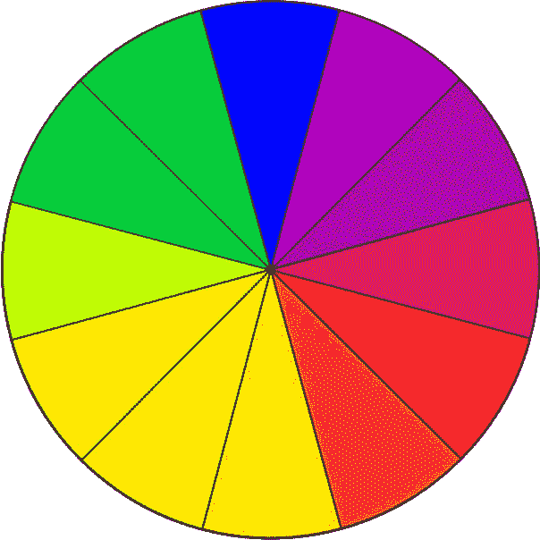

# 利用色彩心理学加速你的网页设计

> 原文：<https://medium.com/swlh/using-color-psychology-to-accelerate-your-web-designs-8f5d5b08ba09>

对于任何品牌来说，网站都是一个很好的营销策略，因为它有助于在市场上树立权威，提高客户的信任度。

但是，一个格式糟糕、视觉效果不佳的网站不太可能达到预期的效果。

当浏览者的目光在其他网站吸引他们注意力的内容上徘徊时，他们会简单地浏览这个网站。你将无法吸引他们，他们将会错过网站的目的。

因此，这将导致你的业务销售减少。

斯坦福大学的一项网站可信度研究表明，高达 75%的访问者对网站的第一印象与其设计有关。

[Potrivaev](https://www.liveedu.tv/potrivaev/R6GdX-how-to-create-a-video-for-data-science-website-using-fusion/) ，拥有超过八年的网页设计经验，目前正在向人们传授他的技能，他也肯定“网站的视觉吸引力在访问者对品牌的第一印象中起着巨大的作用。”

还有什么比使用颜色更能提升品牌的视觉吸引力呢？

网页设计师、手机应用程序设计师和其他致力于打造强势品牌的人需要理解令人印象深刻的设计背后的色彩心理。

# 理解色彩心理学

色彩在品牌营销中起着很大的作用。顾客倾向于联系不同的品牌，并根据一个品牌所描绘的颜色采取某些行动。

良好的色彩审美会激发潜在顾客的积极情绪，强化品牌信息。

另一方面，一个颜色错误的网站在视觉上是没有吸引力的，不会与访问者建立联系。它未能增强客户对品牌形象的信心，客户最终可能会将业务转移到其他地方；一个更有吸引力的品牌。

一个品牌的颜色组合要么成功，要么失败。它会影响顾客如何看待你的品牌以及他们从中获得的信息。

因此，选择最佳的颜色组合是至关重要的，通过这种颜色组合，你的企业将传达其信息。

那么，颜色的使用如何影响你想出令人印象深刻的设计的能力呢？

关键驱动因素是什么？

# **1。了解你的受众**

这将有助于你想出吸引特定人群的视觉愉悦的内容。

谁是你的潜在客户？孩子？女人？

他们的偏好是什么？他们的年龄组是什么？

不同的客户对网页色彩设计有不同的反应。

例如，如果你正在运营一个数据科学网站，那么更权威的颜色会给你的品牌带来很多好处。

你网站的配色方案应该与潜在客户相关。

# 2.激发用户体验

色彩心理学的主要目的是影响顾客行为。因此，你必须决定你希望你的用户体验向哪个方向发展。

一旦你理解了如何影响你的观众和激起他们的情绪，你就可以满足于网站的最佳背景色。

然而，从品牌的角度来看待这个问题也很重要。

这些颜色会和你想要建立的品牌很好地融合吗？

不要让用户体验凌驾于你的品牌活动之上。

# 3.理解对色彩的需求

或者缺乏它。

理解为什么某种颜色比另一种颜色更受欢迎是至关重要的。主导条件应该指导你如何为给定的网页设计选择最佳的颜色。

例如，为了传达一种成熟、冷静和可靠的感觉，蓝色是最好的选择。

但并不是所有的设计都是同色冲击。根据流行的需求和你想要创造的感觉来设计你的网页。

缺少颜色也会影响顾客的行为；白色的使用创造了一种空间感，让一些特别的物品突出出来。

知道了网页设计中的色彩意义在吸引顾客方面起着重要的作用，你就有必要了解如何设计出最佳的色彩组合。

# 颜色混合方法

了解各种颜色组合有助于组合最佳颜色，帮助您的设计传达预期的信息。

以下是其中的一些:

*   红色——激发和激起激情。声音很大。
*   黄色——它是愉快和友好的。孩子们的最爱。
*   蓝色——代表成熟、可靠和信任。
*   紫色——给人一种优雅、奢华和女性气质的感觉。这很受欢迎，尤其是在女性中。
*   橙色——它是友好的，反映了复兴。它年轻而有趣。
*   粉红色——是女性的颜色。给人一种少女感，与婴儿联系在一起。

如何选择网站的颜色组合很大程度上取决于爱好者中当前流行的颜色。

您可以通过以下方式选择最佳设计和品牌颜色:

# **a .色彩鲜明度和互补性**

也称为三色，这种方法根据互补和活力来混合颜色。这是混合颜色的最基本方式，因为它们在[色轮](https://en.wikipedia.org/wiki/Color_wheel)上。

简单地说，选择至少相差 120 度的颜色，并将内容和背景的颜色组合起来。你可以用第三种颜色来导航。

# b.实验或分割互补

这种方法侧重于试验复合色。

例如，通过将色轮上彼此相邻的两种颜色与色轮上彼此相对的另外两种互补色组合，可以获得四种复合颜色。

这种方法需要更多的努力，因为颜色是在反复试验的基础上混合的。

# **c .仅使用互补色**

这种方法是类似的，可以给出夸张的颜色组合。

在决定配色方案时，谨慎是关键，因为所选的颜色可能会显得格外鲜艳。

这种方法主要集中在补色上。

# 最后的想法

虽然你应该热衷于使用正确的颜色来为你的网站和其他在线资产提供最好的设计，但品牌个性绝不能丢失。

颜色的选择应该与品牌相匹配，提升其意义和故事。

作为一名设计师，不要仅仅因为一个现有的标志或艺术品有不同的颜色就限制自己选择颜色。

相反，[学习](https://www.liveedu.tv/projects/premium/design/)如何恰当地运用色彩心理学来加速你的设计。这将有助于你创造一个持久而富有成效的印象。

## 这篇文章发表在[《创业](https://medium.com/swlh)》上，这是 Medium 最大的创业刊物，有+369，518 人关注。

## 在这里订阅接收[我们的头条新闻](http://growthsupply.com/the-startup-newsletter/)。

