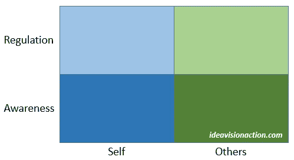

# 利用情商来克服你的不正常模式

> 原文：<https://medium.com/swlh/using-emotional-intelligence-to-overcome-your-dysfunctional-patterns-3b714fc204d5>

[JordyMeow/pixabay](https://pixabay.com/en/tori-torii-shrine-b-w-1976609/)

杰森·m·萨特菲尔德教授在他的课程《提高你的情商》中讨论了许多情商模型。其中一个模型因其简单而引起了我的注意。

An Emotional Intelligence Model

在这个模型中，有两个基本技能。

*   意识到情绪
*   调节情绪

这些技能应用于两个科目。

*   你自己
*   其他人

我们首先意识到一种情绪，然后调节它。我们要么放大它，要么缩小它，要么切换到另一种感觉。

将这些技巧运用到自己的情绪中已经是一种成就，但是能够将它们运用到别人身上是一种 [**超能力**](https://ideavisionaction.com/business/how-to-develop-superpowers-in-business-and-relationships/) 。

**应用于分心**

假设你在日常生活中有注意力分散的问题。午饭后你很难集中精力工作。

你开始用社交媒体分散自己的注意力。一旦开始，一个小时都停不下来。这样，你每天就浪费了一个小时。

这是一个典型的场景。我们都有每天或每周重复的生活模式。然而，这些模式并不适合我们。

**第一步:认知**

要克服这种模式，第一步是意识到引发它的渴望。一旦对社交媒体的渴望开始，花一点时间什么也不做，充分感受它。

深呼吸，观察渴望。当你第一次开始这样做时，你会感到不适，但这种不适会慢慢消退。如果你坚持做几分钟，你就会放松下来。渴望已经减少了。

> **“放手包括意识到一种感觉，让它出现，和它呆在一起，让它顺其自然，不想让它变得不同或做任何事情。**
> 
> 这意味着简单地让这种感觉存在，并专注于释放它背后的能量。
> 
> **“第一步是允许自己拥有这种感觉，不要抗拒它、发泄它、害怕它、谴责它或对它进行道德说教。**
> 
> **“它的意思是放下判断，看到那只是一种感觉。**
> 
> 这个技巧就是和感觉在一起，放弃一切努力去改变它。
> 
> **“放下想要抗拒的感觉。是阻力让这种感觉持续下去。**
> 
> **“当你放弃抵抗或试图修改这种感觉时，它会转移到下一种感觉，并伴随着更轻的感觉。**
> 
> 没有被抵抗的感觉会随着它背后的能量消散而消失
> 
> 出自大卫·霍金斯的《放手:投降之路》

**更进一步:引发另一种感觉**

在上面的例子中，我们意识到一种感觉，并通过简单的呼吸练习来调节它。最终，你可以更进一步，触发你自己的另一种感觉。

艾克哈特·托尔在他的书《现在的力量》中解释说，我们的感觉是我们身体对我们思想的反应。我们可以通过思考一个特定的想法来触发自己的感觉。

例如，你可以想想你浪费时间的习惯导致的一次失败。用这个想法来进入愤怒的情绪。然后，用愤怒来激励自己抛弃网络，开始工作。

**采用成长心态**

开始时调节你的情绪可能很困难。这是一项你可以通过长时间的练习来发展的技能。不要拘泥于固定的思维模式。采用 [**成长心态**](https://ideavisionaction.com/motivation/the-fundamental-principle-of-personal-development/) 。

**准备一份假设清单**

《5 秒钟法则》的作者梅尔·罗宾斯提供了一个培养调节情绪技巧的工具。她建议为你的模式创建一个假设清单。

我们都有不正常的模式。我们一遍又一遍地重复这些模式。如果你能从列表中去掉一个习惯，你将会在生活中取得巨大的进步。

首先，你的生活中会少一个不正常的模式。第二，你将学会一种克服不正常模式的方法。你会知道它的工作原理，并将其应用于其他功能失调的模式。

**试试看！**

在你的日常生活中选择一个不正常的模式。也许，你每次去杂货店都会买饼干。也许，你在早上变得易怒，并猛烈抨击你的孩子。也许，你每天在社交媒体上浪费一个小时。

写下不正常的模式以及你将如何解决它。比方说，你选择了社交媒体习惯。

每当你渴望在社交媒体上浪费时间时，提醒自己每天浪费的一个小时加起来就是一年 15 天，24 年就是一整年。那是在你一生中最富有成效的几年里浪费了整整一年。

我也提醒自己我的听觉清单。我的听力列表上有 380 个标题。听一本优秀的有声读物比在社交媒体上浪费时间要好得多。

**一次只关注一个图案**

雷伊·达里奥在他的书《原则》中建议列出三个你想放弃的习惯和三个你想采纳的习惯。

我建议你列出这个清单，但是一次只做一个模式。在进入下一个模式之前，完成该模式的所有四个学习层次 。

1.  无意识的无能。你没有意识到你有不正常的模式。
2.  自觉无能。你意识到自己的不正常模式，但却无能为力。
3.  自觉能力。你可以解决你的模式，但你必须有意识地努力。
4.  无意识能力。你自动驾驶。对社交媒体的渴望会引发愤怒和动力，甚至不用去想它。过了一段时间，你就完全感觉不到任何渴望了。

**结论**

2×2 情商模型在你的私人和职业生活中是一个有用的工具。

它包括意识到并调节你和他人的情绪。

意识到一种情绪，不对它采取行动，并与它呆在一起直到它平息是一个有效的策略。

另一个有用的策略是提醒自己一个引发反情绪的想法。

列出你不正常的模式，但是一次只关注一个模式。当你完全克服了一个不正常的模式，你就可以进入下一个模式。

一旦你掌握了觉察和调节自己的情绪，你就可以对别人使用同样的技巧。

如果你也能掌握这一点，你将拥有最有效的领导技能之一。

[***注册我的电子邮件简讯***](https://ideavisionaction.com/email-newsletter/) ***每周都会收到我关于人生经验、个人发展、写作、博客、营销、商业、创业和企业家精神的最新帖子。***

## 这个故事发表在 [The Startup](https://medium.com/swlh) 上，这是 Medium 最大的创业刊物，拥有 325，521+人关注。

## 在这里订阅接收[我们的头条新闻](http://growthsupply.com/the-startup-newsletter/)。

