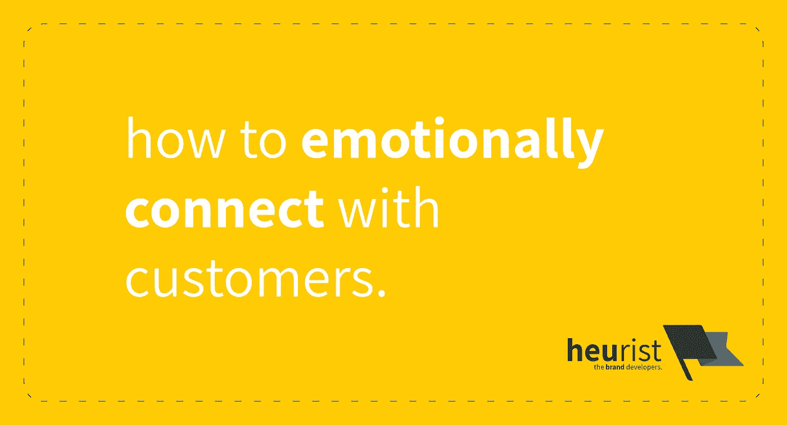

# 如何在网络营销中运用情感？

> 原文：<https://medium.com/swlh/using-emotions-to-connect-with-customers-online-its-trickier-than-you-think-89a952a59d68>

在线营销人员处于劣势。他们需要不断想出创新的方法来与客户建立情感联系。本文将向您展示如何做到这一点。

# 该归功于谁…

这篇文章基于我们在 [Reddit 帖子](https://www.reddit.com/r/marketing/comments/9klzc9/emotions_and_buying_decisions/e709g09/?context=3)中的回答。最初的帖子问及情绪如何影响在线购买过程与传统过程中的决策。

我们对这个问题非常感兴趣，但不幸的是，这个话题没有像我们希望的那样流行起来。我们祈祷能有一个关于营销心理学的深入讨论，但是，唉，我们没有得到。

所以我们决定以文章的形式来探索它。享受吧。

# 情绪如何影响购买过程？

我们最近调查了品牌的情感性和它们如何出名之间的联系([此处](https://www.heurist.com.au/2018/08/how-brands-become-famous/))。Jonah Berger 在几本书中谈到了这个概念，但是我们特别关注了一篇论文，它告诉我们内容的情感性与人们是否会分享它有着直接的联系。所以，从纯粹的营销角度来看，我们看到**人气**取决于**情感**。

> "态度有三个不同的组成部分:情感、行为意图和认知."

接下来**购买过程(一般而言)**会以同样的方式受到情绪的很大影响。通过快速浏览我们的心理学文本，我们发现'**态度**'(定义为对某事的一套信念/感觉/意图)受到**情感**和**认知**过程的影响，最终导致某种行为或**意动**【2】。因此，我们可以相当肯定地说，一件**产品**在消费者头脑中引发的情绪和认知过程的性质与他们是否打算购买它有着直接的联系。

# 为什么多感官互动对营销很重要？

我们知道，情绪与推动购买意向有关。下一个问题是，营销人员如何创造或**影响**这些情绪？显然，答案在感觉中，而人类的感觉。

我们之所以关注五种感官，或称之为**感官模式**，是因为:身体感觉与记忆有关，并且经常与特定的情感联系在一起。事实上，嗅觉是我们最[原始的感觉](https://www.ncbi.nlm.nih.gov/pmc/articles/PMC3782615/)【3】，因此也是[与我们的情感](https://www.sciencedirect.com/science/article/pii/S1879729610001237#bbib0015)【4】联系最紧密的。作为这一事实的证明，这里有一段摘自马丁·林德斯特罗姆的《品牌意识》[5]:

> “……我走在东京的一条街上，从一个身上喷着独特香水的人身边擦肩而过。嗖的一声。记忆和情感的潘多拉魔盒立即打开了。”

嗅觉是一种强大的感觉。它可以影响情绪**潜意识**，不需要任何形式的有意识的思考。自然地，身体上的感觉——尤其是嗅觉——是**极好的工具**,可以用于**营销目的**。

感觉的营销应用也不仅仅局限于嗅觉。以**触摸**为例。人类仅仅通过触摸物体就能推断出大量的信息。通过将一件物品握在手中，我们可以推断出它的**材料属性**——重量、质地、硬度和温度【6】。人们发现，触摸产品的能力**会增加顾客的购买意愿**。事实上，有些客户绝对需要这些信息:

> “触摸障碍，如零售展示柜，会抑制触觉信息的使用，从而降低对产品评估的信心，并增加更有动力触摸产品的消费者的沮丧程度。”[7]

因此，自然地，任何营销人员都应该努力**最大化**在购买过程中**多感官体验**的应用，对吗？

**是**。但是这在网上并不奏效。提示下一部分。

# 在线营销处于劣势

传统环境下的购买过程通常会受到所有感官的影响。比如说食物。你可以看到它，闻到它，听到它被制作，并最终在餐馆触摸/品尝它。

当我们不得不在网上销售它时，事情就变得棘手了。这是我们 Reddit 回答的关键。作为营销/品牌/UX 策略师，我们的观点是，虽然在线营销通常打开了同时与大量人互动的大门，但它有一个主要缺点，即缺乏让客户与产品互动的**感官模式**。

与我们之前的餐馆例子相比，考虑通过 **Uber Eats** 或 **Menulog** 点餐。这样做需要你纯粹从视觉上评估食物；你还没来得及闻一下，就已经买了。这就给在线媒体带来了一个巨大的任务来促进在线购买过程:他们需要创造同样的情感，但他们能够做到的感官模式(即工具)却更少。

总之，这表明在线营销在推动购买意向的能力方面受到严重限制，只能依靠视觉和听觉。

# 在线营销人员如何解决这个问题？

综上所述，我们知道**情感**在顾客**购买**的意向中扮演着重要角色。我们还发现，在线销售过程需要不同的策略来引发必要的情绪，以诱使顾客购买产品。本质上，**在线营销人员**的任务通常是寻找创新的方式来表达——二维感官——五维感官的产品体验。

因此，在线不是以最原始的方式(通过嗅觉/触觉/声音/味觉)来引发情绪，而是使用**视觉**(有时还有**听觉**)手段，要么模仿其他感官，要么试图倒过来“提醒”人们气味、味道等，这将引发他们需要的情绪，以促进购买。

## 假装直到你成功:通过感官障碍。

根据 Peck & Childers [6]的说法，人类能够从视觉上推断产品的材料属性——我们可以从视觉上**测量质地、尺寸、重量等等。更进一步，我们可以想象一个产品可能**闻起来**像什么，甚至**尝起来**像什么，就像**向我们描述的**一样。**

有时候，这样的推论足以让人们衡量一个产品[6]。这种推论——使用视觉和听觉——是在线营销人员经常利用来克服在线购物的感官障碍。因此，我们建议执行以下操作:

1.  创建**视听内容**，如产品的视频，以说明其材料属性的方式，甚至描述其他属性，如相关的气味或味道。
2.  鼓励**产品评论**，评论者借此阐释、展示和描述产品。

为什么是后者？因为根据 Statista 的调查[8]:

> 84%的人会像信任个人推荐一样信任在线评论。

因此，如果一个顾客要购买一件产品，**体验**它，然后**宣传**它——他们可以(在二维感官层面)表达他们对它的情感，以及与它互动的感官体验。然后将充当一个产品的 5-感官维度体验的可信代理。

因此，在线营销人员应该花相当多的时间**制作视频**来展示他们产品的**物理体验**，鼓励**口碑**推荐，让人们向朋友和家人描述产品，鼓励第三方**评论**，并促进内部和客户/评论者**视频**的传播，以弥补他们通过传统方式营销产品时可能会有的物理联系的缺乏。

# 那么，你应该从这篇文章中学到什么呢？

情绪在购物中扮演着重要角色。在线和传统都需要激发情感来推动购买意向。然而，在线和传统购买过程引发情绪的方式必须有根本的不同，因为在线互动在组织与客户互动的感官模式数量上是有限的。

**在线营销在情感上与顾客建立联系是一场向上的战斗:**如果你选择在网上营销你的产品，那么你应该意识到这样一个事实:你的产品或服务在唤起推销自己所需的情感方面存在严重缺陷。

但是，还是有办法解决的。制作视频是跨越感官障碍的一个好方法——你可以展示你的产品的感觉，描述它的味道，它让你想起什么，它唤起你的情感，等等。当然，如果你想让人们相信这个视频，它可能必须由其他人——一个独立的第三方——为你评论或宣传你的产品。

不管怎样，看起来没有一个完美的替代物能够像人一样，对产品进行物理上的视觉、听觉、触觉、嗅觉或味觉的体验。反正还没有。在我们能够为人们创造多感官体验，让他们虚拟地接触产品之前，我们将不得不依靠想出巧妙的方法来使用视觉和听觉，让在线销售为我们服务。

# 脚注。

*我们假设“传统”购买流程是购买产品或服务的行为，需要与销售团队、环境或产品本身进行实际互动。

# 参考文献。

[1] J. Berger 和 K. Milkman，“情感和病毒式传播:是什么使在线内容病毒式传播？，" *GfK 标志。智能。修订版*，第 5 卷，第 1 期，第 14–23 页，2013 年。

[2] N. R. Carlson，G. N. Martin 和 W. Buskist，*心理学*，第二版。埃塞克斯:澳大利亚培生教育公司，2004 年。

[3] E. A. Krusemark，L. R. Novak，D. R. Gitelman，W. Li，“当嗅觉遇到情绪:焦虑状态依赖的嗅觉加工和神经回路适应”，*神经科学杂志。*，第 33 卷，第 39 期，第 15324–15332 页，2013 年。

[4] Y. Soudry，C. Lemogne，D. Malinvaud，S. M. Consoli 和 P. Bonfils，“嗅觉系统和情绪:共同的基质”。安。耳鼻喉科。头颈部疾病。，第 128 卷，第 1 期，第 18-23 页，2011 年。

[5]m . Lind strm，“品牌感”，*汽车科技总线。b .总结。*，2006 年第 15 卷第 1 期。

[6] J. Peck 和 T. L. Childers，“拥有和持有:触觉信息对产品判断的影响”， *J. Mark。*，第 67 卷，第 2 期，第 35-48 页，2003 年。

[7] J. Peck 和 J. Wiggins，《就是感觉好:顾客对触摸的情感反应及其对说服的影响》， *J. Mark。*，第 70 卷，第 4 期，第 56-69 页，2006 年。

[8] Statista，“你信任在线客户评论和个人推荐一样多吗？”【在线】。可用:[https://www . statista . com/statistics/315755/online-custmer-review-trust/](https://www.statista.com/statistics/315755/online-custmer-review-trust/)。[访问时间:2018 年 10 月 4 日]。

## 这篇文章发表在 [The Startup](https://medium.com/swlh) 上，这是 Medium 最大的创业刊物，拥有+ 376，225 名读者。

## 在这里订阅接收[我们的头条新闻](http://growthsupply.com/the-startup-newsletter/)。

