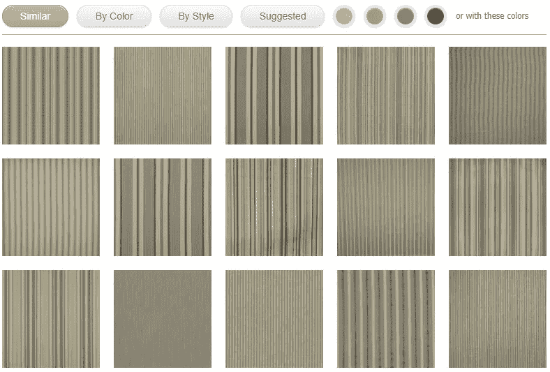

# 使用机器学习改进室内装饰织物的发现

> 原文：<https://medium.com/swlh/using-machine-learning-to-improve-upholstery-fabric-discovery-51e940db195d>

## 提升在线销售和参与度

[Unsplash](https://unsplash.com?utm_source=medium&utm_medium=referral)

我之前与人合伙创办了一家名为 **Inside Stores** 的公司，我们的利基网站之一，【insidefabric.com】是窗帘和室内装饰织物的畅销网站。

这篇文章详细介绍了我们如何利用**机器学习**，通过大大改进近 50 万件直运面料图案的产品发现，来提高访客参与度和销售额。

## 这里没有代码

这不是一篇编程文章，你不需要成为一名开发人员或了解任何关于机器学习的知识来理解这篇文章中的信息。我的重点将是描述我们所面临的问题，以及我们如何使用 ML 来实现创造性的解决方案。

***我不包括任何源代码或花哨的数学；只是简单的概念，可以很容易地被任何人理解运行一个典型的网上商店。***

# 背景

[InsideFabric.com](https://www.insidefabric.com)是一家典型的专注于室内装饰面料的电子商务网站。我们列出了大约 50 个不同供应商的近 50 万个待售图案。

我们不储存任何东西。面料通常来自工厂，采用 54 英寸宽的长螺栓(卷)，由我们的供应商储存，可用于直接运输。我们的顾客只需告诉我们他们想要什么样的图案和多少码，然后从插销上剪下，几天后就出现在他们的门口。

我们的数据是每天从提要、电子表格、电子邮件、pdf 和屏幕截图的组合中收集和刷新的。这是一个艰巨的过程，因为织物供应商最近才开始接受既定的数据自动化流程，而我们许多技术人员通常认为这是理所当然的。

如果您有兴趣了解更多关于我们数据收集流程的信息，我在我的个人网站上提供了我们定制工具的[截屏。](http://www.peteravritch.com/portfolio/insidestoresproductscanner)

我们的购物车软件是基于 ASP.NET 的现成商业产品的高度定制版本。很多年前，当我们发现当时任何可用的东西都无法满足我们的需求时，我们购买了源代码作为起点。

我们的服务器拥有快速固态硬盘、96GB 内存和 12 核 CPU。这确保了所有搜索和发现操作的高度缓存和亚秒级响应时间。

# 发现问题

当你访问像亚马逊这样的购物网站时，你通常很清楚自己在找什么。但是对于布料，用户很少知道他们在寻找新的窗帘，或者沙发的枕头。他们很少知道什么样的图案或颜色最合适——当他们看到时就会知道。

作为商店经营者，我们的工作是让游客开始打字或点击，然后进入兔子洞变得简单有趣。最终，希望他们能找到让他们兴奋的东西，我们就能做成一笔交易。

几乎我们所有的流量都来自有机搜索。我们的成功完全依赖于我们的搜索引擎优化技术和在谷歌有成千上万的页面。

无论用户在谷歌上输入什么作为起点，希望我们的一个页面显示在结果中，我们能够用我们独特有趣的用户体验将他们联系起来——因为我们知道，最终，他们最终购买的东西通常与他们最初在谷歌上输入的东西完全不同。

# 脏数据

在后端，我们面临的第一个问题是脏数据。由于数据来自 50 多家不同的供应商，格式多种多样，我们不可避免地会面临一些导入挑战。起初，这些挑战的深度有点令人惊讶，但最终，通过创造性的编程解决了这些问题，我们创建了一个护城河，这有意义地将我们的网络商店与大多数竞争对手区分开来。

**描述和元数据** 我们知道进去会遇到很多常见问题，比如缩写、拼写错误、同义词、数字格式和缺失数据。然而，令人大开眼界的是，供应商通常不为他们的产品提供任何视觉描述或分类。

为什么他们会告诉我们一个产品是 50%棉的，阻燃的，并被评为大量使用，但不告诉我们这是条纹，或主要是蓝色和白色？简单的回答是，一个多世纪以来，当你亲自去商店浏览时，你**“只是看着它”。如果你找到了你喜欢的图案，背面会有一张贴纸，上面有一些不明显的信息，如耐用性、易燃性和材料成分。**

**当然，在网上商店，访问者希望能够输入搜索短语，如“蓝色条纹”或“绿色花朵”；他们很少输入任何与供应商直接提供的元数据相关的内容——比如 double rubs 中的耐久性评级(业内人士使用的一种常用指标)。**

**很快就清楚了，我们需要使用机器学习来增加我们的数据，并填充关键的缺失描述符。**

****图片** 我们供应商提供的图片有多种形状和尺寸。有的有边框，有的没有。有些嵌入了文字说明。这样的例子不胜枚举。**

**我们最终的解决方案是创建一个图像摄取管道，从给定产品的最佳可用图像开始，然后应用大量测试和转换，如检测和移除边框，将图像转变为我们网站使用的常见格式和大小。**

# **机器学习**

**我们需要解决的发现问题非常适合机器学习，我们甚至不需要完全正确，因为对于我们的特定应用程序，视觉搜索的模糊接近实际上比精确匹配更好，以便向用户显示多种选择。**

## **嵌入**

**摄取和转换新图像后的第一步是将它们简化为矢量，通常称为嵌入。**

**与 GitHub 上大多数使用 TensorFlow 创建数学密集型 2048 长度浮点向量的开源示例不同，我们选择了更快的 54 字节二进制嵌入，基于[紧凑复合描述符](https://chatzichristofis.info/?page_id=15)，这将允许我们在内存中缓存整个数据集，并使用[谷本](https://en.wikipedia.org/wiki/Jaccard_index#Tanimoto_similarity_and_distance)计算对各种颜色和图案的组合执行亚秒距离比较。**

**然后，这些嵌入可以用于分类(条纹与方格)、文本扩充(将颜色和图案组附加到产品记录以支持全文搜索)，以及通过颜色、图案或两者进行实时视觉搜索。**

**如果用户上传他们试图寻找的图案的照片，我们也可以搜索精确匹配。我们只是使用相同的逻辑为上传的图像创建一个嵌入，然后在内存中搜索最接近的匹配。**

## **培训用数据**

**为了让我们的监督机器学习正确工作(用于分类)，我们需要大量带标签的数据集。但是，如前所述，大多数产品都没有标注任何视觉属性。**

**解决方案是创建一个内部工具，该工具根据传统编程按不同类别显示产品组，然后使用人工策展人来查看产品，并点击删除任何不适合该组的产品(在图像上覆盖了一个 X)。**

**最后，我们有了每个关键视觉分类的漂亮标签数据，我们需要这些数据来改善我们网站的用户体验。**

****

## **分类**

**一旦我们有了条纹、花卉和动物图案等流行分组的训练数据，就可以很容易地获取我们摄取的每个新图像，并使用常见的二元分类器来查看它属于哪个组(通常不止一个)。**

**这一分类步骤用于构建从我们的网站菜单和搜索对话框中显示的产品集，以及直接向产品记录添加文本标签和属性，以使产品在文本搜索中可被发现(否则不可能使用供应商提供的有限描述)。**

# **搜索体验**

**我们的搜索体验将页面顶部常见的文本搜索栏与各种分类过滤器(方面)结合在一起，以帮助用户微调他们的结果。**

**显示产品组的每个页面上都有下图所示的对话框。这些页面既包括标准文本搜索结果，也包括品牌、颜色、设计师、价格点和许多其他预定义组的类别页面，这些页面是在监督机器学习的帮助下策划的。**

****

**使用搜索过滤器在屏幕顶部逐步建立一个需求(方面)列表，可以通过单击进一步调整，以实时更改产品结果。**

****

**我们的目标是，无论你如何登陆一个产品页面，都可以很容易地将其作为一个新的参与起点，并应用任何数量的新过滤器。也许你喜欢这些条纹，但现在你需要看到它们是纯棉的，来自拉尔夫·劳伦，每码不到 100 美元——简单！**

# **面料建议**

**在每一个产品页面上，我们使用机器学习来创建一个基于当前展示产品的关键视觉属性的相似模式矩阵。**

**也许你喜欢条纹，但不喜欢颜色。或者，你喜欢其中一种颜色，你想在方格图案中看到它。或者，也许这些条纹太宽，你想要类似的，但更薄，或在不同的价格点。**

**我们涵盖了所有的角度。点击即可。**

**关键的一点是让点击一些相关产品的随机路径变得容易和有趣；沿途提供有趣的曲折。**

****

# **产品图库**

**我们为提高参与度和可发现性而添加的最后一个组件是在网站几乎每个页面的底部随机添加八个产品图库列表。**

**他们的想法是，由于大多数访问者真的不知道他们想要什么，只是四处点击，直到他们看到一些令人兴奋的东西，向他们展示他们当前搜索路径之外的模式与向他们展示与他们的搜索密切匹配的产品一样重要。**

**我们有计划地创建了超过 20 万个这样的“长尾”图库，这也为我们的 Google 足迹增加了数千个页面——提高了 SEO。**

****

# **结果**

**这篇文章中描述的所有变化的累积效应是参与度飙升。人们只是不停地点击。很有趣。**

**游客可以继续沿着某条路走下去，或者突然看到完全不同的东西，然后跳到一个新的兔子洞。他们会一遍又一遍地重复这一过程，直到最终找到适合他们新椅子、枕头或窗帘的完美图案。**

**每次访问花费在我们网站上的平均时间增加了两倍多，销售额也是如此。对于机器学习来说，这是一个极好的应用，对于我第一次真正进入这个领域来说，这是一个很大的乐趣。**

## **感谢阅读。如果你喜欢这篇文章，请随意点击那个按钮👏帮助其他人找到它。**

****

## **这篇文章发表在 [The Startup](https://medium.com/swlh) 上，这是 Medium 最大的创业刊物，有+387，966 人关注。**

## **订阅接收[我们的头条](http://growthsupply.com/the-startup-newsletter/)。**

****