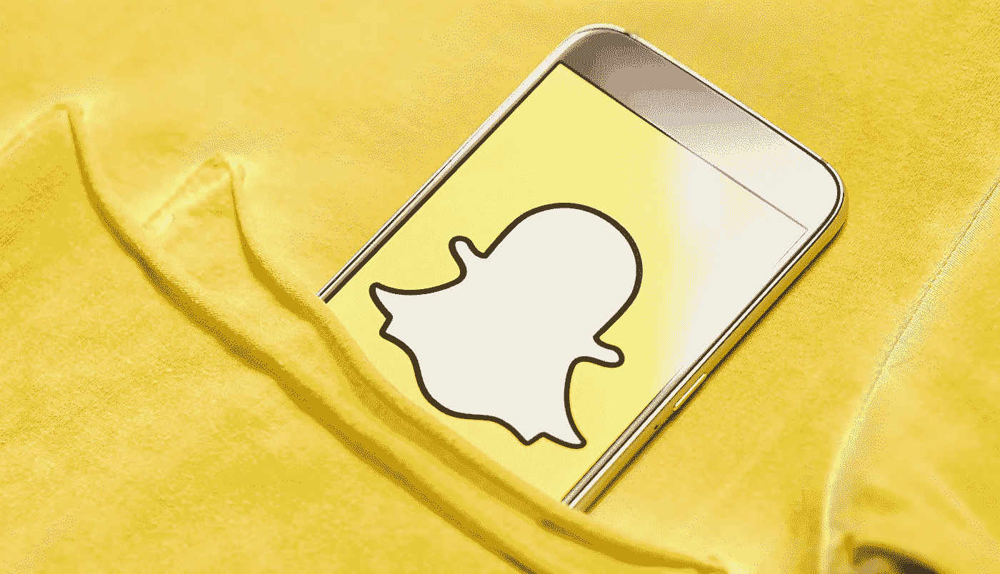
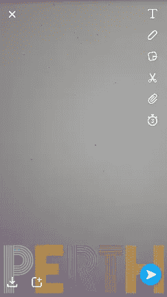
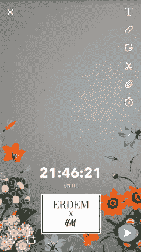
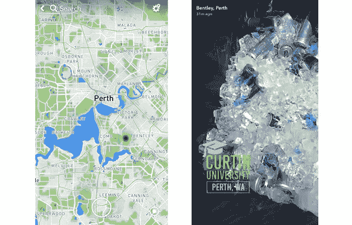

# 营销工具:Snapchat For Business

> 原文：<https://medium.com/swlh/using-snapchat-for-business-marketing-tools-e0e47352cb49>

## 如何在企业中使用 Snapchat

成长在 70 年代和 80 年代的“连胜”是一个喝醉的家伙在足球场上做的事情。谢天谢地，不再是了。这都是关于“Snapchat 条纹”的。好吧，这还不是 Snapchat 的全部，如果你已经过了 40 岁，还“不懂社交”，你就不知道现在发生了什么。Snapchat 不在普通企业，甚至不在营销人员的议事日程上。脸书、Twitter 和 Instagram 是最受欢迎的，但 Snapchat 正在快速增长，并被更大的公司和品牌所接受，这些公司和品牌认识到了在特定客户群体中扩大营销范围的潜力。了解大多数人使用的移动电话应用程序所带来的营销机会是至关重要的。

但是等等！Snapchat 是什么？

Snapchat 是一款面向 Android 和 iOS 的移动平台应用。Snapchat 背后的想法是通过照片和视频进行即时通信，在移动设备上发送或接收。在 Snapchat 出现之前，社交媒体非常基于桌面，更专注于积累数据，如状态或推文或照片和视频，你可以在网上发布所有这些东西。你的朋友可以评论它们，你可以永远保存它们。

Snapchat 改变了这一点，最初“快照”只在收到的设备上保留很短时间，但现在他们扩展了这一点，使用“故事”的想法，你的照片和视频可以与你的粉丝一起广播，“快照”保持 24 小时可用。

**人们如何使用 Snapchat？**

所有的社交平台都执行特定的任务，因此吸引不同的受众。一个人的 Twitter 是另一个人的 MySpace。或者类似的东西。那么，人们如何使用 Snapchat 呢？嗯，视频和照片发挥了巨大的作用。Snapchat 上的用户每天观看 100 亿个视频，比 2015 年的 20 亿有了巨大的飞跃。对我们来说，Snapchats 最大的资产是它通过定期更新的照片过滤器提供的创造力，使 Instagram 的过滤器看起来像爷爷的蹩脚老照片(我想这是重点，但嘿…..).我应该承认，我给我女儿发了一些照片，照片上我戴着独角兽的角，我化着老女人的妆，我戴着老鼠耳朵随着一些奇怪的韩国流行歌曲跳舞。奇怪吗？没错。好玩？肯定！Snapchat 在早期因消息和图像在一段时间后消失的方式而受到指责。突然间，发色情短信成了一件事，家长们不知道该如何处理。作为一个十几岁孩子的父母，我可以证明这不仅仅是一点点令人生畏，然而，尽管滥用这项服务的机会仍然存在，Snapchat 已经超越了它。独特的界面，快速的沟通和有趣的因素超过任何恐惧。此外，作为父母，这是保持联系的好方法，尽管保持一定距离。

该应用程序不断向前发展，2017 年年中，他们发布了 Snapmap，评论褒贬不一。和所有的社交媒体一样，这可以被用作一种善恶力量。知道你所有的“朋友”在哪里并不总是一件好事。然而，如果你是一家企业，它可以有不同的、积极的应用。

**为什么用 Snapchat 做生意？**

除了为更年轻、更懂移动的受众提供门户之外，Snapchat 还创造了智能营销工具，以独特的方式扩展覆盖范围并帮助业务联系。Snapchat 提供了多种付费营销选项，以满足特定的业务目标。你可以创建一个智能快照广告，一个古怪的赞助商地理过滤器，或者通过赞助商的镜头与你的潜在客户互动。

**Snap 广告(付费)**

Snap 广告是全屏的，三到十秒的垂直广告，你可以在 Snapchat 平台上自己制作。它们出现在朋友的故事和 Snapchat 内容之间，如 Snapchat 的故事或出版商的故事。观看的人可以随时向上滑动以获取更多信息，可能是阅读文章或访问网站。快照广告具有很强的针对性，可以提供很好的用户体验。

**过滤器(付费)**

每个支持拍照的社交媒体平台都可以选择使用滤镜。Snapchat 与任何其他平台不同的一点是，企业可以制作自己的 geofilter。打开过滤器和位置设置的任何人都可以浏览本地制作的过滤器。这些是基于位置的自制过滤器。当有人在那个区域时，他们可以使用你的过滤器。它通常用于活动、高流量社交空间、连锁店(如零售业)、宣传活动、圣诞节等节日或电影发行。这对品牌营销来说太棒了。这是我们附近出现的一些过滤器。(不想吓到你，我们拍了一张墙的照片，而不是自拍):

一定要留意指示活动增加的地方的热图。在这张图片中，红点热点位于科廷大学，他们为当天的活动安装了 snapchat 过滤器。

**镜片(付费)**

最后一种广告选择以赞助镜头的形式出现，这种镜头偶尔会引人注目，并取得巨大成功，尽管使用的是大型的知名品牌。 [Adweek](http://www.adweek.com/digital/taco-bells-cinco-de-mayo-snapchat-lens-was-viewed-224-million-times-171390/) 报道称，2016 年，塔可钟的过滤器有超过 2.24 亿次观看，平均用户在上面花费超过 24 秒。24 秒在社交媒体里就是一辈子！赞助镜头让用户有机会玩你创造的独特广告。要激活镜头，用户只需在相机前按住自己的脸。一些镜头需要用户的动作，如“张开嘴”来触发动画，给体验增加了一个引人入胜的扭曲。最棒的是，当你完成游戏后，很容易将完成的视频或照片发送给朋友或发布到你的故事中。统计数据显示，普通用户会用一个赞助商的镜头玩 20 秒。最近，这些镜头开始通过他们的“新世界”镜头系列融入“现实世界”增强现实功能。随着技术的发展和适应，我们期待看到它的发展和变得更加流行。

嗯，有免费的机会吗？

与所有其他平台一样，我们建议建立直接受众的最佳方式是通过真实、有机的参与。付费广告很棒，但是没有什么能打败真实的(虚拟的)联系。因此，如果你还没有准备好投入 Snapchat 的广告预算，仍然有很多方法可以在不花一分钱的情况下将 Snapchat 用于商业。

**讲述你的故事**

Snapchat Stories 是图像和短视频的汇编，可观看长达 24 小时。用户希望与他们的朋友分享他们的故事，商业机会是定期创建一个引人注目的、有创意的故事。无论你是在烤面包还是在键盘上敲数字，都要找到一种有趣且吸引人的方式来谈论你的日常业务活动。我们都喜欢故事！

**建立群组**

Snapchat 是在小而紧密的群体中交流的好方法。当它在 2016 年末发布时，Business Insider 称之为 Snapchat 的群组功能，这是[多年来最好的功能](https://www.businessinsider.com.au/snapchat-groups-best-feature-in-years-2016-12?r=US&IR=T)——这的确是一个很大的呼吁！创建最多 16 人(不超过 16 人)的小组，讨论服务的特定部分。创建教程、指南或只是一个空间，让你最好最好的客户去闲逛。

总的来说，大多数企业在 Snapchat 派对上姗姗来迟。社交媒体研究公司 L2 发现[的 Instagram 采用率远超 Snapchat](http://www.adweek.com/digital/9-data-points-show-how-marketers-are-using-snapchat-171964/) 。可能是因为 Instagram 远更容易把握？无论哪种方式，和所有的社交平台一样，为了获得吸引力，持续一致的沟通是必要的。讲述一个伟大的故事，看着你的追随者成长——但是请不要再拍食物和咖啡的照片了。如果你有话要说，确保它与众不同，引人入胜，最重要的是，你！今天就与 [Start Digital](https://startdigital.com.au/contact-start/) 谈论我们最喜欢的 Snapchat 过滤器——或者您的企业如何拓展新空间！

*本文最初是为* [*开始数字*](https://startdigital.com.au) *于 2017 年 11 月 22 日*创作和撰写的

## 这个故事发表在 [The Startup](https://medium.com/swlh) 上，这里有 262，800+人聚集在一起阅读 Medium 关于创业的主要故事。

## 在这里订阅接收[我们的头条新闻](http://growthsupply.com/the-startup-newsletter/)。

