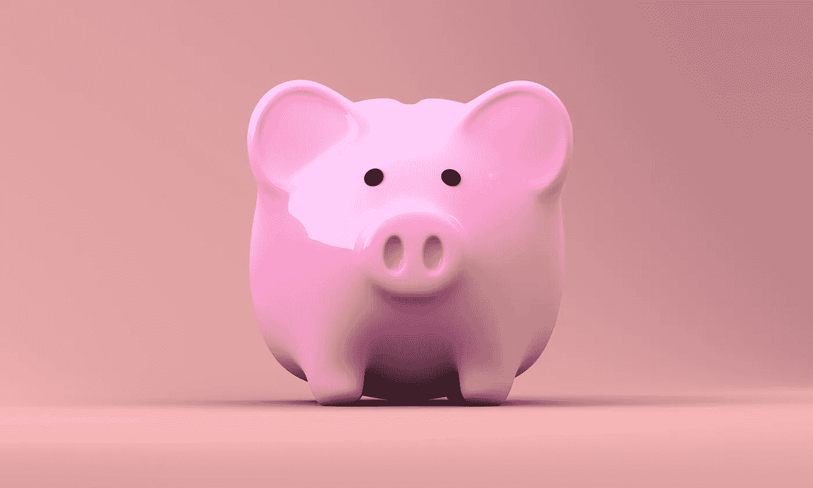

# 用“滚雪球法”还债

> 原文：<https://medium.com/swlh/using-the-snowball-method-to-pay-off-debt-43b89c2d5aa6>

## 由[蜜琪拉·帕里克](/@mikaelaparrick)出版

F 感觉自己被困在一堆坏账下？

考虑使用“滚雪球法”快速摆脱债务，同时尽可能减少你长期支付的利息。

滚雪球法是由金融大师、商人兼作家[戴夫·拉姆齐](https://www.daveramsey.com/)推广开来的。

A visual guide to the snowball method.

## 它是这样工作的:

首先，按照余额大小来组织你所有的债务。

偿还你所有债务的最低金额，然后把多余的钱先用来偿还最小的债务。

一旦最小的债务被还清，将这笔钱滚动到下一个最大的债务。

这种方法旨在通过给你“小胜”作为激励，从心理上鼓励你还更多的债。

戴夫·拉姆齐的网站上有一个例子:

假设你有以下四项债务:

1.  500 美元医疗账单(50 美元付款)
2.  2500 美元的信用卡债务(63 美元付款)
3.  7，000 美元汽车贷款(135 美元付款)
4.  4.10，000 美元学生贷款(96 美元付款)

使用债务滚雪球法，你可以支付除了医疗账单之外的所有费用的最低还款额。举个例子，假设你每个月有 500 美元的额外收入，这是因为你做了一份兼职，并把你的开销降到了最低。

因为你每月要支付 550 美元的医疗费用(50 美元加上额外的 500 美元)，这笔债务将在一个月内还清。然后你会拿着那 550 美元去偿还信用卡债务。你可以为塑料支付 613 美元(释放的 550 美元加上 63 美元的最低付款)。大约四个月后，你将告别信用卡。你已经还清了！

现在每月给汽车贷款 748 美元。十个月后，它会消失在夕阳下。现在你着火了！

当你到了学生贷款的时候——这是你最大的债务——你可以每月投入 844 美元。这意味着它只能持续大约 12 个月。

**点击这里免费下载一份可打印的** [**债务滚雪球工作表**](https://brownandjoseph.com/wp-content/uploads/2018/07/Debt-Snowball-Worksheet.xlsx) **！**

虽然滚雪球法对于管理多项债务非常有效，同时仍有一定的财务自由，但有更多财务纪律的人可能会考虑使用雪崩法。

不管你决定用什么方法，还清债务肯定会让你更安心，让你有更多的钱去买你想要的东西。

# 感谢阅读！如果你喜欢这个故事，我们的[博客](https://brownandjoseph.com/blog/)上还有更多。😊

Brown & Joseph 是一家全国性的催收机构，专门从事保险债务的回收。

我们的结果不言自明—我们已经为客户恢复了超过 10 亿美元的额外收入。

请访问我们位于 www.brownandjoseph.com[的网站了解更多信息！](http://www.brownandjoseph.com)

## 这篇文章发表在[《创业](https://medium.com/swlh)》上，这是 Medium 最大的创业刊物，有 340，876+人关注。

## 在这里订阅接收[我们的头条新闻](http://growthsupply.com/the-startup-newsletter/)。

