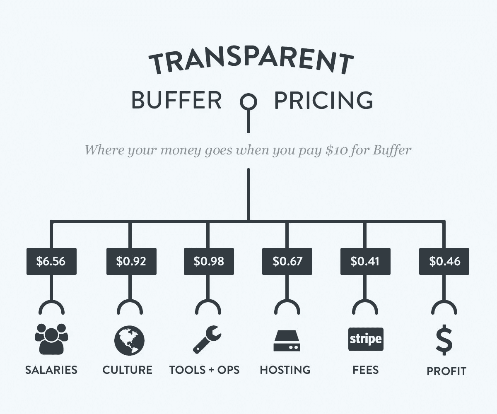

# 用透明度来衡量你的价值

> 原文：<https://medium.com/swlh/using-transparency-to-charge-what-youre-worth-a53b3c53b55a>

## 劳动力幻觉如何导致客户低估工作价值，以及如何解决。

吉姆是个锁匠，他已经当了 25 年了。当他第一次开始时，他不太擅长，所以每把锁要花一个小时。他的顾客感谢他花时间解决他们的问题，并给了丰厚的小费。

现在，吉姆好多了。利用他多年的经验，他可以在 5 分钟内锁定。他的顾客感到被欺骗了，因为他仍然收取和他花了一个小时做的一样的费用。他们不认为他们应该为别人花 5 分钟做的事情付那么多钱。他们给的小费不多。

即使 Jim 以更快的速度向客户提供同样的服务，他也受到了惩罚。他正在经历的是实际上的“T0”劳动幻觉。

虽然看起来你让别人等的时间越长，他们就越不开心，但在某些情况下，事实恰恰相反。如果你把等待和努力联系起来，你会有一个比直接结果更满意的客户。他们更直接地感受到他们购买的价值。

那么，你如何防止客户因为看不到价值而对你的工作不满意呢？

1.  **基于价值的定价**:不按小时收费，而是基于客户从你的工作中获得的价值。为什么要因为变得有经验而惩罚自己，让自己的工作速度提高一倍呢？
2.  **明码标价:**一块 Apple Watch 值多少钱？不是手表本身，而是你能用它做什么。通过追踪你的健康状况来减肥。把你的手机留下。这些不是手表本身的功能，而是好处。关注这些。
3.  **展示里面的东西:**当我买一件衬衫时，我看到一些棉布和一些乙烯印花。很难解释为什么有时甚至是 25 美元。解决办法？对投入的工作保持透明。表明你用的是质量更高的材料，价格更高。或者，你是在美国手工制造的，而不是在海外由机器人制造的，这增加了成本。这种透明度真正表明了客户为什么要花他们正在花的钱。

Buffer 在这方面做得很好。它们显示了你的 10 美元/月的确切去向，这有助于显示产品的价值，并防止客户一旦知道他们的钱去了哪里，就推回成本。

那么，你什么时候见过戏里的劳动幻觉？你见过哪些公司变得透明，公开他们的资金流向以缓解这种情况？

## 这个故事发表在 [The Startup](https://medium.com/swlh) 上，这是 Medium 最大的企业家出版物，拥有 296，127+人。

## 订阅在这里接收我们的头条新闻。

