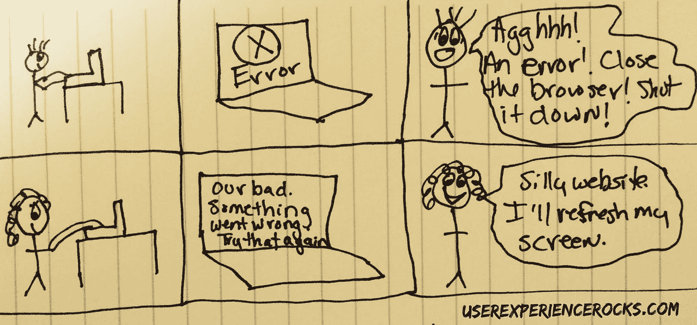

# UX &错误信息:停止吓唬你的用户！

> 原文：<https://medium.com/swlh/ux-error-messages-stop-scaring-your-users-729ca0eda062>

在我成为 UX 职业选手之前，我是一名软件培训师。我走遍了全国，与各个年龄段的用户一起工作，教他们如何使用各种软件解决方案。我有心理学背景，所以我一直觉得有趣的事情之一是用户对错误消息的反应。

我培训的产品在冷静地提醒用户…