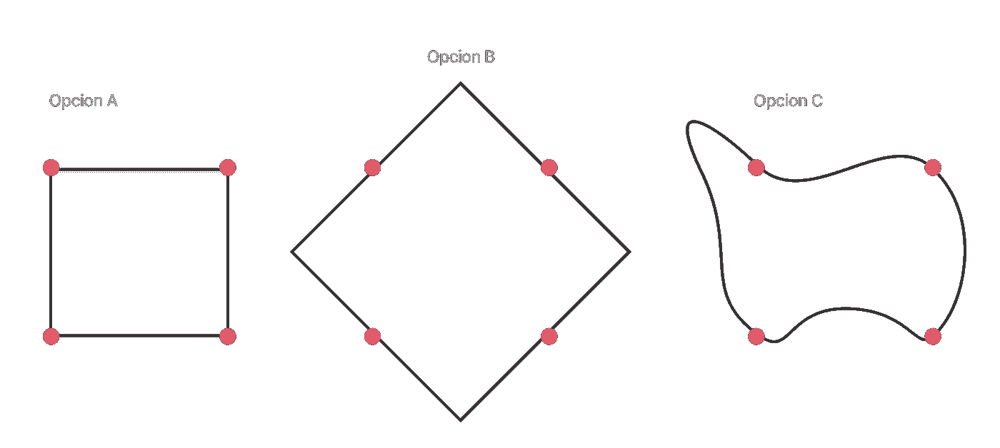

# UX 法律与实例。

> 原文：<https://medium.com/swlh/ux-laws-with-practical-examples-c418b4738d20>

## 先去🇪🇸。你想用西班牙语读这篇文章吗？[查看这里](/startups-es/las-leyes-de-ux-con-casos-prácticos-b838ddf7ff9b)。

几周前，我看到了一个关于“[**【UX】**](https://lawsofux.com/)法律”的轰动，这是一个非常简单的网页，讲述了 UX 的主要法律(用户体验)。这是一个奇妙的网站，我 100%推荐。

如果我们必须制作一个关于 UX 法律的标题…

# **设计师在思考和改善用户体验时必须考虑的法律或设计标准的集合。**

**好的设计往往遵循一般原则，这些原则给设计师提供了工作的一般指导方针。但是对于界面设计者和用户体验来说，也有一定的规律是大家要考虑的。**

**在“**UX 法律**”中，每条法律都有自己的图形表现，灵感来自极简主义书籍的经典封面。我们的目标不是简单地将它们收集成一个列表，而是帮助人们记住这些定律。**

> **无论是图像还是视频，都比文本更容易记忆**

**显然，这些表述不仅仅是在网络上讨论和传播的，我不打算在这里讨论(此外，我 100%同意)**而是就这些法律提出一些有真实产品的例子。**我们开始吧！**

# **费茨定律**

****

**它基于心理学家 Paul Fitts 在 1954 年的工作，确定了**“快速移动到目标区域所需的时间是到目标的距离与目标宽度之比的函数”。****

**当设计按钮时，该定律直接影响用户体验，例如，较大的按钮，尤其是在具有触觉的移动设备上，从而得出结论，较小的按钮更难交互。下面是一个实际的例子。**

****

**Kickstarter**

**这将是应用**费茨定律**的情况，它接近于预设鼠标阅读区的情况*(在右边，因为我们是西方人，我们从左向右阅读)*，它还覆盖了一个大空间(它不是一个小按钮)，因此“点击”和点击按钮的概率很高。**

# ****希克斯定律****

****

****“做决定所需的时间随着选择的增加而增加”****

**因此，用户做决定所花的时间越长，他们拥有的选项就越多，很明显，用户试图考虑所有可能的选项以及它们所包含的内容，并将选择他或她认为最好的选项。**

**哪个更好？**

*   ***有 20 个选项的单个表格需要填写***
*   ***4 个阶段，每个阶段 5 个选项的阶梯式表单。***

**这显然取决于用户的行业和类型，但希克斯法则告诉我们，第二种选择更好。下面是一个实际案例。**

****

**Airbnb**

**一个将简单性发挥到极致，应用希克定律的实际例子。Airbnb 不切割，更喜欢划分流程，简化流程。**

****“直接告诉我你想去哪里，然后我会问你什么时候去，怎么去”。****

# ****雅各布定律****

****

**创造新事物的最好方法是寻找参考资料，这样第一批客户就能理解它是关于什么的，并能产生联想。**

**这是什么意思？这意味着用户将大部分时间花在其他网站上(以防他们不知道你的网站)。这意味着他们更喜欢相似的网站，而不是他们经常访问和已经熟悉的网站。这就是为什么最好不要过度原创或过度创意。**

**这一标准是由 Jakob Nielsen 创造的，他是 Nielsen Norman Group 的主管，与苹果公司的研究副总裁共同创立的。我不知道，我得到的印象是他确实对这个话题有所了解:)。**

**这条定律的一个实际例子是任何电子商务。**

****

**e-commerce example.**

**95%的电子商务都有这种样式的条款。左边是图片，右边是名称、价格、配置和“添加到购物车”。**

**如果你要建立一个电子商务，对你来说合乎逻辑的事情就是考虑这个结构，因为一个潜在的客户知道电子商务是如何工作的，并期待类似的东西。不要让他们思考！**

# ****普氏定律****

****

**也被称为“**简单定律**”，它指出用户以最简单的方式感知复杂的形式，因为这种解释需要较少的脑力。**

**基本上，它描述了正方形比八边形更容易理解和吸收。并且它需要较少的精神强度来获得对那是什么和它的目的的理解。这方面的一个实际例子如下。**

****

**Practical example of the Law of Prägnanz.**

**这是什么意思？我们之前看到的是什么，图 A，B 还是 C？很明显是 A，因为我们的大脑知道这是最简单的联想方式。实际应用的一个例子是:**

## **为什么“添加到购物车”按钮不是购物车，而是正方形？。**

# ****邻近定律****

****

****靠近的对象倾向于加入，在用户体验中，它们被理解为同一组的成员。****

**该原则认为，如果你正在处理一组数据，我们所理解的对应于同一组的所有数据应该在一起，如果我们开始谈论不同的数据，它们之间应该有一个空间(空气)。我们的大脑会完成剩下的工作并区分它们。**

**这方面的一个例子是…**

****

**Amazon**

**亚马逊就是这方面的一个实际例子，尽管在数据层面有“混乱”的感觉，但是这些数据的每一组在哪里都是非常清楚的。**

*   **最新消息与畅销书明显不同，你可以轻松区分不同的群体。**
*   ****B)** 如果你想过滤，你可以将各种技术(LCD、LED 等)结合在一起，并区分品牌(LG、三星等)**

# ****米勒定律****

****

**根据这一定律，人们可以在工作记忆中记住多达 7 种不同的元素。这就是为什么网页中的选项和导航菜单或多或少都基于这个尺寸。拥有超过 7 个元素会使用户产生困惑和注意力分散，用户不再记得他现在正在寻找的选项在哪里。**

****这就是为什么在有大量选项的应用程序或服务中，它们被分组以减少内存负载。****

**它是为了纪念乔治·米勒而命名的，因为它是他的传播理论的一部分。这种法律的一个例子是:**

****

**Netflix**

**虽然网飞有成千上万的电影类别，但它知道这很难记住，所以它让用户记住的不是内容，而是位置。**相反，他更喜欢拥有 6 个最“顶级”的类别，并从那里进行深度导航。****

# ****帕金森定律****

****

**这条定律告诉我们，任何任务都会被延长，直到完成任务的时间完全耗尽。这也是生产力的法则。**

**由于文化问题，我们认为我们投入的时间越多，就越好。但实践表明并不是这样的。**

**当我们知道我们有更多的时间，我们的大脑就会放松。另一方面，当我们感受到截止日期的压力时，我们会专注于做重要的事情，并且必须按时完成。**

**这在用户体验层面意味着什么？**

**用户已经建立了某些临时的“规则”，这显然取决于用户的类型，但举个例子，在亚马逊上购物(一旦你显然选择了购买)有 5 分钟的持续时间(在填写数据、卡等之间……)，任何缩短这些期限的事情都将是积极的。**

****

**Payment with Stripe.**

**比如 Stripe，简化了支付流程，让你记住了数据，所以在后续的销售中，购买的时间会大大减少。**

# ****序列位置效应****

****

**根据这个定律，在一个系列的元素中，**用户总是会更好地记住第一个和最后一个**。**

**这就是为什么我们看到在应用程序导航栏中，最重要的操作放在左边或右边，引入了开始或配置文件等元素，并考虑到了序列位置。**

**Instagram 就是这个定律的一个实际例子。**

****

**Instagram**

**第一个元素是 **Home** (人)，最后一个元素是 **Profile** (你)。应用程序使用中最重要、最核心的部分。**

# ****特斯勒定律****

****

**也被称为“复杂性守恒”，作者拉里·特斯勒。它证明了对于任何系统来说，都有一定的复杂性不能被降低到最大。**

**每个 UX 设计师都想简化流程，让他们更快，但我们必须考虑到，有些事情不能简化得更简单。(除非格式改变)。**

**我们可以在任何一家旅行社找到买票的例子。**

****

**Kayak**

**尽管我们很喜欢它，也很想要它，但预订航班需要 4 个基本数据。(**缘起缘灭，何时有多少**)。没有这 4 个数据，流程就无法完成。**

# ****冯·雷斯托夫效应****

****

**这个原理，也被称为**“隔离效应”，**预测当有几个目标时，与其余不同的那个会一直被记住。**

**很简单，不同的事物吸引着我们，并吸引着我们，典型的。“走！”在 UX 正是这一法律的症状。**

**这一法则的一个实际例子是内部通信这样的客户支持。**

****

**Intercom**

**在这种情况下，服务出现在内部通信网站本身上，没有太大的不同，但是，您确实注意到了“样式”的变化，因为它是最初不应该出现的叠加内容，具有背景，甚至是不同的字体。**

****最后，我们希望在形式和颜色上引起不同的注意。****

# ****蔡加尼克效应****

****

**定义未完成或中断的任务比已经完成的任务更容易记住的倾向。**

**将这个概念应用到 UX，我们可以谈论新的功能(服务)，在某个时刻提供它们，并告诉用户如果他想继续，他必须做 X 动作(注册、购买等)。我们可以提到的一个可视化的例子是一个需要考虑的未决任务列表，比如在[**startup explore**](https://www.startupxplore.com/es/?utm_source=medium&utm_medium=referral&utm_campaign=carlos-post-leyes-ux)**的情况下。****

****

**当你让某些任务“未完成”时，你的内部过程想要完成它们，但你也有那种感觉，记得它们是未完成的。**

# **“一个好的 UX 会考虑或试图考虑用户将要找到的所有选项，并试图简化路径来完成你提供的服务。”**

**总之，一个基于用户体验的、经过深思熟虑的设计必须满足这些标准中的每一条。**

**还有就是我之前提到的，总想着一个**地图产品**(最小牛逼产品)。**

** [## MVP 死了，长命到图。(最低牛逼产品)

### 如果你要做一个新产品，想想你的客户期望什么，并努力提供最好的体验…

medium.com](/swlh/the-mvp-is-dead-long-life-to-the-map-minimum-awesome-product-404df90fef7f)** ****

**你喜欢这个职位吗？**

****给它鼓掌！**你最多可以鼓掌 50 次，这样会有更多的人发现和知道这个帖子，当然……别忘了分享。**

**让我们看看那些掌声！**

****

## **这篇文章发表在[《创业](https://medium.com/swlh)》上，这是 Medium 最大的创业刊物，有 295，232+人关注。**

## **在这里订阅接收[我们的头条新闻](http://growthsupply.com/the-startup-newsletter/)。**

****