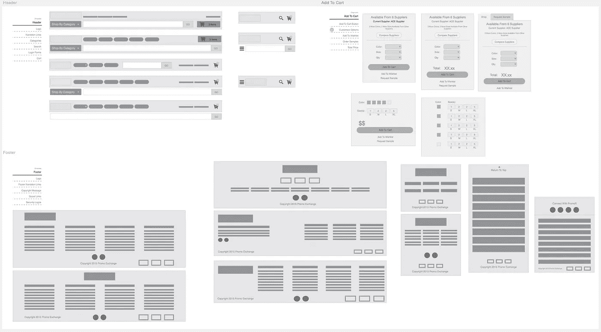

# UX 分流:从看|做走向灰色。

> 原文：<https://medium.com/swlh/ux-triage-moving-from-see-do-to-grays-b9f3e8692d04>

这个过程完全是非线性的。传统上，我们将 UX 流程从 A 点移到 B 点，将之前的步骤留在后面。UX 的分流在本质上不是传统的。**见|做**和**灰**协同工作，都是“活文档”。

想要快速浏览一下 [UX 的伤检分类](http://bit.ly/1GUVuV3)，请点击查看帖子[。](http://bit.ly/1GUVuV3)

# **见|做优先事项**