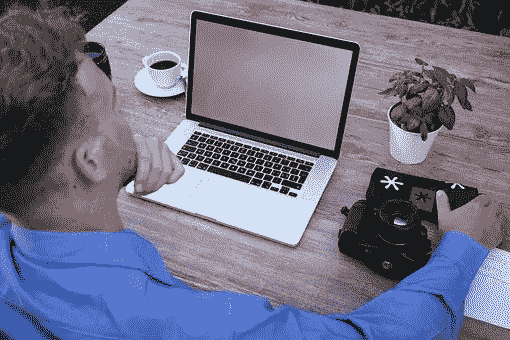

# UX vs UI vs IA vs IxD:解释 4 个令人困惑的数字设计术语

> 原文：<https://medium.com/swlh/ux-vs-ui-vs-ia-vs-ixd-4-confusing-digital-design-terms-explained-222f3bcc3255>

在数字世界里，设计这个词经常被认为是平面设计的字面意思，尽管这个行业正在变得更加复杂。

Leila 是一名乌克兰的 UX/UI 设计师，她喜欢向人们传授自己的技能，她说“随着越来越多的数字创意和工作岗位的出现，如今‘设计’这个词有了更多的含义。”

UX 设计、用户界面设计、信息架构和交互设计是一些数字术语，设计行业以外的人或初涉设计行业的人会感到困惑。

下面是这些单词的快速概述，可以帮助你理解它们的意思。

# 什么是 UX 设计(用户体验设计)？

用户体验是指用户从与产品的互动中获得的满足感。

如果一个应用程序或网站不是用户友好的，用户很容易感到沮丧，并转向其他不太难使用的网站。

UX 设计考虑了人机交互的方面以及用户感知产品的各种角度；利用这些来提高可访问性和可用性。

一个满意的用户更有可能与朋友分享他们的体验，这对一个网站来说是有利的。

因此，UX 设计组件有助于提升网站访问者的体验。

# UX 设计师的角色是什么？

1.  UX 设计师在每个项目开始时使用竞争分析工具进行研究。
2.  这位 UX 设计师使用软件开发产品原型，以提供可供开发人员构建的线框。
3.  他们确保在构建最佳用户体验设计时与开发人员的顺畅沟通。
4.  他们对产品进行可用性测试，并在项目启动时进行深入的 A/B 测试。

# 什么是 UI 设计(用户界面设计)？

用户界面赋予用户与机器之间的交流以意义，无论是身体上的还是情感上的。

用户界面设计关注的是软件和机器，如电子设备、手机、电脑和家用电器，是如何被设计来增强用户体验和最大化可用性的。

作为机器和最终用户之间的接触点，用户界面应该是用户友好的，以提高交互的便利性和实现用户目标的效率。

用户界面设计应该以用户为中心，以提高生产力，让用户享受使用他们的设备。

一个好的用户界面设计，因此，集中在使机器的界面易于使用和最终用户愉快。

此外，选择合适的界面元素可以提高机器的可用性和效率，从而实现用户的目标。

这些元素包括文本字段、使用的文本类型、颜色代码列表和按钮。

这些元素在屏幕上的排列决定了它们被访问和用于不同任务的难易程度。

用户越容易理解界面并与之交互，他们就能越快地完成目标。

以下是一些简化用户交互的用户界面元素:

*   输入控件——它们允许用户将数据或信息输入到他们的机器和设备中。它们包括按钮、复选框、文本字段、列表框、下拉列表和切换。
*   信息组件——这些元素被整合到用户界面中，为用户提供更多信息或足够的帮助，以防他们在与设备交互时陷入困境。它们包括模式窗口、工具提示、消息框、通知和进度条。
*   导航组件——顾名思义，这些组件允许用户导航界面。这些元素包括图标、滑块、搜索栏、面包屑、标签和分页。
*   交易工具——这些元素允许用户根据手头的任务和他们的偏好修改任何输入。这些元素的例子有 Photoshop、Fireworks、Sketch 和 InVision。

# UI 设计师的角色是什么？

1.  用户界面设计者被期望为产品提出一个交互式的设计和样式，以简化操作过程并满足用户的需求。
2.  为了确保界面上的元素简化用户交互，UI 设计者寻求最大化可用性的最佳设计。
3.  确保与开发人员顺利沟通，建立最佳的交互设计。
4.  UI 设计师创造性地设计软件界面，并让它对用户来说是真实的。
5.  通过优化使网页上的操作更加用户友好。

# 什么是 IA(信息架构)？

信息架构是应用程序中内容的安排和组织，使用户能够方便地找到完成任务所需的信息。

信息架构为用户提供了一个导航工具，帮助他们从自己的位置轻松地发现和获取信息。

例如，IA 包括由内容策略师绘制顶层菜单和将内容分成不同的类别。

# 一个 IA 设计师的资质是什么？

1.  应该在移动应用程序、网站、系统服务和其他复杂的数字财产的文档方面有经验。
2.  关注细节，能够发现数字财产综合文件中的差异和漏洞。
3.  熟练使用 IA 相关程序，如 Axure、Keynote、Vision 和 Omnigraffle。
4.  通过分析可用信息优化 IA 方法的能力。

# 什么是 IxD(交互设计)？

交互设计的目的是在用户和他们交互的产品和服务之间提供有益的关系，比如手机、电脑和其他小工具。

# 交互设计师的角色有哪些？

1.  交互设计师负责动作设计，比如应用程序和网站上的动画，以及他们与用户交互的能力。
2.  在整个设计过程中，与其他设计师、产品工程师和研究人员合作，开发高效、互动的产品。
3.  预测用户的需求并为他们开展活动，以确保最终产品符合他们的目标和期望。

# 包扎

总之，UX 设计是用户从使用应用程序中获得的满足感，UI 设计是应用程序中的元素如何协同工作以简化用户交互，信息架构是应用程序如何构建以简化信息查找，交互设计是应用程序和用户交互时的反应。

要清楚地划分不同设计术语之间的界限并不容易，因为它们的方法在某种程度上彼此相似，在某些情况下还会重叠。

因此，[学习](https://www.liveedu.tv/guides/design/)各种设计概念可以帮助你知道如何区分它们，并提升你的开发技能。

## 这篇文章发表在[《创业](https://medium.com/swlh)》上，这是 Medium 最大的创业刊物，有+370，107 人关注。

## 订阅接收[我们的头条新闻](http://growthsupply.com/the-startup-newsletter/)。

