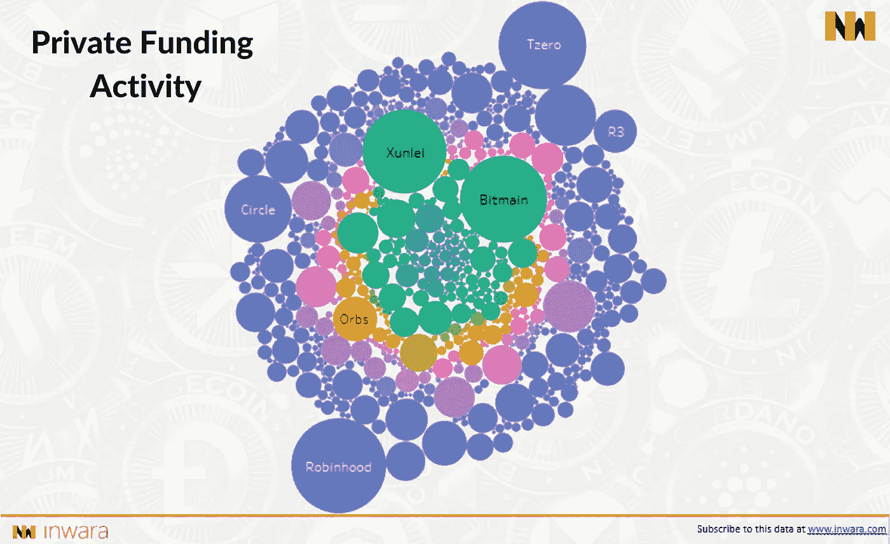

# 创投资本家利用低价环境投资 ico

> 原文：<https://medium.com/swlh/vcs-capitalising-on-low-price-environment-to-invest-in-icos-13b02680678d>

## 2018 年第三季度，风险投资环比增长+100%。

Source: InWara’s Finance Sector report

众筹和机构参与之间的界限越来越模糊。风险资本家正在投资 ico 和区块链公司。

风投已经表现出直接从预售、SAFT 合同和…