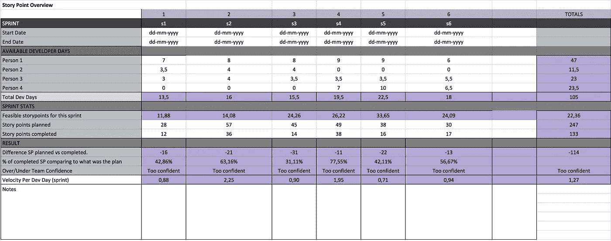
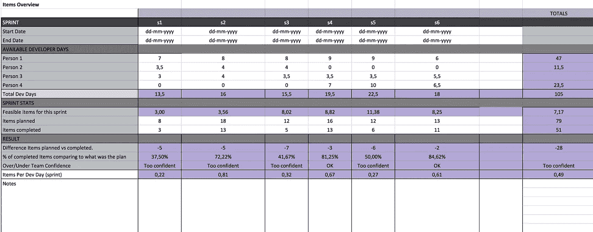
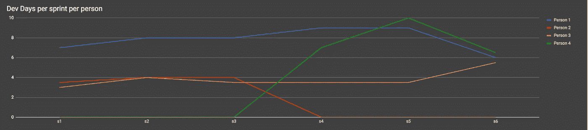
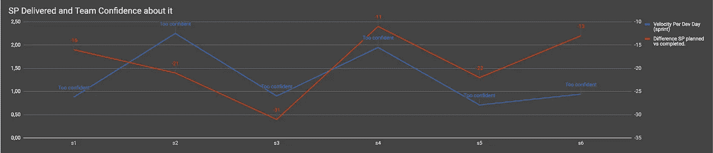
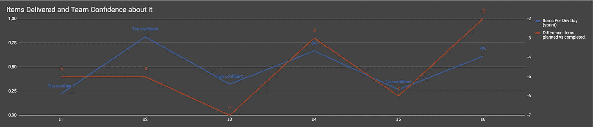
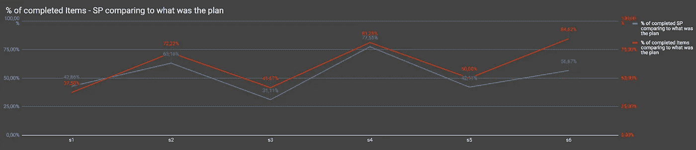

# 速度、pbi 和预测

> 原文：<https://medium.com/swlh/velocity-pbis-and-forecasting-86bb14f54078>

我不得不承认，我在速度方面从来没有过好的体验，我的体验一般，我总是与它斗争，几年前我是开发人员，现在是敏捷蔻驰和 Scrum Master。我知道，随着团队越来越多地进入[规范和执行](https://www.mindtools.com/pages/article/newLDR_86.htm)，以这样的速度，我们应该能够更好地预测什么时候我们会准备好一些东西。

有些团队并不是对所有事情都给出故事点，例如，有些团队只对特性给出 SP，因为作为一个团队，他们想知道做新软件的速度，然后，像 bug 这样的项目会给出很多不确定性，用 t 恤尺寸或不同的技术来估计，但是这篇文章不是关于什么应该估计，什么不应该估计。

我不必承认软件是复杂的，我们都知道这一点，但是，现在人们更多地在公司内部轮换，不仅仅是在公司内部，还有像 Spotify 和[分会](https://labs.spotify.com/2014/03/27/spotify-engineering-culture-part-1/)之类的模式，人们也更多地在团队内部轮换，这是我喜欢的。当然，我的意思是，随着更多的人轮换， 对于一个团队来说，更难的是长时间处于[执行](https://www.mindtools.com/pages/article/newLDR_86.htm)阶段，但这篇文章不是关于这个，也不是关于如何评估，而是关于一个团队如何更好地知道他们能做多少，以及可视化他们在每个 Sprint(PBIs)的任务方面的成就。

这个想法的第一个灵感来自于我和 Jerónimo Palacios 的一次培训，他和我们谈到了这个想法。训练结束后，我开始思考这个问题，我在观察团队时意识到，每次冲刺，他们在任务数量方面的想法比 SP 的数量更准确。

我开始在组织内搜索*速度可视化*的例子，最后我与 [Mels](https://www.linkedin.com/in/melswolf/) 交谈，他是一位 [trivago](http://www.trivago.com/) 的同事，他给了我一个他是如何做的例子，我以他为例，做了一些改变来满足我的需要。

在下面的例子中，你看到的是我过去工作过的一个团队的**前 6 次冲刺**的对比，人员和日期不相关，所以他们不在场，但数据是真实的。

# 我将开始展示故事点的表格。

**开始和结束日期**:冲刺的日期

**可用开发人员天数:**这是由人决定的，这个人将有多少天时间来完成任务？我总是在这里提醒，我们必须现实一点，在冲刺阶段，我们会有会议，Scrum 仪式，等等..因此，我们必须尝试现实地了解每个开发人员将在任务上工作多少天，你可能会想为什么我们在这里有人员的名字，相信我，这不是为了控制或责备或什么，而是为了帮助理解每个 sprint 发生了什么，稍后你会看到。

**总开发天数:**是的，总开发天数。

**这个 sprint 的可行故事点:**这基本上是由 ***所有*** *每日开发速度的 AVG 得出的*总开发天数***

**计划的故事点:**团队最终决定包括多少个 SP。

**故事点完成:**团队最终交付了多少个 SP。

**SP 计划与完成的差异:**以上两个值的差异。

**%已完成的 SP 与计划相比:**上述两个值的百分比差异。

**超出/低于团队信心:**这是由团队设定的，他们认为多少 SP 的差异是超出或低于团队信心，我的意思是，如果我们计划 30 个，我们交付 29 个，团队真的太自信了吗？太少了？他们还好吗？我发现它很有用，以后你会明白为什么。

**每个开发日的速度(sprint):** 这是总开发日交付的 SP *的数量。*

最后，在右边你会看到一些总数，就像一个概述。

# 我将继续显示条目概述表。

这里没有什么令人惊讶的地方，唯一的不同是，我们不是用 SP 来可视化表格，而是按项目来可视化，完全相同的表格结构，但是主要输入是不同的。

为了补充表格，有一些图表可以帮助更好地理解正在发生的事情。

这是我们看到在每个 sprint 中有多少人可用的地方，正如我所说的，这里根本没有责备的意图，也没有控制的目的，这只是帮助我们了解，例如，为什么在一个 sprint 中 SP 目标比其他 sprint 小得多，就像在圣诞节，我们有大多数人在度假。

**对于故事点**

在这里可以看到每个 sprint 我们所做的和我们计划的差异以及信心感受(该值是每天开发的速度)，这将帮助我们看到，例如，我们是否总是对我们能做的事情过于自信，也可以看到我们所做的和我们计划的差异越来越大，这可能会提醒每个人更加现实？

**对于项目**

与上面相同，但这次是项目。

现在我最喜欢的是，对于 SP 和 Items，我们所做的和计划的有%的不同，对吗？所以这个图表是两个值的比较，除了第一次冲刺，我们可以很容易地看到团队是如何**总是更接近他们认为他们可以在项目方面而不是在速度方面做的事情。**

我知道这些数据只属于 Sprints 6，但是根据我们现有的数据，如果您是 PO，您会更信任您的团队他们认为他们可以完成的任务数量，而不是 SP，即使这听起来像是常识，同样地，*“常识没那么普遍”*

我们可以从真实数据中看到，sprint 超过 sprint 是一个事实，即团队可以更好地预测他们认为自己可以完成的任务数量。

有了作为 Scrum Master 和 Developer 的时间和经验，我也看到了团队在考虑他们认为自己在任务方面能做多少的时候通常会更有信心。

# 结论

当然，我并不是说您不应该有速度，或者您不应该进行估计，如果您以正确的方式使用速度，并且您的团队有一定的稳定性，速度当然是有用的，我也喜欢估计，但是不要误解我，我喜欢估计的不是它产生的实际服务点，而是估计在团队中建立的对话，这有助于减少不确定性并给出清晰性。

我只是想分享我的发现，然后由我们每个人来思考这对我们意味着什么，并且为了团队的利益(每个人！开发人员、业务、客户)，可视化这些信息有很大帮助，因为我认为这会让相关人员更加了解正在发生的事情和我们正在做的事情。如果您想了解更多信息，您可能有兴趣阅读[模式以获得有用的 KPI](http://marcos-pacheco.com/patterns-for-a-useful-kpi/)

我希望你喜欢它！如果你想链接到我使用的样本，请留言！

更多信息:http://marcos-pacheco.com/

## 这个故事发表在《创业》(Startup)杂志的第 10 期上，这是 Medium 最大的创业刊物，有超过 284，454 人关注。

## 订阅在此接收[我们的头条新闻。](http://growthsupply.com/the-startup-newsletter/)

