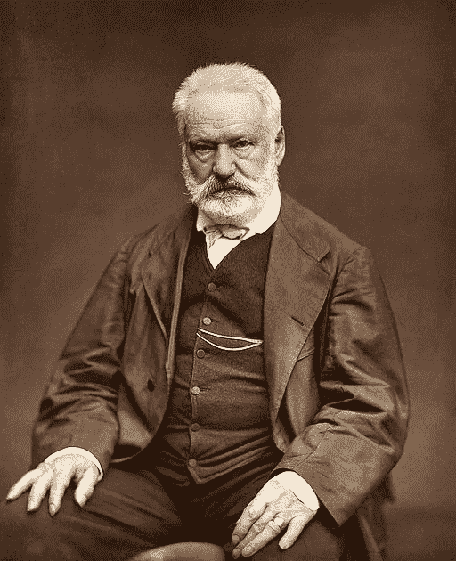

# 维克多·雨果讲述如何战胜拖延症，完成你开始的任何事情

> 原文：<https://medium.com/swlh/victor-hugo-on-how-to-beat-procrastination-and-finish-anything-you-start-3553ba27946a>

Photograph of Victor Hugo by Etienne Carjat.

1830 年 7 月，一个名叫维克多·雨果的 28 岁年轻人与拖延症做斗争，几乎放弃了写作。

雨果本应在 1829 年 4 月前将这本书提交给他的出版商，但他错过了最后期限——事实上，他一个字也没写。因此，雨果的出版商威胁要对他采取法律行动。[1]

经过多次恳求和谈判，雨果的出版商同意将最后期限延长至 1830 年 12 月。但是，雨果又一次拖延写书，错过了第二个截止日期。

这一次，雨果的出版商受够了，给雨果下了最后通牒:如果这本书在 5 个月内没有提交，雨果将为每晚一周支付 1000 法郎的罚款(相当于今天的 13000 美元)。[2]

雨果知道他必须做一些激烈的事情，想出一个战胜拖延症的方法，并完成这本书。

这是他接下来做的。

# 你被软禁了

不久之后，雨果买了一件从头到脚罩住他身体的灰色羊毛连体袜，一瓶新墨水，并把他的衣服锁在衣柜里，以防自己离开房子。

据雨果的妻子阿黛尔·雨果说:“(他)走进他的小说，就像走进监狱一样。”[3]

每天，从黄昏到黎明，雨果都会写他的书，只是在晚饭后的一个小时里，离开他的办公桌去吃饭、睡觉，或者给他的朋友读这本书的草稿。[4]

简而言之，雨果自我软禁。几个月后，他的策略终于有了回报。

1831 年 1 月 14 日，雨果在最后期限前几周完成了这本书，并将它命名为*(法语意为巴黎圣母院)。*

*在这本书出版的前 18 个月内，它售出了 3000 本——这对 19 世纪 30 年代早期来说是很多的——今天它被广泛认为是有史以来最伟大的书之一。[5]*

*但是雨果如果没有使用特殊的策略，就不可能克服拖延症，完成他的畅销书。*

*这个策略被称为*软禁策略*，这里告诉你如何用它来战胜拖延症，完成今天开始的任何事情。*

# *如何用软禁策略战胜拖延症*

*下面是使用*软禁策略*战胜拖延症的三个简单步骤。*

*第一步:写下近期的最后期限。*

*截止日期是克服拖延症和坚持计划的五件事之一。*

*一个好的截止日期短到足以迫使你立即采取行动，长到足以完成手头的任务。*

*在雨果的情况下，出版商的五个月期限迫使他开始写他的书。*

***第二步:为不作为制造负面后果***

*下一步是使用[【赌注】](https://mayooshin.com/how-to-motivate-yourself-dorothy-hamill/)或消极后果，如果你没有在最后期限前完成，来惩罚你自己。*

*例如，Hugo 因未能在最后期限前完成出版任务而受到的负面影响是每延迟一周罚款 1000 法郎。*

***第三步:设计你想要的未来行动***

*最后一步是在今天做一些事情来“锁定”你明天的行动——这就是心理学家所说的“承诺装置”[6]*

*例子包括:买小盘子以避免暴饮暴食，锁好信用卡以避免陷入债务，提前支付健身课程的费用。*

*雨果的承诺手段是锁好他的正装，买一瓶墨水开始写他的书，并防止自己离开房子。*

*就我个人而言，我也使用承诺手段来坚持我的写作习惯。*

*2017 年 5 月，我向公众宣布，我将每周写并发表一篇文章，除了两次短暂的休假，从那以后，我每周至少写一篇[文章](http://mayooshin.com/articles/)。这只是[设计您的环境](https://mayooshin.com/environment-shapes-life/)的另一个例子。*

*开始使用承诺工具的最好方法是向公众——朋友、家人和同事——宣布你的计划，每周让他们了解你的进展。这样你就有责任完成你开始的任何事情。*

# *光有动力是不够的*

*就像雨果一样——在写他的书之前——我们倾向于仅仅依靠动机和意志力来战胜拖延症，但这往往会导致我们无法在最后期限前完成任务，无法按照计划行事。*

*战胜拖延症的一个更好的方法是用三个简单的步骤来使用*软禁策略*:写下最后期限，为不行动创造负面后果，设计你想要的未来行动。*

*就像雨果一样，你将最终打破阻碍你实现潜力的拖延症。*

****网络嘈杂。*** *想要摆脱噪音，用经过充分研究的想法来提高你的大脑习惯和工作效率吗？加入聪明、好奇的头脑，在* [*《更聪明的大脑简讯》*](https://mayooshin.com/newsletter/) *获取你的大脑食物。**

***脚注***

*1.巴伯阿尔弗雷德。维克多·雨果和他的时代(1883)*

*2.法郎属于拉丁货币联盟，该联盟在 1873 年左右使用金本位制。当时，法郎相当于 0.2903225 克黄金。相当于 0.0102408248 盎司。今天的黄金价格约为每盎司 1240 美元，这导致 1 法郎(1830 年)今天约值 12.70 美元。*

*3.雨果五世(1978)。巴黎圣母院。(转。斯特罗克)*

*4.雨果阿黛尔。维克多·雨果:一个目击者讲述的生活(1863)*

*5.格雷厄姆·罗伯的《维克多·雨果》*

*6.加拉德·布莱恩，迪安·卡兰，斯科特·尼尔森，“承诺手段”,《经济学年度评论》2，第 1 期(2010)，doi:10.1146/annu rev . Economics。46366.76868686616*

**原载于 2018 年 12 月 17 日*[*【mayooshin.com*](https://mayooshin.com/victor-hugo-how-to-beat-procrastination/)*。**

**

## *这篇文章发表在 [The Startup](https://medium.com/swlh) 上，这是 Medium 最大的创业刊物，拥有+420，678 名读者。*

## *在此订阅接收[我们的头条新闻](http://growthsupply.com/the-startup-newsletter/)。*

**