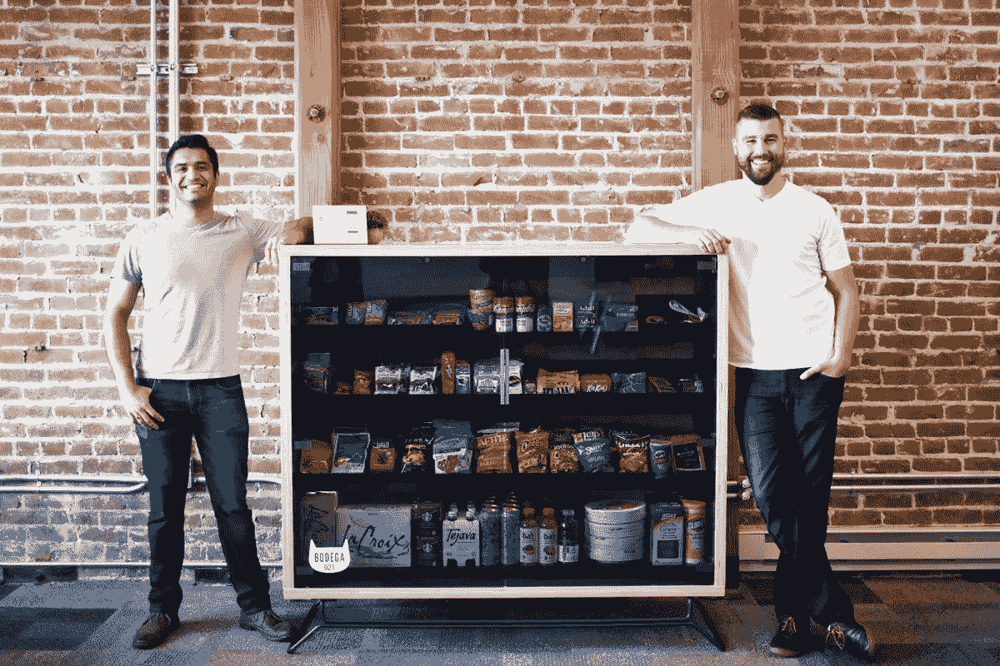

# 山谷中的恶棍:美国创新者是如何迷失方向的

> 原文：<https://medium.com/swlh/villains-in-the-valley-how-americas-innovators-have-lost-their-way-c7f9783dcf24>

扎克·克里格

硅谷初创公司 [Bodega](https://www.bodega.ai/) 认为他们可以将传统的街角商店改造成一台荣耀的自动售货机——而[他们大错特错了。这个想法一公开，](https://www.nytimes.com/2017/09/14/technology/bodegas-vending-machine-google.html?mcubz=3)[就在社交媒体上引起了轩然大波。事实证明，美国不希望它附近的杂货店被技术化的快餐盒取代。](http://www.billboard.com/articles/news/7964790/new-vending-machine-bodega-twitter-reactions)

硅谷的杂货铺没有意识到，对许多人来说，附近的杂货铺不仅仅是一个容易买到的不易腐烂商品的容器。[它们是舒适、传统和社区。你可以去那里吃点热乎的东西，或者进行一次友好的交谈。这些使 bodegas 与众不同的基本成分被一家公司剥夺了，这家公司敢于将这个名字据为己有。Bodega 的团队从根本上忽略了这一点，现在他们正在为此付出代价。](http://publicradiotulsa.org/post/nobody-takes-bodega-out-corner-not-even-startup)

硅谷的故事不再是关于勇敢、激进的创新者——那些不顾一切挑战权势、改变世界的失败者。缓慢但肯定的是，硅谷已经成为一种体制，如此臃肿、短视，与世界其他地区脱节，以至于失去了远见。一路走来，人们已经不再相信硅谷有改善生活的潜力。

在一个充满重大挑战的世界里，硅谷给了美国又一个为都市人送货的公司。难怪人们会翻白眼，而不是对下一个重大进步感到敬畏。作为美国创新的温床，硅谷被视为值得骄傲和兴奋的日子已经一去不复返了。每一个新的丑闻或公关失败都会导致消费者把创业公司看得更像笑话，而不是昔日英勇的技术先锋。

创新之井已经干涸，以至于我们最聪明的创新者从荒谬而非实用中获利了吗？

不。但在他们的傲慢中，硅谷开始把自己视为美国故事的英雄，而事实上，他们正迅速成为恶棍。甚至在苹果公司，加州天才如何改变日常生活的标准，[的魅力也消失了。](https://hackernoon.com/apple-has-lost-its-charm-66d94e2152c7)微小的、反复的前进有助于底线，但它们带来的挫折多于兴奋。当客户不得不修改新产品，让它们看起来更像一个更老、更好的版本时，有必要问一下谁才是品牌故事的主角。

当创新的潜力似乎已经消失的时候，[的傲慢也同时膨胀失控](https://www.forbes.com/sites/lorenfeldman/2016/03/24/todays-must-reads-for-entrepreneurs-silicon-valleys-unchecked-arrogance/#7e78ebde5408)。最近几个月的许多崩溃可以归结为压倒性的自我主义，这已经成为一种趋势和预期。当一个品牌认为自己优于顾客时，它很容易适得其反——这种情况现在正在硅谷发生。

现在，我们对硅谷成功的定义不是一个产品改善人们生活的能力，而是它赚钱的能力。我们根据一个想法有多性感和大胆来定义创新，以及创始人是否能产生狂热的个人崇拜。这可能有利于获得独角兽估值或短期底线，但毫无疑问，长期价值是由客户的情感驱动的。

这里的重点不是抗议科技公司无节制的骄傲。也不是为了敲响创新和机遇的丧钟。但如果硅谷要继续挖掘其创新潜力，故事必须改变。是时候谦虚一点，退一步，树立提升顾客并把他们的需求放在首位的心态了。

这种叙事上的转变不仅仅是表面上的形象重塑。由于糟糕的营销，Bodega 不值得如此负面的反应。这可能是一个原因，但是产品本身从一开始就有根本性的缺陷。当你开始制造一个产品时，它会讲述一个故事。

Bodega 的快餐盒暗示人们不再需要真正的商品。一台别致的自动售货机和一家家族企业一样好，甚至更好。杂货店的价值只在于它卖的东西，人际关系不再重要。单单技术驱动的便利就是[一个没人想再听的故事](http://mashable.com/2017/09/13/bodega-tech-distrust-silicon-valley/#3dCnd8F6.aqZ)。

将 Bodega 与 AirBNB 或 Lyft 进行比较，这两家公司在使用技术提供便利方面有着相同的根源。他们的颠覆是真实的:为消费者提供便利，同时让其他人(司机或房主)释放自己技能和资产的价值。他们十亿美元的估值不仅仅是基于技术:他们认识到他们故事中的英雄。

硅谷可能不再能够可信地讲述一个失败者的故事。尽管如此，这并不意味着这是不可挽回的。他们的故事中仍然有一个英雄——只是不是他们。像 Bodega 这样的创业公司必须把英雄的角色交还给他们的客户。不仅仅是他们的营销，还有他们制造产品的方式。

诚然，硅谷可能永远不会再有英雄，但仍然会有导师、圣贤和榜样——为真正的英雄——客户——提供实现梦想所需工具的向导和探路者。这是一个值得讲述的故事，也是我们都想听的故事。

*扎克·克里格是* [*沃登*](http://www.wodenworks.com/) *的合伙人。无论你讲故事的需求是什么，沃顿都可以帮助你。* [*下载我们丰富的指南*](http://www.wodenworks.com/wp-content/uploads/2017/09/Story_is_the_Strategy.pdf) *，告诉您如何组织叙述，或发送电子邮件至*[*connect@wodenworks.com*](mailto:connect@wodenworks.com)*，讨论我们如何帮助您讲述您的故事。*

## 这个故事发表在 [The Startup](https://medium.com/swlh) 上，这是 Medium 最大的企业家出版物，拥有 289，682+人。

## 在这里订阅接收[我们的头条新闻](http://growthsupply.com/the-startup-newsletter/)。

