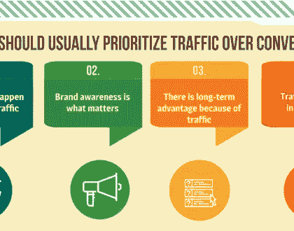
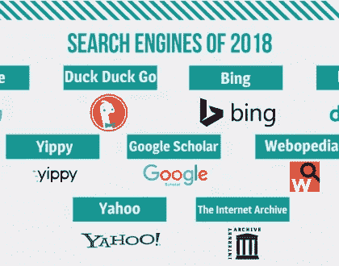

# 特里瓦格人阿比纳夫·库马尔的病毒式营销

> 原文：<https://medium.com/swlh/viral-marketing-all-one-should-know-about-the-trivago-guy-fa29b76bbd49>

我们相信你们一定都在电视上看过 Trivago 的广告。有很多关于特里瓦格广告上那个家伙的模因流传。你如何看待这个广告为 Trivago 做了巨大的营销，这和病毒式营销有什么关系？

在我们了解 Trivago 这个家伙之前，让我们先了解一下什么是病毒式营销。

病毒式营销是指你创造的内容应该像病毒一样传播，这有助于你品牌的营销。

内容或信息在其他网站上传播，这有助于内容覆盖范围和参与度的增长。病毒营销有三种类型或三个阶段，信使、内容和环境。

病毒式营销基本上是创造营销热潮。

促成这一点的因素是社交媒体平台，如脸书、推特、Instagram 等。当人们发现一些有趣的东西时，他们会在社交媒体平台上传播，这就是营销热潮发生的地方。

如今，人们花更多的时间在社交媒体上，这增加了他们对内容的消费，然后在他们喜欢的社交渠道上分享。

为了获得病毒式传播，你必须瞄准正确的受众和正确的营销渠道。它的优势是成本效益、快速增长、更广的覆盖范围和快速的销售线索生成。

既然你现在知道什么是病毒式营销，让我们了解一下 Trivago 这个家伙，以及它是如何导致病毒式营销的。

# 他是谁？

特里瓦格的名字是阿比纳夫·库马尔。每当你听到这样的话，“Kya apne kabhi 在线酒店搜索 kiya？”会立刻把他的脸带到你面前。

这就是阿比纳夫所实现和拥护的。他是所有在社交媒体和其他平台上流传的迷因背后的原因和灵感，人类是一个非常伟大的游戏

尽管他在自己的唱片上分享了自己的照片！

他不仅仅是他们从巷子里抓来的不正常的人。

印度特里瓦格研究员是该组织的真正代表，实际上不，是一个非凡的工作者。

他是 Trivago 印度公司的开发主管。

# 这家伙是怎么火起来的？

就像很多事物一样，基于网络的社交网络已经获得了在几乎所有事物上制作图片的名声，在阳光下无一例外！更重要的是，当那个平凡的人出现在我们的电视屏幕上时，每个人都注意到了。

然而，这并不是因为这场战斗有什么惊人的独特或专业之处，而是阿比纳夫的古怪光环和“不像电视上那样友好”的事件。他交谈的方式让事情变得更好！

虽然一些人在看到 Trivago 广告时非常恼火，但毫无疑问，他有一些粉丝有动机爱他，这是因为 Abhinav 的穿着本性和他不会对关于自己的图像感到震惊的能力，而是同样通过社交媒体在他的个人社交媒体账户上分享图像。

## 尽管如此，Trivago 出于什么原因选择了一个没有参与表演的工人来制作他们在印度的广告呢？

给我们一个机会让你明白为什么。

Trivago 总部位于德国，在超过 56 个国家开展业务。几年前，他们发现了这个例子，当时他们展示了一个突出现在广受赞誉的蒂姆·威廉姆斯的视频广告。蒂姆·威廉姆斯穿着一件有点可怜的衬衫，扣了几个扣子，用英语准确地翻译了阿比纳夫·库马尔的《印度特里瓦格促销》。

蒂姆·威廉姆斯的广告变得如此著名，引起了如此多的关注，以至于 Trivago 决定在他们所有的广告中使用相同的格式。也有一些亚洲，中东和英语版本的阿比纳夫！

《经济时报》对 Abhinav Kumar 进行了采访，他分享了他在寻找蒂姆·威廉姆斯的理想印度替代品时的遭遇，“我们在寻找一个合理的模型时经历了相当大的困难，所以我们的营销主管要求我这样做。起初，我有点犹豫，但最后，我很高兴它让人们对 Trivago 产生了好奇。

我们通常认为，特里瓦格先生或女士应该只是像我们中的一员。

任何人都适合利用它来扫描他们的最佳 in，谁比正常人更喜欢澄清这个项目？"

## 结论:

这就是 Trivago 如何使用这种策略来突出员工的特点，并为广告创造轰动效应。

有一种典型的误解，认为病毒式广告依赖于可靠地制造一些会出名和传播的东西的能力。

事实上，一个卓有成效的病毒式营销努力更多的在于如何通过给他们重要的内容来与特定的社会经济互动。

病毒式广告是一种以客户为中心的方法，因此第一步是识别项目的客观统计数据以及他们最看重项目中的什么，期望广告商查询并分解统计信息。

**你现在对这个平凡的家伙和病毒式营销的概念有什么看法吗？**

2018 年 1 月 19 日

2018 年 1 月 17 日

2018 年 1 月 15 日

*原载于 2018 年 1 月 22 日*[*www . web traffic . agency*](http://www.webtraffic.agency/2018/01/viral-marketing-with-trivago-guy/)*。*

## 这篇文章发表在 [The Startup](https://medium.com/swlh) 上，这是 Medium 最大的创业刊物，有 300，118+人关注。

## 在这里订阅接收[我们的头条新闻](http://growthsupply.com/the-startup-newsletter/)。

