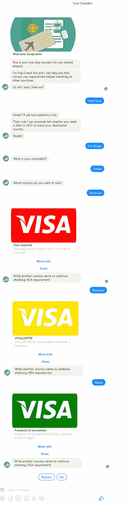

# Visa check bot——全球签证需求解决方案的独特聊天机器人

> 原文：<https://medium.com/swlh/visa-checkbot-unique-chatbot-for-global-visa-requirement-solution-6a8502445b0b>

Visa CheckBot

从今年开始，两个聊天机器人爱好者([我](https://www.linkedin.com/in/swapratim)和我的朋友[维克多·朱比尔卡](https://www.linkedin.com/in/victor-jubirca-0a77b5b6/))做了一个简短的调查，包括我们周围那些喜欢经常出国旅游或商务的人，看看他们的体验如何才能得到改善。几乎所有的人通常都面临一个共同的问题——在旅行前迅速找到正确的签证要求细节。

每次他们都必须使用谷歌搜索来找到一个网站或一个应用程序，这个网站或应用程序可能适合他们的情况，也可能不适合他们的情况。否则，以传统的方式，他们想问他们的签证要求，他们的旅行社，以确保安全。

我们对这个问题感到好奇，并开始深入调查。我们也联系了当地的旅行社。但是这个问题对他们来说似乎也是一样的——主要依赖互联网，没有任何具体的解决方案(至少大部分时间是这样)。

我们还发现，大使馆每天也在很大程度上收到这种签证要求查询。这使他们的工作排起了长队，也延迟了响应时间。我们明白，这是一个比我们最初想象的更难解决的问题，一个好的解决方案可以节省时间，帮助世界各地的许多人。

Visa Checkbot Icon

该解决方案的下一步是确定一个好的平台。网站还可以——但它们通常带有很多信任因素(对用户来说是安全还是不安全，考虑到 GDPR 问题等等)。移动应用是好的——但是如果你问我们，安装一个完整的应用来获取一小段信息听起来并不好。安装额外的应用程序会消耗更多的内存，并会不必要地降低手机的速度。

所以我们想出了一个非常有趣的概念。为什么不设计一个聊天机器人，可以在个人层面上随时帮助任何人？然而，没有人每次都必须安装任何应用程序或打开一个网站。好主意！我们发现没有这样的聊天机器人可以覆盖整个世界的签证要求(从任何来源国到世界上任何目的地国)。

这个主意奏效了！因此，我们开发了一个创新的聊天机器人——[*签证检查机器人*](https://www.facebook.com/visacheckbot) ，它可以精确地告诉你去世界任何地方都需要哪种签证。瞧啊。就这么简单。现在你所有的头痛都消失了。只要和你最喜欢的 Visa 好友机器人聊上几秒钟，你就能每次都获得信息——而且是免费的。对于数百万每天计划下一次旅行的旅行者来说，这可能是最方便的聊天机器人。

Visa Checkbot conversation image

我们的愿景是让 Visa Check Bot 更加强大，为您提供更大的帮助。毕竟，是人的问题推动了数字技术的诞生。您可以使用[信使](https://www.messenger.com/)中的 [Visa CheckBot](https://m.me/visacheckbot) 并推荐您的朋友也使用它。很快它将在

*   电报
*   松弛的
*   Skype &
*   基克

[马文·艾](http://www.marvinai.live/)在这段旅程中帮了大忙。从设计到开发，从托管到测试——[阿旃陀·达斯·罗伊](https://www.linkedin.com/in/ajanta-das-roy-a4347571)([马文·艾](https://www.linkedin.com/company/marvinai)的 CEO)一直在为 [Visa CheckBot](https://www.facebook.com/visacheckbot) 提供帮助。

请在[脸书页面](https://www.facebook.com/visacheckbot)评论中告诉我们您的反馈。您的反馈和想法对我们来说是最重要的！我们计划在未来增加更多的功能，使它成为一个更方便旅行的机器人。你的想法将有助于我们丰富我们的计划及其发展。

让我们一起让这个世界变得更少烦恼吧！干杯:-)

## 这篇文章发表在 [The Startup](https://medium.com/swlh) 上，这是 Medium 最大的创业刊物，拥有+ 370，771 名读者。

## 在这里订阅接收[我们的头条新闻](http://growthsupply.com/the-startup-newsletter/)。

