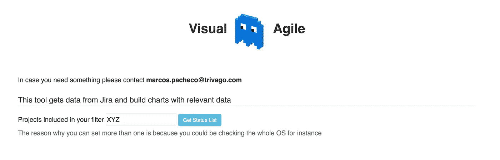
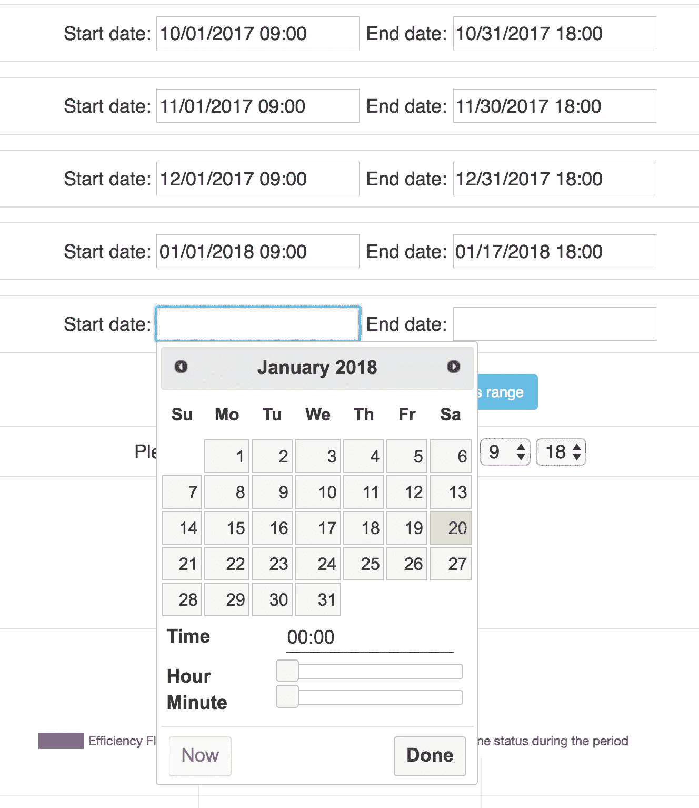

# 可视化敏捷版本 1

> 原文：<https://medium.com/swlh/visual-agile-v-1-cb74833b0f2c>

几个月前，当我对更好地分析吉拉的可用数据的兴趣增加时，一切都开始了。吉拉有很好的仪表板，但这些仪表板有时很难配置，有许多插件，但当然，你必须为它们付费。

我开始检查吉拉 API，并一步一步地开发自己的工具，名为**视觉敏捷**，该工具基本上使用吉拉 API，然后构建一些图表，其中图表的目标是增加**透明度**并可视化团队中实际发生的事情，因此团队知道他们在做什么。

我认为视觉敏捷可以让你对团队有一个整体的看法。

你将看到的是 Visual Agile 的第一个版本，我的 MVP，其中 UX、使用的图表类型和语法(正在审查)肯定可以改进。

非常感谢我亲爱的同事[约翰](https://www.linkedin.com/in/johnbettiol/)！他在这个工具上给了我很大的帮助，给了我一些想法，这样我就不会做无意义的图表了

还有 [Mac](https://www.linkedin.com/in/marcustannerfalk/) ！你还帮助我使用工具，给了我好主意！

你要做的第一件事是设置你想要检查的吉拉项目的代码，为什么？因为我需要知道你使用的*任务类型*和不同的*状态*。

有了回应，我们将首先决定我们想要包括哪种类型的任务，原因是我构建的图表之一是效率流，您可能只是想要为特定类型的任务生成它。

现在，为了生成所有的图表，我们需要知道我们赋予不同状态的含义，我知道对于一个完美定义的工作流，您可能不需要这个，但是可能发生的情况是，相同的工作流用于几个团队，并且状态的含义可能从一个团队到另一个团队发生变化。

正如您所看到的，我们有不同的选择器，每个选择器包含项目所有工作流的所有状态，原因是在同一个项目中，您可能有不同类型的任务，并且每种类型的任务都可以附加到不同的工作流。

所有这一切可能会有点混乱，我知道，UX 不是最好的，这里的目标是使一切可定制，所以你可以根据你给状态的含义创建任何你想要的组合，我会给你一个例子。

如你所知，吉拉用蓝、黄、绿三种颜色来区分不同的身份，简单概括如下:

*   蓝色:积压。
*   黄色:进行中。
*   绿色:完成。

在我使用的一个工作流中，有一个状态称为“ *QA: Passed* ”，其含义不言而喻，这里的问题是在吉拉，这个状态是黄色的，对于几个团队来说，这个状态意味着任务已经完成，只等发布，所以如果在冲刺阶段的团队想要查看他们有多少完成的任务，那么吉拉无法用仪表板正确显示，因为状态是黄色的，而不是绿色的。

你可能会说我们可以只调整工作流程，但是相信我在一个大组织中并不容易，这就是为什么我给你机会用可视化敏捷来赋予“ *QA: Passed* ”这个含义，我希望你明白我的意思。

一旦您选择了所有状态，现在我们需要提供 JQL，或者您可以将其保存在过滤器中，或者您只需复制粘贴 JQL。

现在我们有两个选择:

*   短距离赛跑
*   如图所示，您可以在这里添加过滤器，这将返回一个任务列表，包含每个 sprint 的所有任务，每个 sprint 都有开始和结束日期。
*   看板法
*   使用看板，您不会有冲刺，但您可能会对检查周期感兴趣，例如，如果您的过滤器返回 2017 年 1 月至 2017 年 12 月的任务，您可能会对检查每月周期感兴趣，以了解如何演变。

如果您选择 sprint，那么您不需要设置任何日期，因为 Visual Agile 将使用 sprint 的开始和结束日期，如果您分析其他内容，那么您需要指定时间段。

现在，最后要设置的是您的工作时间，一些图表包含时间，因此我们要确保我们不包括周末或晚上，所以 Visual Agile 给你机会指定您的工作时间范围。

# 结果

对于我知道所有状态转换的每个任务，我接下来要做的是计算开始转换到每个状态的时间与开始转换到不同状态的时间之间的时差，当然，时差考虑了工作时间范围，不包括周末。

# 效率流

效率流程图得到了工作进展状态和无工作进展状态所花费的时间，然后通过一个公式，我得到了效率流程的百分比。

另一条线反映了在此期间至少有多少不同的人改变了身份，这可以解释为什么在某个时期效率流增加或减少，基本上反映了在此期间大约有多少人在工作。

# 周期时间和交付时间

因为您还必须选择周期时间和提前期状态，所以我所做的是获得每个周期所有*【已完成】*任务的平均值，这样，我们就可以看到我们完成的任务是否已经积压了很长时间。

从图表中，我们可以看到，在第三阶段，许多关闭的任务长时间处于积压状态，但在最后一个阶段，情况正好相反，关闭的任务似乎没有在积压状态停留太长时间。

# sprint 开始后添加的任务

很容易理解，我们可以看到在第三阶段我们是如何在冲刺开始后包含 1 个任务的。

# 比较任务已完成

这条非常有趣，蓝线表示每个周期完成了多少任务，橙色线告诉我们这些任务中有多少在开始后被停止、阻塞或卡在流程中，黑色线反映了有多少直接通过系统，我还说它们是“干净的”,因此不会产生浪费。

这可以告诉我们，团队是否有太多的上下文切换，或者一旦他们开始工作，任务就有问题，基本上黑线越靠近蓝线越好。

# 再开

特别是，该工作流允许您在代码审查或 QA 过程中重新打开任务，该图表基本上显示了团队在此期间有多少次重新打开，我们可以看到，在这种情况下，在第三个期间，一个任务在代码审查过程中重新打开，在最后一个期间，一个任务从 QA 重新打开。

有了这个，我们可以看到团队是否过于匆忙，或者，如果从 QA 而不是从代码审查重新开始增加，这可能意味着团队应该在代码审查任务时投入更多的努力。

# 处于状态的时间

对于每种类型的任务，我们也可以看到这一点，有多少时间在平均花费在每一个状态期间，我会解释你的意思，因为这是相当有趣的。

正如你所看到的，我展示的两个状态是队列，*准备好代码评审*和*准备好 QA* ，我们可以争论它们是否应该是状态，但事实是它们是，而且我确信许多工作流也包含类似的状态。

我们可以看到在这种情况下，在持续时间内，等待 QA 的时间减少了，等待代码评审的时间也减少了。

浅绿色的线是测试花费的时间，有趣的是，开始测试总是比实际测试花费的时间长。

这个图表对于发现瓶颈非常有用，例如，如果您的团队能够生产比测试更多的东西，您应该可以看到花费在“等待 QA”上的时间是如何不断增加的。

# 等待和工作的首要任务

很高兴看到平均值，但它们有一个问题，即您可能会错过有问题的任务，极端情况不好，这就是为什么我在这张图表中显示了花费最多时间处于“工作”状态的顶级任务，以及花费最多时间处于“等待”状态的顶级任务，有了这些信息，我们可以发现有问题的任务。

例如，我们看到任务 **1725** 长时间处于工作状态，在检查任务之后，我看到几乎 100%的冲刺任务都在等待代码审查。

# 最后的

不要把视觉敏捷作为一种控制工具，因为那根本不是目的！我的目标是帮助团队了解他们做得如何，给他们一个整体的观点，他们可能会错过改进机会，或者遇到瓶颈，有了这个，我只是保持透明，为每个人获取可用的公共信息，并在不同的图表中可视化。

对我来说，非常重要的一点是，这个工具对每个人都是可用的，对产品所有者、开发人员等来说，无论谁想看看进展如何，这个工具不应该为任何事情责备任何人，这个工具**必须**被用来寻找改进的机会。

**当然，这个工具正在开发中，这只是最有价值球员，更多的更新将会到来！**

*原为 2018 年 1 月 20 日在*[*marcos-pacheco.com*](http://marcos-pacheco.com/visual-agile/)*发布。*

## 这个故事发表在《创业》(Startup)杂志上，这是 Medium 最大的创业刊物，有 295，232 多人关注。

## 订阅在此接收[我们的头条新闻。](http://growthsupply.com/the-startup-newsletter/)

