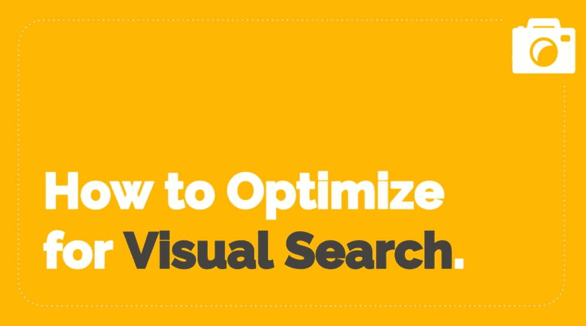

# 视觉搜索:超越关键词

> 原文：<https://medium.com/swlh/visual-search-going-beyond-keywords-113616a2f699>

## 视觉搜索有可能改变我们发现新想法和新产品的方式。

因此，Pinterest、谷歌和亚马逊等公司已经将这项新兴技术列为重中之重。

然而，这是一个复杂的领域，需要复杂的算法和大量的训练数据。

正如人工智能公司 DeepMind 所假设的那样，

> “一位现场语言学家去访问一种语言与我们自己的语言完全不同的文化。这位语言学家正试图从一位乐于助人的母语人士那里学习一些单词，这时一只兔子匆匆跑过。说本族语的人宣布“gavagai”，而语言学家则被留下来推断这个新词的意思。语言学家面临着大量可能的推论，包括“gavagai”指的是兔子、动物、白色的东西、特定的兔子或“兔子的未分离部分”。有无数可能的推论可以做出。人们怎么能选择正确的呢？”

这些问题对于人类来说很难回答，但是对于机器来说更是如此。然而，领先的技术公司在实现这种理解方面取得了重大进展，并在这个过程中，创造了准确的视觉搜索引擎。

在下面的演示中，你会发现:
-什么是视觉搜索
-视觉搜索如何工作
-当今主要的视觉搜索引擎有多有效
-你可以做些什么来开始优化视觉搜索

你也可以在 [Slideshare](https://www.slideshare.net/ClarkBoyd/visual-search-how-it-works-and-how-to-optimize-for-pinterest-google-and-amazon) 上看到这个完整的演示。

对于所有最新的视觉搜索趋势、新闻、技巧和统计数据，请查看[这个资源](/@clarkboyd/visual-search-trends-statistics-tips-and-uses-in-everyday-life-d20084dc4b0a)。

## 这篇文章发表在 [The Startup](https://medium.com/swlh) 上，这是 Medium 最大的创业刊物，有 333，853+人关注。

## 在此订阅接收[我们的头条新闻](http://growthsupply.com/the-startup-newsletter/)。

