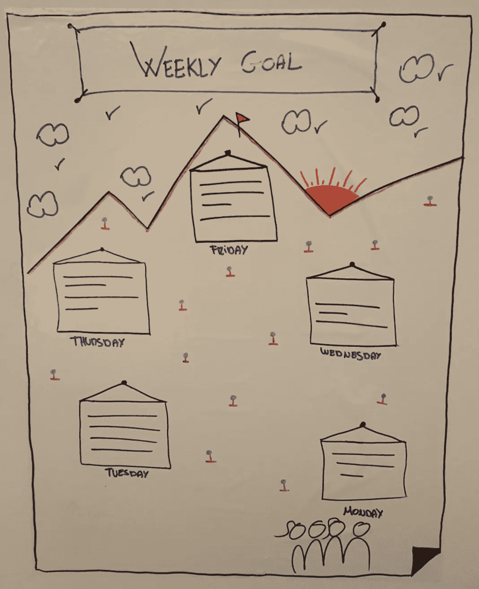
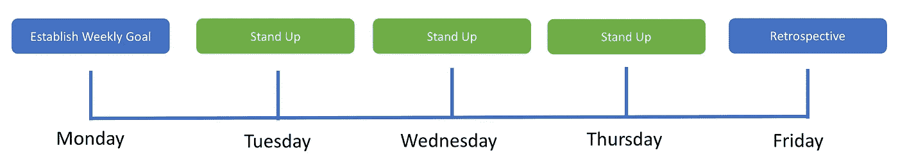

# 爬山时想象一个周目标

> 原文：<https://medium.com/swlh/visualizing-a-weekly-goal-while-climbing-a-mountain-4ad2e1ed2605>

让我们想象一下，有一个从未合作过的团队，他们有一个要实现的目标，所以情况是这样的:

*   团队 A 开发了一个名为 B 的产品，想要在他们的一个仪表板上显示天气预报，因此该团队需要连接到第三方产品 API，该 API 将为他们提供所需的信息，以便他们可以显示天气预报。

现在让我们想象一下，有一个团队，其中的队友已经一起工作了很长时间，他们也有一个要实现的目标，所以这是一个场景:

*   从事名为 D 的产品的团队 C 希望在一个月内尝试一项新技术，该技术可以大大提高产品 D 的性能，因此该团队将开始一个试错阶段，他们将尝试新的东西，因此不会有发布或交付给特定客户的东西。

请注意，我在这里没有提到任何框架，这就是我的意图，我不会假装说这比其他东西更好。

# 团队 A

不在任何框架中工作的团队应该在周末交付他们的目标，因此，在他们开始创建所有需要的任务之前，我们首先可以根据他们认为他们将在一周的每一天做什么来想象他们的计划。这样做的原因是，如果团队需要考虑他们将做什么，他们将在内部计划一周，因此团队将一起调整他们需要遵循的步骤以实现目标，这将减少不确定性。

# B 队

这个团队已经一起工作了很长时间，他们将开始一个新的“项目”,用一个月的时间体验一种可以提高产品性能的新技术。同样，在他们开始创建所有需要的任务之前，我们首先可以根据他们认为他们一周的每一天要做的事情来设想他们的计划。

团队在过去可能使用 Scrum，或者可能使用看板，或者可能什么都不用，但是这里的事情是他们将会在一个阶段工作，在这个阶段试错将会非常普遍，并且不会为客户正式发布产品。

# 每周目标

What you see is a drawing that aims to represent step by step our week, like climbing a mountain we need to go slowly step by step till we get to the top and *celebrate success*.

# 它是如何工作的？

# 如何填满每个方块？

每个方块代表一周中的一天，团队需要一起定义他们认为他们将在一周的每一天工作的内容，这不是一个承诺，这只是他们希望遵循的方向，以实现他们的每周目标:

*   *“在他们的仪表板上显示天气预报”*
*   *“将当前联系人表格从 Laravel 迁移到 Symfony”*

# 站起来？

你可以叫 Stand Up 或者别的什么，但是就像我们在 Scrum 中做的那样，团队每天早上花一些时间对周目标进行健康检查，我们不想在这里报告，我们只是确保团队仍然与最初的周目标保持一致，并且他们仍然相信是可以实现的。

# 哦！这比我们想象的要难！

现在让我们想象一下，我们在周三，我们站了起来，而车队仍然在为他们认为他们将在周一做的事情而奋斗，这是一个问题吗？我不这么认为！

我们越快发现这一点越好，这将是一个很好的机会，让团队真正团结起来，互相帮助解决他们遇到的任何问题，以便继续朝着每周目标努力。

# 如果无法实现每周目标，团队是否应该修改该目标？

我不认为我们应该修改最初的目标，设定现实的期望总是一件很难的事情，我们总是会错过可能影响我们计划的信息，所以实现每周目标将是一件困难的事情，甚至可能在开始时更加困难，我们只需要继续工作，以努力实现每周目标。

# 今天是星期四，如果我们决定不通过测试覆盖代码，我们可以实现每周的目标。

这不起作用，当我在*之前说“需要继续工作，以努力实现每周目标”*时，当然意味着坚持我们的原则和价值观，例如，我们不能仅仅因为我们想实现目标而牺牲质量，这不是重点，所以我们关于**如何**做事的原则和价值观应该**保持不变**，即使我们知道不可能实现每周目标。

# 没有达到周目标不算失败。

不要这样理解，我们都有期望和愿望，如果我们不能做我们认为我们会做的事情，我们只需要从中吸取教训，并努力避免同样的错误再次发生。

# 我们达到了目标！

这太棒了，我们应该庆祝一下，花些时间一起庆祝车队能够实现他们想要的，当你成功实现你的计划时，这是一种很好的感觉，所以值得庆祝一下。

# 回顾的

正如我们将在 Scrum 中再次做的那样，我们将聚在一起回顾这一周，它是如何进行的，我们遇到了哪些问题，我们如何防止它们再次发生，以及如何改进我们在这一周做得好的地方，这也非常重要。

# 日程安排

# 结论

可能会发生这样的情况，有些团队不愿意从 Scrum 或不同的框架开始，这很好，你不必制造冲突，但是，你需要定义对工作的期望，并对进展保持透明。

这个每周目标充满了常识，对于一个想要独立实现目标的团队来说，无论他们是否已经工作了很长时间，都很难不同意这个想法。

非常感谢 [Ester](https://www.linkedin.com/in/estercobo/) 帮助我完成这篇文章，并给出了一个非常好的反馈！

*原载于 2018 年 1 月 16 日*[*【marcos-pacheco.com*](http://marcos-pacheco.com/visualizing-a-weekly-goal-while-climbing-a-mountain/)*。*

## 这篇文章发表在 [The Startup](https://medium.com/swlh) 上，这是 Medium 最大的创业刊物，拥有 295，232+人关注。

## 在此订阅接收[我们的头条新闻](http://growthsupply.com/the-startup-newsletter/)。

