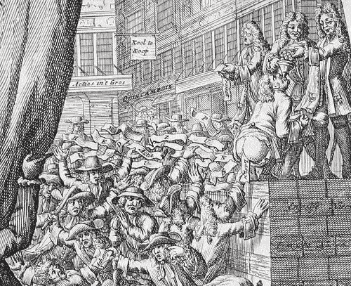

# 量化紧缩时代的波动性

> 原文：<https://medium.com/swlh/volatility-in-the-age-of-quantitative-tightening-c22359586c81>

John Law and the Mississippi Bubble

# 机构为什么要考虑对冲？

我们正在见证全球资本市场有史以来最大的实时巴甫洛夫实验。自 2009 年以来，我们还没有看到股市下跌超过 25%。问题是，几乎所有人都认为量化宽松(QE)应该对此直接负责。因此，经典条件反射让投资者相信，只要这种情况持续下去，风险资产就会有一个永久的底线。既然美联储已经开始降低其资产购买或量化紧缩(QT)的速度，这一底线将受到考验。

# 但是什么能改变这种心态呢？

从技术上讲，QE 股市始于 2008 年年中，股市在 2009 年 3 月跌至低点。QE 不支持银行间借贷稳定之外的股票估值，以及它对推动机构进入更高风险资产的影响(也被称为*投资组合传导机制*)。公司利润的回升推动了股市的复苏。而盈利的复苏反过来又受到历史上最大规模的全球财政刺激和复苏期间新兴市场信贷基础翻番的推动。

现在，随着新兴市场信贷增长减速，以及发达国家紧缩计划的通缩效应开始产生影响，这种情况开始逆转。最终，信贷增长必须转化为持续增长的收入和速度，以创造长期增长。现在我们两样都没有。在过去的周期中，我们可以依靠信贷增长来弥补中产阶级购买力的损失。但看看私人债务，我们正处于有史以来的最高水平。在这些债务被减记之前，不平等性将在增长放缓的背景下继续上升，无论政策制定者试图通过多少次一次性货币或财政注入来提振全球经济。

# 那么养老基金应该为什么样的风险做准备呢？

*日本化，*也就是说公共赤字支出的持续上升，以抵消因私人债务过多而导致的长期疲软的增长。要理解为什么最有可能出现这种情况，你必须了解人口统计学和私人信贷的动态。但投资者很难接受这一点，因为资产管理行业习惯于假设央行行长和政界人士总是会出手救市。但看看日本的经验，几十年的 QE 无法改变潜在的人口结构。如果说有什么不同的话，那就是 QE 和纳税人出资对具有系统重要性的金融机构(SIFIs)的纾困，阻止了创造性破坏的自由市场循环。如果旧的不给新的让路，那么新的技术就会出现，重新雇佣中产阶级。

# 但是时机呢？

由于自 2009 年以来风险溢价几乎全面压缩，现在是考虑去风险选项的最佳时机。这也与对美联储支持股票和信贷风险的信心有关。一旦这展开，当然就已经太晚了。问题在于，对于内部还没有专门衍生品团队的机构来说，选择确实有限。上市的 VIX ETF 产品具有很高的烧钱率，在不涉及像 2008 年 10 月这样的极端事件的熊市情况下，这些产品实际提供的保护水平数据也不一致。

# 金融机构如何实现多元化？

正如我们广泛报道的那样，自 2008 年以来，我们看到机构投资者增加了对对冲基金和私募股权等替代投资的配置，因为他们普遍认为股票和债券的回报率更高，相关性更低。问题是，过去 10 年的数据显示，替代产品与整体市场的相关性越来越高。最可怕的是，在最近的高波动时期，相关性显著增加，这正是你需要多样化收益发挥作用的时候。

# 是什么导致低价竞标与传统投资的相关性更高？

这种现象没有一个明确的解释，但只要看看对冲基金，在 90 年代末，当大多数研究开始时，该行业在 AUM 的总规模还不到 2000 亿美元。现在它已经增长到超过 3 万亿美元，前 100 名经理控制了超过三分之二的资产。鉴于这种规模和集中度，对冲基金自然会成为贝塔系数更高的产品。因此，具有讽刺意味的是，在投资者通过坚持该领域的品牌名称来降低风险的努力中，风险间接增加了，整个行业的收入潜力也相应减少了。

# 什么能改变这一趋势？

如果在下一个长时间的高波动期间，替代投资不能为下跌提供显著保护，机构将因高费用而开始放弃该资产类别。由于全球公共资产负债表的减值，养老基金等机构已经在对费用施加压力，这给主动型基金经理带来了超越业绩的额外压力。

你可以从处于历史高点的集中度和净敞口中看到这一点。自 2009 年以来，每年都必须赶上标准普尔 500，这有很大关系。这是一个反馈循环，随着每一次上涨，情况会变得更糟，因为经理们用指数和 ETF 代替空头，并增加高动能多头以努力赶上。这造成了一种风险，即如果下一场危机不是系统性的，另类资产管理公司长期持有的资产实际上可能会比整体市场下跌得更多，因为它们缺乏流动性且所有权集中。

# 对冲基金为什么不是对冲？

对冲基金近年来表现不佳，因为这个周期没有像 2008 年之前那样回报深刻的基本面分析。自那以后，市场在很大程度上受到当时采取的紧急措施的推动，在本周期的大部分时间里，这些措施将相关性推至历史高点。再说一次，人为刺激的代价是投资者希望同样拥有所有资产。在所有资产都不加选择地上涨的环境下，押注不同资产的相对价值变得越来越无关紧要。再说一遍，这是因为我们试图通过增加债务来解决坏账问题。不可避免的是，随着央行的支持到位，这种增加的流动性会在一个永久的增长循环中回到金融资产中。

政客们喜欢谈论去杠杆化，但全球银行债务超过 100 万亿美元，实际上比 2007 年高出 40%。这可以追溯到这样一个事实:美国房地产市场在很大程度上是由纳税人支撑的。自那以后，中低收入借贷一直由来自 FHA 的 100% LTV 贷款、次级汽车贷款和面向高等教育学生的贷款推动。这些贷款正以惊人的速度拖欠。

这是后危机时期救助的问题，我们被告知，我们需要一个短期的解决办法来重新启动动物精神，一旦发生这种情况，我们将能够解决真正的问题。好吧，我们得到了动物精神的部分权利，但没有解决真正的问题仍然存在。从月度回报数据来看，这些回报是如何产生的粒度很小，但你可以比较不同策略区间的相对表现。结果，对冲基金和其他所有人一样，被迫追逐收益率或倒闭。

# 难道养老金和主权财富基金没有对冲的动机吗？

是的。当趋势逆转时，大型机构正依靠另类投资来帮助他们减轻投资组合的波动性。但这种趋势迫使投资者的定位更加集中于正在发挥作用的行业。尤其是在做多方面，当一种类型的资产的抛售超过更广泛的指数，实际上在某些时期产生负 alpha 时，它可能会在下跌市场中真正受到伤害。

鉴于净头寸仅占做多投资组合的一小部分，这将随着市场的大幅抛售而得到纠正。但是，在许多其他市场，我们没有遇到灾难性的雷曼式事件，情况又如何呢？关于救助，可以说一件积极的事情是，现在有 20 万亿美元的全球 QE 支持，这在 2007-2008 年是不存在的，因此 2008 年事件的可能性比当时低得多。

事实是，08-09 年期间的纾困和财政刺激对金融资产价格来说是非常好的，但这些只是标志。当房价、股票或公司债券交易量较低时，它对实际的基本面价值几乎没有影响。从一开始，市场操纵者就已经理解了在低交易量上移动价格的容易程度，为什么当美联储这样做时，我们对待它的方式会有所不同呢？

这就是为什么现代金融的意识形态基石是如此危险的想法。政策制定者可以隐藏在均衡增长、市场效率和资产价格随机游走模型等概念背后。但是这些理论一次又一次地被经验事实证明是错误的。像人一样，经济和金融市场不会随着一系列独立的硬币翻转而演变。两者都是人类集体行为和观点的结果。

# **道德风险为什么不好？**

道德风险的定义是，当一个人被保护免受风险后果时，缺乏防范风险的激励。当央行和政府决定在救助好的商业行为的同时救助坏的商业行为时，他们开创了金融风险管理最终落在纳税人身上的先例。自那以来，风险溢价一直在压缩，就好像每种可交易资产都会如此。

尽管这种想法很危险，但在 2008 年，全球金融和经济体系有可能发生全系统崩溃，在这种情况下，纳税人出手稳定了局面。这就是中央银行模式被创造出来的原因。躲过这一劫后，人们应该明白，在我们采取行动之前让坏账达到灾难性失败的地步是一个坏主意。我们关于经济和市场如何运作的理论应该得到修正。相反，我们对这次失败加倍下注，并给它贴上了一个真正的“大衰退”的标签，就好像它是一只黑天鹅，没有人会预料到它的到来。

但是人们确实看到了它的到来，他们确实说了些什么，最重要的是，他们试图做些什么。不幸的是，这些声音被制造更多债务的高激励所淹没。更糟糕的是，某些市场参与者利用这种知识创造出他们知道在危机发生时会爆炸的产品，将它们卖给需要收益率的机构，然后做空它们。这种行为只是受到了隆重的惩罚，结果，净效果是鼓励这种行为在未来继续下去。不管有没有救助，人们对这些机构的普遍信心已经丧失。此外，这种信任的丧失导致了民粹主义的兴起，其基础是自二战结束以来对民主制度的普遍不信任。具有讽刺意味的是，正是这种信任的丧失阻止了政策制定者在这一次介入。

# **这给今天的投资者带来了什么？**

投资者应该认识到股票或公司债券不是现金，而是一种风险资产。有了 QT，风险溢价的概念将让围绕估值的对话重新开始。

风险现在意味着错过免费的“央行赞助的”资本增值，而不是资本保全，从而跑输基准。为什么不应该呢？如果你相信央行行长会一直在那里，以确保你不会遭受真正的资本损失，那么所有金融资产都可以按面值买入美国国债。这当然最终是荒谬的，因为如果它无限期地持续下去，没有企业经理会再投资发展他们的业务。相反，他们会受到激励，以股票回购或分红的形式，提高杠杆，将所有利润重新投入资本市场。这与如今公司经理的真正选择相差不远，他们的薪酬与股票价格挂钩。这就是为什么我们看到回购处于历史最高水平，而不考虑基本面估值。

# 既然美联储正在收紧，这将如何结束？

尽管这种免费搭车对某些在全球市场上处于有利地位的参与者来说很好，但这是一种错觉，而且错觉的结局都是一样的:迅速而残酷。在 1999 年和 2007 年之后，很难说这是新知识，然而行为并没有改变。为什么？因为就像巴甫洛夫的狗一样，资产管理者认为每次铃响时食物仍会在那里。

资产管理行业过去 10 年的状况，让越来越多的被动策略得到了回报，负责理解大局的人越来越少。救助者最后一次把食物放在那里。在相关性不断上升的背景下，良好的基本面证券分析和高度专业化变得越来越不重要。不去试图理解这是为什么，而是把自己的头埋在更深的沙子里，不去做市场需求。

只要短期趋势是可察觉的和持续的，这种方法就行。但是，当整个环境发生大的系统变化时，它就会悲惨地失败。这就是 2008 年发生的事情，但救市计划没有奖励那些能够改变策略并看到非常明显的泡沫的少数人，而是进一步强化了羊群追逐行为，认为如果你错过了森林，别担心，其他人也会。

与防止系统性崩溃相比，很难说这是一个次要的副作用。我们应该反对的是修正主义的历史；救助金融机构，假装即使政府没有介入，它们也不会破产。现在每个人都想改写历史，说，“嘿，那只是一次大衰退，是的，我们遭受了损失，但最终我们能够继续经营下去。”

不，你没有。每个人都得出钱让你留在身边。大部分行业都是 DOA。那些能够坚持下来并在不关门的情况下迎接赎回的公司受到了惩罚。当每个人都获得通行证时，我们如何开始了解是什么让这些球员留在比赛中？自由市场理论的基础在于它是进化的；随着时间的推移，长期有成效的想法会存活下来，坏想法会消亡。相反，这就像我们都在玩一场垄断游戏，坐在离银行家最近的人无论如何都要继续玩下去，只是因为银行家曾经是他们的团队成员，或者当他们退休时会是。

当我们开始意识到过去十年并不是真正的复苏，我们忘记开始解决真正的问题时，所有这些缺陷都会回来咬我们。复苏的故事是一个神话。西方的人口结构是通货紧缩的。这不是争论，这是事实。随着婴儿潮一代为了生活而兑现现金，他们出售的东西相对于他们收到的东西会下降。但问题是，没有足够的现金来支付这些债务，至少在这些债务标明的地方没有。这就是债务通缩。

大多数人未能理解的不是这种差距的存在，而是无论如何，这种差距都将从未来几代人的消费能力中减去。同样是那些在 20 世纪后半叶以消费驱动经济的婴儿潮一代，将会变成婴儿潮一代，因为他们的依赖需要不断扩大其他人收入的份额。此外，填补这一缺口意味着出售金融资产以满足短期现金义务，而此时那些通常会购买这些资产的人被迫转移更大份额来照顾卖方。

养老基金的资金缺口与管理不善或工会政治无关。这些可能是边缘问题，但真实的故事是婴儿潮一代作为工人的收入和他们作为家属的收入之间的集体差距。这可以归结为简单的数字，到 2030 年，美国和欧盟的**经济依赖比率**将达到 150%。这意味着每 2 名在职员工将有 3 名家属。因此，即使现在有可能将社会保障私有化，并以当前的市场价值清算养老基金，那又如何？我们还没有弥补差距，我们只是把它从集体责任转移到个人责任上。无论哪种方式，差距仍然存在，仍然来自未来的消费；这只是一个损失如何分配的问题。这就是像养老基金这样的社会安全网最初被创建的原因。我们决定不分担负担并不意味着没有负担。

# 什么会引发下一场市场危机？

在不久的某个时候，我们将进入一个新的去杠杆化阶段，坏账将从那些可以还清的债务中分离出来。没人能准确预测何时会出现这种情况，但你可以看看过去 10 年的增长驱动因素，看看它们何时减速，并为加速风险做好适当准备。现在这正是正在发生的事情。回顾过去，本轮周期有两个主要驱动因素:新兴市场信贷迅猛增长，以及史无前例的全球财政刺激。但随着新兴市场进入明斯基周期(Minsky cycle)的最后庞氏阶段，以及发达市场用紧缩措施取代财政刺激(美国除外)以应对福利问题，这些因素现在正在放缓。

尚不清楚的是，新兴市场信贷基础增长两倍对金融资产估值的影响有多大，以及当这种情况最终像现在开始的那样逆转时，对发达市场的反作用会有多大。再加上欧洲彻底的通货紧缩，投资者更加绝望地期待着中央银行敲响 QE 的钟声。不难理解为什么谨慎的经理们已经开始公开谈论全球风险水平的上升。

# 机构如何发现这种上升的风险？

大多数投资者通过查看过去几年的数据来衡量风险，并根据他们从该窗口中提取的均值和标准差来划分他们的投资组合。然后，这被向前预测，并被接受为对未来风险的准确描述。当然，这种方法已经取得了许多进步，但即使是复杂的统计工具也使用类似的假设从历史回归中提取风险信息。

不幸的是，这种类型的分析作为主要的风险管理工具在像我们正在接近的转折点上受到了影响。长期投资是一项非常困难的工作，因为经济是一个复杂且高度非线性的系统。用数据拟合钟形曲线并不总是最好的描述。再说一次，这个想法应该在 2008 年就被抛弃了。相反，我们只是将金融危机作为一个极端的“黑天鹅”事件添加到分配中，并对一些人进行了欺诈贷款的处罚。这完全是滑稽可笑和智力不诚实的。想象一下，只要放松假设，让数据吻合，物理学就会进步。

好消息是，现实最终会用经验事实战胜糟糕的科学理论。坏消息是，没有什么能阻止我们选择忽略这些事实。我们今天在气候变化上看到了它，如果我们可以在像天气这样基本的事物上做到这一点，那么像经济和金融市场科学这样抽象的事物又怎么可能有机会呢？

问题是，我们越是忽视现实，当我们最终决定解决它时，最终的代价就越大。正是这种人力成本，而不是金钱成本，是整个 10 年“延伸和假装”实验的根本缺陷。社会不稳定正在快速蔓延，显而易见，在整个人类历史上，以牺牲下一代为代价来维持现状从来没有好结果。即使在美国，我们也在用下降的工资和他们无法摆脱的学生贷款债务来撬动下一代进入劳动力市场。更糟糕的是，他们正在与他们前面的两代人竞争，他们被迫留在工作场所的时间比他们预期的低技能工作时间长得多。今天，三分之一的大学毕业生在大学毕业的第一年挣不到 25000 美元，比以往任何时候都低。

在欧洲，青年失业率接近 20%。任何认为美国和欧盟中产阶级会轻松反弹的人都是在自欺欺人。作为一个社会，我们必须以某种方式解决这些问题，不幸的是，政策制定者和经济学家提出的唯一解决方案是增加政府支出或更多量化宽松。从短期来看，这两种方法对现状和金融资产都是极好的，但都不能解决结构性问题。事实上，推迟清算日会让情况变得更糟。

# 还有时间行动吗？

是的。现在是投资者认真审视自己的投资组合在一个金融资产交易不依赖政府支持的世界里会有怎样的表现的时候了。我们不能把头埋在沙子里，以做完全相同事情的其他人为基准来管理月度回报，并希望有时间扭转局面。在 QT 时代，如果政策制定者失去了纾困的政治意愿，当投资者被迫抛售时，他们将从哪里获得流动性？除非你相信投资者会齐心协力，不要一次全部卖出，否则解决这个囚徒困境的唯一方法就是第一个退出。

*布莱恩·维斯克是不对称回报资本公司的首席信息官。如需了解金融行业的更多见解和新方法，请发送电子邮件至 info@arc-investments.com。*

## 这篇文章发表在《T4》杂志的《创业》(The Startup)上，这是 Medium 最大的创业刊物，拥有 315，628 名读者。

## 在这里订阅接收[我们的头条新闻](http://growthsupply.com/the-startup-newsletter/)。

