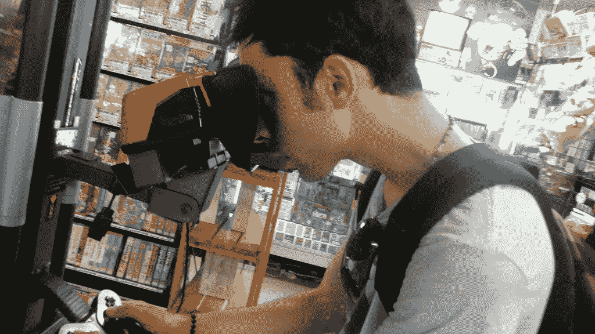
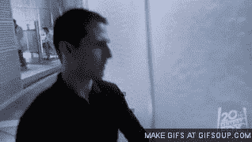
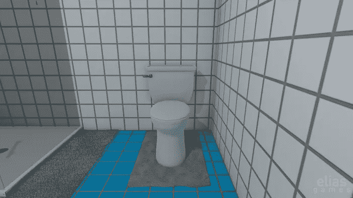
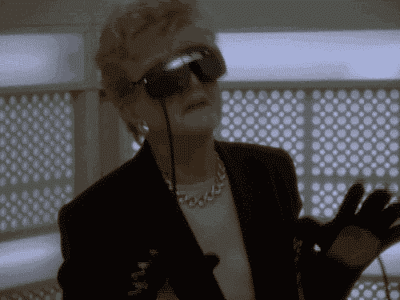

# VR 是个哑弹

> 原文：<https://medium.com/swlh/vr-is-a-dud-a96470bb6455>

The future, early

当我站在一艘沉船的船头时，一条鱼浮在我的头上。一条鲸鱼从上方靠近，阳光透过水面勾勒出它的轮廓。它向我飘来，它那恶毒的眼睛像火车前灯一样大，盯着我的方向。我的呼吸器官制造气泡，当这个奇怪的水生世界召唤我去探索深海时，我可以用手指弹出这些气泡。我被迷住了。

一年前，当我第一次尝试 HTC Vive 时，我确信一个新的世界在等待着我们。我们会把巨大的虚拟现实设备绑在脸上，我们会像科幻电影中那样与游戏互动。我们会穿上衣服，进入一个我们自己设计的虚拟世界。我们会像《少数派报告》中的汤姆·克鲁斯一样挥动双手，像疯狂的巫师一样提出信息。我确信 HTC(以及索尼、Oculus 和 Magic Leap)正在向我们展示未来。

Proposed VR/AR content

现在吗？没有那么多。

Actual VR/AR Content

但是 VR 投资是冒着烟的！而且有这么多惊人的钻机即将推出！如果它不令人惊奇，为什么它是最重要的？为什么 Scoble 去了一家 VR 工作室工作？

我认为正在发生的事情是这样的:硅谷的居民厌倦了看他们的手机。我在旧金山和帕洛阿尔托看到了太多反社会行为的例子，很明显，即使是电话窃听者也对他们自己的狗屎感到恶心。

这个问题的原始解决方案？像玻璃一样的 AR 显示器允许你在抬头看你的用餐伙伴时刷你的 Instagram feed。现在，在 Glass 失败后，nerderati 正在寻找下一个更好的东西。我对此是完全认真的:如此多的金钱和时间被投入到虚拟现实的主要原因是，这样人们就不会在全神贯注于 Twitter 的时候被消防栓绊倒。

因此，我们来到了虚拟现实的第二次到来，第一次发生在超人类时代的*剪草人*和[Mondo 2000](https://en.wikipedia.org/wiki/Mondo_2000)，这是游戏控制台的兴起和第一台廉价、强大的家用电脑的推出之间的一段短暂时期，思想家们在那里想象了一个与我们肮脏的肉空间分开的虚拟空间。虽然第一次到来被定义为一厢情愿的想法，但第二次到来就在计算能力触及红线时到来，而令人惊叹的虚拟现实体验的**潜力**就在我们的掌握之中。这就是症结所在。

> “你有没有想过也许这让我很紧张，你就像我认识的人一样？他站着，拍打着黑色牛仔裤前面的灰。他转过身，回头瞪着布满灰尘的商店橱窗，那扇关着的通向街道的门。“外面有什么？纽约？还是就此打住？”
> 
> “嗯，”芬兰人说，“就像那棵树，你知道吗？落在树林里，但也许没有人听到它。”他给凯斯看了看他的大门牙，然后吸了口烟。“你可以去散步，你想的话。都在那了。或者你见过的所有部分。这是记忆吧？我敲敲你，整理一下，然后反馈回来。”
> 
> “我没有这么好的记忆力，”凯斯环顾四周说。他低头看着自己的手，把它们翻过来。他试图回忆起自己手掌上的纹路是什么样的，但是想不起来。
> 
> “每个人都有，”芬兰人说，放下他的香烟，在他的脚后跟下磨灭它，“但是你们中没有多少人能得到它。大多数艺术家都可以，如果他们还不错的话。如果你能把这个结构放在现实之上，在曼哈顿下城的芬兰人的地方，你会看到不同，但可能没有你想象的那么多。对你来说，记忆是全息的。”芬兰人拽了拽他的一只小耳朵。“我不一样。”
> 
> *“你的意思是，全息？”这个词让他想起了里维埃拉。*
> 
> *“全息范式是你已经研究出的最接近人类记忆的东西，仅此而已。但是你从来没有做过什么。我是说人。”芬兰人走上前去，倾斜着他流线型的头颅，凝视着凯斯。—神经学家威廉·吉布森*

我和你一样对生活在网络空间感到兴奋。我想黑掉 Gibson，同时盯着代表大型国际公司数据库的彩色光平面，军事系统的旋臂永远遥不可及。我想存在于机器中，哪怕一天只有几十个小时。

但你现在看到的东西至少在 10 年内不会有商业可行性，在那之后的 10 年里，我们通常不会进入虚拟世界。光学、图形引擎和硬件现在都不存在。尽管有游戏，媒体市场不会转向虚拟现实，除非他们绝对有必要。电视和电影这种视觉二维媒体仍然是向全世界推销故事或分享你的想法的最简单、最便宜的方式。有线电视公司仍然存在是有原因的:人们懒得去寻找和扼杀他们自己的内容，更重要的是，电视这种被动的媒体允许以最小的努力获得最大的消费。

以下是我对虚拟现实失败的分析。

1.  **内容**。搜索一点 VR 内容来证明花几千买个 VR 钻机的合理性。你会发现什么？零。布库斯。零。听着，你和你的朋友绑了五个 GoPros 一起去滑雪。太好了。但在 360 度相机普及之前，数码单反相机的视频内容将保持静止。詹姆斯·卡梅隆可以拍摄虚拟现实版的《阿凡达 2 》,但毫不夸张地说，这已经便宜到足以让独立电影制作人在他们的作品中加入[散景，更不用说呈现真正的科幻效果了。即使是色情业也在努力寻找如何销售虚拟现实，如果有人能销售一种身临其境的系统，让你身临其境，那就是皮肤行业。此外，如果你认为微软或索尼会为了一些不确定的事情放弃利润丰厚的电视游戏市场，那你就疯了。尽管他们口头上支持虚拟现实，但他们仍将在未来几年推出基于电视的内容。](http://www.sljfaq.org/afaq/boke.html)
2.  **硬件。**创造身临其境的 3D 体验所需的硬件昂贵、笨重且难以运行。此外，它需要空间。你可以向住在大房子里的人出售几千个虚拟现实设备，但住在工作室公寓里的人怎么办？你应该在击退外星人的时候撞到你的梳妆台吗？你会说“AR”。“就是这张票！”AR 或增强现实仍然需要强大的计算能力来将龙或飞机维修指令覆盖到现实世界中。在一副 AR 护目镜中展示商店手册是一回事，但提供喷气式发动机的 3D 渲染是另一回事。
3.  **小孩**。我们即将进入电子产品反弹的十年。正如电视在上世纪 90 年代遭到父母的诋毁一样，我怀疑 iPads 和其他设备将在本世纪 20 年代遭到诋毁。父母正看着他们的孩子被移动设备吞噬，由此产生的阻力可能会在未来十年内阻碍设备销售。结果呢？讨厌“iPad”的家长们会真的讨厌 VR。儿童推动娱乐硬件销售。我向你保证，现在世界上没有一个父母会让他们的孩子深深陷入虚拟世界——特别是如果这需要一个巨大的耳机和昂贵的电脑——就像他们让他们陷入托卡博卡和部落冲突一样。
4.  **未来。**我预见的 VR 的未来是直接的大脑交互。就目前的情况来看，虚拟现实装备是一种间隙技术。如果我们真的要和我们的机器融为一体，输入就不会受到视觉神经的影响。相反，我预计类似于“顶进”的东西将真正导致虚拟现实的起飞。这在实践中是什么样子还不清楚，但我们越来越接近了。目前对虚拟现实的投资很大，因为它将为未来的增长建立一个原型产业，但在短期内，虚拟现实泡沫将会破裂，我们所有的 Oculii 都将蒙上灰尘。这不会阻止 2017 年成为 1 月份 CES 上的“虚拟现实年”，也不会阻止人们在接下来的几年里在垃圾上花更多的钱。但在更好的时代到来之前，美好的时代将会结束。

我不想解散虚拟派对。如果我们想在我们特殊的虚拟现实房间里假装潜入一个陷阱地牢时看起来像傻瓜，那就让我们做吧。但是，不要指望虚拟现实现在能让你赚很多钱，也不要指望任何一种设备能赢得这轮兴趣。我们所看到的是后 2D 世界的初步迹象，鉴于科技追赶科幻的速度，我可以想象第一个脑机接口将在 2030 年到来。记住:要想真正无处不在，一项技术必须毁掉我们的生活。直到你周围的每个人都认为有必要拥有一个发光的黑色金属平板，手机才变得无处不在。直到你身边的人都觉得有必要玩 Farmville 玩到死，互联网才开始兴起。直到世界上的每个人都意识到电视比阅读好得多，电视才开始流行起来。就目前情况来看，虚拟现实不会毁掉我们的生活。相反，在更好的东西出现之前，它只会给我们带来些许快乐。

我是[约翰·比格斯](http://bigwidelogic.com/my-speaking-page/)。我写作，说话，制作东西。阅读[我的书](http://johnbiggsbooks.com)或[给我发微博](http://twitter.com/johnbiggs)或尝试 [Freemit](http://freemit.com) 。