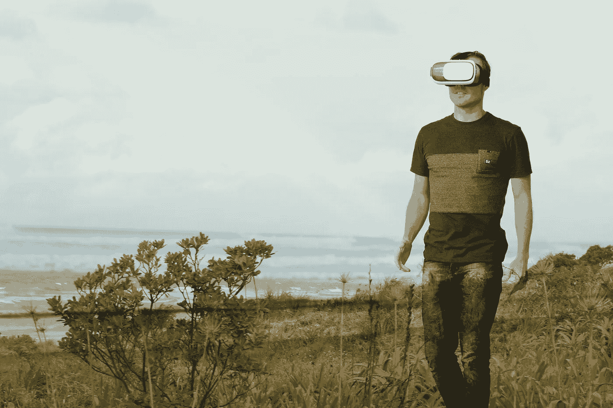
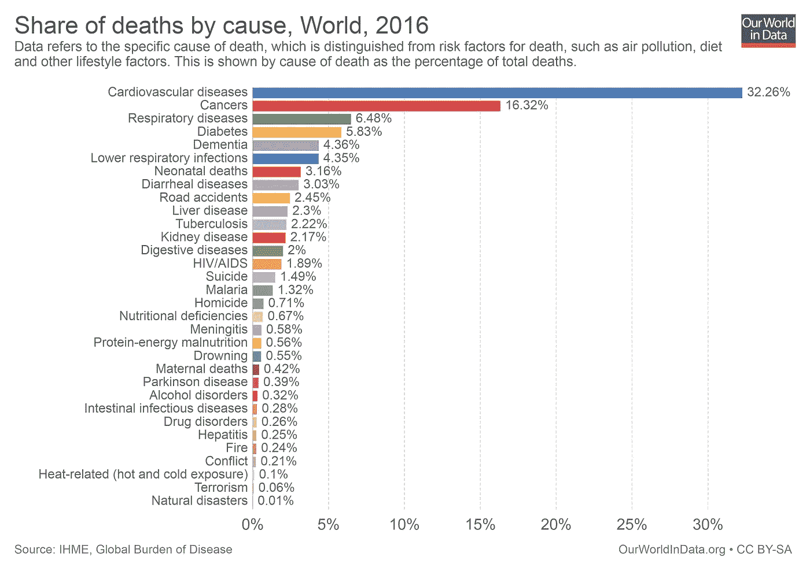
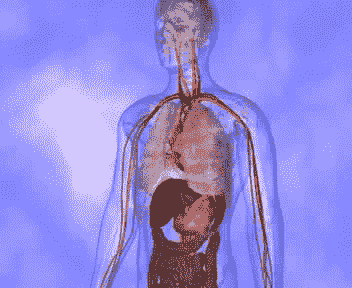
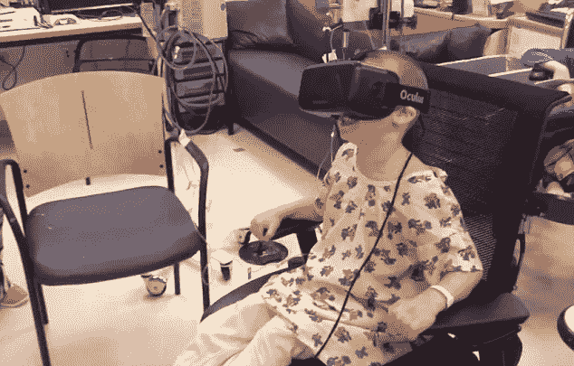
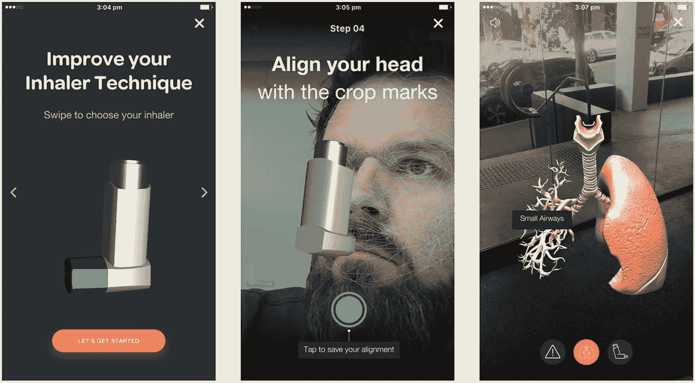
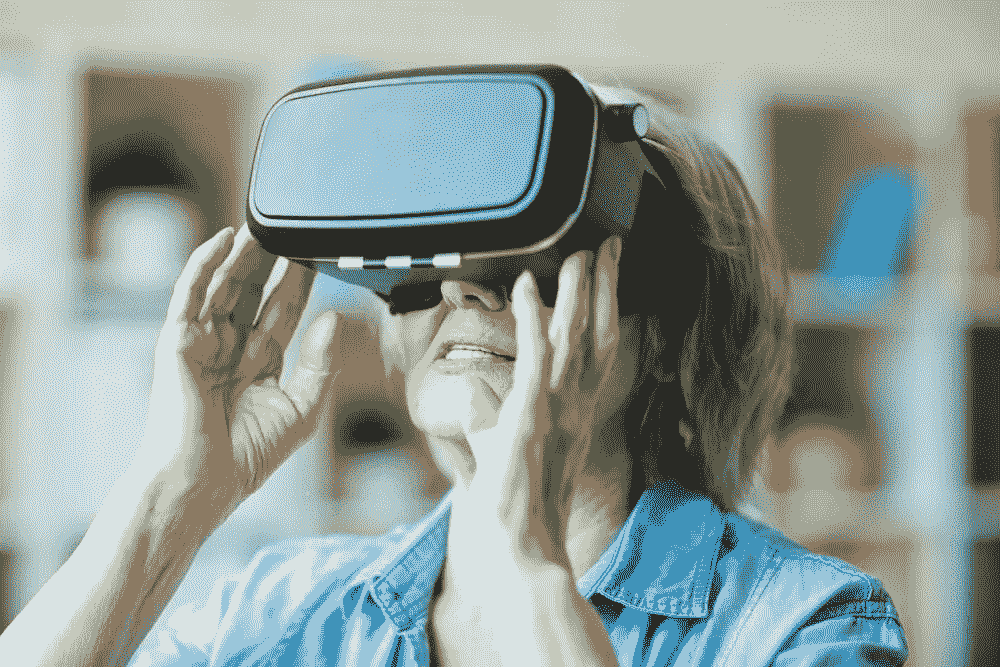
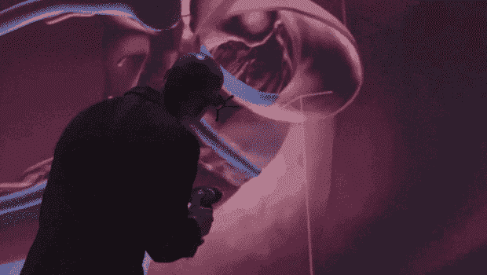

# 虚拟现实:拯救生命不是假装的

> 原文：<https://medium.com/swlh/vr-lives-saved-not-in-pretense-7c0267fa150>

尽管技术进步带来了种种欢乐，但偶尔出现的问题是，如果这么多人还没有活到生命的秋天，那还有什么意义呢？一个癌症患者能从一个新发明中感受到什么样的快乐？花在技术改进上的钱不是白花了吗？然而，那些受欢迎的高科技无用玩具并不像你想象的那么糟糕——即使是虚拟现实护目镜这样看似嬉戏的设备。

现实耳机仍然主要与游戏和电影联系在一起。然而，科学家们对此越来越感兴趣——而且不仅仅是在他们的空闲时间。在过去的几年里，它已经被证明有能力解决问题，而不仅仅是一个玩具。例如，在医疗保健领域，这是最棘手的问题。下图摘自关于全球非自然死亡原因的数据报告中的[我们的世界。VR 有潜力和他们斗争吗？](https://ourworldindata.org/causes-of-death)

# 心血管疾病

心脏和血管疾病是过早死亡的头号原因。心脏治疗的最大困难是它是一个非常复杂的器官。很难理解它内部发生了什么。与此同时，它要求快速反应和深思熟虑的精确决策。虚拟现实在这里能提出什么？

首先，建模。问问任何一位外科医生，他们都会告诉你在脑海中描绘出人类心脏的三维图像有多难。它从来都不是静态的——至少，静态不是外科医生在心脏手术中所期望看到的。那么，如何避免致命的错误呢？

VR 护目镜派上用场了。例如，在一个名为斯坦福虚拟心脏的项目中，你可以通过一个现实耳机从内部探索和操纵一个栩栩如生的人类心脏。该项目在 VR Oculus 的支持下，在[斯坦福大学医学院](http://www.stanfordchildrens.org/en/about/news/releases/2017/virtual-reality-program)实施。这有助于受训者发现缺陷并理解患者的感受。但这不仅仅是一个彻底观察的机会。它节省了很多钱，因为它比以前使用的塑料模型要便宜得多。他们计划为虚拟现实体验开发多达三十个心脏缺陷模型。

虚拟现实在治疗心血管疾病中已经证明其有效性的另一个领域是中风后的康复。通常，那些遭受中风的人会努力恢复运动能力。 [MindMaze](https://www.mindmaze.com/) 虚拟现实治疗软件通过教他们控制自己身体的数字化身来帮助这些患者康复。运动的可视化有助于幸存的神经从休眠状态中恢复。杜克大学的科学家成功地使用了这种技术，甚至瘫痪病人用他们的化身教他们[踢足球](http://www.dailymail.co.uk/sciencetech/article-3734320/Could-paralysis-reversed-using-virtual-reality-Spinal-injury-victims-regain-feeling-legs-brain-training-exercises.html#ixzz5AwcN5qBH)。这个过程实际上重新教会了大脑控制运动活动，并帮助患者恢复力量和活动能力。

# 巨蟹星座

虽然癌症在死亡原因中不占第一位，但由于病人经历的痛苦，它确实在社会上引起了最大的情绪反应。身体上的疼痛是患者、亲属和医生在处理这种疾病时最难面对的事情。目前对严重疼痛的治疗主要涉及阿片类药物，但其麻醉效果会随着时间的推移而减弱。VR 在这种情况下提出的出路，就是基于它的分心效应。沉浸在虚拟世界中让大脑充斥着感官输入。因此，它降低了大脑处理疼痛和感知疼痛的能力。已经证明，虚拟现实减少了 48 %的思考疼痛的时间，而阿片类药物只减少了 10 %。

虚拟现实疗法是减轻癌症患者焦虑和痛苦的有效方法，尤其是年轻癌症患者。像 [KindVR](http://kindvr.com/) 和 [Oncomfort](https://www.oncomfort.com/en/) 这样的公司已经开发了几个虚拟现实项目，从水下探险到冰岛之旅，他们认为自己的使命是通过虚拟现实帮助患者。

VR 在癌症治疗方面的另一个突破在于交流复杂手术病例的经验。2016 年，13，000 名参与者观看了 360°视频直播的医疗流程。英国外科医生沙菲·艾哈迈德(Shafi Ahmed)使用 VR 与世界各地的学生和同事分享他的知识和实践技能。他使用的应用程序是 [Medical Realities](https://www.medicalrealities.com/) 的作品，这是一家使用 VR、3D 和 360 度视频进行医学培训的公司。

# 呼吸系统疾病

呼吸系统疾病是一个巨大的全球性健康压力。据估计，全世界有超过 600 万人患有哮喘、慢性阻塞性肺病、肺结核和肺动脉高压。肺病是 5 岁以下儿童死亡的最常见原因。造成不良后果的原因通常是误用吸入器和不知道如何应对攻击。虚拟现实应用程序帮助从 5 岁开始与哮喘斗争的人管理他们的症状。他们教患者正确使用吸入器和正确呼吸，这可能会挽救生命。

虚拟现实在治疗呼吸系统疾病方面的应用仍处于初级阶段，尽管在这方面已经采取了一些措施。有人试图将[呼吸机管理协议](http://www.nyu.edu/classes/keefer/therapy/therapy2.html)与虚拟现实相结合。它应该减少有呼吸问题的人的机械通气的心理和生理并发症。

# 糖尿病

在这里，VR 现在也大多用于教育目的，无论是对医生还是对病人。[例如，糖尿病旅行者](http://www.diabetesvoyager.co.uk/)使用 Oculus VR 和微软 Kinect 将用户带到糖尿病患者的心脏、大脑和血管系统。受训者经历了与疾病相关的挑战，如达到正常的糖化血红蛋白水平、避免低血糖和减肥。 [VRDiabeti Game](https://www.enfoglobe.com/index.php/en/vr-diabetes) 是为 5-12 岁的糖尿病儿童开发的另一款软件，用于教授日常医疗维护以及健康的饮食和玩耍习惯。

# 阿耳茨海默氏病

阿尔茨海默氏症是痴呆症的主要类型。它影响着全世界数百万人，而且其人口还在不断增长。考虑到这一点，你不能仅仅把这个问题贴上普通衰老障碍的标签就一笔带过。对于科学家来说，这是对创新和改进的自然呼唤。阿尔茨海默氏症和痴呆症患者面临的主要挑战是断开，这表现在各个领域:言语、环境、记忆。虚拟现实在这个领域的应用是基于神经可塑性的原理。这是大脑在与丰富的环境互动时重新组装新突触的能力。

科学家和程序员一起开发软件，这些软件要么再现老年人以前的经历，要么通过像去异国旅行或观察野生动物这样的场景来激发积极的情绪，如 T2。虚拟现实为痴呆症患者提供了感受活力和保持自尊的机会。

但是缓解阿尔茨海默氏症患者的生活并不是处理这种疾病的唯一虚拟现实应用。虚拟现实技术有助于[在 18 岁时检测出患老年痴呆症的风险](http://www.bbc.com/news/health-34607267)，这是基于人们如何在虚拟迷宫中移动。这让科学家们更好地了解疾病的原因以及如何预防或改变它们。

# 未来前景

我们已经描述了在医疗保健中使用虚拟现实的几个例子。但是这项技术的潜力是不可估量的。医疗虚拟现实应用越来越多样化，可以根据私人医生和州立医院的需求进行定制。除了教育、手术刺激、心理障碍治疗和疼痛分散之外，它们还可以用于诊断，并有助于在处理劳动密集型活动时最大限度地减少人员工作量。

在[Stfalcon.com](https://stfalcon.com/)，我们相信虚拟现实在医学上有很大的前景，并参与了医学虚拟现实的开发。因此，我们最近的一个项目致力于创建一个虚拟现实应用程序，旨在诊断一种特殊而复杂的眼病。我们的开发人员提出的解决方案有助于将参与诊断的工作人员数量减少两倍，并获得关于疾病性质的更精确的数据。

# *最初发表于*[*stfalcon.com*](https://stfalcon.com/en/blog/post/VR-in-healthcare)*。*

## 这个故事发表在 [The Startup](https://medium.com/swlh) 上，这是 Medium 最大的创业刊物，拥有 316，028+人关注。

## 在这里订阅接收[我们的头条新闻](http://growthsupply.com/the-startup-newsletter/)。

