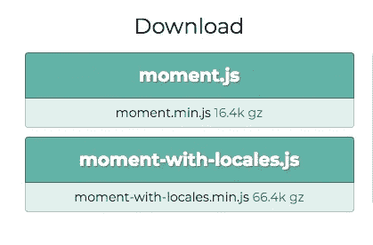
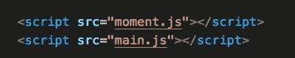
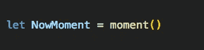
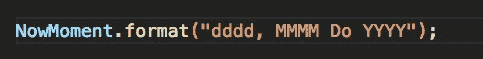
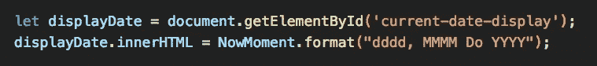
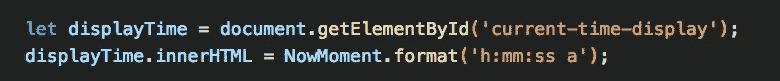
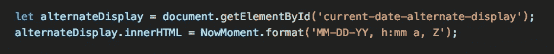
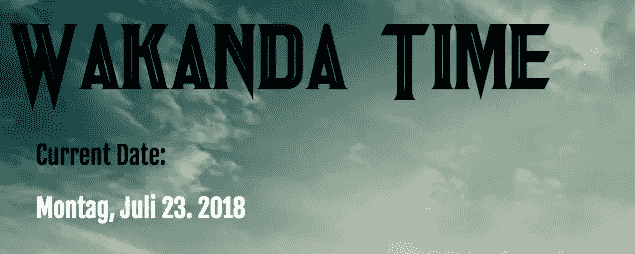
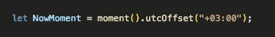

# 瓦坎达现在是几点？Moment.js 初学者使用指南

> 原文：<https://medium.com/swlh/wakanda-time-16a3b0e733ff>

Photo by [Aron](https://unsplash.com/photos/BXOXnQ26B7o?utm_source=unsplash&utm_medium=referral&utm_content=creditCopyText) on [Unsplash](https://unsplash.com/search/photos/time?utm_source=unsplash&utm_medium=referral&utm_content=creditCopyText)

让我们从一个重要的声明开始:

我知道瓦坎达不是一个真实的地方。尽管我希望如此，但我还是把在肯尼亚的时间当成了占位符。瓦坎达应该在东非，但是确切的位置受到很多猜测的影响，一些参考文献指出这个天堂在南苏丹、乌干达、肯尼亚和埃塞俄比亚之间的某个地方。也就是说，[这里的](https://fwallacephd.github.io/WakandaTime/)是我为学习背景搭建的网站(下面截屏)，这里是 [GitHub](https://github.com/fwallacephd/WakandaTime) 上的文件。

Website by @fwallacephd

# 什么是 Moment.js，为什么要关注它

[Moment.js](https://momentjs.com/) 是一个与 JavaScript 协同工作的库(或预写代码)，这样你就可以轻松地显示、操作和验证日期，包括时间。这包括本地语言、格式和时区，就像我的 Wakanda 例子一样。因为这是对 moment.js 的介绍，所以我不打算讨论解析和验证日期——这些将是以后的主题，但是一旦您理解了 moment.js 在最基础的层面上是如何工作的，学习更高级的主题自然会更容易，并且您将看到代码构造方式的模式。

您可能会问自己，JavaScript 没有处理日期的方法吗？确实如此，但是 Moment.js 只专注于让日期(和时间)工作变得超级方便的目的。JavaScript 没有这种奢侈，因此当需要更复杂的功能时，JS 可能会很麻烦。

# 入门指南

由于我们使用的是库，我建议你直接从 moment.js 下载代码。在他们的[主页](https://momentjs.com/)上，你可以选择文件。如果您打算使用 moment.js 来操作和显示本地语言和格式，那么您需要名为 *moment-with-locales.js.* 的文件，否则，您可以只使用标准的 *moment.js* 文件。

Screen Capture from Moment.js

单击您需要的文件，将所有代码复制并粘贴到文本编辑器中的一个新页面，并将其保存为 JS 文件。现在，将这个文件添加到您正在处理的任何项目中，就像处理您的主要 JS 代码一样。

Adding my scripts!

# 显示日期

Moment.js 代码，就像许多其他库(预先编写的代码)一样，以一个自引用片段开始:

Telling the computer to get the date and time object.

为了可读性和便于将来使用，我更喜欢把一切都放在一个变量中。所以上面的片段变成了:

Setting a variable to hold the date and time object. Oops, where’s my semicolon?

有了这一行代码，您就拥有了整个 date 对象，并且可以通过向它添加一个 format 方法来选择显示它的任何方式。基本代码如下所示:

Formatting the date object they way I want it to display.

上面的代码行说明我获取了包含日期和时间对象的变量，并为其添加了一个格式方法。format())。因为我希望计算机以这种特定的方式显示时间，所以我将显示内容传递给了 format 方法的参数。但是现在，这一行代码除了作为一个容器之外并没有真正做任何事情，因为我还没有告诉它格式显示应该放在哪里。我还需要在网站上更新它。您的代码应该做两件事:找到 HTML 中将要显示日期的元素，然后按照您想要的方式格式化日期。大概是这样的:

Find the element where the date is going to be displayed and format it the way you want.

去吧…看看瓦坎达网站上的第一次约会显示，看看这是如何工作的(下面的截图)。

I put my date and time display in three different sections. I’ll explain the other sections in this post as well.

我在这里显示了完整的月份名称，但是我可以很容易地写一个 M 而不是 MMMM，这将给出一个数字输出而不是字符串(参见上面的代码)。我可以添加一些元素，比如一年中的星期(“wo”)或一年中的季度(“Qo”)。Moment.js 在文档中有整整一页的可用格式组合。需要注意的是，出现在我的 Wakanda 网站上的代码中的逗号(在周一到七月之间)是我的逗号。如果你想在你的格式中使用标点符号，你需要插入它。

# 显示时间

那不是很容易吗？

插入时间也一样简单。以下是瓦坎达页面的外观:

Formating the time.

我们仍然需要向网站添加格式显示。您的代码应该做两件事:找到 HTML 中将要显示时间的元素，然后按照您想要的方式格式化时间。类似这样的东西

Find the element where the time is going to be displayed and format it the way you want.

同样，请注意，我在上面的代码中向时间格式参数添加了冒号。

# 耍流氓

事实是，你可以按照你想要的任何方式显示日期和时间(只要 moment.js 支持)，所以我在 Wakanda 网站上添加了第三个显示部分。你认为“Z”代表什么…猜猜…

Find the element where the date and time are going to be displayed and format it the way you want.

…如果你猜的是时区，那你就猜对了。

# 区域设置和时区

我们已经确定瓦坎达是虚构的。

但是，如果作为开发人员，您需要用其他语言和本地格式显示日期，该怎么办呢？Moment.js 支持主页上列出的许多语言环境。正如 format 是一种方法一样，locale 也是一种方法，它只是允许您更改语言。下面的代码说我们使用英语，但我可以用“en”代替“ja”(日语)或“de”(德语)或任何其他支持的语言代码。在这里查找您需要的[语言代码。](http://www.loc.gov/standards/iso639-2/php/code_list.php)

Display in English

只是为了好玩…如果我把“en”换成“de”会发生什么:

Display the moment.js date in German.

我在瓦坎达(好吧，肯尼亚)设置了网站时间，但是我在美国东海岸编码，我怎么改变时区？从 UTC(协调世界时)开始，一个标准的全球通用时钟。相对于您与英国格林威治时间的距离，您的当地时间将在 UTC 上加上或减去小时和分钟。为了确保显示正确的时间，我将获取代码的第一行，在这里我获取了 date 对象并添加了一个 utcOffset 方法。方法中的参数是+3:00，用于更新肯尼亚的时间。

Adding a method that let’s the computer know what time zone to display.

# 现在怎么办？

在你已经知道的东西的背景下学习新的东西总是比较容易的。这就是为什么我强烈建议你接下来做两件事。1.拿一个你已经建立的网站，在页面的某个地方添加一个日期显示。确保您使用不同的格式选项进行练习。2.想想另一个地方，为自己建造一些独特的东西。也许您想显示《哈利·波特》宇宙或《中土世界的霍比特人》中 Durmstang 学院的时间。

你是开发商。如果你能梦想它，你就能建造它。当你建造它的时候，请与我分享！

## 这篇文章发表在 [The Startup](https://medium.com/swlh) 上，这是 Medium 最大的创业刊物，有+ 374，685 人关注。

## 订阅接收[我们的头条新闻](http://growthsupply.com/the-startup-newsletter/)。

