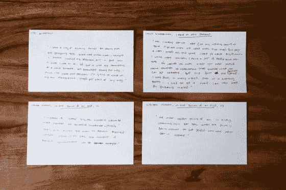
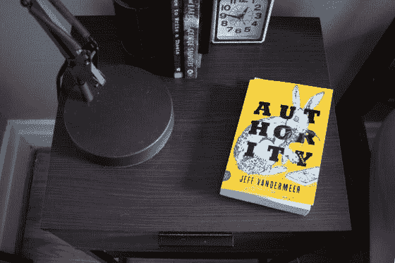
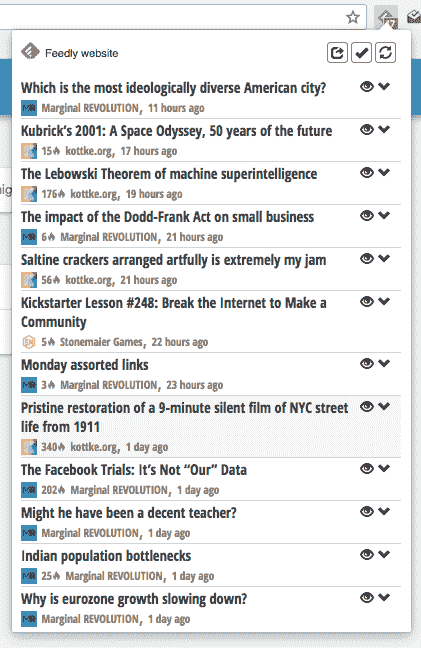

# 想要更好的主意？珍惜你的日常。

> 原文：<https://medium.com/swlh/want-better-ideas-cherish-your-routine-f205cacce7d6>

Photo by [rawpixel.com](https://unsplash.com/photos/5Z398JOmCKw?utm_source=unsplash&utm_medium=referral&utm_content=creditCopyText) on [Unsplash](https://unsplash.com/search/photos/routine?utm_source=unsplash&utm_medium=referral&utm_content=creditCopyText)

过去的一周，我打破了我的记录。这是自 2018 年初以来，我第一次在这个博客上至少领先一篇文章。到目前为止，这一直是一个很好的小习惯——没有现在就发表的压力，我有空间更深入地思考我的话题，花更多的时间写每篇文章，坦率地说，写出更好的作品。

发生了什么事？为什么我最后落后了？为什么我在需要发给你的前几天才写这篇文章？这并不是因为我找不到时间写作。这并不是因为我不想在博客上工作。因为我想不出好主意。我一直觉得有点像[奥斯丁·克莱恩](https://austinkleon.com/2018/01/05/getting-things-done/):

> “有些人告诉我，他们有所有这些伟大的想法，但他们无法将这些想法聚集起来，以实现它们。我很羡慕这些人，因为我并不觉得自己充满了伟大的思想。如果我有一个伟大的想法，我对自己的能力充满信心，但我不相信自己有能力真正产生这个伟大的想法。我几乎花了所有的时间去寻找一个值得去做的想法。”

大多数变成文章的想法都来自我每周的阅读习惯——大约 15 个在线资源加上我床头柜上的任何一本书。我会抄写一些突出的段落，其中最好的最终会放在我的“博客创意”文件中。随着我不断地阅读和学习，新的想法被加入，而其他人则抓住现有的想法不放。最终，就像雨云一样，一个想法会“爆发”——所有的零碎信息会变成一篇完整的文章。

但是最近，什么都没爆。这句话，出自小说 [*机关*](https://www.amazon.com/Authority-Novel-Southern-Reach-Trilogy/dp/0374104107/ref=sr_1_1?ie=UTF8&qid=1524068004&sr=8-1&keywords=authority+jeff+vandermeer) ，准确地概括了我的处境:

> ”他不停地回想起涌入他脑海的所有信息，他让这些信息不断涌入他的脑海。明天会有更多，后天也会有更多，毫无疑问，在得出任何结论之前，新的信息会不断进入他的大脑。”

每天都有新的信息进来，但是没有什么是足够“沉重”的。因此，我继续阅读。

当我开始写这篇文章时，我意识到为什么我最近一直在挣扎。是因为上个星期，一件家事把我从日常事务中敲了出来。一周的大部分时间，我都不在电脑旁。积压的工作。当然，我不后悔请假——几乎不后悔——但我敢打赌，这是我本周没有准备好文章的主要原因。

我认为这种模式证明了我的阅读方式不仅仅是为了好玩。这不是浪费时间或分散注意力。这是我创作过程和生产功能的重要组成部分。也许并不总是*觉得*喜欢埋头苦读，但*确实在工作。*

现在我回到办公桌前，一头扎进上周错过的一切，新的乌云正在形成。它们很快就会破裂。

如果你喜欢本周的文章，你会喜欢我的时事通讯。每周，我都会分享一篇新的文章，里面充满了创造性的想法、心态和习惯，这些都是你实现想法所需要的。 [**报名。你会喜欢的**](http://immakingallthisup.com) 。

## 这篇文章发表在 [The Startup](https://medium.com/swlh) 上，这是 Medium 最大的创业刊物，有 319，283+人关注。

## 在这里订阅接收[我们的头条新闻](http://growthsupply.com/the-startup-newsletter/)。

