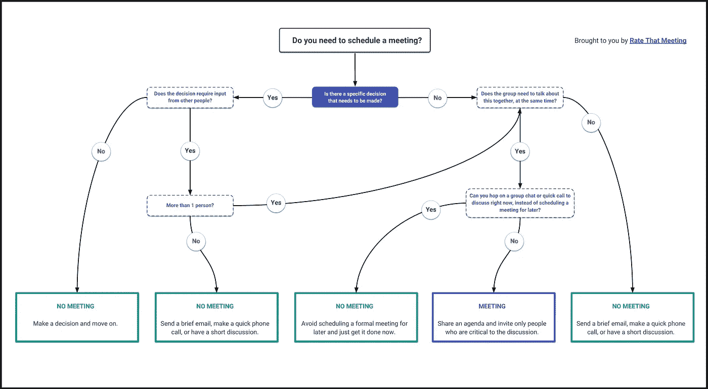

# 想要减少工作中的会议？学会说不。

> 原文：<https://medium.com/swlh/want-fewer-meetings-at-work-learn-how-to-say-no-26b9ccbdf5c1>

并不是所有的决策都需要开会来推动下一步，太多的会议有太多的人参加，很难有效。

Familiarize yourself with this flowchart before scheduling another meeting (source: https://shoulditbeameeting.com)

> 有如此多的新工具、应用程序和插件使得在工作中安排会议变得更加容易，窃取同事的时间变得太容易了。

有没有感觉到你每天所做的就是从一个会议跳到另一个会议？你只有下班后才有时间完成工作吗？你并不孤单。**大多数办公室职员至少花 45%的时间在会议上。**

基本上有两种方法可以解决这个问题——(1)组织更少的会议和(2)作为参与者参加更少的会议。

# 在安排会议前要三思

很少有什么事情会比超载更快地扼杀团队的速度。所以在安排下一次会议之前，问自己几个简单的问题:

1.  这个决定需要不止一个人的参与吗？
2.  小组需要同时一起讨论这个问题吗？
3.  是不是一定要等到以后能找到一个大家共同讨论的时间？

除非你对*上述所有问题*的回答都是肯定的，否则你可能不需要安排会议来实现你的目标。以下是一些可供考虑的替代方案:

*   电子邮件
*   闲谈
*   快速电话
*   简短的面对面交谈
*   共享文档

这些选项和更正式的会议之间的区别在于，你最终可能会让更少的人参与决策过程，而且决策过程可能会更快完成。

但是，如果你对上述所有问题的回答都是肯定的，请确保遵循有效会议的最佳实践:

1.  创建一个清晰、重点突出的议程(并在会前分发)
2.  只邀请对讨论至关重要的人
3.  尽可能缩短会议时间

# 你没有义务接受你收到的每一个会议邀请

没错— *每个人*都可以并且应该考虑，当你被加入工作会议时，是否真的需要你出席。如果你的日历显示你有空，不要盲目地认为你有义务参加会议，你应该觉得自己有权力质疑自己的出席情况。

为了审查收到的会议邀请，您应该向会议组织者提出以下问题(如果您还不知道答案):

*   会议的目标是什么？(要非常清楚)
*   讨论的议程是什么？(务必在会议前查看议程)
*   你的出席对会议的成功至关重要吗？
*   有可能通过电子邮件实现目标吗？

如果你一定要参加会议，你应该尽最大努力确保会议成功。

为了指导您在工作中减少开会时间，我们创建了一个有趣而简单的方法来帮助您和您的同事确定是否真的需要安排另一个会议。

祝你好运！

 [## 应该是开会吧？

### 弄清楚你是否真的需要开会。

shoulditbeameeting.com](https://shoulditbeameeting.com/) 

*如果你有问题，评论，或者只是想打个招呼，给*[*【danny@ratethatmeeting.com】*](mailto:danny@ratethatmeeting.com)*——我很乐意收到你的来信。*

## 这篇文章发表在 [The Startup](https://medium.com/swlh) 上，这是 Medium 最大的创业刊物，有 320，131+人关注。

## 在这里订阅接收[我们的头条新闻](http://growthsupply.com/the-startup-newsletter/)。

