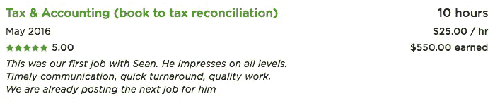
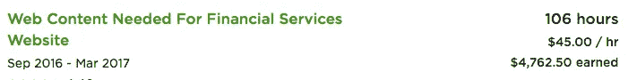
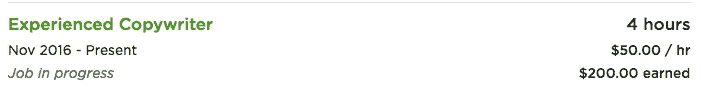
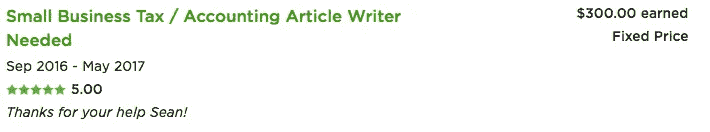
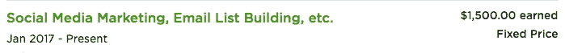

# 想要更多客户？提高你的价格

> 原文：<https://medium.com/swlh/want-more-clients-raise-your-rates-8514a2a040f6>

Photo by [Andre Hunter](https://unsplash.com/photos/p-I9wV811qk?utm_source=unsplash&utm_medium=referral&utm_content=creditCopyText) on [Unsplash](https://unsplash.com/?utm_source=unsplash&utm_medium=referral&utm_content=creditCopyText)

有一个令人不安的神话告诉新的自由职业者，他们需要收取低利率，以获得客户。

关于他们没有任何经验，客户不会与他们合作，除非他们提供服务…

别担心，我自己也经历过，这也是我想告诉你一个小秘密的原因…

# 完全是胡说八道

在我自由职业生涯的初期，我决定做一名簿记员。

我真的不太喜欢这个领域，但我有会计硕士学位，知道这是一个很好的起点…

所以我很快在[Upwork.com](https://www.upwork.com/)上开了一个账户，像大多数自由职业者一样，我一开始收取很低的费用(25 美元/小时)。

我想我会这样做，直到我可以得到我的第一对夫妇的客户，然后一旦我有了稳定的现金收入，我会开始提高利率，那时我就开始赚大钱。

几天后，我准备开始寻找客户，于是我开始像疯子一样提交提案。

实际上，我在头两天提交了太多的提案，以至于我用尽了连接(提交更多提案的能力)，所以我决定在那之后休息一下…

认为所有的工作机会滚滚而来只是几分钟的事。

所以我等了几分钟，然后几天，然后几周…

直到我的努力终于有了回报，我以每小时 25 美元的价格得到了我的第一个客户！

1st job

现在我非常兴奋能得到这第一份工作，所以我马上回复了客户，之后我们立即开始工作…

但是到了第二天早上，我开始意识到这整个个体户的事情并不完全是它所设计的那样。

我早上 7 点醒来，客户已经给我发了 5 封邮件(甚至一条短信)，告诉我他有一些紧急项目必须在早上 9 点前完成——没有例外。

这已经毁了这一天，但他是我唯一的客户，我想让他开心…

所以我马上开始工作，在上午 9 点前完成他的工作，一路上赚了 50 美元。

这种关系持续了几个月，实际上我在这期间也接了一些其他的客户，但是不管我提交了多少提案或者做了多少网络工作…

我找不到足够的客户来付账。

# 然后我读了罗伯特·恰尔迪尼的《影响力》

如果你不熟悉[这本书](https://www.amazon.com/Influence-Psychology-Persuasion-Robert-Cialdini/dp/006124189X)，或者罗伯特·恰尔迪尼本人，他是劝说行业的知名人物。

他实际上把他的大部分生活/研究都献给了这个主题，经过多年的研究，他决定写*的影响* …

一本讲述我们与生俱来的所有自动触发器的书。

有一堆 em，但是给你几个好例子，它讨论的事情有:

*   权威说服 —我们将如何倾听任何有高级证书的人，即使这毫无意义(就像一个超重的医生谈论营养)…
*   **从众心理**——我们认为如果其他人都这么做，那么这一定是个好主意(就像 70 年代的吸烟)…

或者在我们的例子中:

*   **定价心理学**——我们如何认为更高的价格总是意味着更好的质量(例子太多，无法展示)

现在，这整本书对我来说很有趣，因为我试图找出如何才能得到更多的客户，但定价心理学的概念真的吸引了我…

主要是因为我能感同身受(我总是被昂贵的东西所吸引，即使它毫无意义)，但也因为我开始意识到这可能是我无法获得客户的主要原因之一。

# 我的结果

在读完这本书并意识到有“定价心理学”这种东西后，我想看看这种东西如何为我工作…

但是我有一个问题。

我知道潜在客户可能会看到我向现有客户收取非常低的费用，他书中的另一部分谈到人们总是喜欢攀比，这意味着触发器可能会推翻我的定价心理学新概念…

因此，我决定学习一种全新的技能(写作)，将我目前的工资翻倍(嗯，差不多，从每小时 25 美元涨到每小时 45 美元)，然后提交一些建议，看看这是否可行。

然后，令我惊讶的是，不到两天我就找到了我的第一个写作客户…

这已经很疯狂了…

但是最重要的是，他愿意付我 45 美元/小时！

Writing job

这给了我足够的动力继续我的新速度，在我意识到之前，我已经在一个我毫无经验的领域创造了一个全新的侧面骗局…

2nd job

$75 per blog (roughly $50/hr)

$1,500 for 15 hours…

这让我恢复了理智，重新开始支付账单，继续我的自由职业生涯。

# 我想说的是…

很明显，你仍然需要遵循一些指导方针。

请不要认为你可以马上冲出大门开始收取 250 美元/小时的费用，因为你仍然需要实际一些，但是请记住…

有很多人的收费超过 100 美元/小时，所以如果你以一个合适的价格(比如 50 美元/小时)开始，你还是给了他们一个好价钱(同时利用你的定价心理)…

此外，即使低利率真的有效，它们也只不过是通向精疲力竭的捷径…

那么这到底有什么意义呢？

**另外，如果你想了解更多关于如何在疯狂的在线自由职业世界中导航的信息，我已经为你创建了一个免费的迷你课程——**[**点击这里**](http://www.bottomlinegrind.com/free-course/) **。**

## 这篇文章发表在 [The Startup](https://medium.com/swlh) 上，这是 Medium 最大的创业刊物，有 274，559 人关注。

## 订阅接收[我们的头条](http://growthsupply.com/the-startup-newsletter/)。

