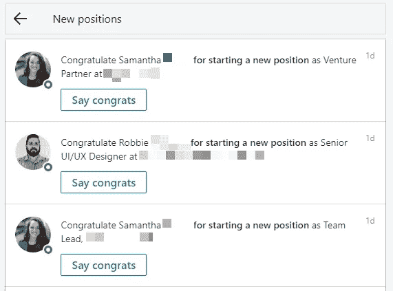
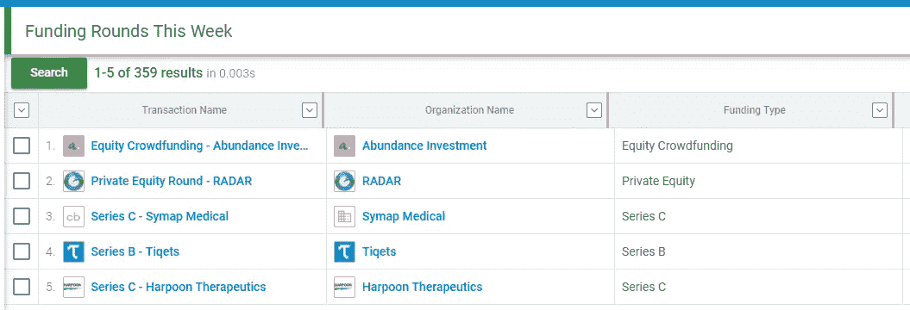

# 想要更多客户？然后，您需要了解您的机会时间表

> 原文：<https://medium.com/swlh/want-more-clients-then-you-need-to-understand-your-opportunity-timeline-8ae31e05839f>

Image credit: [Unsplash](https://unsplash.com/photos/mG28olYFgHI)

SaaS 或服务，每个创业公司都想要同样的东西:

更多的客户，更多的顾客。

虽然关于获得客户的信息比你所能读到的还要多，但有一点经常被忽略，那就是 ***机会时间线。***

机会时间线是您的销售线索最有可能听取您的建议的那一小段时间。

这可能是由多种原因造成的—也许他们正在评估他们的供应商关系，也许有一个新人在掌舵，或者也许一个新的行业发展正在迫使他们改变。

如果你曾经看到你冰冷的电子邮件和推销从一个又一个收件箱退回，很有可能是你的时机错了，而不是你的推销。

初创公司、服务企业、代理机构——任何与客户打交道的人都需要把握好时机，以最大限度地提高销售效率。

怎么会？

下面我给你看。

# **解释了机会时间表**

业务需求很少是线性的。行业中的新发展、关键的人事变动、业务方向的变化——所有这些都会影响企业需要新合作伙伴的方式和时间。

想象一下，一家企业通过引人注目的电视宣传活动推出新产品。但其目前的代理合作伙伴之前没有电视经验。

如果一个在电视上取得巨大成功的机构在那个时候来敲他们的门，你不认为他们会更愿意听吗？

机会时间表就是要找出业务需求中的这些变化，并采取行动。

这样，你就不会浪费资源卖给不需要你的企业。相反，当他们的需求与你的能力相一致时，你可以通过专注于那短暂的时间来最大化你的回报。

俗话说的打铁还需自身硬。

Source: [Giphy](https://giphy.com/gifs/iron-man-laundry-chores-bCvO8biVh8WyI)

您可以将影响业务需求的变化分为四类:

*   **人事变动**如影响业务方向、战略和供应商关系的领导层变动。
*   **季节性变化**例如在财政年度末对供应商关系进行定期重新评估，或者在假日销售季节之前采用新的供应商。
*   **行业变化**如新法规、消费趋势等。这迫使企业采取新的策略。
*   **业务变化**如新一轮融资、并购等。这会影响企业的战略和关系。

这些将因企业和行业的不同而不同。

例如，在我最了解的代理世界里，营销人员随身携带他们的代理机构是很常见的。如果营销副总裁换工作，他很有可能会带着以前的公司一起去。

现在的大问题是，为了利用机会时间表，您应该留意哪种变化？

下一节我有一些答案。

# **6 件需要注意的事情**

如果您打算利用机会时间表，您应该留意以下变化:

## **1。有一个关键的人事变动**

注意:

1.  一家企业雇佣了一名新的决策者(首席和副总裁级别的高管，中层决策者)
2.  转移到新公司的决策者

首先，密切关注经常报道关键人事变动的行业博客。

第二，留意你的 LinkedIn 通知。如果你看到你的联系人名单上的人换了新的角色，祝贺他们，然后伸出手让他们知道你就在身边。

Your LinkedIn notifications can help you spot key personnel changes

## **2。他们筹集了新的资金**

一轮大规模的融资意味着商业重心的转移。他们可能需要新的资源来更快地发展。

使用类似于 [FinSMES](https://finsmes.com) 、 [Crunchbase](https://crunchbase.com) 等网站。发现新一轮融资。

Keep an eye out on Crunchbase to see who’s getting funded or acquired

## **3。有新品发布会**

新产品发布可能是一个巨大的机会，尤其是如果该产品是在该企业的当前供应商没有经验的领域。

然而，发现这些机会可能很难。大公司的产品发布通常提前几年就计划好了。当产品新闻发布时，他们可能已经有供应商了。

但是，您可以通过以下方式评估新产品发布:

*   **分析行业:**有没有在产品选择方面比较落后的商家？是否有来自领导层的抱怨或客户对新产品的需求？如果是，该企业可能有一个新产品在管道中。
*   **了解上市周期:**新产品通常在需求高峰期上市。一家沙滩装公司将在夏天推出新系列。同样的开发可能会提前一年开始。如果你了解这个行业的发布和需求周期，你通常可以预测新产品的发布。

## **4。有一个合并/收购**

合并/收购是巨大变化的时期。旧的关系被抛弃，新的伙伴关系被建立。

寻找你所在行业最近收购或合并的企业。同样，你必须关注特定行业的新闻来源来发现这些机会。

接触被收购公司和收购公司的决策者，开始对话。

## **5。有新的行业发展或规定**

新的法规或发展可能会对现有的供应商关系产生重大影响。

例如，在搜索引擎优化行业，当熊猫/企鹅更新推出时，我看到成千上万的企业更换了搜索引擎优化代理。

最近，GDPR 法规迫使我所在行业的许多公司重新评估他们的供应商。

密切关注行业新闻，了解任何法规或发展动向。任何时候有新的大变化，也会有建立新关系的新机会。

## **6。有一个新的行业趋势**

企业很少能抗拒抓住一个大的新趋势，尤其是如果他们所有的同行都在跟随。

人工智能、虚拟现实、区块链、社交媒体营销——现状的任何改变也是推销你的服务的机会。

如果社交媒体是热门的新趋势(大约 5 年前就是这样)，而你看到一家企业在社交媒体上表现不佳，伸出援手可能是明智的。

如果行业中的每个人都在赶人工智能的潮流，你可能会想要介入并向缓慢采用者推销你的服务。

Source: [Giphy](https://giphy.com/gifs/simpsons-im-so-sorry-just-super-wired-and-hyper-tonight-the-tyger-that-devours-my-soul-u10GReM6igVGg)

关注新的行业趋势。FoMO 既适用于消费者，也适用于企业。

机会时间表有助于您最大限度地提高销售成效。不要去追逐不需要你的业务，你要把注意力放在积极寻找新合作伙伴的那一小部分潜在客户身上。

留意你的目标行业的变化。人员、可用资金、行业趋势或新法规的变化都会影响业务需求。

提出一个好的建议，你会发现需要帮助的企业非常乐意倾听。

***关于这篇文章的更详细版本，请查看我最近的*** [***文章，内容是关于你在 2019 年应该瞄准哪类企业***](https://www.workamajig.com/blog/clients-to-target) ***。***

***

我主要写创业、营销、商业发展、领导力和文化。关注我阅读更多。

## 这篇文章发表在 [The Startup](https://medium.com/swlh) 上，这是 Medium 最大的创业刊物，拥有+400，714 名读者。

## 在这里订阅接收[我们的头条新闻](http://growthsupply.com/the-startup-newsletter/)。

