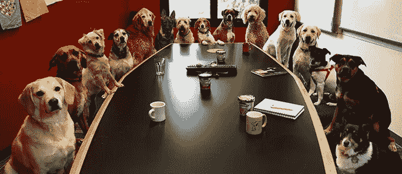
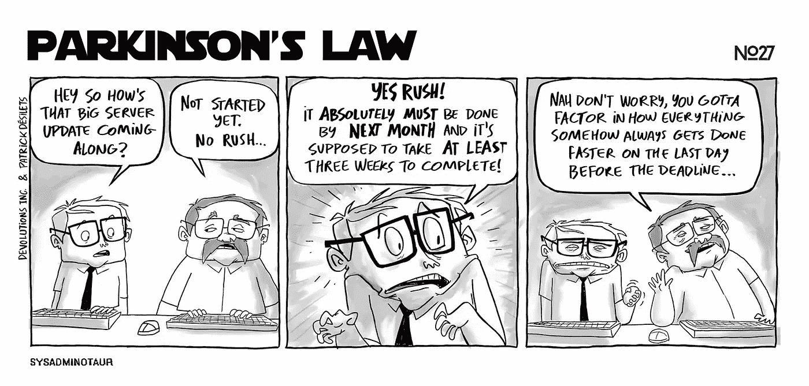
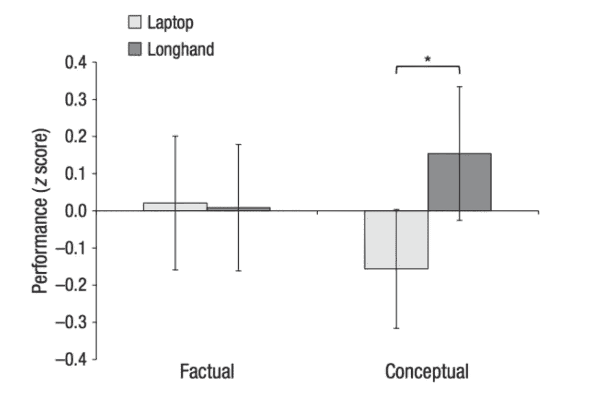

# 想要更短、更高效的会议？做这 11 件事

> 原文：<https://medium.com/swlh/want-shorter-more-productive-meetings-do-these-11-things-4b68db367a79>

## 会议。有很多，对吧？

你可能会想，经过这么多的练习，我们会更好地举行真正有用的会议。

然而，我们中的许多人在离开冗长的会议时，都在想到底什么是外卖，或者我们当初为什么会在那里。

不需要这样。

通过引入一些目的、结构和清晰度，会议可以带来积极的结果并创造新的想法。

从亚马逊的“两个披萨法则”(永远不要开两个披萨不够满屋吃的会议)到史蒂夫·乔布斯对幻灯片的厌恶，有很多传奇的“窍门”可以让会议更有成效。

不幸的是，没有一份建议清单(即使是这一份)能在公司内部带来新的集体思维。

我们都不喜欢无意义的会议，但我们不会给它们注入实质内容，直到我们首先弄清楚到底是什么让它们如此无用。

富有成效的公司有富有成效的会议；这两者密切相关。

下面的建议是为了培养有效开会的健康习惯而编写的。他们可能不会改变你的公司，但他们应该开始培养富有成效的合作行为。

# 1.陈述会议的目的

这似乎是显而易见的，但确切地知道为什么要召开会议是至关重要的。这适用于其总体目标，也适用于预期结果。如果你不能清楚地表达这一点，就不要开会。

如果你知道目的是什么，与与会者分享信息——所有人都应该有一个明确的角色。

通过让人们知道对他们的期望，辅导员可以在参与者中产生一种个人责任感。反过来，这将创造一个让人们感到主动而不是被动的环境。

从丹尼尔·卡内曼的《思考，快与慢》中，还有另一个很好的会议准备技巧。

卡尼曼建议要求所有与会者写下他们对讨论主题的看法。这将使每个人在早期就参与进来，并在会议中具体反映他们的观点。

在会议结束时，这可以作为一个参考点，看看他们的目标是否已经达到，或者意见是否已经改变。

# 2.当心帕金森定律

留出 30 或 60 分钟的会议时间很有诱惑力，因为这是惯例。[帕金森定律](https://en.wikipedia.org/wiki/Parkinson%27s_law)在这里适用；我们为会议留出多少时间，会议就花多少时间。

没有必要仅仅为了给人们一些时间而匆忙召开会议，但是一旦目标达成就结束会议是很有必要的。如果会议需要 33 分钟，那就需要 33 分钟。

这个领域有无数的技巧，有些是噱头，有些是有帮助的。一些人声称设置计时器会产生一种紧迫感，而另一些人则拥护站立会议的优点。

这里没有明确的规则，但是一个熟练的主持人会知道如何让与会者发挥最大的作用。

# 3.下午开会

一般来说，当天晚些时候的会议更有可能吸引人们。

我们应该在早上第一件事就是开会讨论重要的话题，这似乎是直觉。

然而，事实恰恰相反；人们带着一张他们想要完成的事情的清单来到办公室，所以当他们被迫参加会议时，他们仍然专注于这张清单。

让每个人继续做自己的事情，他们会更好地准备积极贡献。

上下文就是一切，某些主题需要立即解决。然而，如果你想利用每个人的全部注意力，那就去参加下午的会议。

# 4.在议程上创建清晰的结构

这个技巧对主持人和与会者都有帮助。

设计一个由不同部分组成的议程，并给每个部分分配一定的时间。

写下你期望在每一部分讨论的内容的概要也是一个好主意。

这将在你的脑海中创建一个会议大纲的清晰画面，同时也允许人们在会议开始前详细考虑讨论要点。

# 5.留出时间准备

如果你希望与会者提出新的想法，并为你的会议贡献他们的时间，提前分发邀请函和议程是很重要的。根据不同的主题，这一时间框架可以改变。

对于每周一次的例会，提前 24 到 48 小时就足够了。对于讨论新战略计划的会议，在会议召开前一周分享细节是个好主意。

准备阶段的一部分可能包括与一些与会者进行一对一的讨论。如果会议提供的新信息对某些与会者的影响比其他人更大，这可能是必要的。

重要的是不要被会议本身的副主题所干扰，所以试着先发制人，在会议开始前解决它们。

# 6.设定规则

设定一些界限将有助于人们参与会议。有很多建议的规则，但这些将因公司而异。

我经常看到的一些规则包括:

*   没有幻灯片。
*   没有笔记本电脑(这应该适用于所有的会议)。
*   虚心倾听。
*   让大家发言。

# 7.让每个人都参与进来

会议中第一个发言的人对会议的其他部分有着不成比例的影响。这种从众心理在我们心中根深蒂固，我们发现跟随比批判性地参与和挑战要容易得多。

不幸的是，这使得外向的人可以提前发言，并在之后主导话语。我见过很多会议被这种方法转移了方向，这很少能有效利用每个人的时间。

回到我们清单上的第一点，我们可以再次看到要求人们在会议前记录他们的意见的重要性。

即使一个人试图接管，这也提供了一个方便的提醒，让每个人的想法进入房间。如果观点发生了巨大变化，主持人可以评估导致这种巨大变化的因素。

# 8.有目的地促进

一个熟练的主持人往往是一次成功会议和另一次无意义聚会的区别。

正如《快乐时光是朝九晚五》的作者亚历山大·谢鲁夫所说:

> 会议的目的不是交谈，而是达成想法、解决方案、计划和决定。

这可能意味着打断那些把谈话引向死胡同的人，让事情回到正轨。

这甚至意味着在会议中留出时间进行沉默思考，如果这是获得新观点的必要条件的话。

我们经常花太多时间聊天，以至于忘记了思考。将这些元素带入会议室需要对会议的总体目的有信心。

# 9.带来问题

让每个人都为会议准备几个问题会很有帮助。同样，这鼓励参与，也是主持人应该考虑的事情。

例如，你可以在房间里走来走去，问为什么每个人都认为会议正在举行。令人惊讶的是(或许不是)，人们经常会说，“我其实不确定。”

希望记住上面的建议，不会出现这种情况，但有趣的是注意到你得到的回应的差异。

同样重要的是，要问怎样才能使会议对每个人都成功。这有助于创建一个有用的程序结构，因为你可以在会议结束时回到这些要点，看看他们是否满意。

# 10.手写笔记

一项关于学生记笔记习惯的[研究](https://www.vox.com/2014/6/4/5776804/note-taking-by-hand-versus-laptophttps://www.vox.com/2014/6/4/5776804/note-taking-by-hand-versus-laptop)发现，用手记笔记的学生比用笔记本电脑记笔记的学生有更高水平的概念回忆。

对于大多数会议来说，这是一个非常重要的考虑因素。它还应该有助于决定谁做笔记，因为这个人将通过记录细节的过程对主题有更深入的了解。

又一个禁止在会议室使用笔记本电脑的理由。

# 11.及时跟进

这些手写笔记应该在 24 小时内打印出来并分享，但这不足以鼓励持续的合作。

会后立即组织跟进会议，明确行动要点，以及负责完成这些要点的各方。

在一次建设性的会议之后，有一个短暂的时间窗口，每个人都关注这个话题，并希望继续下去。

利用这一点，通过安排一些工作组来跟进商定的活动，并使用项目管理工具来让每个人了解最新进展。

# 结论

创建新的工作文化没有捷径可走，但我们至少可以努力引入更有成效的行为

通过遵循这 11 条建议，你可以召开更短、更有效、真正有目的的会议。

*原载于* [*搜索引擎期刊*](https://www.searchenginejournal.com/want-shorter-more-productive-meetings-do-these-11-things/247285/)

## 这篇文章发表在 [The Startup](https://medium.com/swlh) 上，这是 Medium 最大的创业刊物，有 317，238 人关注。

## 订阅接收[我们的头条新闻](http://growthsupply.com/the-startup-newsletter/)。

