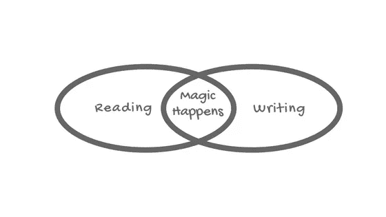
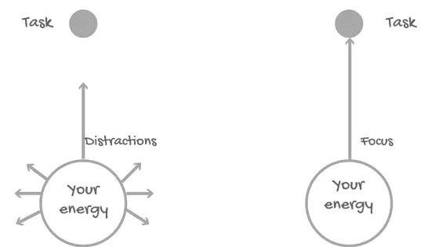

# 想当博主或者作家？立即培养这 7 种行为

> 原文：<https://medium.com/swlh/want-to-be-a-blogger-or-writer-develop-these-7-behaviors-immediately-1e920a63701d>

你想写博客吗？你想写吗？

但是你发现写作很难，有什么东西在拖你的后腿…

那么这篇文章就送给你了。

不管你的职业是什么，你都可以写作。你只是需要一种写作的欲望。

大多数新的博客作者和作家寻找一些快速的提示和技巧来提高他们的写作技巧，如语法，句子结构，校对等。

我把这些外部因素称为 T1，它们在实现写作目标的过程中只占 20%。

但是我们忘记了占 80%的因素——我称这些为**内部因素**。

在这篇文章中，**我们将讨论我在博客之旅中了解到的一些内在因素**。我也采访了一些成功的作家(和我的好朋友)，他们和我分享了他们最好的写作建议。

这篇文章是写给认真写作和写博客的人的。如果你是那种在乎的人，请继续阅读。看看这 7 个对我有帮助的写作行为，我相信它们也会对你有帮助。但是你需要采取行动！

# 1.养成写作习惯和常规(这创造了一种魔力)

如果你一周只去一天健身房，你可能会塑造你的身体。

如果你一个月只练两三天棒球，你不会成为一名优秀的棒球运动员。

如果我们想提高我们在某方面的技能，我们必须养成一种习惯。写作也是一样，你不会从第一天起就成为一个好作家。

就在几天前，我的一个好朋友问我:*“为什么写作过程对我来说如此具有挑战性，而对你来说却更容易？我想写，但是不知道需要从哪里开始？*

我告诉她这没有什么秘密，我只是养成了每天写作的习惯。

如果你有 10 分钟的空闲时间，写下**。**

你不需要在一天内写一本书。从小处着手。

定下每天写 100 字的目标。下周再加 100 字。下周再加 100 个…

这将有助于你形成一个常规。记住，如果你想提高你的写作水平，你必须从今天开始写。

亚历克斯·林伯格说:“最重要的事情是实际去做，坐下来尽可能多地写作。”

没有人有完美的[公式来写出适合每个人需求的伟大作品](https://www.ridethepen.com/writing-prompts/)。我的套路是什么？

我早起上班前投入 500 多字，下班回来投入 500 多字。我总是在身边放一个小笔记本，这样我就可以记下醒来后想到的想法。在开始写作之前，我想象自己坐在椅子上，开始写作。我在脑海中创造了一个视觉场景。这是我的例行公事。

习惯使作家成为作家。坚持下去，想出适合自己的套路。

[**内森·埃勒林**](https://twitter.com/njellering) **说得好:**

> 对于新作家，我建议一步一步来。想想你最喜欢的音乐家。我是金属乐队的柯克·汉梅特。我保证那家伙不会在第一天就拿起吉他，用他现在的方式弹奏。他演奏，他练习，他努力变得像今天一样熟练。"

# 2.尽可能多的阅读(第一条规则)

“如果你没有时间阅读，你就没有时间(或工具)写作。就这么简单。”—斯蒂芬·金

你想提高你的写作水平吗？

规则只有两条:**大量阅读。而且写的很多。**

开始写作之前，[先成为读者](https://www.theguardian.com/books/booksblog/2010/mar/02/best-advice-writers-read)。养成阅读习惯。

我从小就是一个狂热的读者，这个习惯真的帮助我写得更好。在家，车站，睡前，早上，甚至身体不舒服的日子，我都在看书，看杂志。我每月阅读 3-4 本书。

大多数成功的作家都是狂热的读者。而且即使你不想写，对你个人发展来说，这仍然是一个好习惯。

你一定在问，为什么阅读如此重要？

对吗？

你作为读者学到的东西，你作为作家会用到。

它帮助我们成为一个好的健谈者。

阅读鼓励我们向世界展示我们的声音。

阅读有助于提高我们讲故事的技巧。

它提高了我们的创造力和想象力。

它让我们作为读者思考，这是我们需要写的。

它提醒我们，一致性是写好文章的唯一关键。

我们关注作家对文字的处理。

阅读帮助我们变得更有效率。

[**山姆赫尔利**](https://twitter.com/Sam___Hurley) **说得最好:**

> 尽可能多读书。还有练习！阅读大量其他博客肯定也有帮助。有这么多不同的风格你可以把握！当你阅读时，一定要记住你是为了学习而阅读……要深思熟虑；告诉你的大脑这就是你阅读的原因。有目的地消化页面上的每个单词。随着时间的推移，你会自然地学会更多，并创造出自己的风格。

现在拿起一本书，开始阅读。有空的时候不要只是偶尔看看。让它成为一种习惯。

# 3.写作是一种承诺(像对待工作一样对待它)

写作不仅仅是一种爱好或者你感兴趣的事情。

写作是一项血腥的工作，需要你的投入。没有借口。

你的承诺将你的努力转化为成果。如果你想成为一名优秀的作家或博客作者，就像对待其他工作一样认真对待写作。

告诉我，如果你想什么时候上班就什么时候上班，会发生什么？或者一个月中的某几天？

你会被解雇的，对吗？

像你的工作一样，写作应该有一个常规或时间表。

就在前几天，我的一个好朋友给我打电话，说我们喜欢的歌手在市里有演出，我们去吧。但是我必须完成一个写作项目。

我说，“对不起，兄弟。我要工作(写作)，老板(我)不允许。”

我认为写作是一项工作，在完成工作之前，我从不允许自己离开。

# 4.动笔之前先思考一下(这会提高你的速度)

我的一些读者和朋友经常告诉我，“我花太多时间写东西。”

这种想法让他们得出结论:**我不会写**。

听起来很熟悉？

如果你打算写一篇文章，那么让我告诉你一件事:**动笔之前先思考一下**。

一个想法突然出现在你的脑海中，你打开笔记本电脑开始写作。千万不要做。这让你的速度很差。

写作时不要思考。

首先，想想你要写什么。第二，你的文章要涵盖的内容。用纸和笔写一个文章的大纲。做一些研究。开始写作前准备一份草稿。在脑海中勾勒出一个轮廓。这将有助于你只关注大纲。开始写作。

[**Zdravko Cvijetic**](https://twitter.com/iamzdravko)**与我分享他的拍摄**，

> 有三个，首先以一种感觉就像你在和一个朋友交谈的方式写你的文章。从写“我”转移到写“你”,你会看到与读者的互动大大增加，你的文章也会有所收获。最后，至少要做这三件事:娱乐、提供实际内容和激励行动。

# 5.关注数量胜于质量(完美会扼杀你的写作)

**看什么** [**大流士·福禄有话说**](https://twitter.com/DariusForoux) ，

> 重数量轻质量。很多时候，作者在一篇文章上花了很多时间。没那个必要。你写得越多，你就变得越好。

我们身边的人总是谈论质量。但我相信我们只能通过数量来实现质量。我经历过。

一年前，我做了一个简单的决定，在一个月内每天发表一篇文章。因为这是个小目标。可实现且可衡量。然后我再加一个月。

我每天都写作。不管怎样。

新年前夜？我写作。

我的生日？*我写作。*

我变冷了？*我写作。*

我觉得幸福？我写作。

我觉得难过？*我写。*

我没有灵感？*我写。*

有时候我发现我写的东西并不完美，但我还是发表了。因为我不允许自己在那一个月里错过一天。它帮助我写得更好。

永远不要考虑完美，它会扼杀你的写作。不要为别人做。为了你自己。你会达到质量。

**看什么**[**Yann Girard**](https://twitter.com/girard_yann)**有话说**，

> 人们很容易陷入总是必须交付优秀作品的陷阱。这是一个陷阱，因为没有人能不断创造伟大的作品。事实上，你的大部分作品都不怎么样。这将会击垮我们大多数人。只出版伟大作品的愿望。

# 6.展示你的风格(并思考你的价值)

[**Meera kot hand**](https://twitter.com/MeeraKothand)**分享了她对新作家的建议:**

> 想想你的不同点。作为一名作家，你能带来什么？努力敬畏你的观众，或者用你的内容给他们一个灵感。你的写作应该会产生影响。你能毫不费力地引入幽默吗？你能激发出不同的观点吗？

上个月，我和我哥哥做了一道菜。他用他的方式做，我用我的方式做。风格不同。口味不同。

我没说品味差也没说品味好。我说口味不同。

每个人都有独特的风格。每个人都有独特的声音。写作也是一样，不要害怕展示你的声音。想想你在信息中传递了什么价值。

也许你和我一样，母语不是英语。不过没关系。不需要用知性的词语。用简单的单词和句子传达你的信息。

[**蒂芙尼孙**](https://twitter.com/misstiffanysun) **与我分享了她的拍摄**，

> 如果你是一个新作家，不要害怕展示自己。这个世界缺乏真正的声音，所以如果你能从所有遵守学校规则的人中脱颖而出，你会更快得到认可。

# 7.关掉你的手机(和其他干扰)

我的一个朋友总是谈论写作。但是她从来没有时间写作。她总是告诉我，“我不能专注于写作，我很容易分心。”

听起来很熟悉？

但如果你想完成一些写作，你必须与写作(或者几乎每一部作品)的最大敌人作斗争:**分心**。我们生活在令人分心的世界里。

**见什么** [**瑞安罗宾逊**](https://twitter.com/TheRyanRobinson) **就是说**，

> 我给那些努力完成重点写作的作家的建议是，在你的日历上安排好这段时间。身体上为它腾出时间，然后兑现这个承诺——关掉手机，避开社交媒体，只是写作。

你有了一个想法，为你的文章写了一个提纲。你受到启发，准备好写作了。你的手机响了，你的朋友给你发了条短信，你开始发短信。

我们认为发几秒钟短信或查看一分钟社交媒体是无害的。

但现实是？

这会分散你的注意力。你已经失去了你的焦点。你在浪费时间。解决方法是什么？

**关机**。关掉你的社交媒体。不要查看邮件。

当我写这篇文章的时候，我已经[关闭了我的手机](/the-mission/how-scheduling-distraction-breaks-strategy-help-me-to-focus-more-e206ad3a69cd)(我在工作的时候不会把手机放在眼前)。

有时候我的朋友和家人会因为联系不上我而生我的气。很难。但是写作需要你全神贯注。分心会降低工作效率。

# 结论

审视自己，总是问自己一个问题:“是什么在拖我的后腿？”

永远不要停止学习。Robbie Richards 说:“把写作作为一种工具来培养你的技能，并与那些会继续推动你前进的人联系。”。

我认为写作就像学自行车。你的父母可以教你所有该做的和不该做的。但是你永远也学不会，除非你不打算把自己释放到开阔的道路上。

**我的朋友** [**普里扬卡·德赛**](https://twitter.com/priyankaddesai0)说得好:

> 坚持写。每篇文章都会让你变得更好。观察你所在行业中最优秀的人是如何写作的。让你的语气和风格具有原创性，但要确保你的帖子有洞察力，有读者在别处找不到的要点。

去吧。开始写

# 行动起来！

**谢谢**听了这个故事。如果你喜欢这个故事，点击👏按钮，并与他人分享！

## 你想要成功作家的个人写作建议和故事吗？[获取您的免费副本](http://prepawan.com/just-write/)。

*原载于*[*prepawan.com*](http://prepawan.com/7-writing-behaviors/)

## 这个故事发表在 [The Startup](https://medium.com/swlh) 上，这是 Medium 最大的企业家出版物，拥有 360，974+人。

## 在此订阅接收[我们的头条新闻](http://growthsupply.com/the-startup-newsletter/)。

