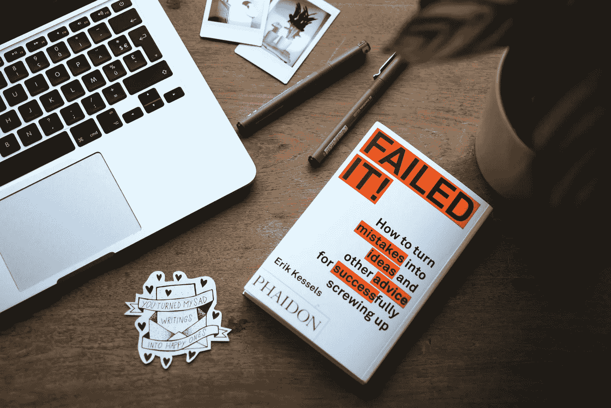

# 想成为企业家？找一个导师

> 原文：<https://medium.com/swlh/want-to-be-an-entrepreneur-find-a-mentor-c38546bff952>

Regular one on one mentoring meetups saved me on numerous occassions

公司创始人和企业主是一类特殊的人。

作为一名企业家，你不断寻求改变，想要有所作为，激励他人，并且永远不会对你周围的世界感到满意。

## “企业家有颠覆的内在动机”

每个企业家都需要具备的一些特质:

> “你对你所做的事情持之以恒，**不怕犯错误，你是一个开放、平易近人的**沟通者”****

对我来说，这些个人特质是任何想成为企业家的人的先决条件。

但是在过去的十年里，我发现真正让我进步的最重要的事情之一是**与伟大的导师**一起工作，人们有自己的观点。

> “如果我能给你一个建议:找一个以前犯过错误的人，仔细听他们的故事”

你不需要事事亲力亲为。

如果你愿意接受他们的建议并倾听他们的意见，你周围的人会非常乐意帮助你。

当然，这需要你很大的耐心，因为你想做出改变。

但是，倾听那些曾经犯过错误、可能试图扰乱你正在努力解决的行业的人的意见，将真正帮助你避免不必要的陷阱。

avoid unnecessary mistakes and ask your mentor for advice

> “针对不同的主题，你可以有不同的导师”

没有人说过，你需要长时间单独跟踪一个人，才能获得你需要的洞察力。

作为一名企业家，你可以真正受益于与来自不同背景的各种不同的人定期接触，这些人可以帮助和指导你。

仅仅是每隔几个月左右和某人见一次面，就已经能给你所需的洞察力和输入，让你朝着正确的方向前进——甚至让你意识到是时候改变了。

> “加入指导计划或加速器”

特定行业的指导计划真的可以产生巨大的影响。

当你还在大学的时候，问问你的教授和创新实验室，如果他们能帮你安排导师会议的话。

你不必拘泥于那个你已经听了两三年的教授。

为什么不试着扩大你的人际网络，和一两个其他人交谈呢？

**加入加速器计划也能让你获得你需要的行业人脉。**

这些项目通常固定在 3 到 6 个月的某个时间段。有些甚至更短。

与其他初创企业、志同道合的人以及之前已经这样做过的人分享你的见解，对于长期的商业成功绝对至关重要。

> “自己成为导师，帮助社区，你也会从中受益匪浅”

在过去的两年里，除了我的常规工作之外，我还一直在辅导和指导年轻的企业家和初创企业。

**我参与的一个项目是苏黎世的 Nexussquared 国际区块链项目**

看到今天有这么多聪明、有动力、年轻的人才试图在他们真正热爱的行业有所作为，这很棒，也很鼓舞人心。

我相信，作为一名导师，我能做出的最大贡献不是告诉别人他们应该如何经营或开展业务，而是告诉他们我如何努力做好自己的工作。

> “一个好的导师会公开地与你分享他的错误以及他思考和看待世界的方式”

**你必须决定如何经营自己的企业。为了做到这一点，你需要尽可能多地从你周围知识渊博的人那里获取信息。**

你将不得不犯自己的错误。相信我，如果你做得对，你会犯很多错误。

你需要很大的勇气来创建自己的公司，并开始一些从未有人做过的事情。

但根据我的经验，不要试图独自完成。

> “如果你真的想颠覆一个行业，你需要所有的建议和帮助。”

成为一名颠覆者比仅仅经营一家年轻的小公司需要更多的知识和勇气。

如果你相信你已经具备了改变一个行业甚至社会的条件，那么尽可能多的去接触。

你们一起将能够实现它。

感谢您阅读这篇文章，我非常感谢您的回复。如果你喜欢它，请让我知道。

最佳，[雷姆科·利万](https://medium.com/u/522fc96b0657?source=post_page-----c38546bff952--------------------------------)

*欢迎关注我，获取更多第一手创业建议、技术讲座、技巧和诀窍*

## 这篇文章发表在《T8 创业》(The Startup)杂志上，这是 Medium 最大的创业刊物，拥有 311，185 名读者。

## 在这里订阅接收[我们的头条新闻](http://growthsupply.com/the-startup-newsletter/)。

