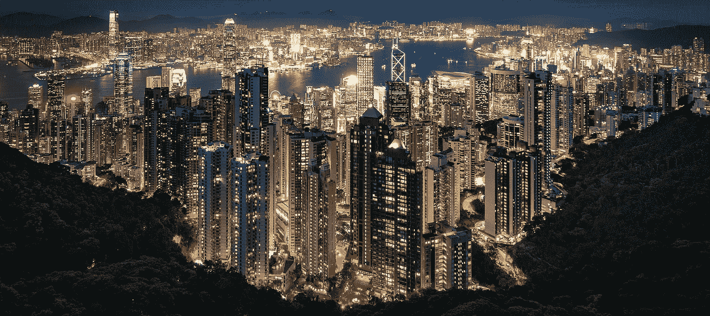

# 想要更有创意？嗨起来。

> 原文：<https://medium.com/swlh/want-to-be-more-creative-get-high-4ea92c66ca54>

Photograph by Nathaniel Parker via Pixabay

无论是像卡波特、凯鲁亚克和契弗这样酗酒的作家[，](http://listverse.com/2008/01/22/top-15-great-alcoholic-writers/)[像巴赫、贝多芬和巴尔扎克这样咖啡因过量的创意者](http://mentalfloss.com/article/67232/15-famous-coffee-fiends)，还是像詹尼斯·乔普林、吉姆·莫里森和柯特·科本这样吸毒成瘾的摇滚歌手，醉酒艺术家的形象仍然是创意阶层神话中的一个强有力的主题。

现在，我们可以讨论一下，在成就卓越的创意者中，对改变思维的物质的偏好是否是一种…