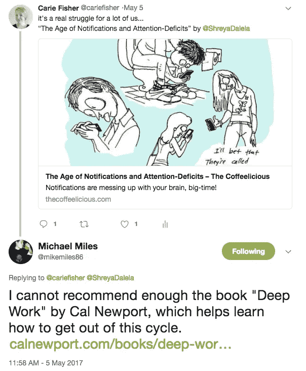

# 想要更有效率？花点时间闻一闻玫瑰花香

> 原文：<https://medium.com/swlh/want-to-be-more-productive-take-time-to-smell-the-roses-3606297fffb3>

## 如何脱离技术实际上可以帮助您提高生产力

我认为自己是一个相当高效的人，但当我把每天写作作为个人目标时，我很挣扎。每当我有空闲时间写东西，一些文字，一些平，一些更紧急的事情总是出现。几个月来，我几乎没有形成超过几个句子，当然没有完成一个故事。

我很快意识到改变日常生活是很棘手的，尤其是当生活和工作以及如此多的懒惰礼物阻碍你的时候。但是我没有制定行动计划，而是做了任何一个[理智的 xennial](https://hackernoon.com/confessions-of-a-middle-aged-techie-21e704cda942) 都会做的事情——我在 Twitter 上抱怨这场斗争。

幸运的是，当我那次对着虚空尖叫时，有人回应了。

我的同事[迈克·迈尔斯](https://twitter.com/mikemiles86)建议我读一读卡尔·纽波特的书[深度工作](https://www.goodreads.com/book/show/25744928-deep-work)，以便更深入地了解如何在我们这个注意力分散、痴迷于技术的世界中专注于任务/问题。在书中，纽波特提供了许多不同的方法来摆脱束缚，成为一个更深入的思考者。

虽然纽波特建议的一些方法对大多数人来说是不切实际的——休假几个月，把自己关在森林深处的小木屋里，就像亨利·大卫·梭罗一样。其他方法更合理一些——在一天中拨出一定的时间，或者留出一定的时间来进行更深入的思考和项目。

我决定尝试阶梯选项，看看我的写作效率水平是否会提高，假设我的家人不希望我成为一个森林隐士。

## 深度思考带来生产力

牛顿的书和我读过的许多关于这个主题的文章的核心是,[生产力基本定律](http://knowledge.wharton.upenn.edu/article/deep-work-the-secret-to-achieving-peak-productivity/)陈述:

**(花费的时间)x(专注的强度)=高质量的工作成果**

如果你认同这个理论，你可以假设提高你的注意力，减少在一项任务上花费的时间，同时不牺牲质量。

> “为了达到最佳状态，你需要长时间全神贯注地工作，不受干扰地完成一项任务。”— [亚当·格兰特](http://knowledge.wharton.upenn.edu/faculty/grantad/)

这是一个特别好的消息，因为生产力专家已经发现，我们深入思考的能力是一种有限的资源，我们的大脑并不是为了一整天八小时而构建的。一些研究表明，即使是最先进的深度思考者每天也只有四个小时的好时光——那么这对我们其他人来说意味着什么呢？假设我们都想最大限度地利用我们的时间，提高我们的生产力——我们如何从新手变成专业的深度思考者？

Adapted image showing a Pavlovian response to notifications. [Get the real poster here from Lili Chin](https://www.doggiedrawings.net/freeposters).

## 抛开杂念休息一下

技术的禅是很难获得的。我可以承认，懈怠的 pings 和 Twitter 通知让我产生了巴甫洛夫式的反应。就像著名实验中的狗一样，我已经习惯于尽可能快地对噪音/视觉线索做出反应，以获得我的奖励。你的分心机制可能不同，但你的反应可能是相似的。

对一些人来说，总是保持联系是一种瘾——一根棍子末端的胡萝卜，你永远不会吃；你把一块西西弗巨石推上山，却只能看着它再次滚下来。一条又一条的帖子、一条又一条的短信、一条又一条的信息，这种无休止的循环可能会让人精疲力尽——但我们还是坚持这样做，部分原因是因为我们的无意识条件反射。这怎么会有成效呢？

> “要想在深度工作中取得成功，你必须重新连接你的大脑，让它能够舒适地抵抗分散注意力的刺激。这并不意味着你必须消除分散注意力的行为……相反，消除这种行为劫持你注意力的能力。”— [加州新港](http://calnewport.com/)

根据一项流行的生产力研究，研究人员发现理想的工作休息比是专注工作 52 分钟，然后休息 17 分钟。在这 52 分钟的工作中，有一个基本的规则——远离任何和所有让你分心的技术。这意味着，不要查看社交媒体、电子邮件、短信、语音信息或即时消息。基本上，假装世界末日发生了，所有的通讯线路都中断了。

这听起来可能很容易，但以一致的方式完全拔掉插头是非常困难的，尤其是如果你已经习惯于在每个通知到来时都跳起来。休息需要有意识的努力，但在这样做了几个月后，我可以说随着时间的推移会变得更容易。

当我拔掉插头时，我发现最令人惊讶的事情是，当我处理更复杂的任务时，我变得多么有效率。通过从世界次要的分心事物中抽离出来，你将允许自己更深入地钻研手头的主题或问题。随后，这将提高你的整体生产力。或者至少，让你更理智一点。

## 学会无聊

人们无聊时做的第一件事是什么？检查他们的手机。承认吧，是你干的。我做到了。我们都这样做。在商店排队，等待下一次会议开始，在健身房锻炼，甚至坐在马桶上…真的在任何平凡的任务中，我们都在使用手机。事实上，普通人一年中有 23 整天都在手机上度过。无聊的艺术哪里去了？

根据众多的[神经学研究](https://centerhealthyminds.org/about/overview)，学会无聊可以增强我们的注意力，调节我们的情绪，增加同情心。除了这些好处，当你放下手机时，你允许你的大脑休息，下意识地解决问题，这最终可以提高生产力。

> “无所事事不仅仅是一个假期、一种放纵或一种恶习；它对大脑来说是必不可少的，就像维生素 D 对身体一样，没有维生素 D，我们会遭受像佝偻病一样的精神痛苦……矛盾的是，它是完成任何工作所必需的。”— [蒂姆·克莱德](http://timkreider.com/)

潜意识解决问题和无聊之间的联系不是一个新现象，而是哲学家和科学家已经讨论了一段时间的事情。

我们的潜意识往往比我们的意识更善于解决问题，其中一个主要原因是因为它明显较少受到规则和协议的约束。你读过多少这样的故事:一个发明家/科学家/艺术家在做一些平凡的事情，比如洗澡的时候，想出了一个绝妙的主意？有多少天才的想法是在没有积极思考实际问题的情况下产生的？我敢打赌相当多。

通过让你的大脑有些无聊，有些安静，有些专注，你可能会想出一个新的解决方案来解决这个一直困扰你的复杂问题。试着无聊一会儿。这比看起来要难。一旦你掌握了几分钟，尝试一个小时，一天，一周，看看你能解决什么问题，你的日常生产力如何受益。

## 重新连接你的非虚拟生活

找到真正的工作/生活平衡可能很难。这是我个人非常纠结的事情——我的网络生活和现实生活之间的平衡。起点和终点之间的界限经常令人困惑和模糊，尤其是当你在一个远程团队工作，而你的办公室也是你的家的时候。与真实生活重新联系的一个简单方法是到大自然中去。

根据密西根[大学](http://journals.sagepub.com/doi/abs/10.1111/j.1467-9280.2008.02225.x)的生态心理学实验，花时间与大自然交流可以提高你的生产力。在实验中，学生们被要求研究随机数字的列表，以相反的顺序背诵它们，并记住排列在网格中的某些单词的位置。

> “深入观察自然，然后你会更好地理解一切。”— [阿尔伯特·爱因斯坦](https://en.wikipedia.org/wiki/Albert_Einstein)

在这些深入思考的任务之后，一半的学生被允许在植物园的一条小路上漫步，而另一半则在安阿伯的一条繁华的街道上漫步。当再次测试时，在树林中漫步的学生比第一次测试时多回忆了 1.5 个数字；而那些步行穿过城市的人只提高了 0.5 位数。与自然联系有很多美妙的理由，但是谁知道生产力是其中之一呢？

整个工作/生活平衡等式的很大一部分是生活的**部分**。因此，重要的是要拔掉插头，花时间和真实的生物在一起。当你与大自然重新联系时，你会发展更深层次的思考技能，这将有助于你更有效率，从而让你有更多的时间花在户外。这是一种循环模式，有益于你的精神、身体和情感健康——可能会让你在工作中更有效率。所以别找借口了，出去放风筝吧。

> 当我们花更多的注意力(而不是时间)在一个任务/问题上，忽略不必要的分心，拥抱无聊，与自然交流，我们会获得更有成效和更满足的生活。

*❤如果你喜欢这篇文章，请点击“鼓掌”图标(次数不限)，在社交媒体上分享这个故事，并在* [*上关注我*](/@cariefisher/) *或*[*Twitter*](https://twitter.com/cariefisher)*！谢谢你和快乐的 reading❤*

## 这个故事发表在 [The Startup](https://medium.com/swlh) 上，这里有 263，100+人聚集在一起阅读 Medium 关于创业的主要故事。

## 在这里订阅接收[我们的头条新闻](http://growthsupply.com/the-startup-newsletter/)。

