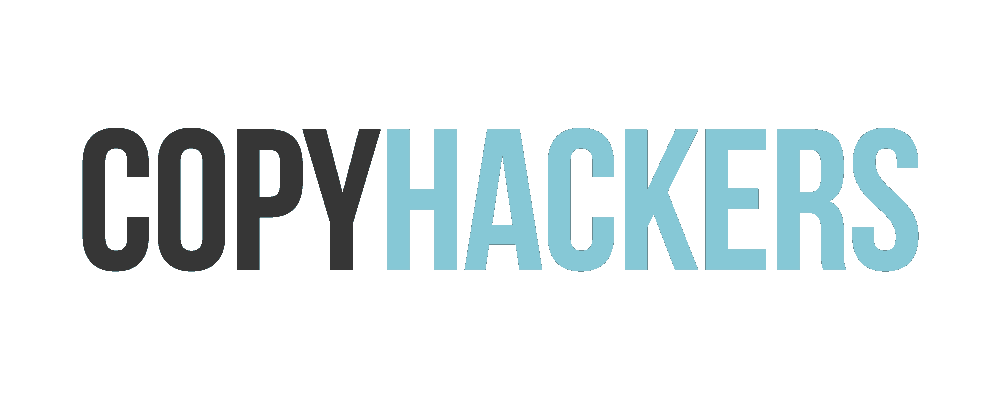

# 想成为文案高手？看看这 5 本很棒的书和在线课程

> 原文：<https://medium.com/swlh/want-to-become-an-expert-copywriter-check-out-these-5-awesome-books-online-courses-d32bcda93688>

在社交媒体、电子邮件、博客、电子书等等之间，书写文字在我们日常生活中的作用越来越明显。因此，撰写引人注目的文案的能力也比以往任何时候都更受欢迎。

虽然人们阅读文案的心理没有改变，但作为一名文案意味着什么却已经改变了。不可否认，自大卫·奥格威时代以来，我们今天交流的平台和我们使用的一般策略已经发生了变化，使得许多经典的文案书籍对于 2018 年的市场来说有些不完整。

从登陆页面到 YouTube 视频脚本到脸书广告，2018 年的文案有很多事情要做。为了帮助你在这一领域游刃有余，成为一名为当今竞争激烈的市场做好准备的文案专家，这里有五本书和五门课程你应该看看。

# 1.盗版黑客周二教程

[*教程周二*](https://copyhackers.com/tutorial-tuesdays-copy-hackers/) 是一个免费的每周网络研讨会系列，由 Copyhackers 的创始人[乔安娜·维贝](https://medium.com/u/58a844d8d962?source=post_page-----d32bcda93688--------------------------------)教授。就个人而言，这个系列是我如何跟上文案撰写者必须掌握的*新*媒介的来龙去脉的，无论是 Twitter 广告、网站文案、销售电子邮件还是其他相关的东西。

Copyhackers 在推出高质量、信息丰富的内容方面做得很好，这些内容可以作为许多文案主题的百科全书——对细节的同样关注也反映在周二的*辅导中。*

# 2.莱恩·史密斯的《我的课程》

莱恩·史密斯是一位成功的广告文案，他的职业生涯跨越了几十年。他把自己多年来学到的所有经验都写进了一门名为 [*文案秘笈——如何写出能卖出*](https://www.udemy.com/copywriting-secrets/) 的文案的 Udemy 课程。这门课程定价 89.99 美元，实际上是它让我对文案产生了兴趣，也是我第一次学会如何撰写引人入胜的标题的地方。如果你想通过精彩的标题写作来提高你的打开率，这个课程几乎有你需要知道的一切。

我喜欢的 Len Smith 材料的另一个方面是，它围绕 B2B(企业对企业)文案撰写，而不是 B2C(企业对消费者)。因为很多文案工作都是为 B2B 公司做的，有白皮书、案例分析等等，所以了解文案风格的基本原理很重要。

# 3.约瑟夫·舒格曼的《广告周刊文案手册》

谈到直接回应营销，很少有偶像比约瑟夫·舒格曼更有成就，这使他更有资格成为《广告周刊》文案“圣经”的作者。这本书已经成为我经常参考的包罗万象的教科书，以解决我对文案写作基础的任何和所有问题(我在页边空白处潦草的笔记完全证明了这一点)。

虽然这本书定价 17.93 美元，不是专门为 2018 年量身定制的，但书中阐述的原则和经验可以普遍适用于各种平台，从电子邮件营销到 LinkedIn 帖子。

# 4.丹·肯尼迪的[终极销售信](https://www.amazon.com/Ultimate-Sales-Letter-Attract-Customers/dp/1440511411)

你可能认为销售信函已经过时，但事实是这种风格以销售邮件、宣传册等形式存在，所以掌握撰写令人难忘的销售信函的原则是值得的。通过学习如何做到这一点，你将会看到邮件打开率、点击率和最终转化率的飙升。当我告诉我的一位导师我正在发行一份电子邮件简讯时，他坚持让我读的唯一一本书是《T4》。今天，我仍然把我几乎所有的电子邮件营销知识归功于丹·肯尼迪。

# 5.[社交媒体文案:如何为 Hubspot 的 5 个不同频道撰写文本](https://blog.hubspot.com/marketing/social-media-copywriting)

社交媒体文案是 2018 年最相关的文案形式之一。如果你不知道如何在你的社交媒体帖子中写下引人注目的微型副本，你可能会错过一笔不可思议的收入。

虽然上面的资源不完全是一门课程或一本书，但它是一个完整的支柱内容，可以很容易地扩展为一门完整的课程。如果你想增强你的社交媒体文案游戏，这篇由 [HubSpot](https://medium.com/u/8732e73183e5?source=post_page-----d32bcda93688--------------------------------) 撰写的文章将会值得你花时间，而且是完全免费的。当我的“门徒”刚开始做社交媒体文案时，我要求她阅读这篇文章，这让她快速有效地跟上了进度。

在今天的市场上，谈到你的手艺，你必须是一把瑞士军刀。从脸书的帖子到视频脚本，再到登录页面的文案，你必须能够说服读者采取行动，不管他们发现自己在用什么媒介写作。

不管你在职业生涯的哪个阶段，在接下来的几周里花些时间梳理一下这些资源。你会很高兴你做了。祝你好运。

# 行动呼吁

如果你想让自己在社交媒体上尽可能处于成功的最佳位置，看看我的小册子:《成功社交媒体营销的 7 种心态转变》 ***】。***

*原载于 2018 年 7 月 30 日*[*www.inc.com*](https://www.inc.com/dakota-shane/learn-how-to-sell-your-business-with-these-5-copywriting-books-online-courses.html)*。*

## 这篇文章发表在 [The Startup](https://medium.com/swlh) 上，这是 Medium 最大的创业刊物，拥有+ 372，020 名读者。

## 在这里订阅接收[我们的头条新闻](http://growthsupply.com/the-startup-newsletter/)。

