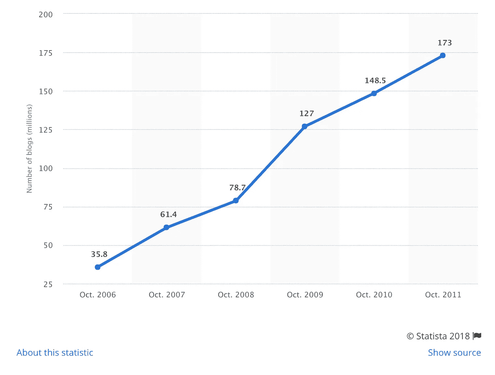
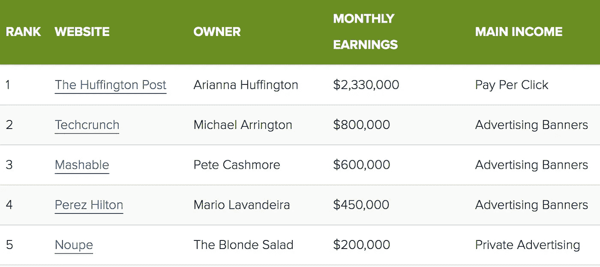

# 19 个不可否认的统计数据帮助你建立一个成功的赚钱博客

> 原文：<https://medium.com/swlh/want-to-build-a-successful-blog-heres-your-moment-of-truth-bd76cdb51513>

## …你有足够的决心去取得成功吗？

Photo by [Josh Hild](https://unsplash.com/photos/WjZ4eaHq9G4?utm_source=unsplash&utm_medium=referral&utm_content=creditCopyText)

也许这是你年轻时的梦想:

*   也许你已经写作了一段时间，最近你意识到你真的可以利用你的在线内容做生意。
*   可能你对朝九晚五的繁琐工作感到难以置信的厌倦(就像我一样),你想要自由的生活。

不管是什么原因，很多人都希望把他们的才华带到网络上，并利用他们制作的任何内容来赚钱，*独立引擎。*

让我们来看看开始和实现一个成功的、赚钱的博客的真相和事实…

# 在线商务、博客和内容写作的统计

Photo by [Chris Liverani](https://unsplash.com/photos/dBI_My696Rk?utm_source=unsplash&utm_medium=referral&utm_content=creditCopyText)

现在，比以往任何时候，进入你的网上声音成功赚钱的门槛比以往任何时候都低。在 2018 年，你甚至不一定需要购买域名和托管平台来让你的想法出来(咳，咳……[中](https://medium.com/u/504c7870fdb6?source=post_page-----bd76cdb51513--------------------------------))。

让我们来看看在线内容生成的一些统计数据:

## 关于博客的统计数据:

1.  据统计，仅 2011 年一年，全球就有 1.73 亿博客作者。

Source: [Statista](https://www.statista.com/statistics/278527/number-of-blogs-worldwide/) (number of bloggers up 600% in the 5 year span)

*   这一数字将持续增长到 2018 年及以后。

## 关于博客作者收入的统计:

并非所有的博客都是平等的。来自[*Blogging.org*](https://blogging.org/blog/blogging-stats-2012-infographic/)的统计数据显示，这个行业内的赚钱能力差异很大…

2.2%的博主每天花不到 2 个小时写博客，收入超过 15 万美元(像蒂姆·费里斯)。

3.17%的人能够通过博客维持他们的生活方式或支持他们的家庭。

4.81%的人从未通过写博客赚到 100 美元。

5.此外，收入排名前五的博客如下:

(Source: [IncomeDiary](http://www.incomediary.com/top-earning-blogs))

## 潜在受众的统计数据:

6.32 亿人——占世界人口的 40%——是互联网用户:发达国家 10 个人中有 8 个人在使用互联网，发展中国家 61 个人中有 21 个人在使用互联网。*(来源:* [*ICT 事实&数字*](http://www.itu.int/en/ITU-D/Statistics/Documents/facts/ICTFactsFigures2015.pdf) *，2015)*

7.每个月有 3 . 29 亿人阅读博客。*(来源:*[*newsred*](http://www.slideshare.net/NewsCred/50-best-stats-presentation)*)*

8.47%的人上网学习提高自己，近三分之一的人上网寻找自助专家或书籍。*(来源:***)**

*9.44%的人上网创建或更新博客，42%的人上网阅读他人的博客。*(来源:* [*美通社*](http://www.prnewswire.com/news-releases/new-study-of-online-behavior-focuses-on-user-intent-underscores-need-for-new-approaches-in-digital-communication-61909487.html) *)**

*10.90%的消费者认为客户内容有用。*(来源:***，2014)***

**11.88%的消费者对网上评论的信任程度不亚于真人的个人推荐。 *(* [*搜索引擎登陆*](http://searchengineland.com/88-consumers-trust-online-reviews-much-personal-recommendations-195803) *，2014)***

**12.81%的美国在线消费者信任来自博客的信息和建议。*(来源:*[*BlogHer*](http://www.blogher.com/women-and-social-media-2012)*)***

**13.61%的美国消费者根据博客帖子进行过购买。*(资料来源:* [*布洛格尔*](http://www.blogher.com/women-and-social-media-2012) *，2012)***

**14.34%的人在网上购买商品。*(来源:* [*美通社*](http://www.prnewswire.com/news-releases/new-study-of-online-behavior-focuses-on-user-intent-underscores-need-for-new-approaches-in-digital-communication-61909487.html) *)***

## **关于如何建立一个成功的博客的统计数据**

**15.如果一个博客超过 1500 字，平均来说，它会多收到 68.1%的推文和 22.6%的脸书赞。*(来源:* [*快速发芽*](http://www.quicksprout.com/2012/12/20/the-science-behind-long-copy-how-more-content-increases-rankings-and-conversions/) *)***

****

**Building the [empire](http://i.imgur.com/hM9lqGh.gif) step-by-step**

**16.博客次数≥ 20 次/月的企业获得的流量是博客次数≤ 4 次/月的企业的 5 倍。*(来源:* [*轮毂*](http://blog.hubspot.com/blog/tabid/6307/bid/33742/12-Revealing-Charts-to-Help-You-Benchmark-Your-Business-Blogging-Performance-NEW-DATA.aspx) *)***

**17.82%每天写博客的营销人员通过他们的博客获得了客户，相比之下，57%每月写博客的营销人员获得了客户。*(来源:* [*进站状态*](http://blog.hubspot.com/marketing/2013-inbound-marketing-stats-charts) *，2013)***

**18.一旦你写了 21-54 篇博文，博客流量会增加 30%。*(来源:***)****

**19.盈利博客每月从广告、联盟营销和销售产品中获得 10 多种收入。*(来源:* [*博主*](http://bloggerspassion.com/bloggers-income-report-how-much-money-do-top-bloggers-make-and-how/) *)***

# **现在是你的关键时刻…**

****

**Photo by [Jordan Whitfield](https://unsplash.com/photos/jxQFMN7xzJc?utm_source=unsplash&utm_medium=referral&utm_content=creditCopyText)**

**有超过一亿的博客读者，超过一半的互联网用户在作出购买决定之前会在网上搜索。有利润可赚。**

**但是这不会在一夜之间发生，只有不到 5%的博客每月收入超过 10，000 美元。**

**正如达伦·罗斯所言:**

> **“99.9%的优秀博客作者在第一天并不出色。他们的了不起是他们随着时间的推移创造的价值的积累。”**

**另一方面，一些人设法在舒适的沙发上全职谋生。**

**虽然没有“魔法酱”，但在这个游戏中保持一致才是真正重要的。你需要每天都出现——即使你不想出现。**

**一个伟大的博客是这样的人，他能够定期更新自己的博客，提供热门的内容，同时也是一个专业的营销者。**

**现在，这个世界比以往任何时候都更需要你的精彩内容，你需要把它放到世界上让人们去发现。**

**记住这些信息，请扪心自问:**

> **你能建立一个盈利的博客吗？**

**…或者仅仅是你是否有足够的决心去取得成功？**

# **👋🏻你好，我是乔恩**

**我是一个思考者，自由撰稿人和葡萄酒爱好者，写关于个人成长和心理优化的文章。我也鼓吹将你的作品货币化。**加入 1200 多名读者的行列**获得我的免费个人 6 天**“创业博客”**课程和我正在进行的时事通讯(你还将获得一份免费的 ***“如何撰写终极博文”*** ):**

****🚨** [**> >世卫组织还想当自己的老板吗？< <**](https://mailchi.mp/4b982beed325/free-6-step-course) **🚨****

****

## **这篇文章发表在 [The Startup](https://medium.com/swlh) 上，这是 Medium 最大的创业刊物，拥有+368，052 名读者。**

## **在这里订阅接收[我们的头条新闻](http://growthsupply.com/the-startup-newsletter/)。**

****