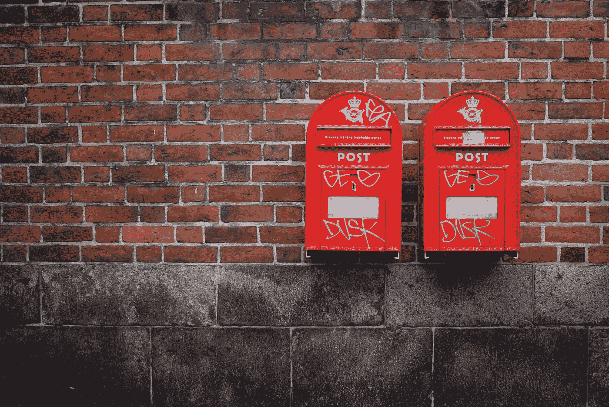

# 想建立一个成功的货币化博客？你的关键时刻到了。

> 原文：<https://medium.com/swlh/want-to-build-a-successful-monetized-blog-heres-your-moment-of-truth-5fd58b579e24>

## 用你的在线声音赚钱的常青树过程

Photo by [Eric Ward](https://unsplash.com/photos/uD0W-swVGgE?utm_source=unsplash&utm_medium=referral&utm_content=creditCopyText)

现在，将你的博客货币化基本上是在线商业的“圣杯”。

如果你是你所做的中的顶级执行者，并且你致力于追求它直到它有回报，这是难以置信地可以实现的。

 [## 如何绕过你所在行业的前 1%

### 世界未来顶尖高手手册

medium.com](/the-post-grad-survival-guide/how-to-bypass-the-top-1-of-your-industry-6bc56183e359) 

而且回报很大…

我会知道——我已经把我的网站变成了一台自动化的被动收入机器，并利用这种杠杆作用，通过我的自由职业来赚取额外的现金。虽然我还没有完全到达那里——但我现在比以往任何时候都更接近于生活在*的“舒适街”*

然而，到达舒适的街道一点也不容易。为此，我整理了一系列技巧、诀窍、策略和窍门，这些都是我在写作过程中学会的，有助于利用我的博客来完成这篇论文。

# 💰1.选择并坚持有利可图的利基市场

Photo by [Freddie Collins](https://unsplash.com/photos/uXWPg9uMwt8?utm_source=unsplash&utm_medium=referral&utm_content=creditCopyText)

> “一只啄木鸟可以在一千棵树上啄二十下，但却一无所获，只能继续忙碌。或者他可以在一棵树上敲两万下，然后得到晚餐。”
> ―塞思·戈丁

感谢像 [Medium](/@jonbrosio?source=your_stories_page---------------------------) 和 [Quora](https://www.quora.com/profile/Jon-Brosio) 这样的网站，我认识了这么多作家和博客。

我见过那么多人崛起。

我也见过很多人仅仅过了几个月就被遗忘了——太多了……

人不长久的原因是什么？

首先，他们放弃了。他们没有跑这场马拉松的耐力。没关系——我真的相信不是每个人都能在这个行业取得成功。抱歉我不抱歉。

对于其他人来说，这是因为他们谈论了太多的事情。

我明白了…随着信息的交流变得如此容易，人们可以学到很多东西并与世界分享。然而，这是你的败笔。

> 当你成为一件事的专家时，你就成了稀缺的奢侈品，当你变得稀缺时，你就变得有价值了。

什么样的利基市场是你们双方都感兴趣并有足够的经验去分享它的荣耀的？

这是建立你的赚钱博客的第一步，也是最重要的一步。

# 💰2.开始建立你的电子邮件列表

Photo by [Kristina Tripkovic](https://unsplash.com/photos/8Zs5H6CnYJo?utm_source=unsplash&utm_medium=referral&utm_content=creditCopyText)

获得浏览量、点击量、评论和流量是很棒的。

然而，如果你真的想从你的博客中赚钱，除非你建立一个电子邮件列表，否则你将一事无成。

构建一个优化的邮件列表有很多复杂的地方。我不打算在这篇文章中讨论这个问题，但是，我以前写过两篇关于这个问题的深度文章(你真幸运)。可以看看两篇文章[这里](/swlh/step-by-step-walkthrough-how-i-earned-my-first-dollar-and-more-blogging-6b85b9a0b56b)和[这里](/swlh/the-beginner-bloggers-guide-to-selling-their-first-ebook-e42c14a9fda1)。

 [## 逐步演练:我是如何赚到我的第一美元(和更多)的博客

### 我一直是个作家。

medium.com](/swlh/step-by-step-walkthrough-how-i-earned-my-first-dollar-and-more-blogging-6b85b9a0b56b)  [## 博客新手出售第一本电子书指南。

### 技巧和策略，如果应用正确，可以转化为你自己的成功，通过写作赚到$美元

medium.com](/swlh/the-beginner-bloggers-guide-to-selling-their-first-ebook-e42c14a9fda1) 

上面的故事也有助于创建你的渠道，让人们真正加入你的邮件列表。

**剧透提示:***“加入我的免费时事通讯，在那里我分享每周的故事并把它们直接发送给你”*作为一种策略根本不起作用…

作家兼企业家拉塞尔·布伦森强调了电子邮件列表的重要性，并举例说明了它的确切含义。他声称你的邮件列表是“你拥有的内容”**你可以直接控制所宣传的信息**(不像你不拥有的内容，读者可能会通过偶然事件接触到这些内容)。

# 💰3.问问你的观众他们想要什么

Photo by [Simon Abrams](https://unsplash.com/photos/k_T9Zj3SE8k?utm_source=unsplash&utm_medium=referral&utm_content=creditCopyText)

对你们中的许多人来说，这可能是一种不舒服和奇怪的感觉。

当你第一次建立你的邮件列表时，人们已经抓住了你的声音和视觉的机会(并且他们信任你),这是你和这些人展开对话的机会。

你已经选择了你的利基——有了它，你就取代了自己在这个利基市场的专家地位。你也在帮助你的观众。

现在你有机会问你的听众什么能最大程度地帮助他们！

*   有没有一个你可以建立的教育模块，让他们从“瘦脂肪”变成碎脂肪(就像很多健身博主做的那样，并在这样做的过程中赚了很多钱)？
*   有没有一本[电子书](https://www.tribeloyal.com/take-whats-yours-store-66-discount)可以让你写出来，说明如何利用 Quora 这样的网站，从一个不知名的作家变成拥有数百万浏览量的读者(就像我一样——用这个[链接](https://www.tribeloyal.com/take-whats-yours-store-66-discount)提供 66%的折扣)？

观众想要的东西太多了。除非你问他们，否则你永远不会知道。他们的痛苦是什么？他们的梦想是什么？他们想要什么？

# 💰4.给人民他们想要的

Photo by [Lina Trochez](https://unsplash.com/photos/ktPKyUs3Qjs?utm_source=unsplash&utm_medium=referral&utm_content=creditCopyText)

这似乎过于简单化了——但这是事实。

在我和我的听众的对话中，我经常被问到什么时候是开始销售产品的“合适时间”。

> 没有合适的时间。

只有对的人才有对的产品或服务。如果你能创造出有助于解决读者问题的东西，他们就会购买。

如果你过度兑现承诺，超出所有人的期望，你的读者就会成为回头客。

重复第 3 步和第 4 步是你的博客赚钱之路。更重要的是，这是你通往一个不断增长和可持续发展的读者群体的道路，当涉及到你选择的焦点话题时，他们会因为你的专业知识而信任你，并向你寻求所有挑战。

记住，我们想成为某人最喜欢的人，当其他人都枯萎的时候，我们想成为一直坚持下去的人。

就是这样。

成为一个受欢迎的人，你的读者会一次又一次地回到你身边——为你创造更多的机会一次又一次地为他们服务。

# 👋🏻你好，我是乔恩

我是一个思考者，自由撰稿人和葡萄酒爱好者，写关于个人成长和心理优化的文章。我也鼓吹将你的作品货币化。**加入 1，200 多名读者的行列**获得我的免费个人 6 天**“创业博客”**课程和我正在进行的时事通讯:

**🚨** [**> >世卫组织还想自己当老板？< <**](https://mailchi.mp/4b982beed325/free-6-step-course) **🚨**

## 这篇文章发表在 [The Startup](https://medium.com/swlh) 上，这是 Medium 最大的创业刊物，拥有+364，117 名读者。

## 在此订阅接收[我们的头条新闻](http://growthsupply.com/the-startup-newsletter/)。

