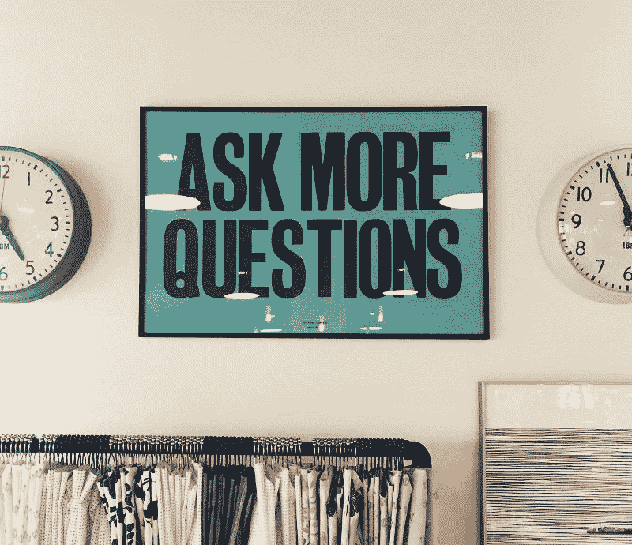
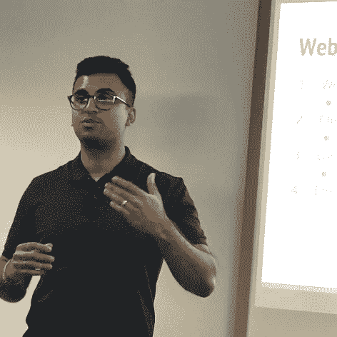
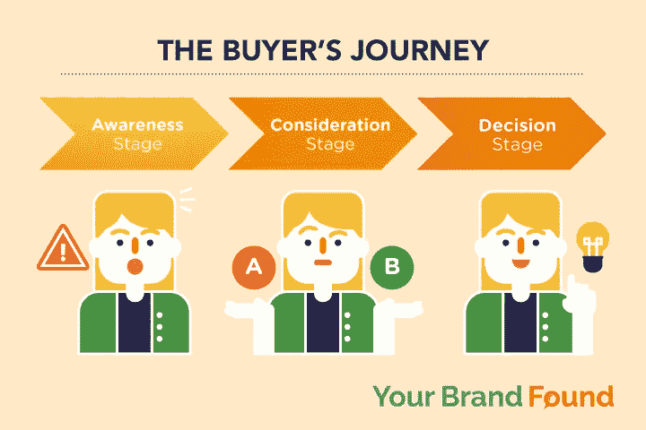
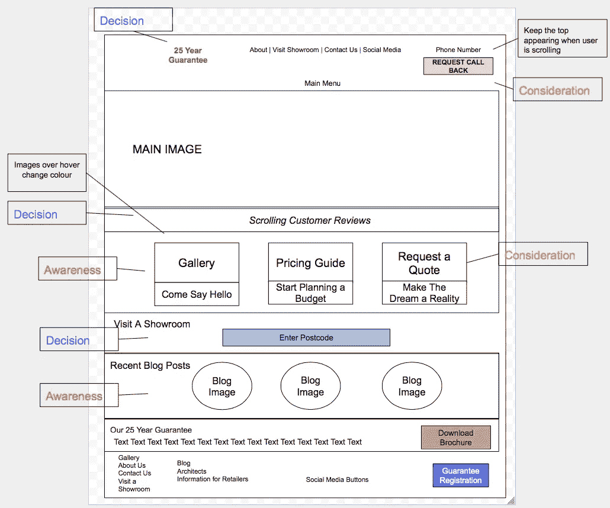
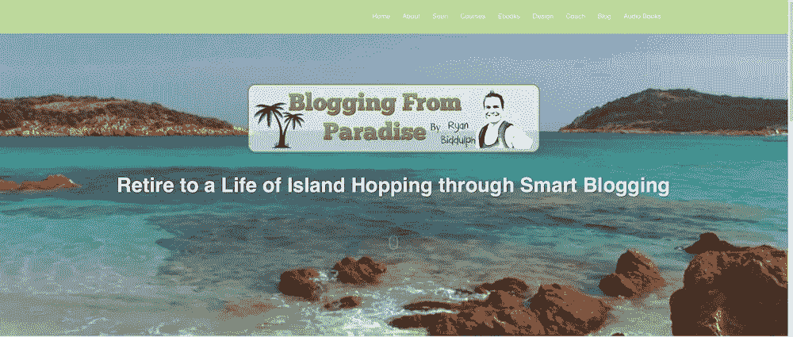
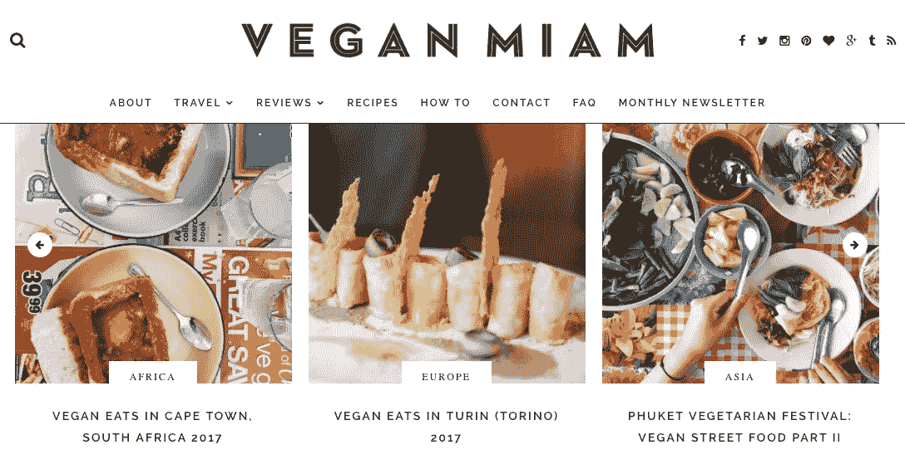
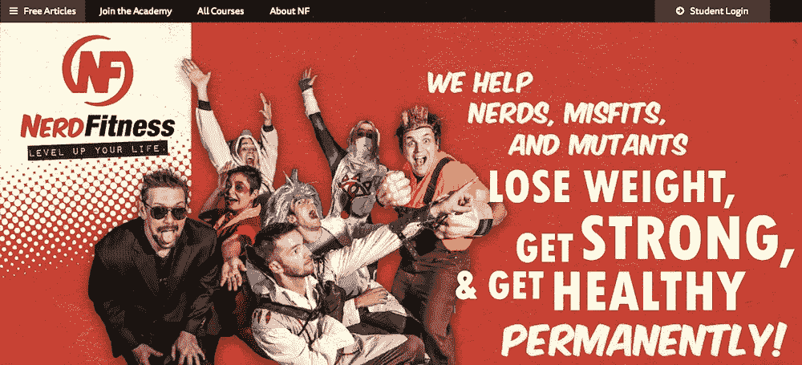
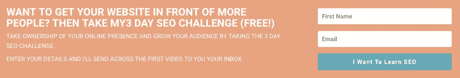

# 想建个网站？从我的 20，000 个错误中吸取教训

> 原文：<https://medium.com/swlh/want-to-build-a-website-learn-from-my-20-000-mistake-5b75822d526d>

我在 2009 年创建了我的第一个网站。

它花费了 2 万英镑，花了 6 个月的时间来设计和建造。

网站上线 3 个月，我只凑了不到 400 美元。

退一步说，这很令人沮丧。

最糟糕的是…

这些销售要么来自朋友，要么来自家人(F&F)。

我不想要施舍，我想建立一个繁荣和受欢迎的网站。

几个月后，更多的失望，该网站被关闭。

2 万被冲走。

一次代价高昂、令人痛心但令人大开眼界的失败。

这种经历就像是在网站建设方面获得了一个 MBA 学位。

如果我知道我现在所知道的，我会大大提高我在网上的成功，并节省一大笔钱。

无论你的网站成本如何，这些现实世界的经验都适用。

稍后我将与您分享这些，但现在，我的方法有一个根本性的失败:

除非你正在建造下一个脸书，否则很有可能你会建造它，而他们不会来。

我掉进了这个陷阱。

我以为一旦我的网站准备好了，流量就会开始流入。

我是说每个人都想知道你的新网站，对吗？

没有。

我希望我能告诉你，我尝试过做推特、脸书，甚至穿着泰迪熊套装站在伦敦火车站外面来吸引注意力。

至少有一半的营销策略。但我是在撒谎。

我将分享一些你可以做的事情来让你的网站走得更远。

# 错误 2——“设计最好看的网站”

我过去一直沉迷于我的新网站。

这包括设计、社交媒体功能、时髦的用户功能和支付处理。

月复一月地与设计师和开发人员一起工作，不断地进行调整。

老实说，我被卡住了。

达到网站的完美让我不再想其他任何事情。

最后，我优先考虑了一些无关紧要的事情，这最终推迟了发布。

在我们的竞争对手中拥有最好看的网站(顺便说一句，我不是说这个！)，没关系。

因为没有人知道它，我可以建立一个人类所知的最伟大的网站，让它坐在互联网的阴暗角落里收集蜘蛛网。

# 错误 3——构建完整的端到端解决方案

这是我犯的最大的错误之一。

当我的竞争对手在与潜在客户交谈时，我正忙于与设计师和开发人员就网站问题进行斗争。

我希望有人能把我从日常事务中拉出来，提醒我要有更大的视野。

我希望有人也提醒我首先创建 MVP(最小产品可行性)的概念。

在我有第一个客户之前，我基本上是在准备扩大规模。

如果你想更深入地了解 MVP 这个话题，我推荐你阅读[精益创业](http://amzn.to/2tZRhpn)。

# 我的 2 万英镑网站是关于什么的？

听说过 Groupon 吗？

Groupon 在美国起步，并在很短的时间内变得非常成功。这种商业模式的病毒性质帮助实现了这一点。

我基本上计划在伦敦开始我自己的 Groupon 类型的业务。

为了不使你对技术细节感到厌烦，我基本上安排了一个完全定制的 Ruby on Rails 网站的设计和开发。

我不知道，当我做的时候:

a)10 多名其他企业家都计划在伦敦开展同样的业务

b)这意味着所有相同的供应商都接到了其他人的电话

c)大公司向自己的 Groupon 投入大量资金

Techcrunch 甚至写了一篇形势的[文章。我的网站叫做 Scrum Buy。](https://techcrunch.com/2010/04/01/attack-of-the-groupon-clones-2-if-you-cant-beat-em-aggregate-em/)

这篇文章确实勾起了一些美好的回忆。

这也提醒了我，当初进入这个行业是多么的冒险。

这个想法是有缺陷的。

即使这是一个很好的想法，我还是错过了建立网站的一些重要步骤。

这是本文的重点，这些错误并不是这类企业特有的。

如果你想创建一个网站，实际增长你的业务，下一节是至关重要的。

继续阅读…

# 如何创建一个吸引客户和销售自己的网站

# 技巧 1——了解你的受众

回答这个问题:你的产品或服务是给谁的？

如果你的答案接近以下其中一个，那么是时候停止考虑你的新网站了:

*   “每个人”
*   “25-40 岁之间的男性或女性”
*   “他们住在 X”

因为你的回答太笼统，说明你其实不知道你的受众是谁。

为所有人写作就是不为任何人写作。

如果你不知道你的受众是谁，你怎么知道什么类型的网站会吸引和吸引他们呢？

顺便说一下，我们不只是在谈论颜色。

想象一下，一家面向儿童的甜品店和一家面向专业人士的甜品店。

装潢、员工制服、菜单甚至员工使用的语言都会完全不同，对吗？

嗯，和建一个新网站没什么区别。

你的受众应该决定你的品牌、颜色、语言、行动号召和总体观感。

那么，你需要了解你的目标受众的哪些方面呢？

**一切**。

好吧，我知道这没什么帮助，所以让我们深入一些细节:

*   性
*   年龄
*   职业
*   位置
*   他们感兴趣的是
*   他们喜欢的运动
*   业余爱好
*   他们使用的社交媒体渠道
*   他们访问的网站
*   他们使用的语言

做好这一步可以决定你的在线营销活动的成败。

例如，我曾与一位客户合作，他每周在脸书广告上花费数百美元，但销售回报不到 10%。

这是一个相当高的负投资回报率。

猜猜是什么问题？

客户认为这是转化率优化。

他们不知道他们的观众是谁。这意味着他们瞄准了错误的人，提供了错误的服务。

赔钱的秘诀。

# 技巧 2——你将如何面对你的观众？

现在，你知道你想吸引谁，是时候去找他们了。

即使你对市场营销没有经验，集思广益制定一个计划并切实执行，比没有计划更能帮助你。

这是你需要避免的分散营销方式。

我说的是随机给你在脸书或 LinkedIn 上认识的人发信息，让他们在社交媒体上分享你的网站或博客文章。

我说的是经常登录谷歌分析，祈祷看到流量的惊人增长。

我说的是不断检查，看看你是否有更多的订户。

我自己也经历过，但我想为你做更多。

你甚至不需要完成数字营销大师所说的所有事情，就可以让你的网站面向大众。

事实上，当你的网站推出时，数字营销甚至可能不是最容易实现的。

你可能会想，“等等，你不是要教我如何在网上营销吗？”

是的，但这并不意味着我整天坐在笔记本电脑前。忽视线下发展业务的机会是愚蠢的。

事实上，线下和线上营销可以很好地合作，尤其是如果你提供的产品或服务既可以在本地销售，也可以在全国销售。

例如，要让你的生意起步，你可以先在当地营销，然后一旦生意有起色，就在全国范围内扩大你的营销范围。

你如何让你的生意在当地起步？

很高兴你问了，这里有一些想法:

a)网络活动

像 [Meetup](https://www.meetup.com/) 和 [Eventbrite](https://www.eventbrite.co.uk/) 这样的在线工具简化了查找当地活动的过程。

为你的观众找到合适的活动的确需要时间，但是请不要花几个小时浏览每一个活动。

挑几个就走。

通过这种方式，你将学会分清轻重缓急，更快地建立关系。

b) LinkedIn

看看和你有关系的人。

一个介绍总是比冷冰冰地开始谈话要好。

顺便说一句，请不要成为那些只是和每个人联系，甚至不包括个人信息的人。

c)脸书集团

网上有无数你可以参与的当地团体。

这是我在为当地的脸书社区做一个工作坊。

不要犯这样的错误:进入团队试图销售。

寻找一些你可以参与并提供帮助的对话。当你开始了解这个群体时，这个群体也开始了解你。

这需要时间。

当你准备好与大家分享一些有价值和相关的东西时，就开始吧。

就是这样。

挑一个做。🙂

# 技巧 3——开始建立你的邮件列表。

我从来没有想到营销会在我的网站建成之前就开始了。

现在看来很明显了。

我忙着和设计师和开发商撞头。

相反，我本可以使用第二条中的提示来创建一个有兴趣听到发布消息的人的列表。

我所需要的只是 google sheets 来获取姓名/电子邮件，以及 Gmail 来发送电子邮件。

你的清单上应该有多少人？我会说…

100 —最小值

250 —不错

500 或更多——难以置信

这些人可能是你的第一批顾客，所以给他们一个红地毯服务。

这可能包括试点折扣、奖金和 VIP 客户服务。

一些有过美好经历的顾客可能是你启动网上成功的全部需要。

# 秘诀 4——在正确的时间提供正确的内容

我将用一个例子来帮助我解释这个技巧。

萨拉想买一台新电视，挂在她的绿色专题墙上。

莎拉购买电视的步骤可能如下所示:

1.  莎拉去电视评论网站或博客了解最新的技术和品牌
2.  莎拉拜访了一些在线或当地零售商，前往**查看一系列产品**
3.  莎拉向朋友和家人寻求**的建议**
4.  莎拉**决定她想要什么**功能和品牌以及她的**预算**
5.  莎拉再次拜访网上零售商或当地零售商，挑选一些产品，特别关注价格
6.  莎拉缩小了她想要的产品和她正在考虑购买的网上零售商的范围
7.  莎拉决定买什么电视和从谁那里买
8.  莎拉买了电视，带回家，让吉尔摩女孩上网飞！

现在，假设你拥有一家销售电视的网店。

如果莎拉在第 1 步和第 2 步中访问了你的网站，那么你知道她不准备购买。

如果莎拉在第五步访问了你的网站，她只是浏览了一下，所以没有准备好购买。

如果莎拉在第 6 步和第 7 步访问了你的网站，你就有了一个潜在的买家。

欢迎来到**买家之旅**。

买家的旅程分为三个阶段:

a) **意识**:莎拉知道她想要一台电视(问题)，但不确定该买哪一台(解决方案)(上述步骤 1-3)

b) **考虑** : Sarah 对她想要的电视有了更好的想法，现在正在考虑选项(步骤 4-6)

c) **决策**:莎拉确切地知道她想要什么电视，并且不知道该从谁那里购买(步骤 7)

一个常见的错误是认为网站流量是潜在客户，但正如你在 Sarah 的例子中看到的，它不仅仅是这样。

你需要把第一步的莎拉和第六步的莎拉区别对待。

例如，您可以创建博客帖子来回答 Sarah 在步骤 1 中提出的问题。

鉴于*客户证明*或*担保*会在第 6 步鼓励莎拉向你购买。

如果你不想让你的新网站看起来非常临床和销售，不要忽略这一步。

这里有一个我在开发新网站之前为客户做的线框的例子。

我在页面上添加了一些元素，这样我们就可以为处于不同购买阶段的人提供服务。

# 技巧 5——不要忽视谷歌，搜索你的网站

如果你对以下任何一个问题的回答是肯定的，我建议你从一开始就优化你的网站的搜索引擎优化。

你打算在你的新网站上写博客吗？

你打算在网上推广你的网站吗？

当地人有兴趣购买你的产品或服务吗？

如果你对所有问题的回答都是“是”，天哪，你需要这样做。甚至一个“是”就足够了。

我遇到过许多博客作者和网络企业家，他们显然花费了大量的时间来创造真实的内容，但他们很难让人们阅读这些内容。

[SEO](https://yourbrandfound.com/learn-seo-online/) 可以让你的内容出现在更多真正寻找你内容的人面前。

做 SEO 的最佳时间是在你建立网站之前，因为它从一开始就定义了一个最佳的网站架构。

这有点像在盖新房子之前先雇一个建筑师。SEO 是架构师。

通过优化你的新网站的搜索引擎优化，你基本上是尽早开始与谷歌的关系。

就像任何关系一样，打破僵局、了解和喜欢对方都需要时间。

那么，谷歌是怎么认识和喜欢你的呢？

当你创造和推广服务于你的客户的高质量和道德的内容时，你就建立了你的关系。

随着谷歌开始信任你，在网上搜索你的业务的人看到你的内容的机会就增加了。

即使你现在不打算写博客和在网上推广你的品牌，我仍然建议你做 SEO。

如果你有本地客户，这一点尤其正确。

为搜索引擎优化优化你的网站足以带来少量的有机访客和销售。

知道了这一点，谁不想让谷歌成为自己的 BFF 呢？

怎么做 SEO？

有两种选择:

# 技巧 6——做一些足够好的东西

或者通常所说的，创建 MVP。

一旦你创造了足够好的东西，你就可以开始与客户分享，并获得早期反馈。

当你知道你的顾客喜欢什么和不喜欢什么时，你可以做进一步的改进。

如果你还没有注意到，上面的建议应该有助于你的 MVP 包括什么。

在我分享一些你应该考虑包括在你的 MVP 中的额外领域之前，我想说一件事:最小可行产品就是最小可行产品。

这就是为什么有一个商业伙伴，一个导师或教练真的会有帮助。

他们可以帮助你挑战和保持专注于推出你的新网站，而不是忘乎所以。

这里有几个你应该包含在你网站的 MVP 中的便宜的地方:

a)关于页面

你需要一个关于页面。

“关于”页面是你网站上最重要的部分，你需要用它来和你的访问者建立关系。

但是，你的“关于”页面不应该仅仅是关于你的业务。

这就像在社交活动中遇到一个人，而他所做的只是谈论自己。

请不要成为那个男生或女生！

我更愿意把这一页看作是关于你的客户的问题以及你如何帮助他们。

看看我的[关于第](https://yourbrandfound.com/about/)页，你就明白我的意思了。

b)主页英雄形象

访问者大约需要 [50 毫秒](http://www.tandfonline.com/doi/abs/10.1080/01449290500330448)(也就是 0.05 秒)来形成对你网站的看法。

良好的第一印象会让访问者在你的网站上花更多的时间。

网站英雄形象的外观和感觉是创造良好第一印象的主要因素。

它应该给访问者一个快速的信息，告诉他们你帮助了谁，以及你如何帮助他们。

这里有几个网站，上面有非常酷的英雄形象，可以激励你:

[**来自天堂的博客**](https://www.bloggingfromparadise.com/)

我喜欢天堂博客上的海洋视频。

Ryan 在描绘博客的想法方面做得很好，他带着这幅清澈的蓝色大海的图像旅行。

看完这个谁不想退休去过岛上跳跃的生活。🙂

[**纯素食 Miam**](http://veganmiam.com/)

素食主义者 Miam 使用三个不同的图像在一起，而不是一个非常聪明。

这些图片不仅看起来非常美味，素食 Miam 对那些在多个地方寻找食物的人也很有吸引力。

使用高质量的食物图片会让你对食物食谱的质量有一个好印象。

这就是为什么素食 Miam 对那些寻找廉价食物的人没有吸引力。

[**书呆子健身**](https://www.nerdfitness.com/)

书呆子健身完全确定了他们的定位，即成为书呆子健身的必去之地。

注意图片和标题是如何传达给他们的观众的。

特别是，使用“不合群”这个词是聪明的，因为它会吸引和吸引他们的观众。

c)电子邮件选择加入

在技巧 4 中，我谈到了顾客在购买过程中处于不同阶段的想法。

请记住，那些访问你网站的处于认知和考虑阶段的人现在还不准备从你这里购买。

但我们仍然可以回答他们的问题，并帮助他们做出正确的决定(即你的产品或服务)。

怎么会？

通过向他们提供免费的东西来换取他们的电子邮件地址，这也被称为电子邮件选择加入。

一旦他们输入了他们的电子邮件地址，你就可以通过电子邮件和他们交流来继续你们的关系。

通过这种方式，你可以帮助他们进入购买者旅程的“决策”阶段，当他们准备购买时，你是他们的首选。

这里有一个惊人的电子邮件选择加入的例子。🙂

在为你的网站设计选择加入时，我建议你确保它符合以下标准:

1.  你的观众实际上**想要**它(听起来很明显，但我见过一些疯狂的选择加入)
2.  很容易**使用**和**可操作**
3.  它给你的观众一个快速的结果

我很想听听你觉得哪个建议最有用，为什么。另外，如果你在建立网站时犯了其他错误，请在下面分享，让我们一起学习。

**在下面留下评论，让我知道。**

为创建一个能吸引你的观众并与他们建立在线关系的网站干杯。

感谢您的阅读，

尼尔 x

*原载于 2017 年 5 月 10 日 yourbrandfound.com***。**

**

## *这个故事发表在 [The Startup](https://medium.com/swlh) 上，这是 Medium 最大的创业刊物，拥有 318，983+人关注。*

## *在这里订阅接收[我们的头条新闻](http://growthsupply.com/the-startup-newsletter/)。*

**