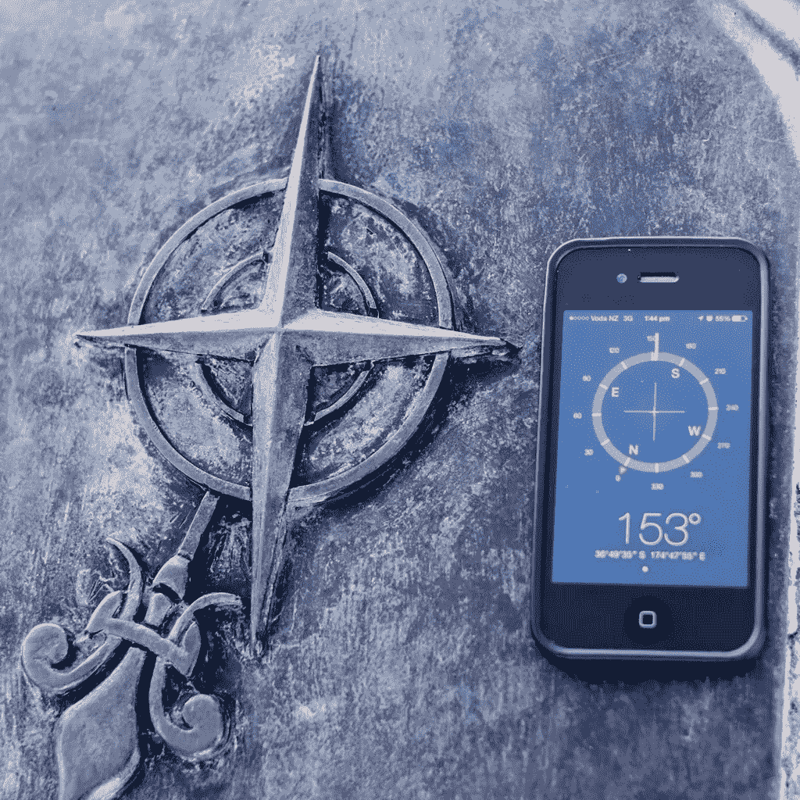
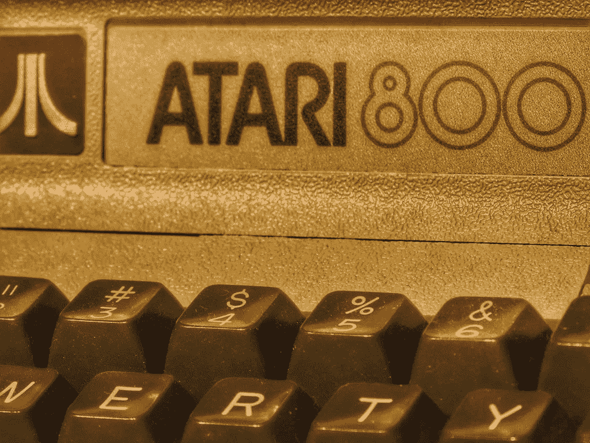
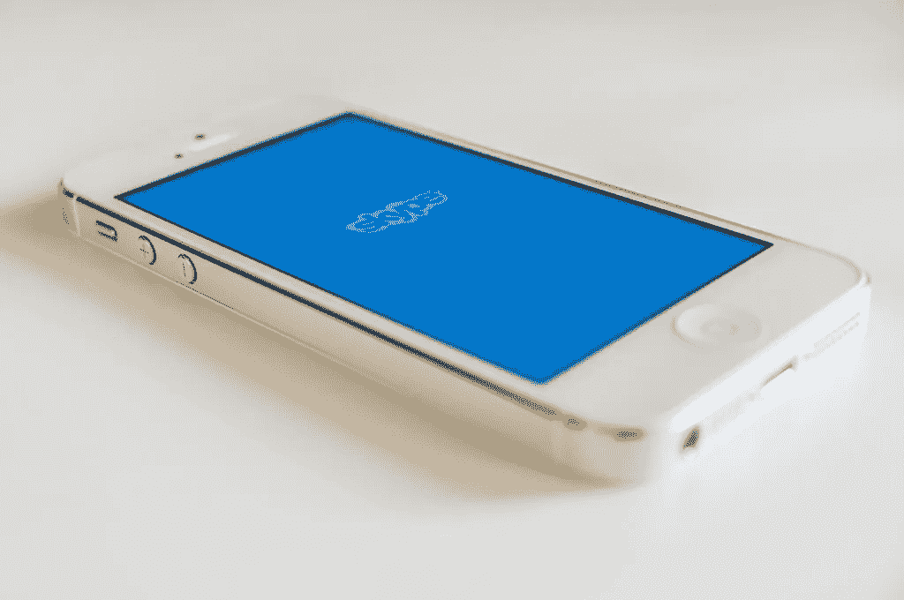
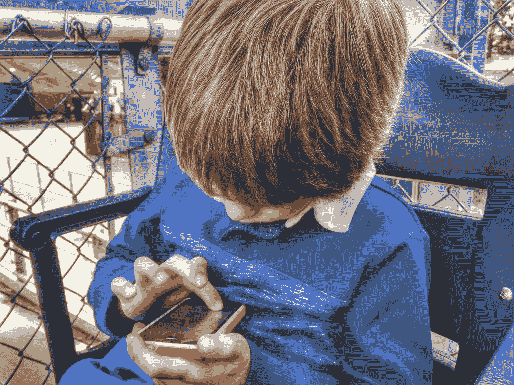
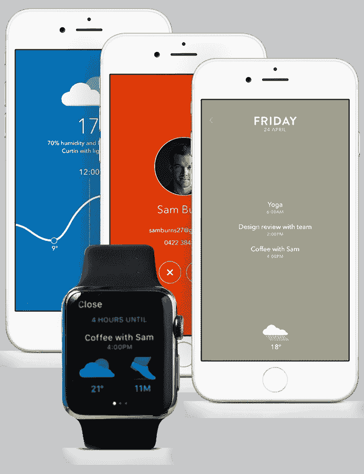
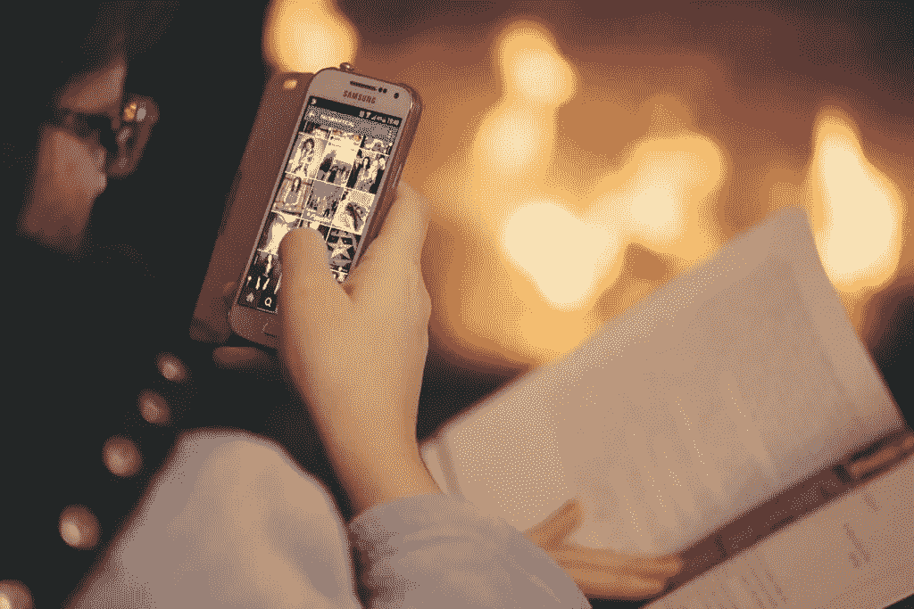

# 想设计一款感觉像魔术一样的手机 App？从这里开始。

> 原文：<https://medium.com/swlh/want-to-design-a-mobile-app-that-feels-like-magic-start-here-e1b729e1a0fd>

亚瑟·C·克拉克的三大定律经常在技术和设计社区被提及，以至于它们几乎已经成为陈词滥调——尤其是第三条:

> "任何足够先进的技术都和魔法没什么区别。"
> 
> —亚瑟·C·克拉克

自从 2010 年史蒂夫·乔布斯[称 iPad](http://www.wired.com/2010/03/the-key-to-apples-ipad-uh-oh-its-magic/) 为“神奇”以来，用于技术和应用程序设计的术语“神奇”已经成为常用语的一部分。但是，在设计移动应用程序的背景下，magic 意味着什么呢？一些移动体验非常突出。有漂亮的设计，有功能性的设计，还有神奇的设计，这两者以一种让用户眼花缭乱的方式交织在一起。如果你想在设计手机应用程序的过程中加入一点魔法，请考虑以下几点:

# 1.听从亚瑟·C·克拉克第二定律，大胆尝试“不可能的事”

虽然这位著名的科幻小说作家可能会因他的第三定律而迷因，但亚瑟·克拉克的第二定律给了我们一个想法，即我们可能如何实现让技术“与魔法无法区分”:

> "发现可能的极限的唯一方法是冒险越过它们，走向不可能。"
> 
> —亚瑟·C·克拉克

当设计一个你想要感觉像魔术一样的移动应用程序时，从考虑目前被认为是不可能的事情开始——然后把它作为你的目标。想想每一个给行业带来革命性变化的伟大设计突破。福特 T 型车使中产阶级拥有不用马拉的马车成为可能。最初的麦金塔电脑通过其图形用户界面使个人计算变得简单易用和直观(尽管施乐公司真的应该[为这一创新获得荣誉](http://www.extremetech.com/computing/104661-how-steve-jobs-stole-the-mouse-and-gui-video))。当雅达利将街机游戏带入客厅，并将数百万台电视机变成游戏的互动渠道时，它拓展了当时可能实现的极限。

在图形、网页和移动应用程序设计中，我们自己也有很多这样的时刻。在 [@font-face 和 WOFF](http://www.creativebloq.com/web-design/choose-web-fonts-1233034) 之前，设计者被限制在任何实时文本中使用“网页安全”字体。如果在设计手机应用程序或网站时，你想包含漂亮的字体，你必须在图片中静态呈现。在 Arial、Trebuchet 和 Comic Sans (cue collective 不寒而栗)的时代，将字体设计作为网页设计的主要元素是不可能的。现在，我们有强大的漂亮字体库供我们使用。

也许在移动应用程序设计中，不可能变成可能的最重要时刻是触摸屏的引入。在我们做出现在看来似乎显而易见的触摸手机从一个元素移动到另一个元素、从一个屏幕移动到另一个屏幕的动作之前，我们必须依赖箭头键和随意的控件。这是一个足够大的范式转变，最终拖垮了曾经辉煌一时的[黑莓](http://2machines.com/184127/)，它似乎凭借 QWERTY 键盘和轨迹球垄断了生产力应用。在 2007 年之前，在智能手机上使用巨大的触控应用生态系统，拥有昔日超级计算机的计算能力，这种想法似乎非常牵强。

在设计移动应用程序时，尝试将这种精神融入到您的流程中。想想最具革命性和无处不在的应用，以及它们将不可能变为现实。有了 Instagram，每个人都是摄影师。有了谷歌地图，你只需在搜索引擎中输入目的地，就能找到你要去的地方。Skype 不仅允许您(在任何地方)看到您正在通话的人，而且是免费的。最令人难忘和神奇的移动应用程序使以前看似不可能的事情不仅成为可能，而且变得不可或缺。

# 2.让体验变得如此自然，用户几乎不用去想它。

从用户的角度来看，魔术和科技有什么区别？灰姑娘不必按下按钮或键入一系列命令来召唤她的仙女教母。甘道夫不会通过在引导导弹的终端输入序列来杀死大地精。你越不用对技术大惊小怪，它就越像魔法。这项技术不仅应该为你工作，而且应该以一种不引人注目的方式，让用户对它的优雅感到吃惊。这很大程度上归结于你的用户界面/UX 设计，以及用户为了与你的应用程序交互而必须做出的手势。毕竟，使用触摸屏感觉比使用鼠标更神奇。发出语音命令并听到 Siri、Google Now 或 Cortana 回应你的召唤比触摸屏幕更神奇。

> *“这是一个有意义的时刻，你想知道为什么我们一直没有这样做，”*

帮助运营 Windows 8 发布会的视听制作公司 [MetroMultiMedia](http://www.metromultimedia.com/) 的数字媒体经理詹姆斯·卡罗兰说。“第一个图形用户界面，第一次使用鼠标，光标随鼠标移动。或者当史蒂夫·乔布斯捏紧手指放大第一部 iPhone 时。第一次将设备连接到电视上，并且不需要确定正确的分辨率。我可以告诉我的 Xbox 去网飞，再也不用拿起控制器了。”底线呢？卡罗兰说，

> *“当技术以它应该的方式工作时，它创造了一种体验。突然间你成了《少数派报告》里的汤姆·克鲁斯。”*

想一想 Tinder。现在，千禧一代的约会模式是向左滑动，向右滑动。用户花最少的努力注册一个输入，然后刷一下就可以把另一个人添加到你的约会池中。一个原本复杂的过程(在你的区域找到一个人，确定你是否觉得这个人有吸引力，拯救这个人或者从你的选项列表中排除这个人，通知这个人你对他感兴趣)被减少到几分之一秒。魔法。当我们说到这一点时，同样重要的是…

# 3.保持简单。

如果你看看我们最近的帖子【2015 年 8 月的 10 大移动应用用户界面，你会看到一个共同的趋势:简单。

例如，Moleskine Timepage 日历应用程序非常简单，但它以优雅整洁的方式为您提供了必要的信息。

[Timepage App](http://www.moleskine.com/microsites/apps/timepage), Moleskine

> *“我们的生活被细节消磨殆尽……简化，简化。”*
> 
> *—亨利·大卫·梭罗*

但是，虽然简单有助于更好的审美体验，但它是否也让你的应用程序更加神奇呢？同样，用户对应用的思考越少，体验就越神奇。这不仅仅针对用户输入和手势，还包括布局和图形设计。当设计一个移动应用程序时，请记住，用户需要查看的元素越少，用户就越不需要考虑应用程序，不知道应该点击或滑动哪个按钮。当有疑问时，删掉它——试着让任何说明或复制尽可能的短，并删除任何对体验不必要的图像。

Meerkat 是一个用简单的设计提供强大用户体验的简单用户界面的极好例子。你所要做的就是点击一个按钮，开始一个视频流，供你的 Twitter 关注者观看。用户输入(两个按钮和一个文本字段，用于命名您的流)与可爱、不显眼的卡通猫鼬共享屏幕，作为应用程序的标志。就是这样。没有让用户困惑该做什么的空间，也没有令人分心的图片或副本。

# 4.创造一致、身临其境的体验。

为了说明这一点，想想最成功的幻想世界。任何读过《哈利·波特》的人都能在瞬间想象出霍格沃茨的样子。《指环王》中的中土世界也是如此。维斯特洛怎么样？是什么让这些世界如此成功？

很大一部分是想象力(说真的，乔治·r·r·马丁怎么会想到所有这些政治阴谋？)，但另一部分是一致性。你不会走进瑞文戴尔，看到一群吵闹的高中生在打魁地奇。我们知道从这些幻想世界中可以期待什么，因为它们是如此精心制作的，细节是一致的。任何一个 90 年代的孩子甚至能想象出哈利波特系列丛书章节名所用的字体。当设计一个感觉像魔术一样的移动应用程序时，同样的原则也适用。你使用的手势应该在不同的屏幕上保持一致——同样适用于你的排版和配色方案。想想 Instagram。该应用程序的输出遵循相同的美学:完美的正方形，通常带有某种彩色滤镜，为照片添加怀旧感。你可以闭上眼睛想象一张“Instagram 照片”是什么样子，就像你想象霍格沃茨的餐厅一样容易。如果你能在设计手机应用时创造出同样的沉浸感和可识别性，你就在创造奇迹。

# 5.设计手机应用时，不要忽略质量保证。

破坏你的应用程序可能具有的任何神奇效果的最可靠的方法是缩短 QA 过程。魔杖不需要你在施魔法前多次开关它们，如果用户遇到崩溃或错误信息，他们也不会迷失在一个身临其境、设计良好的体验中。我们明白了。你有截止日期，QA 是最后一步，通常也是最容易被挤压的一步。

有时候，在你开始编写实际的应用程序之前，你会经历这么多轮的设计更改、副本更改和法律质量保证，然后你主要关注的是如何将它发布出去。事实是，在设计移动应用程序时，魔法是一种土地法则，用户正在习惯 Meerkat 等应用程序的一键操作功能，或者 Evernote 的强大可靠性。如果应用程序崩溃，或者不能做它应该做的事情，世界上最漂亮的界面也不能挽救你的用户体验。只需要 iTunes 应用商店或 Google Play 上的一个一星评论就能赶走潜在用户，即使用户下载了你的应用程序，他们也会在遇到破坏体验的错误时寻求另一个。

当然，不要忘记平台。有时候，影响你的应用体验的因素与你如何编写或设计移动应用关系不大，而是与它运行的平台有关。当人们抱怨 Android 5.0(棒棒糖)的漏洞和问题时，他们抱怨的是这些问题如何影响他们个人的应用体验。至关重要的是，你的 QA 团队要掌握你发布应用的每个平台上的潜在问题，并在你有可用的测试版时测试这些问题。

设计移动应用程序时，在多种设备上进行测试也很重要。Android 尤其如此，因为该操作系统运行在众多制造商生产的设备上。QA 帮助你确保技术是“足够先进的”，因此是神奇的。记住:魔法是让童话和科技令人愉悦的东西。当你想下载的应用程序不断崩溃时，你脑海中不会出现“高兴”这个词。

# 6.在设计过程中开始质量保证。

也许这听起来很熟悉:你正在设计一个移动应用程序，你经历了这么多轮的小设计或复制调整，以至于你没有达到任何目标期限。为了节省时间，您的开发人员决定在设计师和复制团队仍在更新模型时开始编程，然后您以一个混乱的协调结束:执行团队带着反馈回来，反馈必须反映在设计样本和测试版中，并且您以要跟踪一百万个修订结束。不可避免地，一些东西在翻译中丢失了，QA 变得一团糟。这就导致了我们之前的问题:质量不好的应用程序不是神奇的应用程序。设计第一。发展第二。

在你的设计过程中，通过利用一个类似成品的[移动应用原型来开始质量保证，因为与静态屏幕、线框和模型不同，一个真实的原型将允许你浏览用户故事，并与实际用户一起测试*体验*。](http://proto.io/)

在设计过程中测试用户体验可以让你在早期就专注于获得正确的体验。可以用更少的资源和时间更快地解决反馈问题。开发人员不必担心合并无止境的设计修改，每个人都更快乐、更好。

*留下评论，让社区知道你是否有自己的设计神奇移动应用和体验的技巧。谢谢！*

*原载于 2015 年 6 月 4 日*[*blog . proto . io*](http://blog.proto.io/6-secrets-to-designing-a-mobile-app-that-feels-like-magic/)*。*

*发表于* **创业、旅游癖和生活黑客**

-