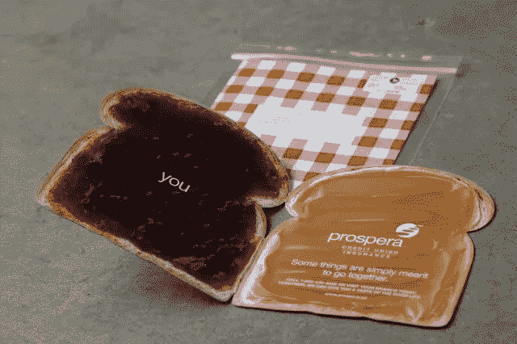

# 想发展你的网络品牌吗？下线。

> 原文：<https://medium.com/swlh/want-to-grow-your-online-brand-go-offline-da8f31949335>

## 听起来适得其反，对吧？请原谅我。

Photo by [Igor Son](https://unsplash.com/photos/FV_PxCqgtwc?utm_source=unsplash&utm_medium=referral&utm_content=creditCopyText) on [Unsplash](https://unsplash.com/search/photos/grow?utm_source=unsplash&utm_medium=referral&utm_content=creditCopyText)

还记得 2000 年代初，每个人都在敦促你把业务放到网上吗？很难预料有一天网站和在线营销不再是独一无二的。即使精心制作的网站拥有各种花哨的功能，也很难在众多优秀的设计和营销技巧中脱颖而出。

市场比以往任何时候都更加饱和，营销人员必须在如何让品牌受到关注和吸引更多用户方面变得更有创意。为了吸引新的受众，让你的品牌在竞争如此激烈的市场中脱颖而出，让我们回到最基本的东西。随着公司投资于他们的数字营销工作，一种策略卷土重来:传统的线下活动。

很少有公司将时间或营销努力分配给线下战略，结果错过了一大部分准备利用他们服务的人。

探索在线脱颖而出的新方法，在线下花同样的时间。

## “离线”交流。

用面对面的交流或者电话来代替网上交流。“离线”交流并不意味着没有互联网。与其发电子邮件，不如打电话或进行视频聊天，这样你就可以建立一种“人与人”的联系。如果你不能安排面对面的会议，建议进行视频通话。从长远来看会更有意义，在一堆无聊的邮件中脱颖而出。

## 亲自出现

如果你销售 B2B，衡量一下亲自拜访是否合适。如果该公司有一个公共店面，可能值得光顾他们的设施，甚至使用他们的服务。通过这种方式，你可以了解员工，与经理或其他决策者交流，并迅速与公司的人建立关系。确保你不是在闲逛。

## 发送物理邮件

在他们的邮箱里放一封定制的邮件/提案/推介，然后发一封跟进邮件或打一个电话，确保他们收到了。

A creative mailer by Prospera Credit Union

这种方法可能开始变得昂贵，但可以有一个巨大的回报，特别是在创意产业。发送实际样品或带有邮件和产品信息的 PR 包可以为你的品牌创造一个很好的营销机会，如果你以这样一种方式包装你的材料，让人们谈论它。

邮件是在视觉上脱颖而出和补充你的在线营销活动的一个聪明的方法。

## 组织活动

许多在线品牌，如 [Ban.do](http://bando.com) ，定期举办面对面的弹出式商店来销售他们的产品。它与客户建立了良好的关系，并使之成为一种有趣的体验，让他们能够联想到你的品牌。同样，如果访问者在社交媒体上谈论他们的体验，这些场景可以转化为重要的在线营销机会，因此需要平衡在线推广活动的努力，以获得营销回报。

像这样的活动创造了一个极好的机会来展示你的品牌，并通过社交媒体和口碑产生轰动。面对面的活动对于在一个有机的环境中获得评价是非常好的，因为你知道那里的大多数人都有意识地去那里，因为他们追随你的品牌。

基于网络的公司；研究你的大部分顾客或客户住在哪里，并相应地选择你的位置，以确保你得到一个体面的投票率，至少知道你在某一特定地区有一个可靠的用户网络。对于服务型公司，不要开弹出式商店，而是举办社交活动、研讨会或免费培训。

## 创建本地存在

在高流量客户区域举办重大活动可以与周围社区建立有价值的关系。在当地活动中有一个展位或代表也将表明你的公司有一个当地的面孔和存在，不管它的规模或位置。赞助当地慈善机构或福利可能是一个巨大的慈善机会，也是为你的品牌线下赢得更多关注的一种方式。

除了在网上推广你的线下活动之外，研究你的客户的模式，为这些客户确定最佳的营销方法。找出人们在你的市场上从哪里获得新闻，并利用这些平台做广告。

你喜欢这篇文章吗？为了获得鼓舞人心的内容来帮助你在个人和职业上成长 [**订阅我的时事通讯吧！**](http://eepurl.com/ddk9Zj) **(** 不信。这是你的选择。)

*Sarah Aboulhosn 是一位作家兼内容营销专员，热爱好的设计，漂洋过海，自称流行文化专家(说真的，问她什么都行)。在*[*www.sarahaboulhosn.com*](http://www.sarahaboulhosn.com)*了解更多关于她如何帮助你创造品牌价值的信息。*

## 这个故事发表在 [The Startup](https://medium.com/swlh) 上，这是 Medium 最大的企业家出版物，拥有 293，189+人。

## 在这里订阅接收[我们的头条新闻](http://growthsupply.com/the-startup-newsletter/)。

