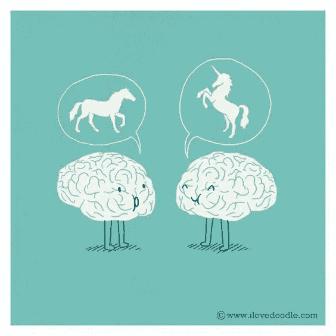

# 想提高记忆力？科学告诉我们答案(这其实很有趣)

> 原文：<https://medium.com/swlh/want-to-improve-your-memory-science-tells-us-the-key-and-it-can-actually-be-fun-99a9c9b95d5b>

你还记得你初吻的时候在哪里吗？

有趣的是，我们的记忆可以挖掘出来的东西。

我记得我通过驾照路考成为司机那天穿的衣服。

我们可能都记得纽约双子塔倒塌时我们在哪里，不管我们在世界的哪个角落。

我们的许多记忆都是由重大生活事件定义的，或者至少与重大生活事件相关联。我们可以[回忆起这些事情](http://www.inc.com/jessica-stillman/more-ideas-in-minutes-5-instant-creativity-boosters.html)，然而自从做了爸爸，有些日子我都不太记得我早餐吃了什么！

这是有原因的。

由爱丁堡大学领导的一项[研究](http://www.nature.com/nature/journal/v537/n7620/full/nature19325.html)探索了驱动我们记忆创造的生物过程背后的科学。这被称为“闪光灯记忆”，理解这个小概念可以帮助你提高自己记忆重要信息的能力。

研究人员发现，当他们让老鼠在他们想要记住的事情之前或之后经历引人注意的经历时，它们储存信息的能力得到了提高。

例如，一个测试对象必须走过一个新的不同的地板表面，然后才能更好地记住食物来源的位置。

那么这在人类身上是如何起作用的呢？

基本上，当我们兴奋或接触新事物时，我们的大脑会释放一种叫做多巴胺的化学物质，并将其运输到大脑中负责记忆形成的区域。那一点点多巴胺帮助我们形成那一刻的记忆。

所以，惊喜吧！提高记忆力的关键是…嗯，是惊喜。

爱丁堡大学认知和神经系统中心的理查德·莫里斯教授说:“小惊喜总是以微妙的方式发生，反映出我们的个人生活和兴趣。不知何故，惊喜的新鲜感为我们通常会忘记的一天中所有琐碎的事情创造了一个更好的记忆光环。”

我们早就知道多巴胺在记忆形成中发挥了作用，但这项研究证明了海马体的参与。有趣的是，大脑的这一部分也被认为是我们情绪的中心。想一想，在广告和营销中，我们如何不断地试图与 T2 建立情感联系，让观众真正感受到信息。嗯，原因是这样的。

那么如何利用这个小花絮来提高自己的记忆力呢？

当你想记住重要信息时，试试下面这些提高记忆力的方法:

*   分散注意力。你可能会觉得坚持工作会让你变得非常高效和专注，但是你不太可能在以后回忆起来。你不是一个坏人，你可以在 YouTube 上休息两分钟，大声疾呼，不要再相信[多任务处理=更高生产力的神话](http://www.inc.com/larry-kim/why-multi-tasking-is-killing-your-brain.html)。
*   庆祝快速胜利。当你完成一件事情时，多巴胺就会释放出来，所以列一个你可以处理的小任务的清单，这样你就可以在一天中快速取得胜利。
*   定期进行身体休息。找根跳绳。跑上一段办公室楼梯。即使你有时间站起来在桌子旁边做 10 个跳跃动作，你也在给自己增加一点内啡肽和多巴胺。(额外收获:这也会让你更有创造力。)
*   抓住机会尝试新事物。这并不意味着要学习一种全新的技能。也许这是一个感官上的惊喜——用手抚摸不同的材料，或者冷了出去再回来。也许(在没有香味的工作场所之外)这意味着用不同香味的油来保暖。重点是在你的工作空间中创造变化，这样它就不会总是老样子。

这就对了——提高你的记忆力不一定是枯燥乏味的。惊喜！

# 做驴海里的独角兽

获取我的最佳独角兽营销和创业成长秘诀:

1.  [**报名直接发到你邮箱**](https://mobilemonkey.com/blog-subscription)

**2。** [**通过 Facebook Messenger 注册偶尔的 Facebook Messenger 营销新闻&提示。**](http://m.me/447438332063924?ref=e58448cdd16367419b279793544e132f5388067506f92c92e6)

# 关于作者

拉里·金是世界上最好的 Facebook Messenger 营销平台提供商 MobileMonkey 的首席执行官。他也是 WordStream 的创始人。

你可以在 [Facebook Messenger](http://m.me/447438332063924?ref=e58448cdd16367419b279793544e132f5388067506f92c92e6) 、 [Twitter](https://twitter.com/larrykim) 、 [LinkedIn](https://www.linkedin.com/in/larrykim) 、 [Instagram](https://www.instagram.com/kim_larry/) 上和他联系。

最初发布于[Inc.com](/the-mission/want-to-improve-your-memory-science-tells-us-the-key-and-it-can-actually-be-fun-47a095e81f76)