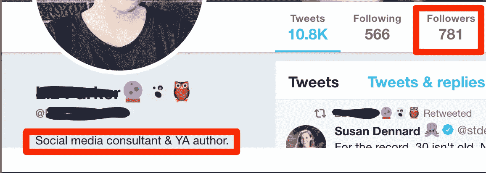

# 想增加你的咨询收入吗？做你教的。

> 原文：<https://medium.com/swlh/want-to-increase-your-consultancy-revenue-do-what-you-teach-f48c7625001c>

互联网的力量和可及性意味着任何人都可以成为任何人。

*   称自己为社交媒体顾问不需要学位。
*   称自己为数字营销专家不需要资格。
*   你不需要获得写作奖才能称自己为内容营销者。

那么，为什么有那么多没有能力的人有着自封的头衔呢？

现在，这不是在挖苦那些正在学习进入角色的人。

每个人都从某个地方开始，有了网络上丰富的知识，学习和自学你不知道的东西并不困难。

但这并不能解释人们说的多，做的少。

# 成为最好的需要时间

> 他们说要成为一名专家需要在某项工作上花费 10，000 小时。

这是一个很长的时间来把事情做到最好。你能诚实地说你有毅力花 10，000 小时成为某方面的佼佼者吗？

# 从客户的角度来看

这个推特用户说他们是社交媒体顾问。

他们可能会承诺在 Y 时间内让你的账户增长 X 倍(T2)。

但是看看他们自己的下面…

当这个人没有花时间去建立自己的社交媒体账户时，你会相信他会建立自己的账户吗？

你会相信一个看起来好像多年没有刷牙的牙医吗？

# 说你做某事是不够好的

正如我们之前提到的，任何人都可以在网上自称为任何人。

因此，筛选有天赋和没有天赋的人是一项艰巨的任务。你必须验证每个人告诉你他们能做什么。往往会导致把钱花在没有带来任何结果或价值的人身上。

# 低调生活的好处。

俗话说:

> 你不可能成为每个人的全部。

是真的。尤其是在生意上。对于每个产品、任务或工作角色，你都面临着竞争对手。如果你没有竞争对手，很可能你提供的东西就没有存在的必要。

我经营着一家[内容营销代理](http://copyandcheck.com/)，之前我们也做社交媒体管理和付费广告。

我们这样做是为了有一个稳定的工作流，并且觉得如果我们不接受任何符合我们预算的工作，我们的前景管道就会干涸。

事实并非如此。

事实上，当我们细分市场时，我们增加了来找我们的客户数量。

这是因为他们知道我们做了什么，而且对于他们是否适合我们的服务也没有混淆。

现在，我们只与 B2B 和 SaaS 公司合作。

它帮助了我们的 pipleline，给了我们关注点，让我们成为我们领域的专家。

更何况。我们写作。不仅仅是为了我们的客户，也是为了我们自己。我们身体力行，并且做得很好。

所以我向你提出这个问题，你做了足够多的工作来证明自己是你声称的专家吗？

## 这个故事发表在[的创业](https://medium.com/swlh)上，这是 Medium 最大的创业刊物，有 308，692+人关注。

## 订阅接收[我们的头条新闻](http://growthsupply.com/the-startup-newsletter/)。

