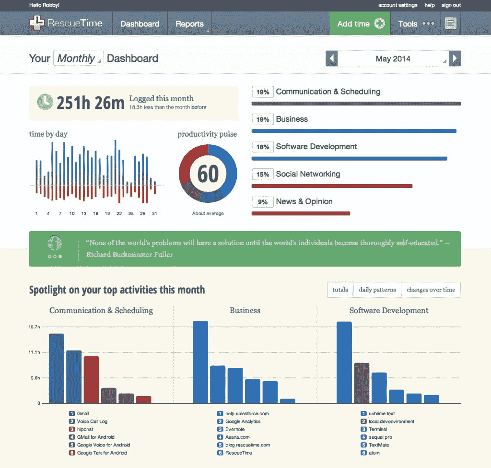
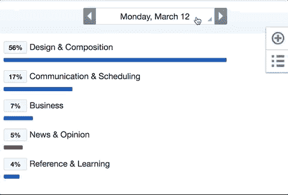
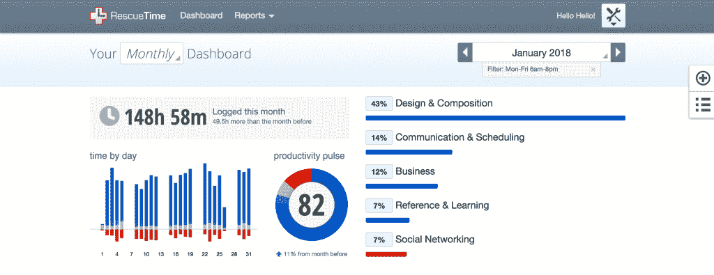
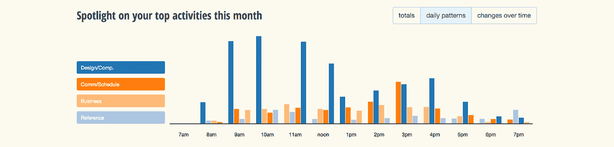
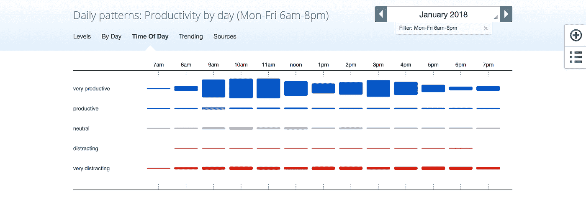
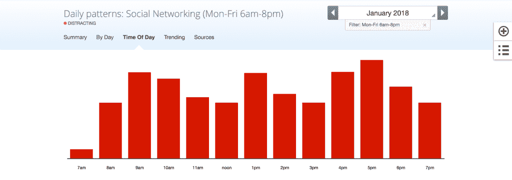
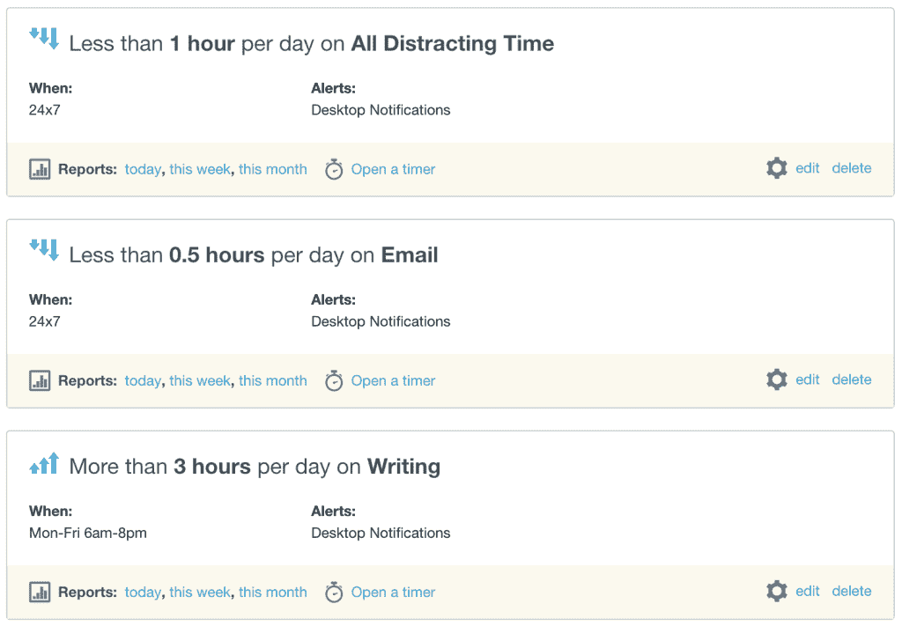

# 想知道你的时间到底去了哪里？做一个时间审计。

> 原文：<https://medium.com/swlh/want-to-know-where-your-time-is-actually-going-do-a-time-audit-fbf2c85554d3>

## 重新安排你如何度过每一天的五步计划

***“已经下午 5 点了吗？”***

对一些人来说，工作日没有经过太多思考就过去的想法是一个梦想。

对于其他人来说，这是一场噩梦。

当你在做[有意义的工作](https://blog.rescuetime.com/meaningful-work-guide/)并且关心你深陷其中的项目的时候，[时间](https://blog.rescuetime.com/time-management/)是一种你会不惜一切去获得更多的资源。但是(不幸的是)它不是那样工作的。

我们计划把时间花在重要的事情上。但是接下来[会议](https://blog.rescuetime.com/true-cost-big-staff-meetings/)、电话、管理、打扰、[分心](https://blog.rescuetime.com/the-fight-against-distraction/)、谈话、约会(也就是生活)会成为障碍。在我们知道之前，一天已经过去了，我们仅仅完成了我们想做的事情的 50%。

令人沮丧。但是答案并不是花费更多的时间和消耗过多的精力。是为了[夺回我们时间的控制权](https://blog.rescuetime.com/time-management/)。

最简单的解决方法？时间审计。

# *拿着模板跟着*

*我把* ***免费放在一起，*** [***可下载时间审计模板***](https://blog.rescuetime.com/wp-content/uploads/2018/03/Time-Audit-Template.pdf) *如果你想在浏览这篇文章时填写它。*

# 什么是时间审计？

就像你可能会被税务审计一样，时间审计是国税局对你的[时间表](https://blog.rescuetime.com/daily-schedule/)的审计。通过深入了解你是如何度过最后一周/一个月/一个季度的，你可以从时间管理中去掉猜测，合理地设定你的时间表。

在其最基本的形式中，时间审计由 3 个简单的步骤组成:

1.  写下你的意图(例如，你希望*如何利用*的时间？)
2.  看看你的个人资料，看看你实际上是如何度过时间的
3.  调整，设定新的目标，跟踪进展

例如，如果你想[写一部小说](https://blog.rescuetime.com/results-from-our-2012-national-novel-writing-month-experiment/) ( **意图**)，但你每周只写一个小时(**分配**)，那就有问题了。

你的工作也是如此。如果你的主要任务是开发软件，但是你大部分时间都在回复邮件或者开会，那么你的意图和分配是错位的。

时间审核会让你的时间表和你的目标保持一致。

它确保你每天付出的努力都朝着正确的方向发展。不仅仅是眼前的东西。

正如《你将如何衡量你的生活》一书的作者克莱·克里斯滕森所说: [写了](https://hbr.org/2010/07/how-will-you-measure-your-life):

> 你关于分配个人时间、精力和才能的决定最终会塑造你的人生策略

当我们设定并坚持我们的目标时，我们不仅能完成更多的工作，还能感受到继续前进的压力和力量。势头产生势头。

# 如何收集时间审计所需的信息

时间审计过程中最重要的部分是收集真实清晰的数据，了解你实际上是如何花费时间的。

有许多工具可以用来做这件事。您选择哪一个最终将取决于您是否习惯于跟踪时间、您愿意付出多少努力以及您希望审计的粒度级别:

# 您的待办事项列表(应用程序/笔和纸)

如果你使用类似于 [Todoist](https://todoist.com/) 或 [Wunderlist](https://www.wunderlist.com/) 的待办事项应用程序，或者在便笺簿和纸上跟踪你的日常任务，这是一种查看你如何度过一天的方式。虽然它能让你更清楚地看到你花时间做的(或者至少想做的)具体任务，但缺点是不太清楚时间实际上是怎么花的。

# 日历

如果你用你的日历创建一个[每日计划](https://blog.rescuetime.com/daily-schedule/)并跟踪任务，这也是另一个查看你的时间去了哪里的好地方。作为一个额外的收获，你的日历包含了所有通常会让你远离有意义工作的事情，比如会议、电话和约会。

当然，因为你是手动输入一切，所以你的日历有可能是用玫瑰色眼镜创建的。此外，如果你只是简单地遵循一个重复的日常计划，你是在处理预设的时间块(意图)，而不是实际花费的时间(分配)。

# 时间追踪应用

像 [RescueTime](https://www.rescuetime.com/) 这样的时间跟踪应用程序会在后台详细记录你如何度过时间，这意味着你不必手动输入任务。

此外，因为这是你如何度过时间的真实表现，你不会落入重写自己历史的陷阱。一个潜在的缺点是，在大多数情况下，你会获得更高层次的时间花费视图(你在使用什么应用程序)，而不是像你在待办事项列表中那样的具体任务。

# 一个简单的 5 步时间审计来重新调整你的生活

等等，我们不是说过时间审核只有 3 个步骤吗？

从最基本的形式来看，是的。**但是只有当你用反思来做出真正的改变时，反思才是有价值的。**

我们的时间审计模板不仅为您提供有关您的意图和分配的信息。而是帮助你承诺在未来改变你的[时间管理](https://blog.rescuetime.com/time-management/)。

# 第一步:写下你上个月的意图

在你看任何数据之前，写下一个你希望如何度过过去一个月(或者你正在看的任何时间段)的理想情景。这可能是花在活动或项目上的时间。

写下你的 3-5 个最重要的优先事项(正在进行的目标也可以)以及你打算在这些事项上花费的时间 ***。***

对我来说，这可能看起来像:

*   **目标 1:** 写博文(50%)
*   **目标 2:** 研究和教育(25%)
*   **目标 3:** 客户和团队沟通(10%)

这些意图不需要也不应该占用你 100%的时间。时间管理就是要现实一点。总有一大块时间是你无法控制的。

# 步骤 2:使用 RescueTime 运行上个月的时间审计

使用 [RescueTime](https://www.rescuetime.com/) ，我现在可以看看我实际上是如何度过时间的。这是我的**分配。**

这是原始而真实的数据，没有因为我在某些任务上花费太多(或时间不够)而受到影响。

首先，使用日期选择器选择您想要查看的时间。

为了这篇帖子，我打算用 2018 年 1 月:

而且只看工作时间(周一到周五早上 6 点到晚上 8 点):

看起来是这样的:

马上我就能看到我的时间意图和分配是关闭的:

*   **目标 1:** 写博文(**意向:**50%；**分配:** 43%)
*   **目标二:**研究和教育(**意向:**25%；**分配:** 7%)
*   **目标 3:** 客户与团队沟通(**意向:**10%；**分配:** 14%)

接下来，我将向下滚动，查看每天每项任务发生的时间，看看我最有可能在什么时候做某项工作。养成一个现有的习惯比创造一个全新的习惯要容易得多，所以了解我现在是如何工作的是一个强有力的起点。

对我来说,**写作**发生在上午，下午晚些时候会多一点。

而**沟通和安排**全天都存在，但在下午最为普遍。

我还可以按时间查看我的**效率，这可以给我一些如何更好地安排一天的线索(我们的下一步):**

当我被社交媒体之类的东西分散注意力时，我甚至会深入研究:

有大量的信息要从 RescueTime 收集。但这里的关键是寻找模式。**什么时候我的意向和分配出现偏差？又有什么妨碍？**

这样，我们可以设定具体的目标，按照我们想要的方式来安排我们的日子。

# 第三步:设定目标和指标，让你重新调整

现在我可以看到我的时间都花在哪里了，我可以开始为每个目标制定行动计划:

**目标 1:** 写博文(**意向:**50%；**分配:** 43%)

**行动计划:**每天早上(上午 8 点至下午 12 点)留出时间写作。

**目标二:**研究和教育(**意向:**25%；**分配:** 7%)

**行动计划:**在下午安排时间专门研究。

**目标 3:** 客户和团队沟通(**意向:**10%；分配比例: 14%)

行动计划:花更少的时间在邮件上。设置每日提醒，如果我超过 30 分钟。

从我对自己实际如何度过时间的研究中，我还可以看到在我以前没有意识到的其他方面还有改进的空间:

*   **新目标 1:** 通过在早上设置[焦点时段](https://www.rescuetime.com/focustime)来减少社交媒体时间(RescueTime 的网站拦截器，用于拦截分散注意力的网站)
*   **新目标 2:** 通过安排非认知性任务来提高一天的工作效率

作为一个额外的奖励，我可以使用 RescueTime 来设置[每日提醒](https://blog.rescuetime.com/alerts/)，当我达到(或错过)这些承诺时就会触发:

*关于* [*如何使用改期提醒的详细解释，请看这篇文章*](https://blog.rescuetime.com/alerts/) *。*

# 第四步:根据你的目标、生产力和时间研究来调整你的时间表

有了这些信息，你就可以主动设定你的[日计划](https://blog.rescuetime.com/daily-schedule/)来反映你想要如何度过你的时间。

[以“满满的日程”开始每一天](https://blog.rescuetime.com/daily-schedule/)意味着你在掌控自己的时间，而不是被要求和会议淹没。

这也意味着根据真实数据安排你的一天，而不仅仅是猜测。

例如，我从我的时间审计中知道，我的效率在下午会更低，我更容易分心而不去写。所以，我应该把这段时间安排在研究、电子邮件和其他要求不高但重要的任务上。

# 第五步:留出开会、打电话、休息和被打扰的时间

这里你可能犯的一个大错误是假设你所有的时间都是富有成效的。

尽管我们尽了最大努力，干扰、会议和干扰还是会出现。作为远程团队的一员，我很幸运能够将大部分时间花在我的核心工作(写作)上。然而，你的工作性质可能不允许这样。

做这个练习时，记住要现实地看待你是如何度过时间的。如果你知道你每周有 10 个多小时的电话或 5 个重复的会议，那么每天安排大量的深度工作可能是不现实的。

可能需要反复几次才能让你的时间表正确。但是一旦你做到了，你就能让每一天都变得美好。

# 何时进行时间审核

你可以在任何时候进行时间审计，但是在你开始之前至少要有几个星期到一个月的个人数据。

如果你能每月浏览一遍这个列表，你就能微调你的时间表。然而，每季度或每两年一次也很好。尤其是如果你已经意识到你的时间去了哪里。

# 自己做时间审计

时间管理是一个持续的过程。我们花了很多时间来思考让它为您服务的最佳方式。

如果你想做自己的时间审计，并了解你的时间去了哪里，注册[一个免费的时间账户](https://www.rescuetime.com/)，然后在这里获取我们免费的 [**时间审计模板**。](https://blog.rescuetime.com/wp-content/uploads/2018/03/Time-Audit-Template.pdf)

# 嘿，我是乔里！

我帮助公司和有趣的人通过巧妙而专注的写作讲述他们的故事。想一起工作吗？在 hello@jorymackay.com 给我发邮件

*这篇文章的一个版本最初发表在* [*改版博客*](https://blog.rescuetime.com/time-audit/) *上。查看更多关于生产力、专注和动力的文章。*

## 这个故事发表在 [The Startup](https://medium.com/swlh) 上，这是 Medium 最大的企业家出版物，拥有 305，782+人。

## 在这里订阅接收[我们的头条新闻](http://growthsupply.com/the-startup-newsletter/)。

