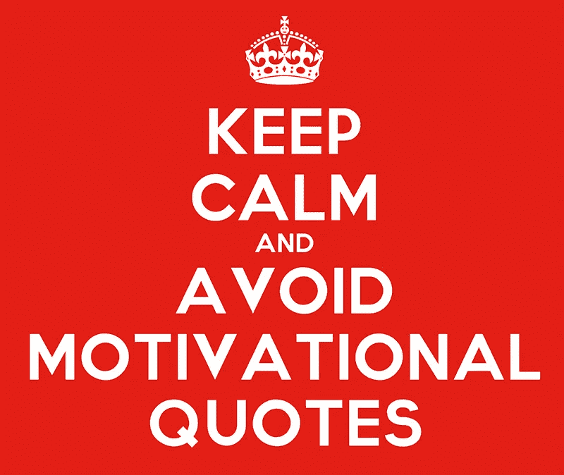

# 想做些改变吗？立即回答这 4 个问题

> 原文：<https://medium.com/swlh/want-to-make-a-change-answer-these-4-questions-immediately-10db20f17f34>

**Read or Watch? Maybe both?**
You can find my content on Medium (read below) and Youtube (via my channel — [Sign of Life](https://www.youtube.com/channel/UC4211nC0IOB0FS6eGWM7x7g))

## **“改变是一个过程，而不是结果……”**

**Watch the video** [**here**](https://youtu.be/j1FYQ5POJH8)

上周，一个朋友把我加进了脸书的一个自我提升小组，在那里，人们积极参与积极健康的生活讨论。

正如你们中的许多人所知，大多数脸书团体都有变得不活跃或充满垃圾邮件的趋势。但是这个小组是不同的。这个小组很活跃。它没有垃圾邮件。好吧，让我换个说法——它应该没有垃圾邮件。

# 应该是？你什么意思？

绝对没有广告、脸书病毒或常见的“在家每小时赚 300 美元！”算是帖子吧。
然而，在我看来，一切都像一大堆垃圾邮件，所以那天我最终离开了这个团队。

这里有一个例子:

当然，这不是真正的垃圾邮件，对不对？这也是我朋友的观点。
但当他问我为什么离开这个团队时，我是这样解释的。

这些可能是惊人的名言(实际上我喜欢上面的一个)，但是我没有发现励志名言的任何价值。
当我偶然发现一句激励性的名言时，我会这样做:
我花五秒钟读它。然后我再花 10 秒或者 15 秒来消化它。
**但是接下来会发生什么呢？我继续我的生活。**

事实是，尽管一句名言可能很有意义或鼓舞人心，但如果你只是读它，它也毫无意义。

# 一个能立刻改变你生活的建议

我最近加入了 Quora。这是一个你可以在你的专业领域提问或回答问题的网站。我花了一个小时浏览不同的问题，看看是否有我可能提供答案或见解的问题。几分钟后，我明白了一些事情。许多问题几乎完全相同，尽管它们不是由同一个人写的。他们只是有一个共同的主题。事情是这样的:

> 问:如何在不到 7 天的时间里改变我的人生？
> 
> 问:能帮助我改善生活的秘诀是什么？

快速搜索发现了数十个甚至数百个类似的问题，所有这些问题都有数千个不同的答案、评论和建议。

所有这些问题的答案应该很简单——生活不是励志名言。没有一个终极秘诀可以帮助你改善生活。“生活中的胜利”并没有什么秘密公式。*(尽管有些人，甚至是媒体上的人，会告诉你不是这样)*

当然，你可以改变你的生活。可能是七天，甚至一分钟。但这只是第一步，因为改变是一个过程，而不是结果。
容易改变的事情，几乎总是最不重要的。走出你的舒适区是困难的，但这是提升自己的唯一途径。这不一定是一个巨大的飞跃。坚持循序渐进会是一个很好的开始。

# 健身房会员还不够。

几周前，我写了关于新年决心的文章。说新年决心完全是浪费时间是相当时髦的。但是思考和想出解决方案并不是问题。事实上，这是一件很棒的事情，因为它需要真正的反思和观察，而这是我们很少做的事情。问题是我们把新年决心当成了一个目标，而不是一个计划。

想要变得更好和实际改善是有区别的。真正的成就需要真正的努力。这也是大多数人陷入困境的地方。他们渴望成为更好的自己。他们渴望过上更充实的生活。但是他们没有意识到这需要持续的练习。我听到很多人说:*“我不知道如何改变我的生活。”*这正是关键所在。他们不知道如何。

也许我们天生就喜欢寻找捷径。快速完成工作而不浪费太多精力的方法。也许这就是为什么我们认为通过加入健身房，我们将能够改变我们的健康或我们的外表。或者通过下载约会应用程序，我们会找到人生伴侣。这可能是我们最初爱上励志名言的原因。它们提供了即时的洞察力，无需挣扎。

正如我之前所说，阅读励志名言不会带来改变，除非你真的愿意努力。

# 问自己这四个问题

1.  **什么？弄清楚你真正想要改变的是什么。
    **花时间反思。**不要操之过急。准备一份清单，列出你想改变自己或生活的所有事情。
    可以是任何事情，从你的生意、创业或工作到人际关系、个人特质和长相。**
2.  **为什么？** 接下来，问问自己这个:**为什么我想要改变？**看看你的清单。观察每一个项目。你开始做的每一个改变都有理由吗？你是真的想改变它还是只是想讨好别人？如果你很难找到一个好的理由去改变某件事，你也许应该把它从你的清单中删除。
3.  **如何？既然你已经列出了对你来说真正有价值的改变，问问你自己:**我怎样才能让这些改变发生？记住，改变是一个过程，而不仅仅是最终目标。为了实现每一个改变，再列一个你可以采取的步骤清单。要有创造性，不要寻找捷径。想想你实际上能够遵循的合理步骤。****
4.  **什么时候？** 你什么时候出发？你什么时候进行第二步？你什么时候会反思你以前的步骤？你可以给自己写一些提醒，或者在日历上添加具体的步骤。理想的做法是为每一步设定最后期限，让自己保持承诺和自律。显然，你可以从小步开始。

我想说清楚。上面的四个问题不会仅仅通过阅读就神奇地改变你的生活。
**这些问题仅仅是一套指导方针。你必须做这项工作。阅读、观看或聆听是不够的。你必须采取行动来实现你想要的改变。你必须承诺并理解改变是一个过程。它需要适当的练习，一次又一次。**

> 你经历了哪些实实在在的变化？激励我们所有人，并在下面的评论中分享它们！:)

## 感谢阅读！您可能也会喜欢这些:

 [## 为什么冒大风险是你的职责

### 你与你的舒适区之间的长期冲突

medium.com](/swlh/why-it-is-your-duty-to-take-big-risks-b48a33d66b6f)  [## 这个假期要避免的 3 件最糟糕的事情

### 别等到明年，好吗？

medium.com](/swlh/3-worst-things-to-avoid-this-holiday-season-4218dc351e22) 

## 这篇文章发表在 [The Startup](https://medium.com/swlh) 上，这是 Medium 最大的创业刊物，有+401，714 人关注。

## 订阅接收[我们的头条新闻](http://growthsupply.com/the-startup-newsletter/)。

